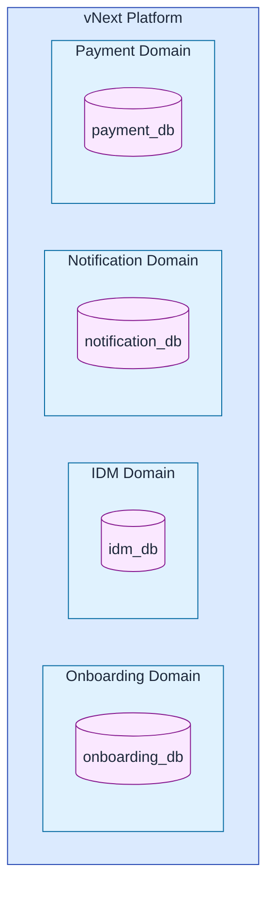
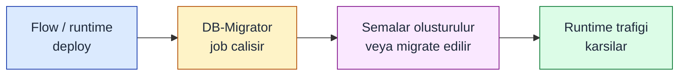
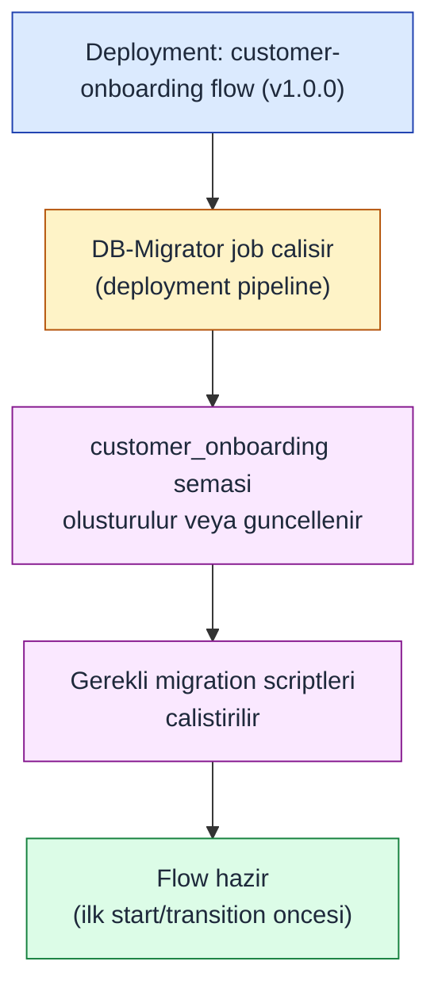
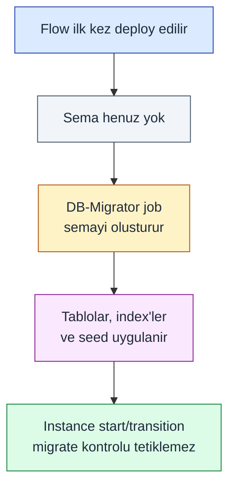
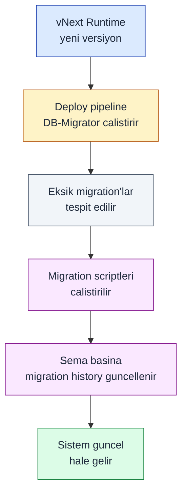
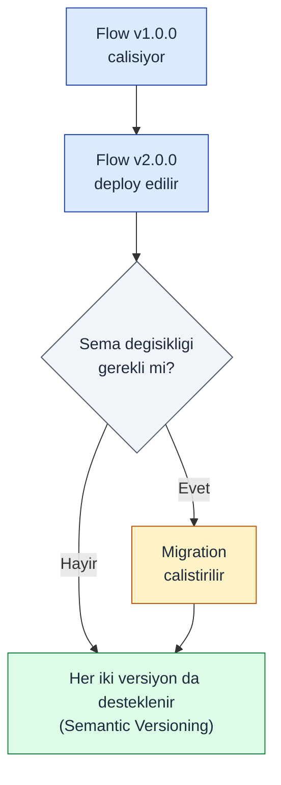

# Veritabanı Mimarisi

## Domain Seviyesinde Veritabanı İzolasyonu

vNext Runtime platformunda her domain, kendi bağımsız veritabanına sahiptir. Bu yaklaşım, domain'ler arası tam veri izolasyonu sağlar ve güvenlik ile veri bütünlüğü açısından kritik öneme sahiptir.

### Veritabanı İzolasyonunun Prensipleri



**Temel Prensipler:**
- Her domain = Bir veritabanı
- Domain'ler arası direkt veritabanı erişimi yasaktır
- Veri paylaşımı sadece API veya Event üzerinden olur
- Her domain kendi data governance politikalarını uygular

## Multi-Flow Şema Yapısı

vNext Runtime, veritabanı içinde **multi-flow şema** (multi-schema) yaklaşımını kullanır. Bu yapı, farklı flow'ların ve sistem bileşenlerinin veritabanı objelerini organize eder.

### Sistem Şemaları (System Schemas)

Platform başlatıldığında otomatik olarak **6 temel sistem şeması** oluşturulur:

#### 1. sys_flows
```sql
-- Flow tanımlarının saklandığı şema
sys_flows
```
**İçerik:** Workflow tanımları, state yapıları, transition kuralları, versiyon bilgileri.

#### 2. sys_views
```sql
-- View tanımlarının saklandığı şema
sys_views
```
**İçerik:** UI view tanımları, şablonlar, platform override'ları.

#### 3. sys_functions
```sql
-- Function API'lerinin saklandığı şema
sys_functions
```
**İçerik:** Sistem function'ları (State, Data, View API'leri), yetkilendirme kuralları.

#### 4. sys_tasks
```sql
-- Task tanımlarının saklandığı şema
sys_tasks
```
**İçerik:** HTTP, Script, Timer, Condition ve diğer task türlerinin tanımları.

#### 5. sys_extensions
```sql
-- Extension ve plugin'lerin saklandığı şema
sys_extensions
```
**İçerik:** Sistem uzantıları, özel plugin'ler, genişletme noktaları.

#### 6. sys_schemas
```sql
-- Şema metadata'sının saklandığı şema
sys_schemas
```
**İçerik:** Tüm şemaların kaydı, migration geçmişi, versiyon takibi.

## Flow-Specific Şemalar (Dinamik Şemalar)

Flow başına veritabanı şemaları instance verisi ve geçmişi tutar. itibarıyla şema **oluşturma ve migration**, her **start** veya **transition** isteğinde kontrol çalıştırmak yerine **deploy** sırasında çalışan **DB-Migrator job** ile yönetilir.

### Deploy zamanı şema yaşam döngüsü



**Örnek:**



## Otomatik Migration Sistemi

Şema değişiklikleri **migrator** ve **`sys_schemas`** geçmişi üzerinden kontrollü uygulanır; her API isteğine migration bağlanmaz.

### İlk deploy



### Sistem yükseltmesi



### Flow Versiyon Değişikliği



## Database Architecture Diagram

```mermaid
graph TB
    subgraph services["vNext Services"]
        orchestration["vnext-app<br/>(Orchestration)"]
        execution["vnext-execution-app<br/>(Execution)"]
        init["vnext-init<br/>(Initialization)"]
    end
    
    subgraph database["Domain Database (PostgreSQL)"]
        subgraph system["System Schemas"]
            sys_flows["sys_flows<br/><i>Workflow definitions</i>"]
            sys_views["sys_views<br/><i>View definitions</i>"]
            sys_functions["sys_functions<br/><i>Function APIs</i>"]
            sys_tasks["sys_tasks<br/><i>Task definitions</i>"]
            sys_extensions["sys_extensions<br/><i>Extensions</i>"]
            sys_schemas["sys_schemas<br/><i>Schema registry</i>"]
        end
        
        subgraph flows["Flow Schemas"]
            flow1["customer_onboarding<br/><i>Instances, data, history</i>"]
            flow2["payment_process<br/><i>Instances, data, history</i>"]
            flow3["document_approval<br/><i>Instances, data, history</i>"]
        end
    end
    
    orchestration -->|Read definitions| sys_flows
    orchestration -->|Read views| sys_views
    orchestration -->|Read tasks| sys_tasks
    orchestration -->|CRUD operations| flow1
    orchestration -->|CRUD operations| flow2
    orchestration -->|CRUD operations| flow3
    
    execution -->|Read data| flow1
    execution -->|Read data| flow2
    execution -->|Read data| flow3
    
    init -->|Schema DDL & Migration| sys_schemas
    init -->|Seed flows| sys_flows
    init -->|Seed tasks| sys_tasks
    init -->|Create on first run| flow1
    init -->|Create on first run| flow2
    init -->|Create on first run| flow3
    
    style database fill:#dbeafe,stroke:#1e40af,color:#1e293b
    style system fill:#fef3c7,stroke:#b45309,color:#1e293b
    style flows fill:#fae8ff,stroke:#86198f,color:#1e293b
    style services fill:#dcfce7,stroke:#15803d,color:#1e293b
```




## Sonuç

vNext Runtime'ın multi-schema veritabanı mimarisi, her domain'in ve her flow'un bağımsız veri yönetimine olanak tanır. Otomatik şema oluşturma ve migration sistemi, geliştiricilerin veritabanı yönetimiyle uğraşmadan iş akışlarına odaklanmasını sağlar.

## İlgili Dökümanlar

- [Domain Topology](/architecture/domain-model/topology) - Domain seviyesinde izolasyon
- [Persistence](/architecture/data/persistence) - Veri saklama prensipleri