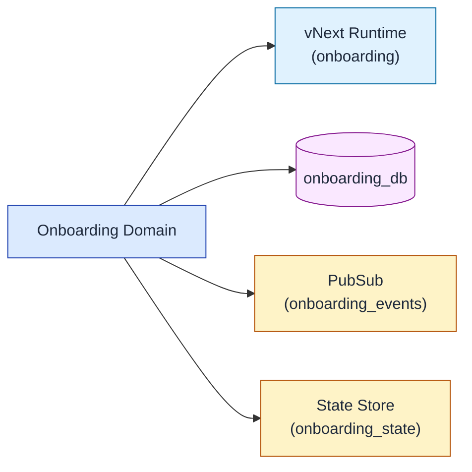
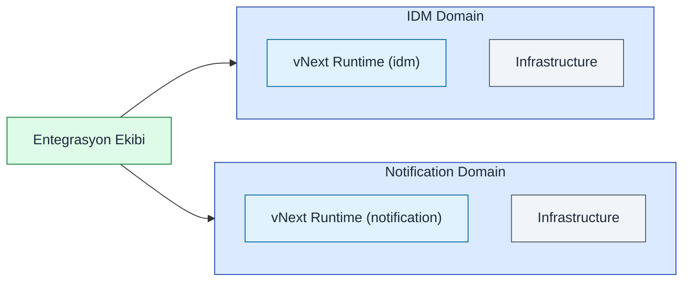
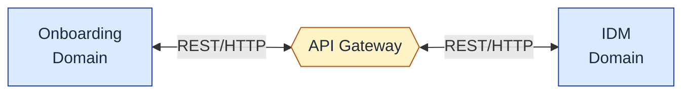
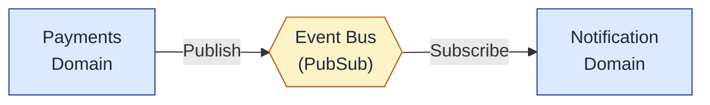
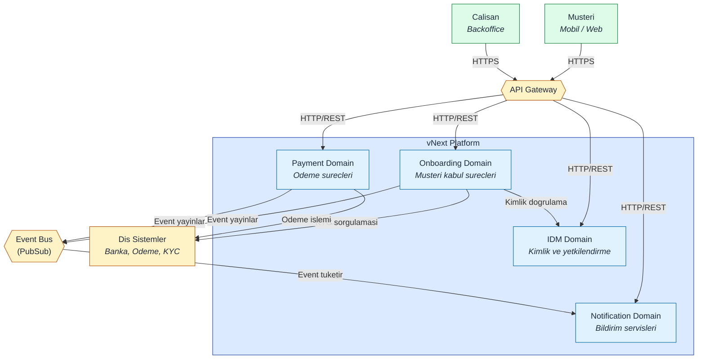
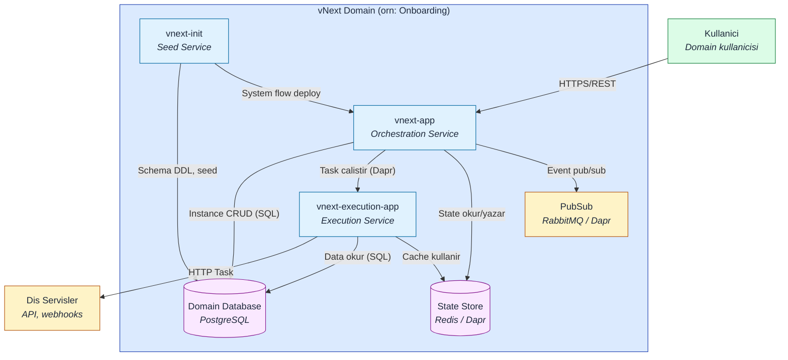

# Domain Topolojisi ve Mimari

## Platform Domain Kavramı

vNext Runtime platformu, **Domain** kavramını temel alır. Domain, bir iş alanını, ürün grubunu veya ekip sorumluluğunu temsil eden izole edilmiş bir runtime ortamıdır.

### Domain = Runtime Prensibi

**Her domain, kendi bağımsız runtime'ına sahiptir.** Bu prensip, platformun temel mimarisini oluşturur:

- Bir domain = Bir vNext Runtime instance
- Her domain tekil ve bağımsızdır
- Domainler arası izolasyon tam olarak sağlanır

## Domain Örnekleri

Bir kurumda domainler şu şekilde organize edilebilir:

### Ürün Grubu Bazlı Domain



**Örnek:** Müşteri kabul süreçlerini yöneten onboarding ekibinin kendi domain'i.

### Ekip Sorumluluğu Bazlı Domainler



**Örnek:** Entegrasyon ekibi, sorumluluğundaki IDM ve Notification sistemlerini ayrı domainler olarak yönetir.

## Domain İzolasyonunun Faydaları

### 1. Altyapı İzolasyonu
Her domain kendi altyapı bileşenlerine sahiptir:
- **Database**: Domain'e özel veritabanı
- **PubSub**: Domain'e özel mesajlaşma kanalları
- **State Store**: Domain'e özel durum yönetimi
- **Secrets**: Domain'e özel güvenlik yapılandırması

### 2. Bağımsız Geliştirme
- Her domain ekibi kendi hızında gelişebilir
- Domain'ler arası bağımlılık minimum seviyededir
- Versiyon yönetimi domain bazlı yapılır
- Deployment bağımsız gerçekleştirilir

### 3. Ölçeklenebilirlik
- Her domain ihtiyacına göre ölçeklendirilir
- Yüksek yük alan domain'ler daha fazla kaynak alabilir
- Düşük yük alan domain'ler minimum kaynakla çalışır
- Kaynak kullanımı optimize edilir

### 4. Hata İzolasyonu
- Bir domain'deki sorun diğerlerini etkilemez
- Yedekleme ve geri yükleme domain bazlı yapılır
- Bakım ve güncelleme bağımsız planlanır

## Domainler Arası İletişim

Domainler birbirinden izole olmasına rağmen, iş gereksinimleri doğrultusunda iletişim kurabilirler:

### 1. API Gateway Üzerinden



- Senkron iletişim
- REST API çağrıları
- HTTP Task kullanımı

### 2. Event-Driven Yapılar



- Asenkron iletişim
- Event-based entegrasyon
- Gevşek bağlılık (Loose coupling)
- DaprPubSub Task kullanımı

## C4 Context Diagram - Multi-Domain Architecture



## C4 Container Diagram - Domain Ici Yapi



## Domain Yönetimi Best Practices

### Domain Sınırlarını Doğru Belirleyin
- **İş alanına göre**: Her domain belirli bir iş fonksiyonunu temsil etmeli
- **Ekip sorumluluğuna göre**: Domain sahipliği net olmalı
- **Ölçek ihtiyacına göre**: Farklı yük karakteristiklerine sahip alanlar ayrı domain'ler olmalı

### Domain İzolasyonunu Koruyun
- Domain'ler arası doğrudan database erişimi yasaktır
- Tüm iletişim API veya Event üzerinden olmalı
- Shared infrastructure minimize edilmeli

### Monitoring ve Observability
- Her domain için ayrı monitoring dashboard'ları
- Domain bazlı metrik toplama
- Distributed tracing ile domain'ler arası çağrı takibi

### Versiyon Yönetimi
- Domain'ler bağımsız versiyonlanır
- API contract'ları semantic versioning ile yönetilir
- Breaking change'ler koordine edilir ancak deployment bağımsızdır

## Domain Lifecycle

### 1. Domain Oluşturma
```bash
# Infrastructure provisioning
- Domain database oluşturma
- Domain state store yapılandırması
- Domain PubSub konfigürasyonu

# vNext Runtime deployment
- vnext-init ile system kurulum
- vnext-app deployment
- vnext-execution-app deployment
```

### 2. Domain İşletimi
- Flow deployment ve yönetim
- Monitoring ve alerting
- Scaling ve optimization
- Backup ve disaster recovery

### 3. Domain Retirement
- Migration planlaması
- Dependency analizi
- Graceful shutdown
- Data archiving

## Sonuç

Domain topolojisi, vNext Runtime platformunun ölçeklenebilir, esnek ve yönetilebilir olmasını sağlayan temel mimari karardır. Her domain'in bağımsız runtime'a sahip olması, ekiplerin hızlı hareket etmesini, sistemin dayanıklı olmasını ve kaynakların verimli kullanılmasını mümkün kılar.

## İlgili Dökümanlar

- [Database Architecture](/architecture/data/database) - Domain seviyesinde veritabanı yapısı
- [Persistence](/architecture/data/persistence) - Veri saklama stratejileri