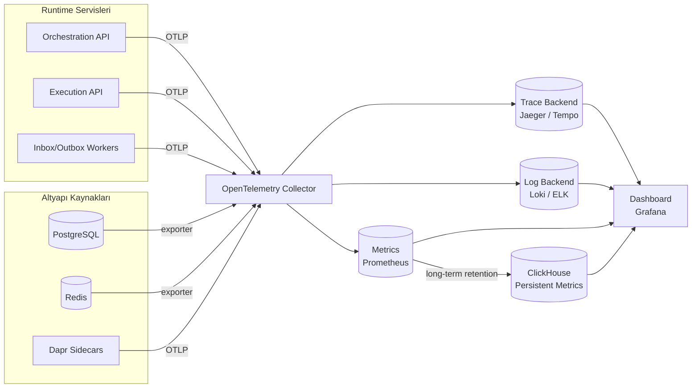

# Observability

vNext **observable-by-default** prensibiyle (bkz. [#7](/architecture/overview/principles#7-observable-by-default)) tasarlanmıştır: bir akış canlıya çıktığı an gözlemlenmektedir, ek enstrümantasyon gerekmez.

## Telemetri Veri Akışı

## Sinyaller

### Distributed Tracing

- **Standart**: OpenTelemetry (OTLP)
- **Instrumentation**: HTTP, Dapr (service invocation, pub/sub), DB, Redis, custom spans
- **Custom spans & events**:
  - `workflow.transition` — geçiş tetiklenmesi
  - `workflow.task.execute` — task yürütümü
  - `workflow.script.run` — Roslyn script çalışması
  - `workflow.outbox.publish` — outbox event yayını
- **Correlation**:
  - Parent ↔ child workflow ilişkisi (sub-workflow)
  - HTTP / pub-sub trace context propagation
  - Instance ID + correlation ID her span'de

### Structured Logging

- **Format**: JSON (machine-readable)
- **Standart alanlar**: `timestamp`, `level`, `service`, `domain`, `workflow_id`, `instance_id`, `trace_id`, `span_id`, `correlation_id`
- **Sensitive data**: PII alanları redaction layer'dan geçer
- **Sink**: OpenTelemetry Logs → Loki / ELK

### Metrics

| Kategori | Örnek Metrik | Kaynak |
|----------|-------------|--------|
| **HTTP** | request rate, latency p50/p95/p99, error rate | Orchestration / Execution API |
| **Workflow** | transition count, transition duration, active instance count | Execution API |
| **Task** | task execution duration, success/failure, retry count | Execution API |
| **Cache (Redis)** | hit/miss ratio, eviction count, latency | Redis exporter |
| **Database (PostgreSQL)** | connection pool, slow query, lock wait | PG exporter |
| **Pub/Sub** | publish rate, consume lag, DLQ rate | Dapr / broker exporter |
| **Outbox** | drain rate, backlog size, publish failure | Outbox worker |
| **Inbox** | inbox lag, dedupe hit, apply failure | Inbox worker |

## Persistent Metrics (ClickHouse)

Prometheus kısa vadeli (default 15 gün) saklama yapar. **Uzun vadeli trend ve SLO raporu** için OpenTelemetry metrics → ClickHouse pipeline'ı kullanılır:

- **Saklama süresi**: Yıllar bazında konfigüre edilebilir
- **Kullanım amacı**: SLO compliance raporu, trend analizi, kapasite planlama, audit
- **Sorgu modeli**: SQL üzerinden time-series + analitik
- **Avantaj**: PostgreSQL audit ile aynı analitik motor; cross-join mümkün

## Health Endpoints

| Servis | Endpoint | Probe Tipi |
|--------|----------|-----------|
| Orchestration API | `:4201/health` | liveness + readiness |
| Execution API | `:4202/health` | liveness + readiness |
| Inbox Worker | `/health` (workers HTTP host) | liveness |
| Outbox Worker | `/health` (workers HTTP host) | liveness |

Kubernetes deployment'larda `livenessProbe` ve `readinessProbe` bu endpoint'lere bağlanır. **Health-based traffic** sayesinde sağlıksız replica'ya istek gitmez.

## SLO Bağlantısı

Product roadmap **Now** fazında "Operasyonel SLO" işlendi. Bu sayfa o SLO'ların ölçüm altyapısını sağlar:

- **Availability**: health endpoint + HTTP success rate
- **Latency**: HTTP p99 + transition duration p99
- **Throughput**: transition rate + outbox publish rate
- **Error budget**: error rate + DLQ rate

> Detay: [Product / Roadmap — Now](/product/roadmap/)

## Çapraz Bağlantılar

- [Çekirdek Prensipler — Observable by Default](/architecture/overview/principles#7-observable-by-default)
- [Runtime topolojisi](/architecture/runtime/)
- [Product / Release Strategy](/product/release-strategy/) — release notes ve SLO standartları
