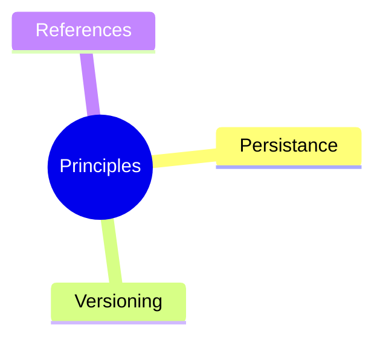
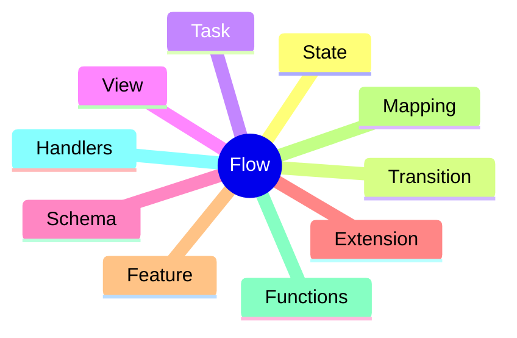
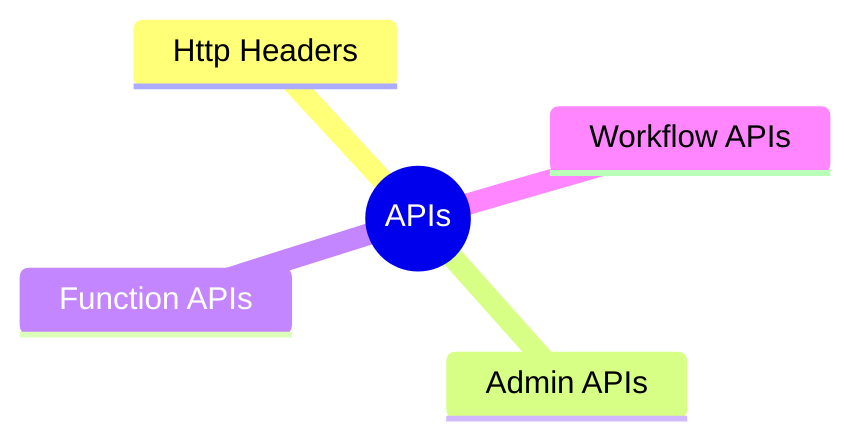
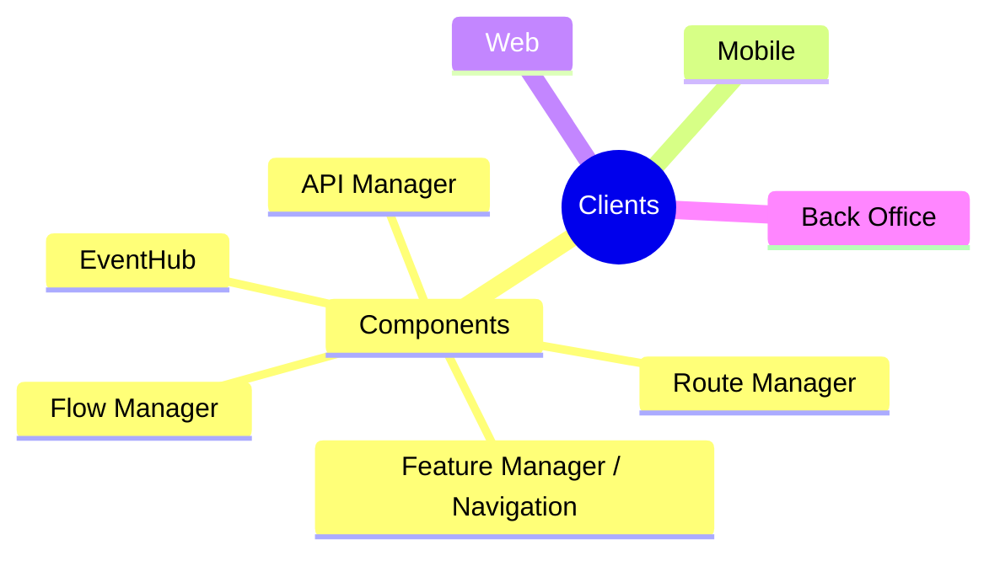
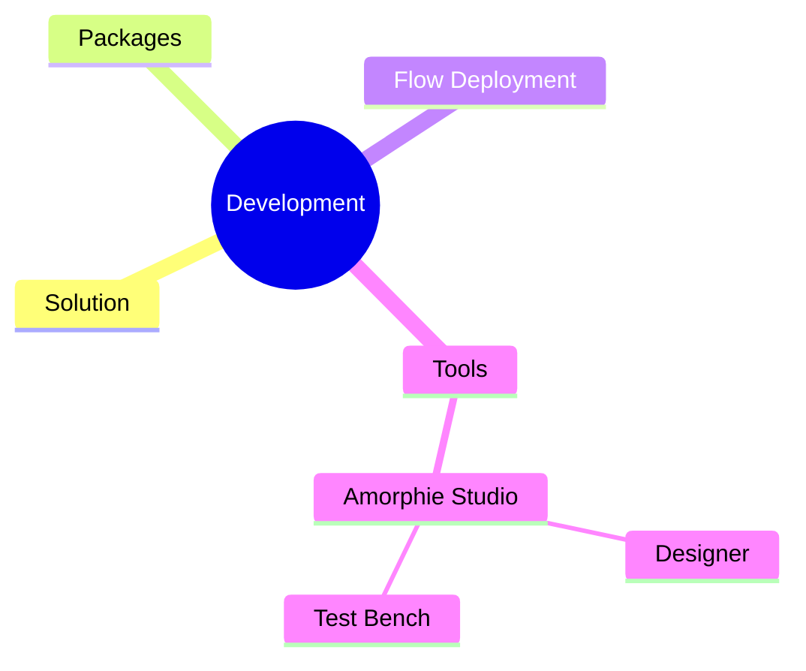
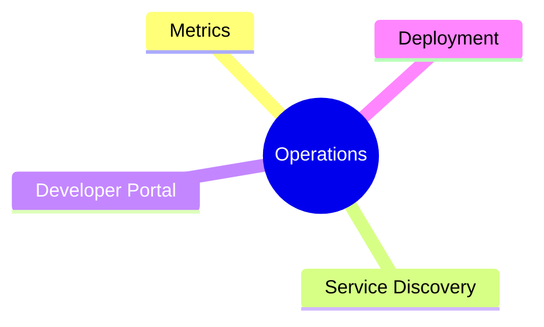

# Temeller

vNext Platformu, low-code, no-code ve full-code desteği sunan bulut tabanlı bir uygulama geliştirme platformudur.

Platform, yatayda büyüyen bir servis kümesine sahiptir ve bu servislerle yönetilen önyüz uygulamaları aracılığıyla müşteri, çalışan ve sistemlere arayüz sunarak her türlü iş akışını ve fonksiyonu yüksek güvenlikle gerçekleştirebilir.

## Platform Yapısı

### Mimari ve Topoloji

Platform mimarisi ve domain topolojisi için şu dökümanları inceleyebilirsiniz:

- **[Domain Topolojisi](/architecture/domain-model/topology)** - Domain kavramı, izolasyon ve çoklu-domain mimarisi
- **[Veritabanı Mimarisi](/architecture/data/database)** - Multi-schema yapısı, migration sistemi ve DB izolasyonu

### Temel Prensipler

Temel prensipler için **Principles** dizin içeriğine bakmanız önerilir:

### İş Akışı Mantığı ve Tanımı

İş akışı mantığı ve tanımı için **Flow** dizin içeriğine bakmanız önerilir:

### API Tanımları

vNext uygulamalarla sadece API'ler üzerinden etkileşir. API tanımları için **APIs** dizin içeriğine bakmanız önerilir.

*Not: Asenkron API dönüşleri için aynı zamanda SignalR ve MQTT kanalı üzerinden etkileşim sunulmaktadır. Bu yapı (EventBus), API'lerin uzantısıdır.*

### Hazır Uygulamalar

vNext servislerini tüketen hazır uygulamalar için **Clients** dizin içeriğine bakmanız önerilir:

### Geliştirme Ortamı

vNext üzerinde çözüm geliştirmek için teknik bilgi ve araçlar için **Development** dizin içeriğine bakmanız önerilir:

### Operasyon Yönetimi

vNext üzerinde çalışan çözümleri izlemek ve dağıtım için geliştirmek amacıyla teknik bilgi ve araçlar için **Operations** dizin içeriğine bakmanız önerilir:

