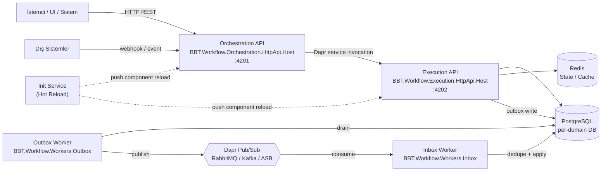

# Runtime

vNext runtime'ı **stateless, horizontally scalable** servislerden oluşur. Her domain için aynı runtime artifact'ları ayrı deployment olarak çalışır (bkz. [Domain = Runtime](/architecture/overview/principles#2-domain-driven-architecture)).

## Topoloji

## Bileşenler

### Orchestration API (`BBT.Workflow.Orchestration.HttpApi.Host`)

- **Sorumluluk**: İstemci-yönlü API yüzeyi; workflow instance başlatma, transition tetikleme, sorgulama
- **Port**: `4201`
- **Health**: `GET /health` (liveness + readiness)
- **Özellikler**:
  - ETag tabanlı concurrency control
  - SignalR / MQTT üzerinden asenkron yanıt kanalları (EventBus)
  - Dapr service invocation ile Execution API'ye delegasyon
  - OpenTelemetry instrumentation (HTTP, Dapr, DB, Redis)
- **Yatay ölçek**: Stateless; replica artırma ile lineer ölçeklenir

### Execution API (`BBT.Workflow.Execution.HttpApi.Host`)

- **Sorumluluk**: Transition pipeline yürütümü, task execution, scripting, state mutation
- **Port**: `4202`
- **Health**: `GET /health`
- **Özellikler**:
  - Roslyn tabanlı dinamik C# script yürütme
  - Task tipleri: DaprService, DaprPubSub, DaprBinding, Http, Script, Workflow
  - Transition pipeline: validation → state update → side-effect → audit
  - Dual-write: state + outbox aynı transaction içinde
- **Yatay ölçek**: Stateless; tek transition tek replica üzerinde tamamlanır

### Inbox Worker (`BBT.Workflow.Workers.Inbox`)

- **Sorumluluk**: Pub/sub'tan gelen event'lerin **idempotent** kaydı ve workflow'a uygulanması
- **Garanti**: Exactly-once delivery (InboxMessage tablosu üzerinden dedupe)
- **Çapraz**: [Inbox/Outbox detayları](/architecture/data/persistence)

### Outbox Worker (`BBT.Workflow.Workers.Outbox`)

- **Sorumluluk**: `OutboxMessage` tablosundaki kayıtları drain edip **Dapr Pub/Sub** üzerinden yayınlama
- **Garanti**: At-least-once publish + transactional write (mesaj kaybı olmaz)
- **Retry policy**: Exponential backoff, idempotent

### Init Service (Hot Reload)

- **Sorumluluk**: Component tanımlarının (workflow, schema, task, function, view, extension) **kesintisiz** runtime'a yüklenmesi
- **Tetik**: Component create/update/delete üzerine event
- **Etki**: Yeni sürüm canlıya alındığında çalışan instance'lar etkilenmez; yeni instance'lar yeni tanımı kullanır

## Operasyonel Garantiler

| Garanti | Mekanizma |
|---------|-----------|
| **Mesaj kaybı yok** | Outbox pattern + transactional write |
| **Tam-bir-kez işleme** | Inbox pattern + dedupe (mesaj ID + idempotency key) |
| **Lost update yok** | ETag based optimistic concurrency |
| **Zero-downtime deployment** | Stateless host + rolling update + hot reload |
| **Health-based traffic** | `/health` endpoint, Kubernetes liveness/readiness probe |
| **Cross-domain decoupling** | Dapr Pub/Sub (CloudEvents); domain'ler doğrudan birbirini çağırmaz |

## Çapraz Bağlantılar

- [Domain Topolojisi](/architecture/domain-model/topology) — multi-domain dağılımı
- [Persistence Strategy](/architecture/data/persistence) — Inbox / Outbox tabloları
- [Observability](/architecture/infrastructure/observability) — telemetri katmanı
- [Çekirdek Prensipler](/architecture/overview/principles) — mimari kararların gerekçesi
