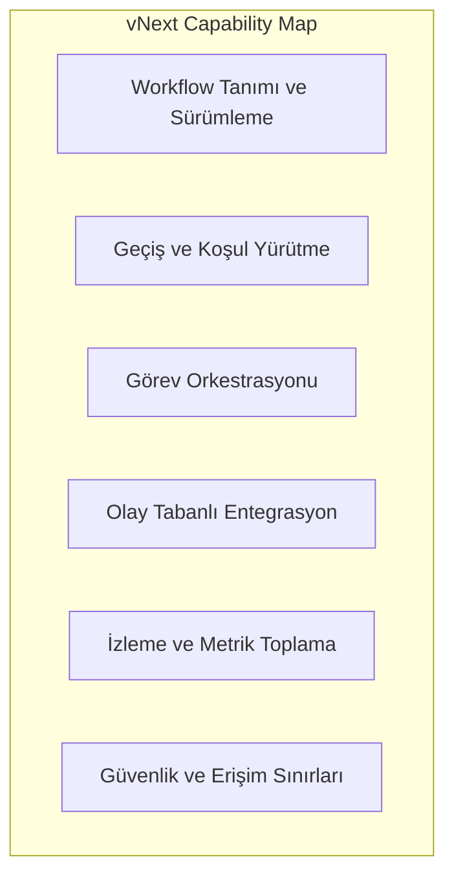
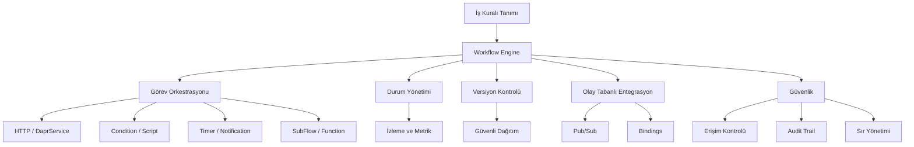

# Platform Yetenekleri

vNext platformu, kurumsal iş süreçlerini dijitalleştirmek için altı çekirdek yetenek alanı sunar. Bu yetenekler, teknik altyapı detaylarından bağımsız olarak iş değeri üretecek şekilde tasarlanmıştır.

## Capability Map

| # | Yetenek | Bir cümlede |
|---|---------|-------------|
| 1 | **Workflow Tanımı ve Sürümleme** | Süreçleri tanım olarak modelle, semantic versioning ile yönet |
| 2 | **Geçiş ve Koşul Yürütme** | State machine + koşullu dallanmalarla akışı yürüt |
| 3 | **Görev Orkestrasyonu** | HTTP, Script, Timer, SubFlow gibi farklı görev türlerini tek akışta birleştir |
| 4 | **Olay Tabanlı Entegrasyon** | Dapr pub/sub ile sistemler arası gevşek bağlı iletişim |
| 5 | **İzleme ve Metrik Toplama** | OpenTelemetry + persistent metrics ile uçtan uca gözlemlenebilirlik |
| 6 | **Güvenlik ve Erişim Sınırları** | Domain izolasyonu + rol bazlı görünürlük + sır yönetimi |

---

## 1) Workflow Tanımı ve Sürümleme

Süreçler **tanım** olarak modellenir; her bileşen (workflow, schema, task, function, view) semantic versioning ile yönetilir.

**Ne yapabilirsiniz?**

- Çok adımlı iş süreçlerini görsel olarak tanımlayın
- Her adımda koşullu dallanmalar oluşturun
- Paralel ve sıralı görevleri birlikte kullanın
- Akışı durdurun, bekletin, devam ettirin veya iptal edin
- Yeni sürümü eski ile yan yana çalıştırın (canary)
- Sorun durumunda önceki sürüme geri dönün
- Major/minor değişiklikleri ayrıştırın

**Örnek senaryo:** Kredi başvuru süreci — başvuru alımı → kimlik doğrulama → gelir kontrolü → (koşullu) otomatik onay veya manuel inceleme → sözleşme oluşturma → müşteri bilgilendirme. Yeni bir adım eklendiğinde mevcut devam eden başvurular eski sürümle tamamlanır.

## 2) Geçiş ve Koşul Yürütme

Her workflow instance state machine olarak çalışır. Geçişler **deterministic transition pipeline** üzerinden, koşullar **condition task** ile yürütülür.

**Ne yapabilirsiniz?**

- Bir sürecin anlık durumunu sorgulayın
- Geçmiş durum geçişlerini geriye dönük inceleyin
- Belirli bir duruma göre filtreleme ve raporlama yapın
- Eşzamanlı güncellemelerde veri kaybını ETag concurrency ile önleyin
- Manuel, otomatik, zamanlanmış ve olay tetikli geçişleri ayrı işleyin (trigger handlers)

**Örnek senaryo:** "Şu an onayda bekleyen tüm kredi başvurularını listele" veya "son 24 saatte tamamlanan müşteri aktivasyon sayısı."

## 3) Görev Orkestrasyonu

Platform farklı işlem türlerini tek bir akış içinde birleştirir:

| Görev Türü | Ne İşe Yarar | Örnek Kullanım |
|------------|--------------|----------------|
| **HTTP** | Dış servislere API çağrısı | KYC doğrulama, SMS gönderimi |
| **DaprService** | İç servis çağrısı (service invocation) | Domain-içi mikroservisler arası iletişim |
| **DaprPubSub** | Olay yayınlama / dinleme | "Müşteri aktif edildi" olayını yayınla |
| **Condition** | Veri bazlı karar | Tutar > 50.000 ise üst onay |
| **Timer** | Bekleme veya tetikleme | 24 saat içinde cevap gelmezse hatırlat |
| **Notification** | Kullanıcıya mesaj | "Başvurunuz onaylandı" push bildirimi |
| **Script** | Özel hesaplama (Roslyn) | Faiz hesaplama, risk skoru |
| **SubFlow / SubProcess** | Başka bir akışı tetikle | Onboarding → KYC akışını başlat |
| **Function** | Yeniden kullanılabilir mantık | Ortak hesaplamalar, validasyonlar |

**Sub-Flow vs Sub-Process:**

- **SubFlow** parent akışı bloklar — sonuç beklenir
- **SubProcess** parent akışı bloklamaz — paralel/asenkron yürütülür

## 4) Olay Tabanlı Entegrasyon

Olay tabanlı entegrasyon, Dapr **pub/sub** ve **bindings** üzerinden standart bir şekilde kurulur. Bu sayede:

- **Sağlayıcı bağımsızlığı** — RabbitMQ, Kafka, Redis Streams, Azure Service Bus arasında geçiş tanım değişikliği gerektirmez
- **Açık standartlar** — CloudEvents formatı varsayılan
- **Gevşek bağlılık** — yayıncı ve dinleyici birbirini bilmek zorunda değil
- **Inbox/Outbox** — kayıplara karşı transactional outbox ile koruma

**Ne yapabilirsiniz?**

- REST API çağrıları ile dış sistemlere bağlanın
- Olay bazlı (event-driven) entegrasyon kurun
- Zamanlayıcı bazlı periyodik işlemler tanımlayın
- Dış sistem cevaplarına göre akışı yönlendirin
- Birden fazla dinleyiciye aynı olayı yayınlayın

**Örnek senaryo:** Müşteri onboarding akışı sırasında → KKB sorgusu (HTTP) → Mernis doğrulama (HTTP) → "Müşteri aktif" olayı yayınla (DaprPubSub) → CRM dinleyicisi otomatik kayıt oluştur.

## 5) İzleme ve Metrik Toplama

Gözlemlenebilirlik platforma yerleşik bir özelliktir; ek enstrümantasyon gerektirmez.

**Bileşenler:**

- **OpenTelemetry** — distributed tracing, structured logging, metrics
- **Cache metrics** — Redis performans izleme
- **Database metrics** — PostgreSQL operasyonel metrikler
- **Persistent metrics** — ClickHouse üzerinde uzun vadeli saklama
- **Health endpoints** — `/health` uçları her host için

**Ne yapabilirsiniz?**

- Her sürecin her adımını izleyin (kim, ne zaman, hangi veriyle)
- Ortalama tamamlanma sürelerini ölçün
- Bekleyen/tıkanan işlemleri görünür kılın
- En çok zaman harcanan adımları belirleyin
- Optimizasyon fırsatlarını veri ile destekleyin
- SLO/SLA uyumunu raporlayın

**Örnek metrik soruları:** "Bu hafta KYC adımının ortalama süresi?", "Hangi onay seviyesinde en çok zaman kaybı var?", "Geçen aya göre toplam akış başlatma sayısı?"

## 6) Güvenlik ve Erişim Sınırları

Güvenlik sonradan eklenen bir katman değil, platform doğasında yer alır.

**Katmanlar:**

| Katman | Mekanizma |
|--------|-----------|
| **Tenant izolasyonu** | Multi-schema, domain bazında runtime + database |
| **Erişim kontrolü** | Rol bazlı yetkilendirme, alan bazında ayrıştırma |
| **Field-level visibility** | Master schema `roles` ile alan düzeyinde görünürlük |
| **Sır yönetimi** | Dapr secret store (Vault, Kubernetes secrets, vb.) |
| **Eşzamanlılık** | ETag bazlı optimistic concurrency control |
| **Audit trail** | Her transition + task execution kayıt altında |
| **Query güvenliği** | QueryExtensions ile injection koruması |

**Ne yapabilirsiniz?**

- Her işlemi denetlenebilir şekilde kaydedin
- Alan bazında erişim kontrolü uygulayın
- Hassas bilgileri merkezi sır kasasında tutun
- Eşzamanlı erişimde veri bütünlüğünü koruyun
- Düzenleyici (KVKK, GDPR, BDDK) gerekliliklerini karşılayın

---

## Yetenekler Arası İlişki

## Ek Yetenekler

### Çoklu Alan Desteği (Multi-Domain)

Farklı iş alanları (departmanlar, ürün grupları, ekipler) aynı platform üzerinde **birbirinden izole** çalışır. Her domain bağımsız runtime + database + messaging'e sahiptir.

### Ölçeklenebilirlik (Scalability)

Yoğun dönemlerde otomatik ölçeklendirme; her alanı ihtiyacına göre bağımsız büyütme; düşük yük dönemlerinde kaynak tasarrufu.

### Caching Stratejisi

Sık erişilen workflow tanımları, schema'lar ve referans verileri Redis tabanlı distributed cache ile sunulur; otomatik invalidation ile tutarlılık korunur.

### Hot Reload (Init Service)

Bileşenler kesintisiz güncellenebilir; çalışan instance'lar etkilenmeden yeni sürüm devreye alınır.

## İlgili Bölümler

- [Kullanım Senaryoları](../industries/) — Yeteneklerin gerçek dünya örnekleri
- [Değer Önerisi](../value/) — Bu yeteneklerin iş değerine dönüşü
- Teknik detay: [Technical Documentation](/docs/intro)
