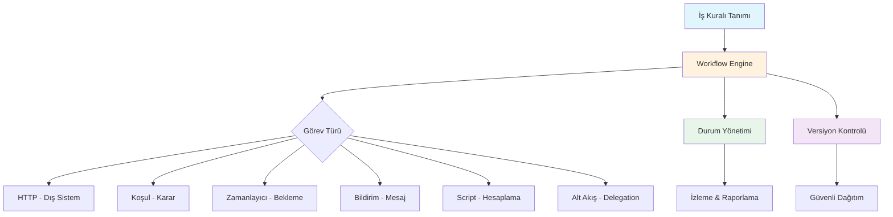

# Platform Yetenekleri

vNext platformu, kurumsal iş süreçlerini dijitalleştirmek için bir dizi temel yetenek sunar. Bu yetenekler, teknik altyapı detaylarından bağımsız olarak iş değeri üretecek şekilde tasarlanmıştır.

## İş Akışı Yönetimi (Workflow Management)

Platformun çekirdek yeteneği, iş süreçlerini **akış** (workflow) olarak tanımlama ve yönetmedir.

**Ne yapabilirsiniz?**
- Çok adımlı iş süreçlerini görsel olarak tanımlayın
- Her adımda koşullu dallanmalar oluşturun (onay/red, tutar eşikleri, müşteri segmenti...)
- Paralel ve sıralı görevleri birlikte kullanın
- Akışı durdurun, bekletin, devam ettirin veya iptal edin

**Örnek senaryo:** Kredi başvuru süreci — başvuru alımı → kimlik doğrulama → gelir kontrolü → (koşullu) otomatik onay veya manuel inceleme → sözleşme oluşturma → müşteri bilgilendirme.

## Durum Yönetimi (State Management)

Her iş akışı instance'ı, hangi adımda olduğunu, hangi veriye sahip olduğunu ve ne beklediğini bilir.

**Ne yapabilirsiniz?**
- Bir sürecin anlık durumunu sorgulayın
- Geçmiş durum geçişlerini geriye dönük inceleyin
- Belirli bir duruma göre filtreleme ve raporlama yapın
- Eşzamanlı güncellemelerde veri kaybını önleyin

**Örnek senaryo:** "Şu an onayda bekleyen tüm kredi başvurularını listele" veya "son 24 saatte tamamlanan müşteri aktivasyon sayısı."

## Görev Çeşitliliği (Task Diversity)

Platform, farklı işlem türlerini tek bir akış içinde birleştirir:

| Görev Türü | Ne İşe Yarar | Örnek Kullanım |
|------------|--------------|----------------|
| **HTTP** | Dış servislere API çağrısı | KYC doğrulama, SMS gönderimi |
| **Koşul** | Veri bazlı karar | Tutar > 50.000 ise üst onay |
| **Zamanlayıcı** | Bekleme veya tetikleme | 24 saat içinde cevap gelmezse hatırlat |
| **Bildirim** | Kullanıcıya mesaj | "Başvurunuz onaylandı" push bildirimi |
| **Script** | Özel hesaplama | Faiz hesaplama, risk skoru |
| **Alt Akış** | Başka bir akışı tetikle | Onboarding → KYC akışını başlat |
| **Pub/Sub** | Olay yayınlama | "Müşteri aktif edildi" olayını yayınla |

## Çoklu Alan Desteği (Multi-Domain)

Farklı iş alanları (departmanlar, ürün grupları, ekipler) aynı platform üzerinde **birbirinden izole** çalışır.

**Ne yapabilirsiniz?**
- Her iş alanı için bağımsız ortam oluşturun
- Alanlar arası veri izolasyonunu garanti edin
- Her alanı bağımsız ölçeklendirin
- Ortak altyapıyı paylaşırken iş mantığını ayırın

**Örnek senaryo:** Onboarding, Ödeme ve Bildirim ekipleri aynı platformu kullanır ama birbirlerinin verilerine erişemez ve birbirlerini etkilemez.

## Entegrasyon Kapasitesi (Integration)

Platform, mevcut kurumsal sistemlerle entegrasyonu yerleşik olarak destekler:

**Ne yapabilirsiniz?**
- REST API çağrıları ile dış sistemlere bağlanın
- Olay bazlı (event-driven) entegrasyon kurun
- Zamanlayıcı bazlı periyodik işlemler tanımlayın
- Dış sistem cevaplarına göre akışı yönlendirin

**Örnek senaryo:** Müşteri onboarding akışı sırasında → KKB sorgusu (REST) → Mernis doğrulama (REST) → Bildirim gönder (Event) → CRM kaydı oluştur (REST).

## Versiyon Yönetimi (Version Control)

Tüm iş akışı bileşenleri versiyonlanır — değişiklikler kontrollü ve geri alınabilir.

**Ne yapabilirsiniz?**
- Yeni versiyonu eski ile yan yana çalıştırın (canary deployment)
- Sorun durumunda önceki versiyona geri dönün
- Değişiklik geçmişini takip edin
- Major/minor değişiklikleri ayrıştırın

**Örnek senaryo:** Kredi onay akışında yeni bir adım ekleniyor — mevcut devam eden başvurular eski versiyonla tamamlanırken, yeni başvurular güncel versiyonla başlar.

## Güvenlik ve Uyumluluk (Security & Compliance)

**Ne yapabilirsiniz?**
- Her işlemi denetlenebilir şekilde kaydedin (audit trail)
- Alan bazında erişim kontrolü uygulayın
- Hassas bilgileri (credentials, API keys) güvenli kasada tutun
- Eşzamanlı erişimde veri bütünlüğünü koruyun

## Ölçeklenebilirlik (Scalability)

**Ne yapabilirsiniz?**
- Yoğun dönemlerde otomatik ölçeklendirme
- Her alanı ihtiyacına göre bağımsız büyütme
- Düşük yük dönemlerinde kaynak tasarrufu
- Yatay büyüme — yeni alan ekleme dakikalar içinde

## Yetenekler Arası İlişki

