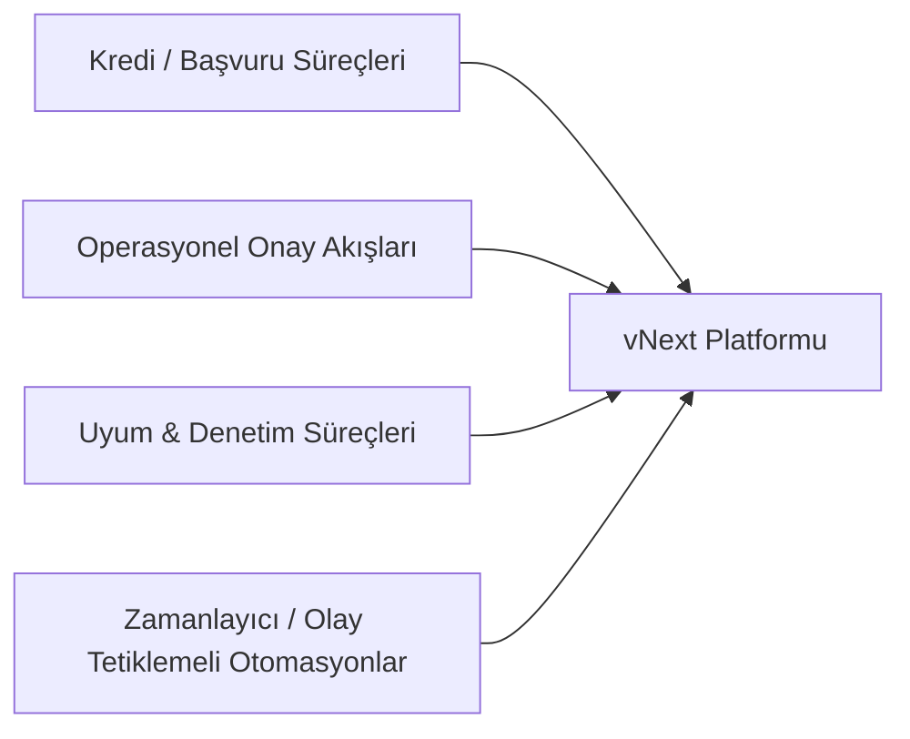
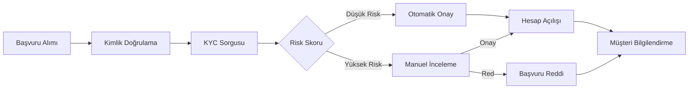
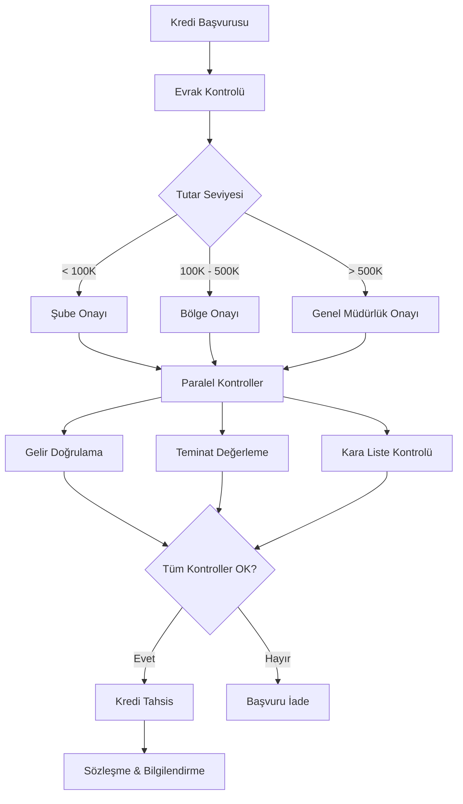
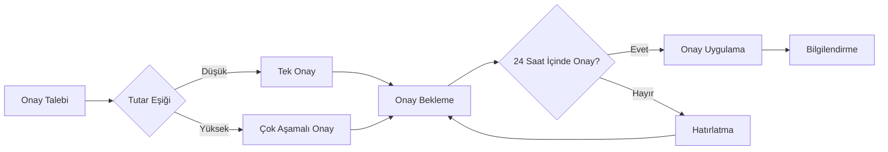
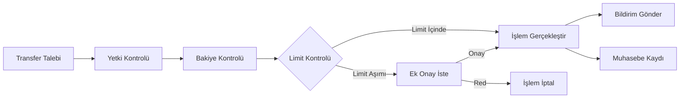
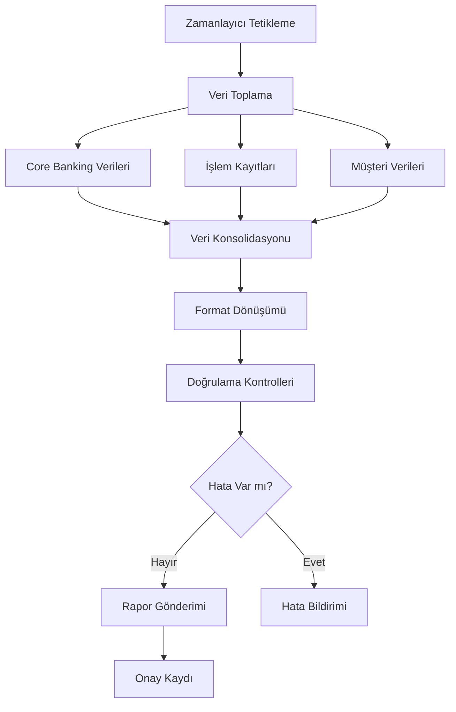

# Kullanım Senaryoları

vNext platformu, sektörden bağımsız olarak iş süreçlerini dijitalleştiren genel amaçlı bir workflow platformudur. Bu sayfa; **genel kullanım senaryolarını** ve bunların **bankacılık alanındaki somut uygulamalarını** birlikte sunar.

## Senaryo Aileleri

vNext üzerinde tipik olarak dört senaryo ailesi gözlemlenir:

| Aile | Tipik Karakteristik | Bankacılık Karşılığı |
|------|---------------------|----------------------|
| **Kredi / Başvuru** | Çok adımlı, koşullu, dış sistem yoğun | Kredi başvurusu, müşteri onboarding |
| **Operasyonel Onay** | İnsan + zaman + hiyerarşi içeren | Limit artırımı, harcama onayı, parametre değişikliği |
| **Uyum & Denetim** | Düzenli raporlama, audit yoğun, hata tolere etmeyen | BDDK/MASAK raporlama, KVKK işlemleri |
| **Otomasyon (Zamanlayıcı / Olay)** | İnsan müdahalesi olmadan koşan, periyodik veya tetiklenen | Gece sonu işlemleri, hatırlatma akışları, event-driven entegrasyon |

---

## Senaryo 1: Müşteri Onboarding (Başvuru Ailesi)

### İş Tanımı

Yeni bir müşteri dijital kanallardan (mobil/web) hesap açmak istiyor. Süreç, birden fazla sistem ile etkileşim gerektiriyor ve düzenleyici uyumluluk adımları içeriyor.

### Akış Adımları

### Platform Yeteneklerinin Kullanımı

| Adım | Platform Yeteneği | Açıklama |
|------|-------------------|----------|
| Başvuru Alımı | Workflow Start | REST API üzerinden akış başlatılır |
| Kimlik Doğrulama | HTTP Task | Mernis/e-Devlet servisi çağrılır |
| KYC Sorgusu | HTTP Task | KKB/Findeks servisine bağlanılır |
| Risk Skoru | Condition Task | Skor eşik değerine göre dallanma |
| Manuel İnceleme | Timer + State | Operatöre görev atanır, süre takibi yapılır |
| Hesap Açılışı | HTTP Task | Core banking sistemine API çağrısı |
| Bilgilendirme | Notification + DaprPubSub | SMS/Push bildirim + "müşteri aktif" olayı |

### Kazanımlar

- **Süre**: Geleneksel 3-5 iş günü → 15 dakika (otomatik onay senaryosu)
- **Uyumluluk**: Her adım otomatik olarak loglanır (audit trail)
- **Esneklik**: Risk eşikleri konfigürasyonla değiştirilebilir, kod değişikliği gerekmez

---

## Senaryo 2: Kredi Başvuru ve Onay (Başvuru + Operasyonel Onay Ailesi)

### İş Tanımı

Bireysel veya kurumsal müşteri kredi başvurusu yapıyor. Başvuru tutarına göre farklı onay seviyeleri ve paralel kontroller gerekiyor.

### Akış Adımları

### Platform Yeteneklerinin Kullanımı

| Adım | Platform Yeteneği | Açıklama |
|------|-------------------|----------|
| Tutar Seviyesi | Condition Task | Tutar aralığına göre onay seviyesi belirlenir |
| Paralel Kontroller | SubProcess (non-blocking) | Her kontrol paralel akış olarak çalışır |
| Gelir Doğrulama | HTTP Task | Gelir doğrulama servisine API çağrısı |
| Kara Liste | HTTP Task | Yasaklı listeler servisine sorgu |
| Zaman Aşımı | Timer Task | Onay bekleyen adımlar için süre limiti |
| Sözleşme | Script Task (Roslyn) | Dinamik sözleşme metni üretimi |

### Kazanımlar

- **Paralel işlem**: Gelir, teminat ve kara liste kontrolleri eşzamanlı yapılır (süre %60 kısalır)
- **Esnek onay hiyerarşisi**: Tutar eşikleri konfigürasyonla ayarlanır
- **Versiyon desteği**: Yeni düzenleme geldiğinde akış güncellenir, devam eden başvurular eski kurallarla tamamlanır

---

## Senaryo 3: Operasyonel Onay Akışları (Operasyonel Onay Ailesi)

### İş Tanımı

Şube müdürü bir müşteri için kart limiti artırımı talep ediyor; tutar eşiğine göre farklı seviyelerden onay gerekiyor ve onay bekleme süresi belirli bir hatırlatma kuralına bağlı.

### Akış Adımları

### Platform Yeteneklerinin Kullanımı

| Adım | Platform Yeteneği |
|------|-------------------|
| Onay Bekleme | Human Task + Timer |
| Hatırlatma | Timer + Notification |
| Tutar Eşiği | Condition |
| Onay Uygulama | HTTP (core sistem güncellemesi) |
| Bilgilendirme | DaprPubSub (olay yayını) |

### Kazanımlar

- **Hatırlatma otomasyonu**: Geciken onaylar otomatik olarak yöneticiye iletilir
- **SLA ölçümü**: Onay süreleri metric olarak izlenir
- **Esnek hiyerarşi**: Onay seviyeleri konfigürasyonla yönetilir

---

## Senaryo 4: Ödeme ve Transfer İşlemleri (Operasyonel Akış)

### İş Tanımı

Müşteri farklı kanallardan (mobil, ATM, şube) para transferi gerçekleştiriyor. Her kanaldan gelen işlem aynı iş kuralları ile yönetiliyor.

### Akış Adımları

### Kazanımlar

- **Kanal bağımsızlığı**: Aynı iş kuralları tüm kanallardan gelen işlemler için geçerli
- **Gerçek zamanlı**: Milisaniye düzeyinde yanıt süresi
- **Olay yayılımı**: İşlem tamamlandığında ilgili tüm sistemler (muhasebe, raporlama, bildirim) otomatik bilgilendirilir

---

## Senaryo 5: Uyumluluk ve Düzenleyici Raporlama (Uyum & Denetim Ailesi)

### İş Tanımı

Banka, düzenleyici kurumlara (BDDK, MASAK, SPK) periyodik raporlama yapması gerekiyor. Raporlama süreci birden fazla kaynaktan veri toplayıp konsolide ediyor.

### Akış Adımları

### Platform Yeteneklerinin Kullanımı

| Adım | Platform Yeteneği |
|------|-------------------|
| Zamanlayıcı Tetikleme | Timer Task (cron) |
| Paralel Veri Toplama | SubProcess (non-blocking) |
| Veri Konsolidasyonu | Script Task |
| Format Dönüşümü | Script Task |
| Doğrulama | Condition Task |
| Rapor Gönderimi | HTTP Task |
| Onay Kaydı | Audit Trail (otomatik) |

### Kazanımlar

- **Otomatik tetikleme**: Zamanlayıcı ile periyodik çalışma, insan müdahalesi gerekmez
- **Paralel veri toplama**: Farklı kaynaklardan eşzamanlı veri çekme
- **Denetim izi**: Her raporlama çalıştırmasının tam kaydı tutulur
- **Hata yönetimi**: Eksik veya hatalı veri durumunda otomatik bildirim

---

## Senaryo 6: Olay Tetiklemeli Otomasyonlar (Otomasyon Ailesi)

### İş Tanımı

Müşteri segmentinde değişiklik (örn. "Premium müşteri oldu") olduğunda; CRM, kart sistemi, bildirim ve kampanya sistemleri otomatik olarak güncellenmeli.

### Akış Mantığı

- **Tetik**: `customer.segment.changed` olayı (Dapr PubSub)
- **Dinleyici workflow**: Olayı alır, müşteri verisini çeker
- **Paralel aksiyonlar**:
  - CRM'i güncelle (HTTP)
  - Premium kart üret (SubFlow)
  - "Hoş geldin Premium" SMS (Notification)
  - Kampanya kaydı yarat (DaprService)

### Kazanımlar

- **Gevşek bağlılık**: Yayıncı dinleyiciyi bilmek zorunda değil
- **Genişletilebilirlik**: Yeni dinleyici eklemek mevcut akışı bozmaz
- **Resiliency**: Inbox/Outbox sayesinde olay kaybı olmaz

---

## Sektörel Genişleme

vNext'in workflow modeli **bankacılığa özel değildir**; benzer karakteristik gösteren sektörlerde de uygulanabilir:

| Sektör | Tipik Senaryolar |
|--------|------------------|
| **Sigorta** | Poliçe başvuru, hasar yönetimi, yenileme süreçleri |
| **Leasing / Faktoring** | Limit tahsisi, sözleşme yönetimi, tahsilat |
| **Telekom** | Müşteri aktivasyonu, paket değişikliği, port etme |
| **Kamu / e-Devlet** | Başvuru, uygunluk kontrolü, sertifika üretimi |
| **Sağlık** | Randevu, sevk, sigorta onayı, ödeme |

## Senaryo Özeti

| Senaryo | Temel Platform Yeteneği | İş Değeri |
|---------|------------------------|-----------|
| Müşteri Onboarding | Workflow + HTTP + Condition | Dakikalar içinde hesap açılışı |
| Kredi Onay | SubProcess + Timer + Condition | Paralel kontrol ile hızlı karar |
| Operasyonel Onay | Human Task + Timer + Notification | SLA takipli onay süreçleri |
| Ödeme Transfer | Multi-Channel + PubSub | Kanal bağımsız tek kural seti |
| Düzenleyici Raporlama | Timer + Script + HTTP | Otomatik uyumluluk |
| Olay Otomasyonu | PubSub + SubFlow + DaprService | Sistemler arası gevşek bağlı koordinasyon |

:::tip[İleri Okuma]
Her senaryonun teknik implementasyon detayları için [Technical Documentation](/docs/intro) bölümüne, mimari yapısı için [Architecture](/architecture/intro) bölümüne bakabilirsiniz. Süreçle ilgili riskler için [İş Riskleri ve Azaltım](../risks/) sayfasını inceleyin.
:::
