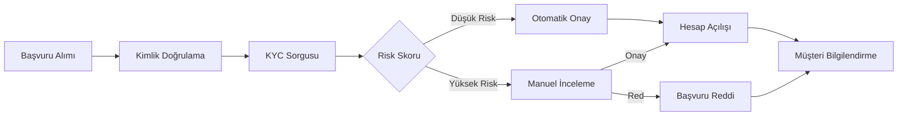
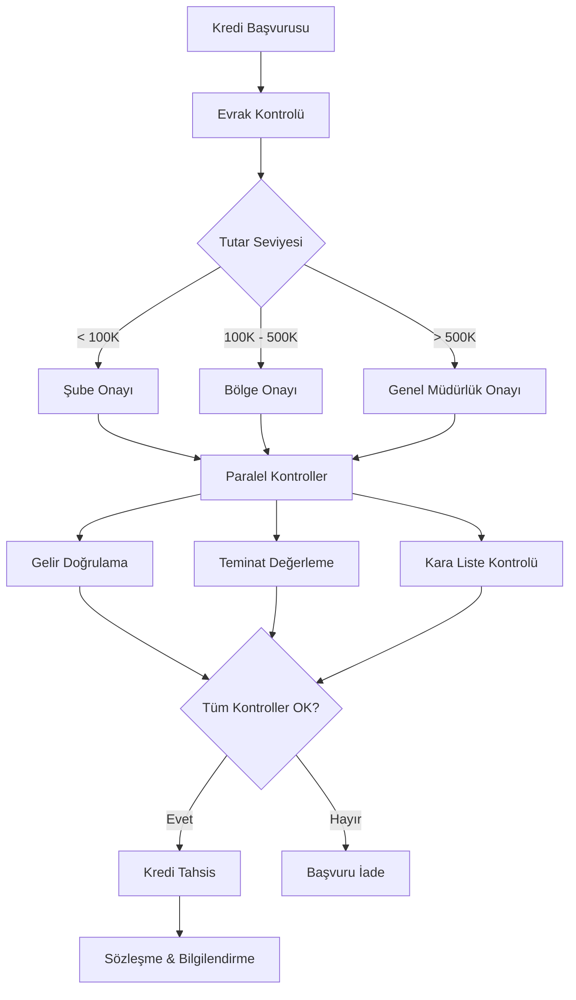
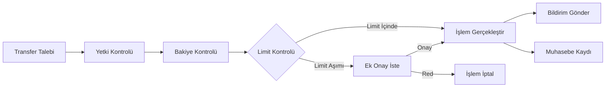
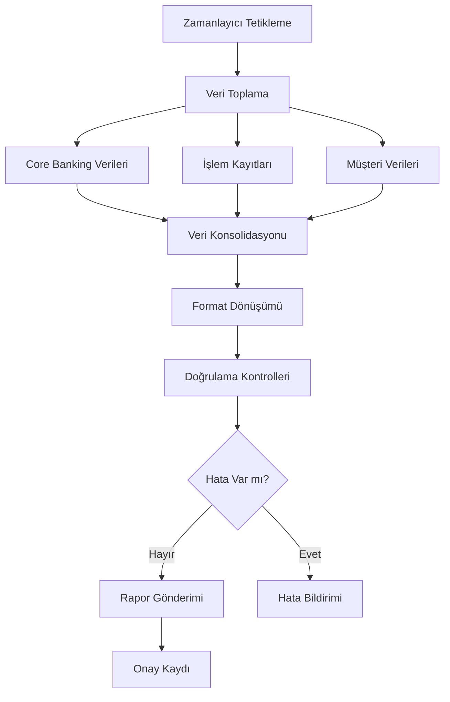

# Bankacılık Senaryoları

vNext platformu, sektörden bağımsız olarak iş süreçlerini dijitalleştiren genel amaçlı bir workflow platformudur. Bu bölümde, platformun bankacılık alanındaki örnek kullanım senaryoları yer almaktadır.

## Müşteri Onboarding

### Senaryo

Yeni bir müşteri dijital kanallardan (mobil/web) hesap açmak istiyor. Süreç, birden fazla sistem ile etkileşim gerektiriyor ve düzenleyici uyumluluk adımları içeriyor.

### Akış Adımları

### Platform Yeteneklerinin Kullanımı

| Adım | Platform Yeteneği | Açıklama |
|------|-------------------|----------|
| Başvuru Alımı | Workflow Start | REST API üzerinden akış başlatılır |
| Kimlik Doğrulama | HTTP Task | Mernis/e-Devlet servisi çağrılır |
| KYC Sorgusu | HTTP Task | KKB/Findeks servisine bağlanılır |
| Risk Skoru | Condition Task | Skor eşik değerine göre dallanma |
| Manuel İnceleme | Timer + State | Operatöre görev atanır, süre takibi yapılır |
| Hesap Açılışı | HTTP Task | Core banking sistemine API çağrısı |
| Bilgilendirme | Notification Task | SMS/Push bildirim gönderilir |

### Kazanımlar

- **Süre**: Geleneksel 3-5 iş günü → 15 dakika (otomatik onay senaryosu)
- **Uyumluluk**: Her adım otomatik olarak loglanır (audit trail)
- **Esneklik**: Risk eşikleri konfigürasyonla değiştirilebilir, kod değişikliği gerekmez

---

## Kredi Başvuru ve Onay Süreci

### Senaryo

Bireysel veya kurumsal müşteri kredi başvurusu yapıyor. Başvuru tutarına göre farklı onay seviyeleri ve paralel kontroller gerekiyor.

### Akış Adımları

### Platform Yeteneklerinin Kullanımı

| Adım | Platform Yeteneği | Açıklama |
|------|-------------------|----------|
| Tutar Seviyesi | Condition Task | Tutar aralığına göre onay seviyesi belirlenir |
| Paralel Kontroller | Sub-Flow Task | Her kontrol bağımsız alt akış olarak çalışır |
| Gelir Doğrulama | HTTP Task | Gelir doğrulama servisine API çağrısı |
| Kara Liste | HTTP Task | Yasaklı listeler servisine sorgu |
| Zaman Aşımı | Timer Task | Onay bekleyen adımlar için süre limiti |
| Sözleşme | Script Task | Dinamik sözleşme metni üretimi |

### Kazanımlar

- **Paralel işlem**: Gelir, teminat ve kara liste kontrolleri eşzamanlı yapılır (süre %60 kısalır)
- **Esnek onay hiyerarşisi**: Tutar eşikleri konfigürasyonla ayarlanır
- **Versiyon desteği**: Yeni düzenleme geldiğinde akış güncellenir, devam eden başvurular eski kurallarla tamamlanır

---

## Ödeme ve Transfer İşlemleri

### Senaryo

Müşteri farklı kanallardan (mobil, ATM, şube) para transferi gerçekleştiriyor. Her kanaldan gelen işlem aynı iş kuralları ile yönetiliyor.

### Akış Adımları

### Kazanımlar

- **Kanal bağımsızlığı**: Aynı iş kuralları tüm kanallardan gelen işlemler için geçerli
- **Gerçek zamanlı**: Milisaniye düzeyinde yanıt süresi
- **Olay yayılımı**: İşlem tamamlandığında ilgili tüm sistemler (muhasebe, raporlama, bildirim) otomatik bilgilendirilir

---

## Uyumluluk ve Düzenleyici Raporlama

### Senaryo

Banka, düzenleyici kurumlara (BDDK, MASAK, SPK) periyodik raporlama yapması gerekiyor. Raporlama süreci birden fazla kaynaktan veri toplayıp konsolide ediyor.

### Akış Adımları

### Kazanımlar

- **Otomatik tetikleme**: Zamanlayıcı ile periyodik çalışma, insan müdahalesi gerekmez
- **Paralel veri toplama**: Farklı kaynaklardan eşzamanlı veri çekme
- **Denetim izi**: Her raporlama çalıştırmasının tam kaydı tutulur
- **Hata yönetimi**: Eksik veya hatalı veri durumunda otomatik bildirim

---

## Senaryo Özeti

| Senaryo | Temel Platform Yeteneği | İş Değeri |
|---------|------------------------|-----------|
| Müşteri Onboarding | Workflow + HTTP + Condition | Dakikalar içinde hesap açılışı |
| Kredi Onay | Sub-Flow + Timer + Condition | Paralel kontrol ile hızlı karar |
| Ödeme Transfer | Multi-Channel + PubSub | Kanal bağımsız tek kural seti |
| Düzenleyici Raporlama | Timer + Script + HTTP | Otomatik uyumluluk |

:::tip[İleri Okuma]
Her senaryonun teknik implementasyon detayları için [Technical Documentation](/docs/intro) bölümüne, mimari yapısı için [Architecture](/architecture/intro) bölümüne bakabilirsiniz.
:::
