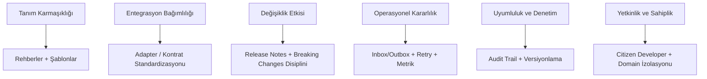

# İş Riskleri ve Azaltım

Bu sayfa, vNext platformu üzerinde süreç tasarlarken ve işletirken karşılaşılan başlıca **iş riskleri** ile bu risklerin platform ve metodoloji düzeyinde nasıl **azaltıldığını** özetler. Hedef kitle: ürün sahipleri, iş analistleri, uyumluluk ve operasyon ekipleri.

## Risk Haritası

## 1. Tanım Karmaşıklığı

**Risk:** Süreçler büyüdükçe akış tanımları okunması zor, bakımı pahalı bir hâle gelebilir. Çok sayıda condition + sub-flow + script kombinasyonu "tanım üzerinde kod yazma" anti-pattern'ine dönüşebilir.

**Azaltım stratejileri:**

- **Rehberler ve şablonlar** — yaygın senaryolar (onay zinciri, KYC, raporlama) için referans şablonlar.
- **Modülerleştirme** — büyük akışları **sub-flow** ile parçala; her parça tek sorumluluk taşısın.
- **Script ölçeği sınırı** — script task'larını dar tutar, ağır iş mantığını uygulama servisine taşır.
- **Tanım review süreci** — yeni workflow'lar code review benzeri bir gözden geçirmeden geçer.

## 2. Entegrasyon Bağımlılığı

**Risk:** Süreç, üçüncü taraf veya iç dış sistemlere (KYC servisi, core banking, ödeme switch'i) sıkı bağlıdır. Tek bir kontrat değişikliği birden çok süreci kırar.

**Azaltım stratejileri:**

- **Adapter / kontrat standardizasyonu** — dış sistemler ile etkileşim, sabitlenmiş request/response sözleşmeleri üzerinden tanımlanır.
- **Dapr building blocks** — service invocation, pub/sub, binding, state ve secret store soyutlamaları ile sağlayıcı bağımsızlığı.
- **Circuit breaker + retry policy** — dış sistem geçici hataları akışı bozmaz, kontrollü yeniden denenir.
- **Mock + simülasyon** — entegrasyon testleri staging ortamında, sahte servislerle koşturulabilir.

## 3. Değişiklik Etkisi

**Risk:** Bir bileşende (workflow, task, schema, function) yapılan değişiklik aktif çalışan instance'ları veya bağımlı süreçleri etkileyebilir.

**Azaltım stratejileri:**

- **Semantic Versioning** — her bileşen MAJOR.MINOR.PATCH ile sürümlenir; kırıcı değişiklik MAJOR'a düşer.
- **Yan yana sürüm** — eski ve yeni sürüm aynı anda çalışabilir; devam eden instance'lar başlatıldıkları sürümü tamamlar.
- **Breaking changes disiplini** — kırıcı değişiklikler için `docs/breaking-changes/` altında resmi duyuru standardı.
- **Release notes** — her sürümde değişiklik, etki ve migration adımları açıkça belgelenir.
- **Geri dönüş (rollback)** — sorun çıkan sürümden bir önceki sürüme kontrollü dönüş.

## 4. Operasyonel Kararlılık

**Risk:** Yoğun yük, geçici dış sistem arızası veya altyapı kesintisi süreçleri yarıda bırakabilir; mesaj veya işlem kaybı yaşanabilir.

**Azaltım stratejileri:**

- **Inbox/Outbox pattern** — gelen olaylar ve giden mesajlar transactional outbox üzerinden idempotent şekilde işlenir.
- **Background workers** — Inbox/Outbox worker'ları geçici hataları arka planda otomatik yeniden dener.
- **Domain izolasyonu** — bir domain'in arızası diğer domain'leri etkilemez.
- **Health endpoint + metrik** — `health` uçları + persistent metrics (ClickHouse) ile sorun erken tespit edilir.
- **Distributed cache (Redis)** — sık erişilen tanım/veri için merkezi cache; tek nokta yük baskısı azalır.

## 5. Uyumluluk ve Denetim

**Risk:** Düzenleyici (BDDK, MASAK, KVKK, SPK) denetimlerinde "şu işlem ne zaman, kim tarafından, hangi veriyle yapıldı?" sorusu cevapsız kalabilir.

**Azaltım stratejileri:**

- **Audit trail** — her transition, her task execution otomatik olarak kayıt altına alınır.
- **OpenTelemetry** — uçtan uca distributed tracing; korelasyon ID'leri ile süreç tüm bileşenler arasında takip edilir.
- **Versiyon kaydı** — bir instance'ın hangi tanım sürümüyle çalıştığı kalıcı olarak saklanır.
- **Field-level visibility (master schema roles)** — hassas veri alanlarına rol bazlı erişim kontrolü.
- **Secret yönetimi** — credential, API key gibi sırlar Dapr secret store üzerinden merkezi olarak yönetilir.

## 6. Yetkinlik ve Sahiplik

**Risk:** Tüm süreç bilgisi BT ekibinde kilitlenirse iş birimleri kendi süreçlerinde söz sahibi olamaz; rotasyon ve büyüme darboğaza dönüşür.

**Azaltım stratejileri:**

- **Citizen developer yaklaşımı** — düşük kod / tanım odaklı modelle iş analistleri kendi süreçlerini şekillendirebilir.
- **Domain izolasyonu** — her iş alanı kendi süreçlerinin sahibi; bağımsız ilerler, bağımsız deploy eder.
- **Rehberli onboarding** — yeni alan için adım adım kılavuzlar ve örnek paketler.
- **Ortak terim sözlüğü** — iş ↔ teknik dil eşleştirmesi ile iletişim kaybı azaltılır.

## Risk-Azaltım Matrisi

| Risk | Olasılık | Etki | Birincil Azaltım | İlgili Platform Mekanizması |
|------|----------|------|------------------|-----------------------------|
| Tanım karmaşıklığı | Orta | Orta | Rehber + şablon + sub-flow | [Workflow modelleme](../../docs/intro) |
| Entegrasyon kırılması | Orta | Yüksek | Kontrat standardizasyonu | Dapr building blocks |
| Versiyon çakışması | Düşük | Yüksek | Semantic versioning + yan yana sürüm | Component versioning |
| İşlem/mesaj kaybı | Düşük | Yüksek | Inbox/Outbox + retry | Outbox workers |
| Denetim eksikliği | Düşük | Çok Yüksek | Audit trail + tracing | OpenTelemetry + persistent metrics |
| Sahiplik yoğunlaşması | Orta | Orta | Citizen developer + izolasyon | Multi-domain runtime |

## Risk Yönetiminin Sürekliliği

Risk azaltımı tek seferlik bir aktivite değildir. vNext üzerinde aşağıdaki periyodik pratikler önerilir:

- **Çeyreklik süreç sağlık taraması** — en yüksek hata oranlı ve en uzun süren akışların gözden geçirilmesi.
- **Yıllık entegrasyon kontrat review'u** — dış sistem sözleşmelerinin güncelliğinin doğrulanması.
- **Her release sonrası retrospektif** — breaking changes ve migration adımlarının etkinliğinin ölçülmesi.
- **Audit log örnekleme** — denetim izinin tutarlılığının düzenli olarak doğrulanması.

## İlgili Teknik Dokümanlar

- Architecture: [/architecture/intro](/architecture/intro)
- Infrastructure: [/docs/intro](/docs/intro)
- Breaking changes: [/blog](/blog) (release notes)
- Security: ilgili Technical bölümleri
