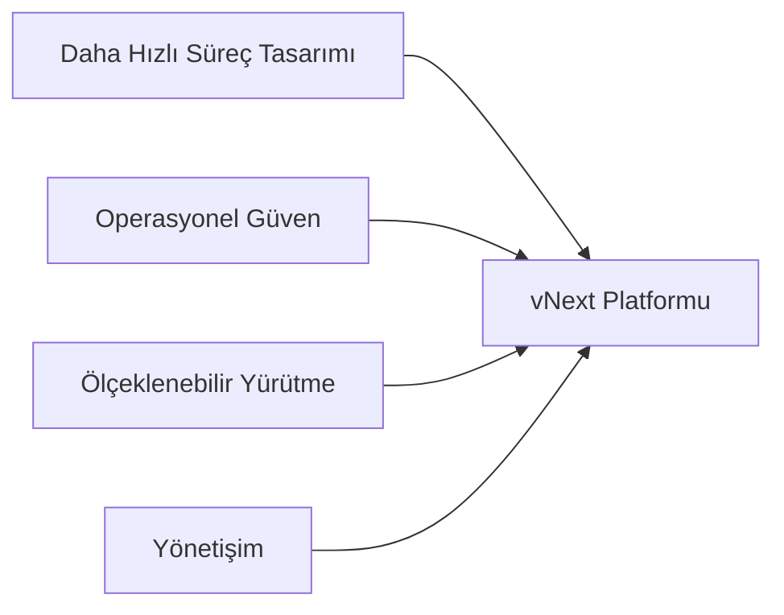

# Değer Önerisi (Value Proposition)

## Neden vNext?

Kurumsal yazılım dünyasında iş süreçleri geleneksel olarak **özel kod** ile geliştirilir. Her yeni süreç aylar süren analiz, geliştirme, test ve deploy döngüsüne girer. vNext, bu döngüyü kırarak iş süreçlerini **platformlaştırır** ve aşağıdaki dört temel değer eksenini sunar.

## Dört Temel Değer Ekseni

### 1. Daha Hızlı Süreç Tasarımı

**Tanım odaklı workflow modeli** — süreçler kodlanmaz, tanımlanır.

| Metrik | Geleneksel Yaklaşım | vNext ile |
|--------|---------------------|-----------|
| Yeni iş akışı tanımlama | 4-8 hafta geliştirme | 1-5 gün konfigürasyon |
| İş kuralı değişikliği | 2-4 hafta (CR → Dev → Test → Deploy) | Saatler içinde (config change → deploy) |
| Yeni entegrasyon ekleme | 3-6 hafta | 1-3 gün |
| Yeni iş alanı açma | 8-12 hafta (altyapı + geliştirme) | 1-2 gün (platform clone) |

**Hızlı yapan unsurlar:**

- İş akışları **tanımlanır**, sıfırdan kodlanmaz
- Entegrasyon noktaları hazır task tipleri (HTTP, DaprService, DaprPubSub, Timer, Script, SubFlow) ile bağlanır
- Her alan bağımsız deploy edilir — diğer alanları beklemek gerekmez
- Versiyon yönetimi sayesinde geri dönüş anında yapılabilir
- Citizen developer yaklaşımıyla iş analistleri sürece doğrudan katkı verir

### 2. Operasyonel Güven

**Inbox/Outbox, retry, metrik ve log altyapısı** ile süreçler güvenle koşar.

| Mekanizma | Sağladığı Güvence |
|-----------|-------------------|
| **Inbox/Outbox pattern** | Olayların tam-bir-kez (exactly-once semantics) işlenmesi, mesaj kaybı yok |
| **Retry policy** | Geçici hataların kontrollü ve idempotent şekilde yeniden denenmesi |
| **Background workers** | Asenkron işlerin arka planda dayanıklı yürütülmesi |
| **OpenTelemetry** | Uçtan uca distributed tracing + structured logging |
| **Persistent metrics (ClickHouse)** | Uzun vadeli metrik saklama ve analiz |
| **Health checks** | Tüm bileşenlerin sağlık durumunun anlık takibi |
| **Distributed cache (Redis)** | Tutarlı, otomatik invalidate edilen cache |
| **ETag concurrency control** | Eşzamanlı erişimde veri kaybı koruması |

**Operasyonel kazanımlar:**

- Geçici dış sistem arızaları akışı yarıda bırakmaz
- Süreç adımları nereden geçtiğini, neye baktığını, ne sonuç verdiğini bilir
- "Şu anda kaç başvuru var, hangi adımda?" sorusu anlık cevaplanır
- Hata ayıklama saatler değil, dakikalar içinde tamamlanır

### 3. Ölçeklenebilir Yürütme

**Asenkron işleme ve dağıtık bileşenlerle büyüme.**

vNext mimarisi büyümeyi en başından düşünür:

- **Orchestration API ↔ Execution API ayrımı** — istemci işlemleri ile arka plan görev yürütümü ayrı ölçeklenir
- **Asenkron task yürütümü** — uzun süren işler ana akışı kilitlemez
- **Domain bazında izolasyon** — her alan kendi ihtiyacına göre ölçeklenir
- **Multi-schema desteği** — tek instance üzerinde çoklu tenant
- **Stateless API host'ları** — yatay büyüme için doğal uyum
- **PostgreSQL + ClickHouse + Redis** — operasyonel + analitik + cache yükü ayrıştırılmış

**Sonuç:**

| Yük Profili | vNext Davranışı |
|-------------|-----------------|
| Düşük yük | Tek instance yeter; kaynak israfı yok |
| Pik yük | Domain bazında bağımsız ölçeklenme |
| Sürekli yüksek yük | Worker havuzları otomatik genişler |
| Bölgesel dağıtım | Multi-cloud / multi-region kurulum mümkün |

### 4. Yönetişim

**Sürümleme, kırıcı değişiklik takibi ve gözlemlenebilirlik.**

Platform yönetişimi üç katmanda işler:

#### Sürümleme

- Her bileşen (workflow, task, schema, function, view) **MAJOR.MINOR.PATCH** semantic versioning ile yönetilir
- Eski ve yeni sürümler **yan yana** çalışır
- Devam eden instance'lar başlatıldıkları sürümle tamamlanır
- Yeni instance'lar güncel sürümle başlar

#### Kırıcı Değişiklik Disiplini

- Her kırıcı değişiklik resmi duyuruyla yayımlanır
- Migration adımları örnekle birlikte verilir
- Release notes standardı her sürüm için takip edilir

#### Gözlemlenebilirlik & Denetlenebilirlik

- Her transition, task execution, dış çağrı kayıt altına alınır (audit trail)
- Distributed tracing korelasyon ID'leri ile uçtan uca akış izlenir
- Field-level visibility ile hassas veri rol bazında korunur
- Sırlar (credentials, API keys) Dapr secret store üzerinde merkezi yönetilir

## Kimler İçin Değer Üretir?

| Paydaş | Aldığı Değer |
|--------|--------------|
| **CEO / CTO** | Dijital dönüşüm hızı, maliyet kontrolü, risk azaltma |
| **İş Birimi Yöneticisi** | Bağımsız hareket edebilme, hızlı değişiklik |
| **Operasyon Müdürü** | Uçtan uca görünürlük, otomatik izleme |
| **Uyumluluk Sorumlusu** | Denetlenebilirlik, otomatik raporlama |
| **BT Direktörü** | Standart platform, azalan bakım yükü |
| **İş Analisti (Citizen Dev)** | Süreç sahipliği, fikirden uygulamaya hızlı yol |

## ROI ve Maliyet Azaltma

| Alan | Tasarruf |
|------|----------|
| **Geliştirme maliyeti** | Tekrarlayan süreç kodlama ihtiyacı ortadan kalkar |
| **Bakım yükü** | Platform güncellenir, bireysel süreçler ayrı ayrı bakılmaz |
| **Altyapı standardizasyonu** | Her ekip aynı altyapıyı kullanır, özel DevOps ihtiyacı azalır |
| **Hata maliyeti** | Denetlenebilir akışlar ile sorun erken tespit edilir |
| **Eğitim** | Tek platform bilgisi ile tüm alanlarda çalışılabilir |
| **Lisans** | Vendor lock-in yerine açık standartlar + Dapr ekosistemi |

## Değer Üretme

| Alan | Getiri |
|------|--------|
| **Hızlı ürün lansmanı** | Rekabet avantajı — rakiplerden önce pazara çık |
| **Müşteri deneyimi** | Dakikalar içinde hesap açılışı, anlık onay/red |
| **Düzenleyici uyum** | Otomatik raporlama ve audit trail ile ceza riski azalır |
| **Veri odaklı karar** | Her süreç adımı ölçülebilir — darboğazlar görünür hale gelir |
| **Organizasyonel çeviklik** | Yeni alan, yeni partner, yeni regülasyon hızla karşılanır |

## Rakip Yaklaşımlarla Karşılaştırma

| Kriter | Özel Geliştirme | BPM Ürünleri (Camunda, Pega) | vNext |
|--------|-----------------|------------------------------|-------|
| Kurulum süresi | Aylar | Haftalar | Günler |
| Değişiklik hızı | Yavaş (CR döngüsü) | Orta | Hızlı (config-driven) |
| Domain izolasyonu | Yok (monolitik) | Sınırlı | Tam (domain = runtime) |
| Entegrasyon yaklaşımı | Her seferinde yeniden | Connector bazlı | Dapr building blocks + task tipleri |
| Operasyonel altyapı | Her ekip kendi kurar | Vendor'a bağlı | Inbox/Outbox + retry + metric yerleşik |
| Cloud-native | Bağlı | Genelde değil | Birinci sınıf vatandaş |
| Maliyet | Yüksek (her süreç ayrı) | Lisans + geliştirme | Platform + konfigürasyon |
| Sahiplik | BT'ye bağımlı | Hibrit | İş birimi + BT işbirliği |
