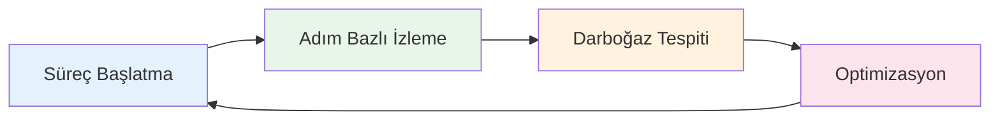

# Değer Önerisi (Value Proposition)

## Neden vNext?

Kurumsal yazılım dünyasında iş süreçleri geleneksel olarak **özel kod** ile geliştirilir. Her yeni süreç aylar süren analiz, geliştirme, test ve deploy döngüsüne girer. vNext, bu döngüyü kırarak iş süreçlerini **platformlaştırır**.

## Temel Değer Alanları

### 1. Time-to-Market — Pazara Çıkış Hızı

| Metrik | Geleneksel Yaklaşım | vNext ile |
|--------|---------------------|-----------|
| Yeni iş akışı tanımlama | 4-8 hafta geliştirme | 1-5 gün konfigürasyon |
| İş kuralı değişikliği | 2-4 hafta (CR → Dev → Test → Deploy) | Saatler içinde (config change → deploy) |
| Yeni entegrasyon ekleme | 3-6 hafta | 1-3 gün |
| Yeni iş alanı açma | 8-12 hafta (altyapı + geliştirme) | 1-2 gün (platform clone) |

**Neden hızlı?**
- İş akışları **tanımlanır**, sıfırdan kodlanmaz
- Entegrasyon noktaları hazır task tipleri ile bağlanır
- Her alan bağımsız deploy edilir — diğer alanları beklemek gerekmez
- Versiyon yönetimi sayesinde geri dönüş anında yapılabilir

### 2. ROI — Yatırım Getirisi

#### Maliyet Azaltma

| Alan | Tasarruf |
|------|----------|
| **Geliştirme maliyeti** | Tekrarlayan süreç kodlama ihtiyacı ortadan kalkar |
| **Bakım yükü** | Platform güncellenir, bireysel süreçler ayrı ayrı bakılmaz |
| **Altyapı standardizasyonu** | Her ekip aynı altyapıyı kullanır, özel DevOps ihtiyacı azalır |
| **Hata maliyeti** | Denetlenebilir akışlar ile sorun erken tespit edilir |
| **Eğitim** | Tek platform bilgisi ile tüm alanlarda çalışılabilir |

#### Değer Üretme

| Alan | Getiri |
|------|--------|
| **Hızlı ürün lansmanı** | Rekabet avantajı — rakiplerden önce pazara çık |
| **Müşteri deneyimi** | Dakikalar içinde hesap açılışı, anlık onay/red |
| **Düzenleyici uyum** | Otomatik raporlama ve audit trail ile ceza riski azalır |
| **Veri odaklı karar** | Her süreç adımı ölçülebilir — darboğazlar görünür hale gelir |

### 3. Operasyonel Verimlilik

#### Manuel Süreçlerin Otomasyonu

- **Onay zincirleri**: Kağıt bazlı onay → dijital akış + otomatik hatırlatma
- **Periyodik raporlama**: Manuel veri toplama → zamanlayıcı bazlı otomatik rapor
- **Entegrasyon yönetimi**: Sistem bazlı özel bağlantılar → merkezi entegrasyon katmanı

#### Operasyonel Metrikler

Platform, her sürecin her adımını izleyerek:
- Ortalama tamamlanma sürelerini ölçer
- Bekleyen/tıkanan işlemleri görünür kılar
- En çok zaman harcanan adımları belirler
- Optimizasyon fırsatlarını veri ile destekler

### 4. Risk Azaltma

| Risk | Platform Çözümü |
|------|-----------------|
| **Veri kaybı** | ETag tabanlı eşzamanlılık koruması |
| **Denetim eksikliği** | Her işlem otomatik loglanır |
| **Sistem bağımlılığı (vendor lock-in)** | Açık standartlar, REST API, event-driven mimari |
| **Tek nokta arızası** | Domain izolasyonu — bir alan çökse diğerleri çalışmaya devam eder |
| **Değişiklik riski** | Versiyonlama — yeni sürüm sorun çıkarırsa öncekine dön |
| **Yetkinlik bağımlılığı** | Konfigürasyon bazlı — tek kişiye bağımlılık azalır |

### 5. Çeviklik (Agility)

**Değişen düzenlemelere hızlı adaptasyon:**
- Yeni düzenleme geldiğinde iş akışı kuralları güncellenir, kod yazılmaz
- Versiyonlama sayesinde eski ve yeni kurallar paralel çalışır
- Geçiş süreci kontrollü yönetilir

**Organizasyonel büyümeye hazırlık:**
- Yeni ürün, yeni departman, yeni partner → yeni domain oluştur, hemen başla
- Mevcut akışları şablon olarak kullan, kopyala, özelleştir
- Platform ölçeklenir — her yeni alan aynı kalite ve güvenlikle çalışır

## Kimler İçin Değer Üretir?

| Paydaş | Aldığı Değer |
|--------|--------------|
| **CEO / CTO** | Dijital dönüşüm hızı, maliyet kontrolü, risk azaltma |
| **İş Birimi Yöneticisi** | Bağımsız hareket edebilme, hızlı değişiklik |
| **Operasyon Müdürü** | Uçtan uca görünürlük, otomatik izleme |
| **Uyumluluk Sorumlusu** | Denetlenebilirlik, otomatik raporlama |
| **BT Direktörü** | Standart platform, azalan bakım yükü |

## Rakip Yaklaşımlarla Karşılaştırma

| Kriter | Özel Geliştirme | BPM Ürünleri (Camunda, Pega) | vNext |
|--------|-----------------|------------------------------|-------|
| Kurulum süresi | Aylar | Haftalar | Günler |
| Değişiklik hızı | Yavaş (CR döngüsü) | Orta | Hızlı (config-driven) |
| Domain izolasyonu | Yok (monolitik) | Sınırlı | Tam (domain = runtime) |
| Bankacılık odağı | Yok (generic) | Kısmen | Tam (sektör odaklı tasarım) |
| Entegrasyon | Her seferinde yeniden | Connector bazlı | Yerleşik task tipleri |
| Maliyet | Yüksek (her süreç ayrı) | Lisans + geliştirme | Platform + konfigürasyon |
| Sahiplik | BT'ye bağımlı | Hibrit | İş birimi + BT işbirliği |
