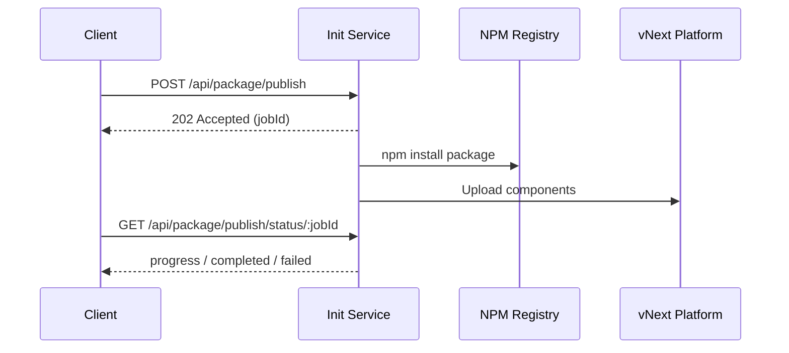
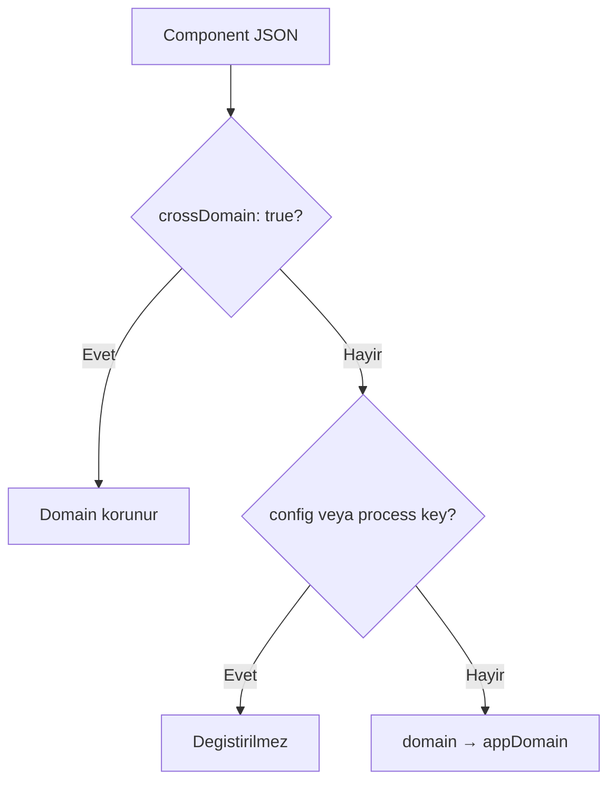
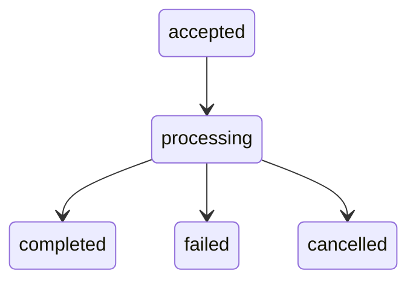

# vNext Init Service

vNext Init Service, platform bileşenlerinin deployment işlemlerini yöneten merkezi servistir. Bu servis, geliştiricilerin hazırladıkları workflow paketlerini platforma deploy etmelerini sağlar.

## Genel Bakış

vNext Init Service, aşağıdaki işlemleri gerçekleştirir:

1. **Paket İndirme**: NPM veya diğer artifact sistemlerinden paketleri indirir
2. **Versiyon Oluşturma**: Semantik versiyonlama stratejisi ile versiyonları yönetir
3. **Bileşen Deploy**: Tüm bileşen türlerini platforma asenkron job stratejisi ile deploy eder
4. **Domain Değiştirme (replaceDomain)**: 3rd parti domain bileşenlerini hedef domain bilgileri ile deploy etmeye imkan tanır

### Çalışma Yöntemi

Deploy işlemi **asenkron job** stratejisi ile çalışır. Publish endpoint'ine yapılan istek anında `202 Accepted` ile bir `jobId` döner; deploy ilerlemesi status endpoint'i üzerinden sorgulanır.



1. Geliştiricinin platforma deploy etmek istediği repo önce **build** alınarak paketlenir
2. Paket **NPM** veya herhangi bir artifact sistemine yüklenir
3. `vnext.config.json` dosyasındaki `version` alanı semantik olarak versiyonlanır
4. Init service publish endpoint'ine istek atılır ve bir **jobId** alınır
5. Status endpoint'i ile job'ın durumu sorgulanarak deploy sürecinin detayları takip edilir

---

## Bileşen Türleri

Init Service aşağıdaki bileşen türlerini deploy etmek için kullanılır:

| Bileşen | Açıklama |
|---------|----------|
| **flows** | İş akışı tanımlamaları |
| **tasks** | Görev tanımlamaları |
| **schemas** | Veri şema tanımlamaları |
| **extensions** | Extension bileşenleri |
| **functions** | Fonksiyon tanımlamaları |
| **views** | Görünüm tanımlamaları |

---

## Deployment Akışı

### 1. Paket Hazırlama

```bash
# Projeyi build edin
npm run build

# Paketi oluşturun
npm pack
```

### 2. Versiyonlama

`vnext.config.json` dosyasında version alanını güncelleyin:

```json
{
  "name": "my-workflow-package",
  "version": "1.0.0",
  "domain": "my-domain"
}
```

> **Not**: Versiyonlama stratejisi için detaylı bilgi: *Versiyon Yönetimi (Phase 2)*

### 3. NPM'e Yükleme

```bash
npm publish --registry https://your-registry.com
```

### 4. Init Service ile Deploy

Deploy işlemi iki adımda gerçekleşir:

**Adım 1 — Publish isteği gönderin:**

```http
POST /api/package/publish
Content-Type: application/json

{
  "packageName": "@my-org/my-workflow-package",
  "version": "1.0.0"
}
```

Servis `202 Accepted` yanıtı ile bir `jobId` döner:

```json
{
  "jobId": "550e8400-e29b-41d4-a716-446655440000",
  "statusUrl": "/api/package/publish/status/550e8400-e29b-41d4-a716-446655440000",
  "message": "Job accepted. Poll statusUrl for progress."
}
```

**Adım 2 — Job durumunu sorgulayın:**

```http
GET /api/package/publish/status/550e8400-e29b-41d4-a716-446655440000
```

Job `completed` veya `failed` durumuna geçene kadar status endpoint'ini polling ile sorgulayın.

### Instance üzerinde flow versiyonu

Bir instance'ın **başlatıldığı flow versiyonu** **instance üzerinde saklanır** ve transition'lar için kullanılır. Böylece instance, başlatıldığı flow versiyonu ile devam eder.

### Loglama ve ingress zaman aşımları

Init servis log satırlarında **zaman damgası** bulunur. Deploy işlemi artık asenkron job olarak çalıştığı için istemci tarafında timeout riski büyük ölçüde ortadan kalkmıştır. Ancak Helm'teki **nginx** (veya diğer ingress) **proxy read/send timeout** değerlerinin yeterli olduğundan emin olun.

---

## API Endpointleri

Tüm API yanıtlarında uygulama sürümü **X-App-Version** response header'ında döner.

### Health Check

Servis ve platform sağlık durumunu kontrol eder.

```http
GET /health
Accept: application/json
```

**Response headers:** Tüm yanıtlarda uygulama sürümü `X-App-Version` header'ında döner (örn. `X-App-Version: 0.0.38`). Health endpoint'i de bu header'ı içerir.

**Response:**
```json
{
  "status": "healthy",
  "timestamp": "2025-01-15T10:30:00Z"
}
```

---

### Package Publish (Standard)

Herhangi bir NPM paketini platforma asenkron olarak deploy eder. Yanıt olarak bir `jobId` döner.

```http
POST /api/package/publish
Content-Type: application/json
```

**Request Body:**

| Alan | Tip | Zorunlu | Varsayılan | Açıklama |
|------|-----|---------|------------|----------|
| `packageName` | string | ✅ | — | NPM paket adı (örn: `@my-org/my-workflow-package`) |
| `version` | string | ❌ | `latest` | Paket versiyonu (örn: `1.0.0`) |
| `replaceDomain` | boolean | ❌ | `false` | Domain değiştirme özelliğini etkinleştirir; `appDomain` ile birlikte kullanılmalıdır |
| `appDomain` | string | ❌ | — | Hedef domain adı (`replaceDomain: true` ile birlikte kullanılır) |
| `npmRegistry` | string | ❌ | `https://registry.npmjs.org/` | Özel NPM registry URL'i |
| `npmToken` | string | ❌ | — | Token tabanlı authentication (npmjs.org ve uyumlu registry'ler) |
| `npmUsername` | string | ❌ | — | Azure DevOps / TFS Artifacts kullanıcı adı |
| `npmPassword` | string | ❌ | — | Azure DevOps / TFS Artifacts şifresi (servis tarafında Base64'e çevrilir) |
| `npmEmail` | string | ❌ | `unused@dev.azure.com` | Azure DevOps / TFS Artifacts e-posta |
| `reInitialize` | boolean | ❌ | `false` | Deploy sonrası platform cache'ini yeniden başlatır |

**Response:** `202 Accepted`

```json
{
  "jobId": "550e8400-e29b-41d4-a716-446655440000",
  "statusUrl": "/api/package/publish/status/550e8400-e29b-41d4-a716-446655440000",
  "message": "Job accepted. Poll statusUrl for progress."
}
```

---

### Runtime Package Publish

`@burgan-tech/vnext-core-runtime` paketini platforma deploy eder. Bu endpoint runtime pakete özeldir ve **appDomain zorunludur**. Domain değiştirme her zaman uygulanır.

Runtime paket deploy sıralaması:
1. **Workflows** dizini öncelikli işlenir — `sys-flows.json` ilk yüklenir
2. Diğer workflow dosyaları yüklenir
3. Kalan bileşen dizinleri (tasks, views, functions, extensions, schemas) işlenir

```http
POST /api/package/runtime/publish
Content-Type: application/json
```

**Request Body:**

| Alan | Tip | Zorunlu | Varsayılan | Açıklama |
|------|-----|---------|------------|----------|
| `version` | string | ❌ | `latest` | Paket versiyonu |
| `appDomain` | string | ✅ | — | Hedef domain adı (tüm domain alanları bu değerle değiştirilir) |
| `npmRegistry` | string | ❌ | `https://registry.npmjs.org/` | Özel NPM registry URL'i |
| `npmToken` | string | ❌ | — | Token tabanlı authentication |
| `npmUsername` | string | ❌ | — | Azure DevOps / TFS Artifacts kullanıcı adı |
| `npmPassword` | string | ❌ | — | Azure DevOps / TFS Artifacts şifresi |
| `npmEmail` | string | ❌ | `unused@dev.azure.com` | Azure DevOps / TFS Artifacts e-posta |
| `reInitialize` | boolean | ❌ | `false` | Deploy sonrası platform cache'ini yeniden başlatır |

**Response:** `202 Accepted`

```json
{
  "jobId": "660e8400-e29b-41d4-a716-446655440000",
  "statusUrl": "/api/package/publish/status/660e8400-e29b-41d4-a716-446655440000",
  "message": "Job accepted. Poll statusUrl for progress."
}
```

> **Not:** `appDomain` gönderilmezse `400 Bad Request` döner.

---

### Job Status (Durum Sorgulama)

Publish job'ının güncel durumunu ve ilerleme bilgisini döner.

```http
GET /api/package/publish/status/:jobId
```

**Response:** `200 OK`

```json
{
  "jobId": "550e8400-e29b-41d4-a716-446655440000",
  "packageName": "@my-org/my-workflow-package",
  "status": "processing",
  "progress": {
    "current": 5,
    "total": 12,
    "currentFile": "core/Tasks/sys-tasks.json",
    "phase": "uploading"
  },
  "results": null,
  "error": null,
  "cancelRequested": false,
  "cancelledAt": null,
  "createdAt": "2025-01-15T10:30:00Z",
  "updatedAt": "2025-01-15T10:30:15Z"
}
```

**`status` değerleri:**

| Durum | Açıklama |
|-------|----------|
| `accepted` | Job kuyruğa alındı, henüz işlenmeye başlamadı |
| `processing` | Job aktif olarak çalışıyor |
| `completed` | Tüm bileşenler başarıyla deploy edildi |
| `failed` | Job hata ile sonlandı |
| `cancelled` | Kullanıcı tarafından iptal edildi |

**`progress.phase` değerleri:**

| Phase | Açıklama |
|-------|----------|
| `waiting-for-vnext` | vNext Platform'un sağlıklı olması bekleniyor |
| `downloading` | NPM paketi indiriliyor |
| `uploading` | Bileşenler platforma yükleniyor |
| `re-initializing` | Platform cache yeniden başlatılıyor |
| `done` | İşlem tamamlandı |
| `cancelled` | İşlem iptal edildi |
| `failed` | İşlem hata ile sonlandı |

**Tamamlanmış job response örneği:**

```json
{
  "jobId": "550e8400-e29b-41d4-a716-446655440000",
  "packageName": "@my-org/my-workflow-package",
  "status": "completed",
  "progress": {
    "current": 12,
    "total": 12,
    "currentFile": "core/Schemas/sys-schemas.json",
    "phase": "done"
  },
  "results": {
    "success": true,
    "message": "Package processed and published successfully",
    "packageName": "@my-org/my-workflow-package",
    "appDomain": "my-domain",
    "successful": ["core/Workflows/sys-flows.json", "core/Tasks/sys-tasks.json"],
    "failed": [],
    "skipped": []
  },
  "error": null,
  "cancelRequested": false,
  "cancelledAt": null,
  "createdAt": "2025-01-15T10:30:00Z",
  "updatedAt": "2025-01-15T10:31:20Z"
}
```

> **Not:** `jobId` bulunamazsa `404 Not Found` döner. Job'lar terminal duruma geçtikten **30 dakika** sonra otomatik olarak temizlenir.

---

### Job Cancel (İptal)

Çalışan bir publish job'ını kooperatif (cooperative) şekilde iptal eder. Job, bir sonraki kontrol noktasında (dosyalar arasında) durur.

```http
POST /api/package/publish/cancel/:jobId
```

**Response:** `202 Accepted`

```json
{
  "jobId": "550e8400-e29b-41d4-a716-446655440000",
  "status": "processing",
  "cancelRequested": true,
  "message": "Cancel signal sent. Job will stop at next checkpoint. Poll status endpoint to confirm."
}
```

**Hata durumları:**

| HTTP Kodu | Durum | Açıklama |
|-----------|-------|----------|
| `404` | Not Found | Job bulunamadı |
| `409` | Conflict | Job zaten terminal durumda (`completed`, `failed`, `cancelled`) |

> **Dikkat:** İptal edilen job'larda o ana kadar yapılmış yüklemeler **geri alınmaz** ve `reInitialize` adımı atlanır.

---

## Package Publish Örnekleri

### Temel Kullanım

En basit kullanım — sadece paket adı:

```http
POST /api/package/publish
Content-Type: application/json

{
  "packageName": "@my-org/my-workflow-package",
  "version": "1.0.0"
}
```

**Response (202):**
```json
{
  "jobId": "...",
  "statusUrl": "/api/package/publish/status/...",
  "message": "Job accepted. Poll statusUrl for progress."
}
```

---

### Domain Değiştirme ile (replaceDomain)

3rd parti paketlerin domain bilgilerini kendi domain'iniz ile değiştirerek deploy etmek için `replaceDomain: true` ve `appDomain` birlikte kullanılır:

```http
POST /api/package/publish
Content-Type: application/json

{
  "packageName": "@my-org/my-workflow-package",
  "version": "1.0.0",
  "replaceDomain": true,
  "appDomain": "my-custom-domain"
}
```

---

### Runtime Package Publish

Core runtime paketini belirli bir domain ile deploy etmek için:

```http
POST /api/package/runtime/publish
Content-Type: application/json

{
  "version": "1.17.0",
  "appDomain": "account",
  "reInitialize": true
}
```

---

### Özel NPM Registry ile

Özel bir NPM registry kullanmak için:

```http
POST /api/package/publish
Content-Type: application/json

{
  "packageName": "@my-org/my-workflow-package",
  "version": "1.0.0",
  "npmRegistry": "https://registry.your-company.com"
}
```

---

### Private Registry — Token Authentication

Private NPM registry için token tabanlı authentication:

```http
POST /api/package/publish
Content-Type: application/json

{
  "packageName": "@my-org/my-workflow-package",
  "version": "1.0.0",
  "npmRegistry": "https://registry.your-company.com",
  "npmToken": "your-npm-token-here"
}
```

---

### Private Registry — Azure DevOps / TFS Artifacts

Azure DevOps veya TFS Artifacts feed'leri için kullanıcı adı ve şifre ile authentication:

```http
POST /api/package/publish
Content-Type: application/json

{
  "packageName": "@my-org/my-workflow-package",
  "version": "1.0.0",
  "npmRegistry": "https://pkgs.dev.azure.com/your-org/_packaging/your-feed/npm/registry/",
  "npmUsername": "your-username",
  "npmPassword": "your-pat-token",
  "npmEmail": "user@company.com"
}
```

---

### Tam Konfigürasyon

Tüm parametreleri içeren kapsamlı örnek:

```http
POST /api/package/publish
Content-Type: application/json

{
  "packageName": "@my-org/my-workflow-package",
  "version": "1.0.0",
  "npmRegistry": "https://registry.your-company.com",
  "npmToken": "your-npm-token-here",
  "replaceDomain": true,
  "appDomain": "production",
  "reInitialize": true
}
```

---

### Job Durumu Sorgulama

Publish isteğinden dönen `jobId` ile deploy durumunu takip edin:

```http
GET /api/package/publish/status/550e8400-e29b-41d4-a716-446655440000
```

---

### Job İptal Etme

Çalışan bir deploy job'ını iptal etmek için:

```http
POST /api/package/publish/cancel/550e8400-e29b-41d4-a716-446655440000
```

---

## Domain Değiştirme (replaceDomain)

`replaceDomain` özelliği, 3rd parti domain paketlerinin bileşen JSON'larındaki `domain` alanlarını hedef domain ile değiştirerek deploy edilmesine imkan tanır.

### Nasıl Çalışır

- **Standard Publish** (`POST /api/package/publish`): Opt-in özelliğidir. `replaceDomain: true` ve geçerli bir `appDomain` birlikte gönderilmelidir. İkisi birlikte verilmezse domain değiştirme uygulanmaz.
- **Runtime Publish** (`POST /api/package/runtime/publish`): Domain değiştirme her zaman aktiftir. `appDomain` zorunludur.

### Değiştirme Kuralları

1. JSON yapısındaki **tüm seviyelerde** `domain` alanı hedef domain ile değiştirilir (root, `attributes.domain`, `data[].domain`, vb.)
2. `crossDomain: true` işaretli bileşenler **muaf tutulur** — kasıtlı olarak başka bir domain'i hedefledikleri için domain alanları korunur
3. `config` ve `process` anahtarları içindeki değerler **hiçbir zaman değiştirilmez**



### Versiyon Oluşturma

Deploy sırasında bileşen versiyonları şu formatta oluşturulur:

```
MAJOR.MINOR.PATCH-pkg.PKG_VERSION+PKG_NAME
```

| Segment | Kaynak | Örnek |
|---------|--------|-------|
| `MAJOR.MINOR.PATCH` | Bileşenin `version` alanı | `1.0.0` |
| `PKG_VERSION` | `vnext.config.json` → `version` | `1.17.0` |
| `PKG_NAME` | `vnext.config.json` → `domain` | `account` |

Sonuç: `1.0.0-pkg.1.17.0+account`

---

## Job Yaşam Döngüsü

Publish endpoint'lerine yapılan her istek bir **job** oluşturur. Job, asenkron olarak arka planda çalışır ve belirli durumlar arasında geçiş yapar.

### Durum Geçişleri



### İşlem Aşamaları

Bir job arka planda şu aşamalardan geçer:

1. **waiting-for-vnext** — vNext Platform'un health check'i beklenir
2. **downloading** — NPM paketi indirilir ve yapısı doğrulanır
3. **uploading** — Bileşen JSON dosyaları sırayla platforma yüklenir
4. **re-initializing** — (opsiyonel) `reInitialize: true` ise platform cache yeniden başlatılır
5. **done** — İşlem tamamlandı

### TTL ve Temizlik

- Terminal duruma (`completed`, `failed`, `cancelled`) geçen job'lar **30 dakika** boyunca sorgulanabilir
- 30 dakika sonra otomatik olarak bellekten temizlenir
- Arka planda 5 dakikada bir temizlik işlemi çalışır

### Kooperatif İptal (Cooperative Cancellation)

Cancel endpoint'i bir iptal **sinyali** gönderir. Job, dosyalar arasındaki kontrol noktalarında bu sinyali kontrol eder ve mevcut yüklemeyi tamamladıktan sonra durur.

- O ana kadar yapılmış yüklemeler **geri alınmaz**
- `reInitialize` adımı **atlanır**
- Job durumu `cancelled` olarak güncellenir ve `cancelledAt` zaman damgası eklenir

---

## Definitions Publish Endpoint

Platform bileşenlerini doğrudan deploy etmek için kullanılan endpoint. Bu endpoint, init service tarafından paket indirildikten sonra bileşenleri platforma yüklemek için dahili olarak kullanılır.

```http
POST /api/v1/definitions/publish
Content-Type: application/json
```

### Request Body

| Alan | Tip | Zorunlu | Açıklama |
|------|-----|---------|----------|
| `key` | string | ✅ | Bileşen benzersiz anahtarı |
| `flow` | string | ✅ | İlişkili flow adı |
| `domain` | string | ✅ | Hedef domain |
| `version` | string | ✅ | Semantik versiyon |
| `tags` | string[] | ❌ | Bileşen etiketleri |
| `attributes` | object | ✅ | Bileşen içeriği |
| `data` | array | ❌ | Seed data (başlangıç verileri) |

**Örnek Request:**

```json
{
  "key": "my-component",
  "flow": "my-flow",
  "domain": "my-domain",
  "version": "1.0.0",
  "tags": ["production", "v1"],
  "attributes": {
    // Bileşen içeriği
  },
  "data": [
    {
      "key": "seed-record-1",
      "version": "1.0.0",
      "tags": ["initial"],
      "attributes": {}
    }
  ]
}
```

### Response Kodları

#### ✅ 200 OK - Başarılı

Bileşen başarıyla deploy edildi.

---

#### ⚠️ 400 Bad Request - Doğrulama Hatası

Bileşen doğrulaması başarısız olduğunda döner.

```json
{
  "type": "https://httpstatuses.com/400/validation/App/900006",
  "title": "Bad Request",
  "status": 400,
  "detail": "Component validation failed for type 'sys-flows'",
  "instance": "/api/v1/definitions/publish",
  "errors": {
    "workflow.States": [
      "Workflow must contain exactly one initial state. Found: 2."
    ]
  },
  "errorCode": "validation.App:900006",
  "prefix": "validation",
  "code": "App:900006",
  "traceId": "00-75d0de9d505f79e60997909aa47bc2ec-a9b2e4f305bff2b6-01"
}
```

**Yaygın Doğrulama Hataları:**
- Workflow'da birden fazla initial state tanımlanmış
- Zorunlu alanlar eksik
- Geçersiz bileşen yapısı

---

#### ❌ 409 Conflict - Versiyon Çakışması

Aynı versiyon zaten mevcut olduğunda döner.

```json
{
  "type": "https://httpstatuses.com/409/conflict/Instance/100002",
  "title": "Conflict",
  "status": 409,
  "detail": "A record with the same version already exists.",
  "instance": "/api/v1/definitions/publish",
  "errorCode": "conflict.Instance:100002",
  "prefix": "conflict",
  "code": "Instance:100002",
  "traceId": "00-cc2fa21cbe77902da014702864c563f8-e62547f41765a292-01"
}
```

**Çözüm:** `vnext.config.json` dosyasında version alanını güncelleyerek yeni bir versiyon oluşturun.

---

## İlgili Dökümanlar

- [Sunucu Timeout Yapılandırması](/docs/configuration/server-timeout) — Timeout ayarları
- [URL Templates](/docs/configuration/url-templates) — Gateway URL şablonları
- [Service Discovery](/docs/configuration/service-discovery) — Servis keşfi yapılandırması
