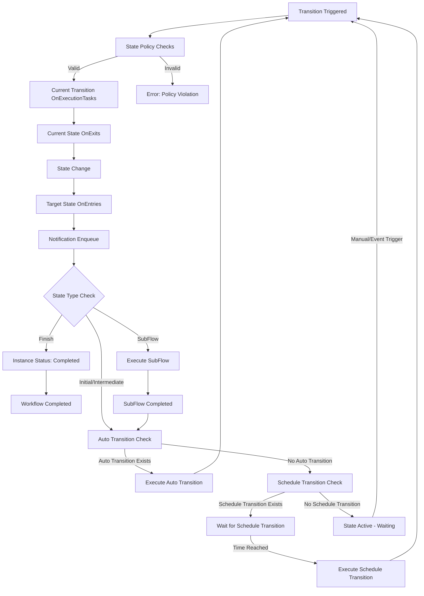

# Workflow

**Workflow**, vNext platformunda iş süreçlerini modelleyen ana **definable unit**'tir. JSON formatında tanımlanır ve `vnext-schema` üzerinden doğrulanır.

> **Schema:** [`vnext-schema/workflow-definition.schema.json`](https://github.com/burgan-tech/vnext-schema)

## Tanım JSON Örneği

> **Schema:** `workflow-definition.schema.json`

```json
{
  "key": "account-opening",
  "flow": "sys-flows",
  "flowVersion": "1.0.0",
  "domain": "banking",
  "version": "1.0.0",
  "tags": ["banking", "account", "account-opening"],
  "_comment": "Hesap açma iş akışı",
  "attributes": {
    "type": "F",
    "labels": [
      { "label": "Account Opening", "language": "en-US" },
      { "label": "Hesap Açma", "language": "tr-TR" }
    ],
    "schema": {
        "key": "account-master-schema",
        "domain": "banking",
        "flow": "sys-schemas",
        "version": "1.0.0"
    },
    "startTransition": {
      "key": "start",
      "target": "account-type-selection",
      "triggerType": 0,
      "versionStrategy": "Minor",
      "labels": [
        { "label": "Start", "language": "en-US" },
        { "label": "Başlat", "language": "tr-TR" }
      ],
      "schema": {
        "key": "start-schema",
        "domain": "banking",
        "flow": "sys-schemas",
        "version": "1.0.0"
      },
      "mapping": null
    },
    "states": [
      {
        "key": "account-type-selection",
        "stateType": 1,
        "versionStrategy": "Minor",
        "labels": [
          { "label": "Account Type Selection", "language": "en-US" },
          { "label": "Hesap Türü Seçimi", "language": "tr-TR" }
        ],
        "view": {
          "view": {
            "key": "account-type-selection-view",
            "domain": "banking",
            "flow": "sys-views",
            "version": "1.0.0"
          },
          "loadData": false
        },
        "transitions": [
          {
            "key": "select-demand-deposit",
            "target": "account-detail",
            "triggerType": 0,
            "versionStrategy": "Minor",
            "labels": [
              { "label": "Select Demand Deposit", "language": "en-US" },
              { "label": "Vadesiz Hesap Seç", "language": "tr-TR" }
            ],
            "schema": {
              "key": "demand-deposit-schema",
              "domain": "banking",
              "flow": "sys-schemas",
              "version": "1.0.0"
            },
            "mapping": {
              "location": "./src/SelectDemandDepositMapping.csx",
              "code": "<BASE64_ENCODED_CODE>"
            },
            "view": null,
            "rule": null,
            "timer": null
          }
        ]
      },
      {
        "key": "account-detail",
        "stateType": 2,
        "versionStrategy": "Minor",
        "labels": [
          { "label": "Account Detail", "language": "en-US" },
          { "label": "Hesap Detay", "language": "tr-TR" }
        ],
        "view": {
          "view": {
            "key": "account-detail-view",
            "domain": "banking",
            "flow": "sys-views",
            "version": "1.0.0"
          },
          "loadData": true,
          "extensions": ["extension-customer-detail"]
        },
        "transitions": [
          {
            "key": "complete-account",
            "target": "completed",
            "triggerType": 0,
            "versionStrategy": "Minor",
            "labels": [
              { "label": "Complete", "language": "en-US" },
              { "label": "Tamamla", "language": "tr-TR" }
            ],
            "onExecutionTasks": [
              {
                "order": 1,
                "task": {
                  "key": "create-account",
                  "domain": "banking",
                  "flow": "sys-tasks",
                  "version": "1.0.0"
                },
                "mapping": {
                  "location": "./src/CreateAccountMapping.csx",
                  "code": "<BASE64_ENCODED_CODE>"
                }
              }
            ],
            "mapping": null,
            "schema": null,
            "view": null,
            "rule": null,
            "timer": null
          }
        ]
      },
      {
        "key": "completed",
        "stateType": 3,
        "subType": 1,
        "versionStrategy": "None",
        "labels": [
          { "label": "Completed", "language": "en-US" },
          { "label": "Tamamlandı", "language": "tr-TR" }
        ]
      }
    ],
    "cancel": {
      "key": "cancel-account-opening",
      "target": "cancelled",
      "triggerType": 0,
      "versionStrategy": "None",
      "labels": [
        { "label": "Cancel", "language": "en-US" },
        { "label": "İptal", "language": "tr-TR" }
      ]
    },
    "timeout": {
      "key": "account-opening-timeout",
      "target": "timed-out",
      "versionStrategy": "None",
      "timer": {
        "reset": "None",
        "duration": "PT30M"
      }
    },
    "functions": [
      {
        "key": "function-get-customer-detail",
        "domain": "core",
        "flow": "sys-functions",
        "version": "1.0.0"
      }
    ],
    "extensions": [
      {
        "key": "extension-customer-detail",
        "domain": "core",
        "flow": "sys-extensions",
        "version": "1.0.0"
      }
    ],
    "queryRoles": [
      { "role": "account-officer", "grant": "allow" },
      { "role": "guest", "grant": "deny" }
    ]
  }
}
```

---

## Workflow Türleri

| Kod | Tür | Açıklama | Tipik Kullanım |
|---|---|---|---|
| **C** | Core | Platform çekirdek iş akışları | Sistem işlemleri, platform servisleri |
| **F** | Flow | Ana iş akışları | İşletme ana süreçleri, kullanıcı etkileşimi |
| **S** | SubFlow | Alt iş akışları | Tekrar kullanılabilir süreç parçaları |
| **P** | SubProcess | Alt süreçler | Paralel ve bağımsız işlemler (fire-and-forget) |

---

## Properties

### Top-Level Alanlar

| Alan | Tip | Zorunlu | Pattern / Kısıt | Açıklama |
|------|-----|---------|-----------------|----------|
| `$schema` | string | Hayır | — | JSON Schema referansı |
| `key` | string | **Evet** | `^[a-z0-9-]+$` | Workflow'un benzersiz tanımlayıcısı (domain içinde unique) |
| `flow` | string | **Evet** | `^[a-z0-9-]+$` | Kategorize amaçlı flow ismi |
| `flowVersion` | string | **Evet** | `^\d+\.\d+\.\d+(-[a-zA-Z]+\.\d+)?$` | Flow versiyonu (SemVer) |
| `domain` | string | **Evet** | `^[a-z0-9-]+$` | Workflow'un ait olduğu domain |
| `version` | string | **Evet** | `^\d+\.\d+\.\d+(-[a-zA-Z]+\.\d+)?$` | Workflow tanım versiyonu (SemVer) |
| `tags` | string[] | **Evet** | — | Etiketler — sorgu/filtre için |
| `_comment` | string | Hayır | — | Açıklama / yorum |
| `attributes` | object | **Evet** | — | Workflow'un asıl tanımı (aşağıda) |

### `attributes` Alanları

| Alan | Tip | Zorunlu | Açıklama |
|------|-----|---------|----------|
| `type` | string | **Evet** | Workflow türü: `C`, `F`, `S`, `P` (yukarıdaki tür tablosu) |
| `scripts` <sup>New</sup> | object | Hayır | Flow seviyesi helper ve izinli assembly tanımı (aşağıda) |
| `states` | array | **Evet** | State listesi. Tam olarak **bir** `Initial` state (`stateType: 1`) içermelidir |
| `startTransition` | object | **Evet** | Başlangıç transition tanımı (aşağıda) |
| `labels` | array | **Evet** | Çoklu dil etiketleri (`minItems: 1`). Her öğe: `label` + `language` |
| `schema` | object | Hayır | Master schema referansı. `schema` ile `reference` objesi içerir |
| `timeout` | object \| null | Hayır | Workflow seviyesi timeout tanımı (aşağıda) |
| `functions` | array | Hayır | Workflow'da kullanılan function referansları |
| `features` | array | Hayır | Workflow'da kullanılan feature (extension) referansları |
| `extensions` | array | Hayır | Workflow'da kullanılan extension referansları |
| `sharedTransitions` | array | Hayır | Birden fazla state'den erişilebilen ortak transition'lar (aşağıda) |
| `errorBoundary` | object \| null | Hayır | Global hata yönetim tanımı (aşağıda) |
| `cancel` | object \| null | Hayır | Cancel transition tanımı. Yalnızca `triggerType: 0` (manual) |
| `exit` | object \| null | Hayır | Exit transition tanımı. Yalnızca `triggerType: 0` (manual) |
| `updateData` | object \| null | Hayır | Update data transition. `target` her zaman `$self` |
| `queryRoles` | array | Hayır | Root-level sorgu rolleri. DENY her zaman ALLOW'u geçersiz kılar |
| `output` <sup>New</sup> | object \| null | Hayır | Sync yanıt için opsiyonel output mapping (`scriptCode`, `IOutputHandler`). Ayrıntı: [Output Mapping](#output-mapping) |
| `event` <sup>New</sup> | object \| null | Hayır | Workflow seviyesi event tanımı. Tanımlıysa harici bir event bu workflow'un **yeni bir instance'ını başlatabilir** (`action=start`). Transition seviyesi event'ten bağımsızdır. Ayrıntı: [Event Transition](#event-transition) |
| `config` <sup>New</sup> | object \| null | Hayır | Flow seviyesi yapılandırma. Şu an built-in function cache ayarını (`functionCache`) içerir. `null` ise host varsayılanları geçerlidir. Ayrıntı: [Config (Built-in Function Cache)](#config-built-in-function-cache) |

---

## Reference Yapısı

Workflow tanımı içinde birçok yerde kullanılan genel referans objesidir. İki formdan biri kullanılır:

| Form | Zorunlu Alanlar | Açıklama |
|------|-----------------|----------|
| Explicit | `key`, `domain`, `flow`, `version` | Doğrudan bileşen referansı |
| Ref | `ref` | Dosya yolu ile bileşen referansı |

---

## State Yapısı

### State Alanları

| Alan | Tip | Zorunlu | Açıklama |
|------|-----|---------|----------|
| `key` | string | **Evet** | State benzersiz tanımlayıcısı (pattern: `^[a-z0-9-]+$`) |
| `stateType` | integer | **Evet** | State tipi — aşağıdaki enum tablosuna bakın |
| `subType` | integer | Hayır | State alt tipi — aşağıdaki enum tablosuna bakın. Varsayılan: `0` |
| `versionStrategy` | string | **Evet** | Versiyon stratejisi: `None`, `Patch`, `Minor`, `Major` |
| `labels` | array | **Evet** | Çoklu dil etiketleri (`minItems: 1`) |
| `view` | object \| null | Hayır | State view tanımı: `view` (reference), `loadData` (boolean), `extensions` (string[]) |
| `subFlow` | object \| null | Hayır | SubFlow state için alt akış tanımı: `type` (`S`/`P`), `process` (reference), `mapping` |
| `transitions` | array | Hayır | Bu state'den çıkan transition'lar. Wizard state (`stateType: 5`) için yalnızca **bir manuel transition** tanımlanabilir |
| `onEntries` | array | Hayır | State'e girildiğinde çalıştırılacak task'lar |
| `onExits` | array | Hayır | State'den çıkılırken çalıştırılacak task'lar |
| `errorBoundary` | object \| null | Hayır | State seviyesi hata yönetimi |
| `queryRoles` | array | Hayır | State seviyesi sorgu rolleri. Root `queryRoles`'u override eder. Instance bu state'teyken **state/data/view/schema** read fonksiyonlarınca uygulanır; izin yoksa `403` (bkz. [Query Roles](#query-roles)) |
| `alias` | array | Hayır | State için rol bazlı alternatif çoklu-dil etiketleri. Tanımlıysa State Function `state` değerini role göre maskeler |
| `notifications` | array | Hayır | State'e bağlı bildirim tanımları. Transition pipeline tamamlandıktan sonra enqueue edilir ve durable çalışır — bkz. [State Notifications](#state-notifications) |
| `interaction` | object \| null | Hayır | State etkileşim yapılandırması (ör. `longPoll`). Long-poll'un ne zaman sonlandırılacağını deklaratif tanımlar — bkz. [State Interaction (Long Poll)](#state-interaction-long-poll) |

### `stateType` Enum Değerleri

| Değer | Ad | Açıklama |
|-------|----|----------|
| `1` | **Initial** | Başlangıç state'i. Workflow'da tam olarak **bir tane** olmalıdır |
| `2` | **Intermediate** | Ara state |
| `3` | **Final** | Bitiş state'i |
| `4` | **SubFlow** | Alt akış çağıran state |
| `5` | **Wizard** | Wizard (sihirbaz) state. Yalnızca bir manuel transition'a sahip olabilir |

### Wizard State ve View Davranışı

Wizard state, kullanıcı girdisini transition tabanlı modellemek için kullanılan özel state tipidir. Bir Wizard state içinde yalnızca bir manuel transition tanımlanabilir; input, seçim ve onay gibi kullanıcı etkileşimleri state view içinde data alanı olarak değil, bu transition'ın view'ı üzerinden alınmalıdır.

State Function aktif state'in tipini Wizard olarak değerlendirdiğinde önce authorization/role evaluation sonrasında kullanılabilir transition listesini belirler. Kullanılabilir manuel transition varsa View Function, state view yerine bu transition'ın view'ını döndürür. Transition üzerinde view tanımlı değilse state'de tanımlı view fallback olarak kullanılır.

Örneğin hesap açılışı akışında "hesap türü seçimi" state'inde kullanıcıdan vadeli/vadesiz seçimi alınacaksa bu seçim state view içinde veri alanı olarak modellenmemelidir. Seçim transition routing perspektifiyle tasarlanır; böylece her seçim ayrı transition görünürlüğü, loglama ve raporlama katkısı sağlar. State view varsa, summary veya wizard'a devam edeceği ekran olarak kullanılmalıdır.

### `stateSubType` Enum Değerleri

| Değer | Ad | Açıklama |
|-------|----|----------|
| `0` | None | Belirli bir alt tip yok (varsayılan) |
| `1` | Success | Başarılı tamamlanma |
| `2` | Error | Hata durumu |
| `3` | Terminated | Manuel sonlandırılmış |
| `4` | Suspended | Geçici askıya alınmış |
| `5` | Busy | Meşgul |
| `6` | Human | İnsan müdahalesi gerektiren |

### State Alias (Rol Tabanlı State Maskeleme)

`alias`, bir state'in dış dünyaya nasıl görüneceğini **role göre** maskelemek için kullanılır. Bir süreç client tarafında başlayıp backoffice'te devam ederken, arka planda Fraud, Limit, KPS gibi kontrol state'leri çalışır. Client durumu [State Function](/docs/components/functions/custom#state-function) ile sorduğunda normalde ham `state.key` döner — bu da iç süreç adımlarının client'a sızmasına ve bir güvenlik açığına yol açar.

`alias` ile aynı state'e rol bazlı alternatif çoklu-dil etiketleri tanımlanabilir: client `"Değerlendirme Aşamasında"` gibi maskelenmiş bir değer görürken, backoffice aktörleri kendi rollerine uygun alias'ı (örn. `"Operasyon İncelemesinde"`) görür.

`alias` bir dizidir; her öğe aşağıdaki alanlara sahiptir:

| Alan | Tip | Zorunlu | Açıklama |
|------|-----|---------|----------|
| `name` | string | **Evet** | Alias adı. İstek diline uygun bir `label` bulunamazsa fallback olarak döner |
| `roles` | array | **Evet** | Bu alias'ın geçerli olduğu roller (`minItems: 1`) |
| `labels` | array | **Evet** | Alias'ın çoklu-dil etiketleri (`minItems: 1`) |

**`roles` alanları:**

| Alan | Tip | Zorunlu | Açıklama |
|------|-----|---------|----------|
| `role` | string | **Evet** | Rol adı |
| `grant` | string | **Evet** | `allow` veya `deny`. DENY her zaman ALLOW'u geçersiz kılar |

**`labels` alanları:**

| Alan | Tip | Zorunlu | Açıklama |
|------|-----|---------|----------|
| `label` | string | **Evet** | Etiket metni |
| `language` | string | **Evet** | Dil kodu (pattern: `^[a-z]{2}(-[A-Z]{2})?$`, örn. `tr`, `en`, `tr-TR`) |

**Örnek:**

```json
{
  "alias": [
    {
      "name": "Değerlendirme Aşamasında",
      "roles": [
        { "role": "backoffice.operator", "grant": "allow" }
      ],
      "labels": [
        { "label": "Operasyon İncelemesinde", "language": "tr" },
        { "label": "Under Operational Review", "language": "en" }
      ]
    }
  ]
}
```

**Çözümleme Davranışı:**

State Function `state` değerini döndürürken aşağıdaki sırayı izler:

1. State'te `alias` tanımı **yoksa** → `state.key` döner (mevcut davranış).
2. `alias` tanımı **varsa** → istek yapan aktörün rolleri her alias'ın `roles` listesine göre değerlendirilir (DENY her zaman ALLOW'u geçersiz kılar).
3. Eşleşen bir alias bulunursa → istek diline (Accept-Language) uygun `label` döner; o dilde label yoksa `alias.name` döner.
4. Hiçbir alias rolü eşleşmezse → `state.key` fallback olarak döner.

### State Notifications

State'e girildikten sonra, transition pipeline'ı tamamlandığında platform bildirim taleplerini **enqueue** eder ve **durable** olarak çalıştırır. Bu yapı Notification Task'tan bağımsızdır; task pipeline'ına bağlı kalmadan state geçişini takip eden bildirimleri kapsam dışında tutar.

Dapr Binding yapılandırması [Notification Task](./tasks/notification) ile aynı convention'ı izler (`vnext-notification-state`).

#### `stateNotification` Alanları

| Alan | Tip | Zorunlu | Açıklama |
|------|-----|---------|----------|
| `type` | integer | **Evet** | Bildirim tipi. Şu an yalnızca `0` (State) desteklenir |
| `mapping` | scriptCode | **Evet** | `IStateNotificationMapping` implementasyonu. Bildirim içeriğini ve hedef metadata'yı şekillendirir |
| `rule` | scriptCode \| null | Hayır | Koşul scripti. Tanımsız veya `null` ise bildirim her durumda çalışır |

**Örnek:**

```json
{
  "key": "waiting-approval",
  "stateType": 2,
  "notifications": [
    {
      "type": 0,
      "mapping": { "type": "L", "code": "<base64-encoded-script>", "encoding": "B64" },
      "rule": { "type": "L", "code": "<base64-encoded-condition>", "encoding": "B64" }
    }
  ]
}
```

:::tip
`rule` alanı yalnızca belirli koşullarda (örn. yalnızca belirli bir transition üzerinden gelindiğinde) bildirim göndermek için kullanılır. `rule` yoksa her state girişinde bildirim enqueue edilir.
:::

> İlgili: [IStateNotificationMapping](/docs/components/interfaces#istatenotificationmapping) · [Notification Task](./tasks/notification)

---

### State Interaction (Long Poll)

State Function, client tarafında **long-polling** ile süreç durumunu döner. `interaction.longPoll` ile bu açık tutulan isteğin **ne zaman sonlandırılacağı** state tanımında **deklaratif** olarak belirtilir. Runtime, isteği bir transition gerçekleşene veya fallback timeout dolana kadar açık tutar. Böylece bir süreç tasarımında farklı client'lar süreci kendi **durak noktaları** ile belirleyebilir.

`interaction` opsiyoneldir ve şimdilik tek bir alt blok taşır: `longPoll`.

| Alan | Tip | Zorunlu | Açıklama |
|------|-----|---------|----------|
| `terminate` | boolean | **Evet** | State'ten çıkıldığında açık olan long-poll isteğinin sonlandırılıp sonlandırılmayacağı |
| `fallbackTimeoutSeconds` | integer | Hayır | İstek fallback'e düşmeden önce açık tutulacağı maksimum saniye (`minimum: 1`). Client `ack` gönderemezse bu süre sonunda platform isteği otomatik kapatır |
| `roles` | array | **Evet** | Long-poll etkileşimini kullanabilecek roller. DENY her zaman ALLOW'u geçersiz kılar |

**Örnek:**

```json
{
  "key": "waiting-approval",
  "stateType": 2,
  "interaction": {
    "longPoll": {
      "terminate": true,
      "fallbackTimeoutSeconds": 30,
      "roles": [
        { "role": "client.app", "grant": "allow" }
      ]
    }
  }
}
```

#### State Yanıtındaki `interaction` Objesi

State Function yanıtındaki `interaction` objesi, state'te `interaction.longPoll` tanımlıysa (rol kontrolüne tabi olarak) **`terminate` değerinden bağımsız her zaman** döner:

```json
"interaction": {
  "terminateLongPoll": false,
  "fallbackTimeoutSeconds": 600
}
```

| Alan | Açıklama |
|------|----------|
| `terminateLongPoll` | State'in `interaction.longPoll.terminate` değerini yansıtır |
| `fallbackTimeoutSeconds` | Fallback penceresi (varsayılan `60`). `interaction.longPoll` tanımlıysa her zaman döner |
| `ack` | Acknowledge endpoint href'i. **Yalnızca** `terminateLongPoll: true` iken bulunur |

Client davranışı:

- **`terminateLongPoll: true`** → client aktif long-poll isteğini sonlandırır, girilen state'in ekranını render eder ve `ack` ile platformu bilgilendirir. Süre içinde ack gelmezse zamanlanmış fallback pipeline'ı otomatik devam ettirir.
- **`terminateLongPoll: false`** → client, **instance durumundan bağımsız olarak** durmuş bir long-poll isteği varsa yeniden başlatır ve `fallbackTimeoutSeconds` penceresi boyunca denemeye devam eder.

#### Long Poll Acknowledge

Client, açık tuttuğu long-poll isteğini tamamladığında **acknowledge** endpoint'ini çağırarak platformu bilgilendirir:

```
PATCH /api/v1/{domain}/workflows/{workflow}/instances/{instance}/longpoll/ack
```

Client hata alır veya talep gönderemezse `fallbackTimeoutSeconds` süresi dolduğunda platform isteği otomatik olarak kapatır. Bu sayede client çökmesi veya ağ hatası durumunda long-poll askıda kalmaz.

> İlgili doküman: [Async / Sync Yöntemi](/docs/how-to/async-sync)

---

## State Yaşam Döngüsü

State machine aşağıdaki yaşam döngüsünü takip eder:



### Yaşam Döngüsü Adımları

1. **State Policy Kontrolleri**
   - State'de tanımlı transition'lar kontrol edilir
   - Client sadece manuel ve event transition'ları tetikleyebilir
   - Auto ve schedule transition'lar sadece sistem tarafından çalıştırılır

2. **Current Transition OnExecutionTasks**
   - Mevcut transition'ın OnExecutionTask'ları çalıştırılır

3. **Current State OnExits**
   - Mevcut state'in OnExit task'ları çalıştırılır

4. **State Değişimi**
   - Current Transition'ın target state'ine geçiş yapılır
   - State değişimi sadece transition'lar üzerinden gerçekleşir

5. **State OnEntries**
   - Yeni state'in OnEntry task'ları çalıştırılır

5.1. **State Notifications**
   - State'de tanımlı bildirimler enqueue edilir ve durable olarak gönderilir
   - `rule` koşulu varsa değerlendirilir; koşul sağlanmazsa bildirim atlanır

6. **State Tipi Kontrolü**
   - **Finish**: Instance durumu "Completed" olarak güncellenir
   - **SubFlow**: Sadece SubFlow çalıştırılır

7. **Auto Transition'lar**
   - Otomatik transition'lar çalıştırılır

8. **Schedule Transition'lar**
   - Zamanlanmış transition'lar çalıştırılır

---

## Transition Yapısı

### Transition Alanları

| Alan | Tip | Zorunlu | Açıklama |
|------|-----|---------|----------|
| `key` | string | **Evet** | Transition benzersiz tanımlayıcısı (pattern: `^[a-z0-9-]+$`) |
| `target` | string | **Evet** | Hedef state key'i. `$self` veya bir state key (pattern: `^(\$self\|[a-z0-9-]+)$`) |
| `from` | string | Hayır | Kaynak state key'i |
| `triggerType` | integer | **Evet** | Tetikleme tipi — aşağıdaki enum tablosuna bakın |
| `triggerKind` | integer | Hayır | Otomatik transition alt tipi. Varsayılan: `0` |
| `versionStrategy` | string | **Evet** | `None`, `Patch`, `Minor`, `Major` |
| `labels` | array | **Evet** | Çoklu dil etiketleri (`minItems: 1`) |
| `schema` | object \| null | Hayır | Transition schema referansı (request body validation) |
| `rule` | object \| null | **Koşullu** | Kural betiği. `triggerType: 1` (auto) ise **zorunlu** (triggerKind 10 hariç) |
| `timer` | object \| null | **Koşullu** | Timer betiği (`ITimerMapping`). `triggerType: 2` (scheduled) ise **zorunlu**. Schedule transition'ın nasıl timer ürettiği için bkz. [Timer mapping](/docs/components/mappings#timer-mapping) |
| `view` | object \| null | Hayır | Transition view tanımı. Yalnızca `triggerType: 0` (manual) için geçerli |
| `onExecutionTasks` | array | Hayır | Transition sırasında çalıştırılacak task listesi |
| `mapping` | object \| null | Hayır | Transition input mapping betiği |
| `roles` | array | Hayır | Yetkilendirme rolleri. DENY her zaman ALLOW'u geçersiz kılar |
| `annotations` <sup>New</sup> | object \| null | Hayır | Client-side filtreleme ve UI bağlamı için key-value metadata. Platform annotations değerlerini yorumlamaz (passthrough). Çakışmaları önlemek için namespace'li key'ler kullanın (örn. `ui/visible-in`, `ui/priority`) |
| `event` <sup>New</sup> | object \| null | **Koşullu** | Transition seviyesi event tanımı. `triggerType: 3` ise **zorunlu**. Ayrıntı: [Event Transition](#event-transition) |
| `resourceLock` <sup>New</sup> | object \| null | Hayır | Transition sırasında çalışan dağıtık kaynak kilidi (Dapr `lock.redis`). Yalnızca **Manual** profilde çalışır; start, state-level ve shared transition'larda geçerlidir. Ayrıntı: [Kaynak Kilitleme](/docs/how-to/resource-lock) |

### `triggerType` Enum Değerleri

| Değer | Ad | Açıklama | Zorunlu Alanlar |
|-------|----|----------|-----------------|
| `0` | **Manual** | Kullanıcı tarafından tetiklenir | — |
| `1` | **Automatic** | Otomatik tetiklenir | `rule` zorunlu (`triggerKind: 10` hariç) |
| `2` | **Scheduled** | Zamanlayıcı ile tetiklenir | `timer` zorunlu |
| `3` | **Event** | Harici pub/sub event'i ile tetiklenir — bkz. [Event Transition](#event-transition) | `event` zorunlu |

### `triggerKind` Enum Değerleri

| Değer | Ad | Açıklama |
|-------|----|----------|
| `0` | Not applicable | Uygulanmaz (varsayılan) |
| `10` | Default auto | Varsayılan otomatik transition (rule opsiyonel) |

### `versionStrategy` Enum Değerleri

| Değer | Açıklama |
|-------|----------|
| `None` | Versiyon güncellemesi yok |
| `Patch` | Patch versiyon artırımı |
| `Minor` | Minor versiyon artırımı |
| `Major` | Major versiyon artırımı |

### Annotations

`annotations` alanı, platform tarafından yorumlanmayan serbest key-value metadata'dır. UI SDK'ları ve istemci uygulamaları transition'ları filtrelemek, gruplamak veya koşullu render etmek için kullanır. Çakışmaları önlemek için namespace'li key'ler kullanılması önerilir.

#### Tanımlı Key'ler

| Key | Tip | Açıklama |
|-----|-----|----------|
| `ui/visibility-channel` | string | Pipe (`\|`) ile ayrılmış kanal listesi. Yalnızca belirtilen kanallarda gösterilir |
| `ui/priority` | integer (string) | Sıralama önceliği. Düşük değer = yüksek öncelik |
| `ui/intent` | string | Görsel davranış ipucu |

#### `ui/visibility-channel` Değerleri

| Değer | Kanal |
|-------|-------|
| `IbWeb` | İnternet Bankacılığı |
| `backoffice` | Backoffice |
| `IbIvnApp` | Call Center |

#### `ui/intent` Değerleri

| Değer | Açıklama |
|-------|----------|
| `cancel` | İptal aksiyonu |
| `destructive` | Geri alınamaz / yıkıcı aksiyon |
| `close` | Ekran veya modal kapatma |
| `confirm` | Onay gerektiren aksiyon |

#### Örnek

```json
"annotations": {
  "ui/visibility-channel": "IbIvnApp|backoffice",
  "ui/priority": "1",
  "ui/intent": "cancel"
}
```

### Event Transition

Bir transition, harici bir **pub/sub event'i** ile tetiklenebilir. Bunun için transition'da `"triggerType": 3` ve bir `event` tanımı bulunmalıdır. Ayrıca workflow seviyesinde `attributes.event` tanımlanarak harici bir event ile **yeni instance başlatılabilir** (`action=start`). İki tanım birbirinden bağımsızdır.

`event` objesinin tek alanı vardır:

| Alan | Tip | Zorunlu | Açıklama |
|------|-----|---------|----------|
| `mapping` | object | **Evet** | [IEventMapping](/docs/components/interfaces#ieventmapping) uygulayan mapping betiği (standart `scriptCode` yapısı: `location` + base64 `code`). Ham event payload'ını **InstanceKey + Body**'ye (veya key yoksa **Selector**'e) dönüştürür |

```json
{
  "key": "abort-order",
  "target": "aborted",
  "triggerType": 3,
  "versionStrategy": "Minor",
  "labels": [{ "label": "Abort Order", "language": "en-US" }],
  "event": {
    "mapping": { "location": "./src/AbortEventMapping.csx", "code": "<base64>" }
  }
}
```

Kurallar:

- Event transition yalnızca **state transition'ları** ve **shared transition'lar** üzerinde tanımlanabilir; `startTransition`, `cancel`, `exit` ve `updateData` manuel kalır.
- `triggerType: 3` olan bir transition'a event dışı teslimat `NotAnEventTransition` hatasıyla reddedilir.
- Event teslimatı `POST /api/v1/{domain}/workflows/{workflow}/instances/events?action=transition&transitionKey=<key>` endpoint'i üzerinden yapılır; topic ve Dapr Subscription tanımları domain'e aittir.

> Uçtan uca akış (korelasyon kuralları, Dapr Subscription YAML'ları, runtime davranışları, test) için: [Event-Driven Workflow'lar](/docs/how-to/event-driven-workflows).

---

## StartTransition Yapısı

| Alan | Tip | Zorunlu | Açıklama |
|------|-----|---------|----------|
| `key` | string | **Evet** | Transition key'i |
| `target` | string | **Evet** | Hedef state (Initial state olmalı) |
| `triggerType` | integer | **Evet** | Sabit: `0` (yalnızca manual) |
| `versionStrategy` | string | **Evet** | `None`, `Patch`, `Minor`, `Major` |
| `labels` | array | **Evet** | Çoklu dil etiketleri |
| `schema` | object \| null | Hayır | Start request body validation schema'sı |
| `onExecutionTasks` | array | Hayır | Başlangıçta çalıştırılacak task'lar |
| `mapping` | object \| null | Hayır | Input mapping betiği |
| `roles` | array | Hayır | Yetkilendirme rolleri |
| `annotations` <sup>New</sup> | object \| null | Hayır | Client-side filtreleme ve UI bağlamı için key-value metadata (passthrough) |
| `resourceLock` <sup>New</sup> | object \| null | Hayır | Dağıtık kaynak kilidi. Ayrıntı: [Kaynak Kilitleme](/docs/how-to/resource-lock) |

### Davranış

Start transition **view tanımı alamaz** (tabloda `view` alanı bilinçli olarak yoktur); yalnızca `schema` ile **başlangıç verisi** ve validation tanımlanabilir. Bu, instance'ın hangi veriyle başlatılacağını belirler.

- **Service-to-service (S2S) akışlar:** Start transition'da `schema` ile veri almak mantıklıdır; çağıran sistem başlangıç payload'ını doğrudan gönderir.
- **Client-base akışlar:** Instance genellikle **base bilgiyle** başlatılır; kullanıcı girdisi (gerekiyorsa) start'ta değil, **initial state view**'inde alınır. Çünkü client tarafı girdiyi view üzerinden toplar.

:::tip[Flow tasarım notu]
Girdi modelini bu ayrıma göre kurgulayın: S2S tetikleyiciler için start `schema`; kullanıcıdan girdi gereken client akışlarında ise minimal start payload'ı + initial state view. State vs transition view ayrımı için bkz. [Pseudo UI → Giriş](/docs/how-to/view-consept) ve [User Integration](/docs/concepts/user-integration).
:::

---

## Özel Transition'lar

### Cancel Transition

| Alan | Tip | Zorunlu | Açıklama |
|------|-----|---------|----------|
| `key` | string | **Evet** | Cancel transition key'i |
| `target` | string | **Evet** | Hedef state (iptal state'i) |
| `triggerType` | integer | **Evet** | Sabit: `0` (yalnızca manual) |
| `versionStrategy` | string | **Evet** | Versiyon stratejisi |
| `labels` | array | **Evet** | Çoklu dil etiketleri |
| `availableIn` | string[] | Hayır | Cancel'ın geçerli olduğu state'ler |
| `view`, `schema`, `mapping`, `onExecutionTasks`, `roles` | — | Hayır | Standart transition alanları |
| `annotations` <sup>New</sup> | object \| null | Hayır | Client-side filtreleme ve UI bağlamı için key-value metadata (passthrough) |

Alt akışları varsa onlara da **cancel** bildirisi yayınlar. Alt akışlarda cancel tanımı **yoksa** bypass edilir.

### Exit Transition

Cancel ile aynı yapıda. **Client implementasyonlarında** ekran çıkışları veya ekrandan ayrılma durumlarında aktif instance'ları sonlandırır.

### Update Data Transition

Cancel ile aynı yapıda, tek fark: `target` her zaman `$self` olmalıdır. Alt akışlardan üst akış data'sını **ara bloklarda güncellemek** için kullanılır.

### Shared Transitions

Birden fazla state'den erişilebilen **ortak transition**'lardır. Standart transition alanlarına ek olarak:

| Alan | Tip | Zorunlu | Açıklama |
|------|-----|---------|----------|
| `availableIn` <sup>New</sup> | string[] | Hayır | Transition'ın geçerli olduğu state key'leri. Tanımlanmazsa **tüm state'lerden** erişilebilir |
| `annotations` <sup>New</sup> | object \| null | Hayır | Client-side filtreleme ve UI bağlamı için key-value metadata (passthrough) |
| `event` <sup>New</sup> | object \| null | **Koşullu** | Event tanımı. `triggerType: 3` ise **zorunlu** — bkz. [Event Transition](#event-transition) |
| `resourceLock` <sup>New</sup> | object \| null | Hayır | Dağıtık kaynak kilidi. Ayrıntı: [Kaynak Kilitleme](/docs/how-to/resource-lock) |

Shared transition'larda `triggerType` yalnızca `0` (Manual), `2` (Scheduled) veya `3` (Event) olabilir.

---

## Timeout Yapısı

| Alan | Tip | Zorunlu | Açıklama |
|------|-----|---------|----------|
| `key` | string | **Evet** | Timeout tanımlayıcısı |
| `target` | string | **Evet** | Timeout durumunda hedef state |
| `versionStrategy` | string | **Evet** | Versiyon stratejisi |
| `timer` | object | **Evet** | `reset` (string) + `duration` (ISO 8601, örn. `PT30M`) |
| `mapping` | object \| null | Hayır | Dinamik timeout hesaplama betiği. Başarısız olursa statik `timer.duration` kullanılır |

---

## Error Boundary Yapısı

Workflow (global), state ve task seviyesinde tanımlanabilir. Öncelik sırası: task > state > workflow.

### Error Boundary Alanları

| Alan | Tip | Açıklama |
|------|-----|----------|
| `onError` | array | Hata kuralları listesi. Priority sırasına göre (düşük değer = yüksek öncelik) değerlendirilir |
| `onTimeout` | object | Timeout hatası politikası |

### `onError` Kural Yapısı (errorHandlerRule)

| Alan | Tip | Zorunlu | Açıklama |
|------|-----|---------|----------|
| `action` | integer | **Evet** | Hata aksiyonu — aşağıdaki enum tablosuna bakın |
| `errorTypes` | string[] | Hayır | Eşlenecek exception tipleri. `*` veya boş = tümü |
| `errorCodes` | string[] | Hayır | Eşlenecek hata kodları (örn. `Task:400007`, `500`) |
| `transition` | string | **Koşullu** | Tetiklenecek transition key'i. `Rollback` ve `Notify` için **zorunlu**, `Abort` için **yasak** |
| `priority` | integer | Hayır | Kural önceliği (`minimum: 1`, varsayılan: `100`). Düşük değer = yüksek öncelik |
| `retryPolicy` | object | **Koşullu** | Retry konfigürasyonu. `action: 1` (Retry) ise **zorunlu** |
| `logOnly` | boolean | Hayır | `true` ise yalnızca log yazar, akışı etkilemez. Varsayılan: `false` |

### `errorAction` Enum Değerleri

| Değer | Ad | Açıklama | Kısıtlar |
|-------|----|----------|----------|
| `0` | **Abort** | İşlemi durdur | `transition` belirtilmemeli |
| `1` | **Retry** | Yeniden dene | `retryPolicy` zorunlu |
| `2` | **Rollback** | Telafi state'ine dön | `transition` zorunlu |
| `3` | **Ignore** | Hatayı yoksay, devam et | — |
| `4` | **Notify** | Bildirim gönder ve transition yap | `transition` zorunlu |
| `5` | **Log** | Yalnızca logla, akışı etkilemez | — |

### Retry Policy

| Alan | Tip | Zorunlu | Varsayılan | Açıklama |
|------|-----|---------|------------|----------|
| `maxRetries` | integer | Hayır | `3` | Maksimum yeniden deneme sayısı |
| `initialDelay` | string | **Evet** | — | İlk deneme öncesi bekleme süresi (ISO 8601, örn. `PT5S`) |
| `backoffType` | integer | Hayır | `1` | `0` = Fixed, `1` = Exponential |
| `backoffMultiplier` | number | Hayır | `2.0` | Exponential backoff çarpanı (`minimum: 1`) |
| `maxDelay` | string | Hayır | — | Denemeler arası maksimum bekleme süresi (ISO 8601) |
| `useJitter` | boolean | Hayır | `true` | Deneme gecikmesine rastgele jitter eklenip eklenmeyeceği |

---

## Diğer Yapılar

### Config (Built-in Function Cache)

`attributes.config`, flow seviyesi yazar-kontrollü ayarları tek bir obje altında toplar. Şu an tek üyesi, built-in **instance function**'larının (`data`, `view`, `schema`, …) cache süresini ayarlayan `functionCache`'dir.

```json
"config": {
  "functionCache": {
    "ttlSeconds": 120
  }
}
```

| Alan | Tip | Zorunlu | Varsayılan | Açıklama |
|------|-----|---------|------------|----------|
| `functionCache.ttlSeconds` | integer | Hayır | Host varsayılanı (**60 sn**) | Bu workflow'un built-in function yanıtları için cache TTL'i (saniye). `null` veya pozitif olmayan değer host varsayılanına düşer (`InstanceFunctionCache:DefaultTtlSeconds`) |

Çalışma modeli:

- Built-in function isteği cache'lenir; **aynı instance** için tekrarlanan istekler TTL boyunca cache'ten döner.
- **Instance değiştiğinde cache düşer** ve yeni istek yeniden cache'lenir.
- **State Function bu kapsamın dışındadır** — State Function cache'ini **platform kendisi yönetir** (host tarafındaki `StateFunctionCache` ayarları); `config.functionCache` onu etkilemez.

### Resource Lock

Transition tanımına eklenen `resourceLock` bloğu, paylaşılan bir kaynağı (koltuk, günlük limit, hesap vb.) birden fazla instance'ın aynı anda değiştirmesini engelleyen **dağıtık kilit** mekanizmasıdır (Dapr `lock.redis`). `start`, state-level ve `sharedTransitions` transition'larında geçerlidir ve yalnızca **Manual** profilde çalışır. Önerilen model, kilidi giriş transition'ında `Acquire` ile almak ve bırakmayı runtime'a devretmektir (instance terminal olduğunda otomatik release). Tam davranış modeli, `keyExpression` yazımı, conflict/409 ve örnekler için bkz. **[Kaynak Kilitleme (Resource Lock)](/docs/how-to/resource-lock)**.

### MasterSchema

`attributes.schema` alanı, workflow'un **instance data** ana yapısını belirler. Gelişmiş filtreleme ve instance data'nın her değişim noktasında **tutarlılık kontrolü** sağlar.

:::caution
Instance data her state'de merge ile genişlediğinden master schema'da **`required` kullanılmamalı** ve **`additionalProperties: true`** olmalıdır. Alan görünürlüğü (`x-roles`), filtrelenebilirlik/sıralanabilirlik (`x-filterOperators` / `x-sortable`) gibi davranışlar da master şemada tanımlanır. Davranış kuralları, filtering ve view kullanımı için bkz. [Schema → Master Schema Davranışı](/docs/components/schema#master-schema-davranışı).
:::

### Functions ve Extensions

`attributes.functions` ve `attributes.extensions` alanları, workflow'a bağlı function ve extension **reference** listelerini içerir. Her öğe standart `reference` yapısındadır.

### Scripts (Helpers & Allowed Assemblies)

`attributes.scripts`, flow boyunca geçerli olacak **helper** referanslarını ve **izinli assembly**'leri tanımlar. Tek tek mapping objelerine `scripts` eklemek yerine, tüm flow'da kullanılacak bir helper/assembly burada bir kez bildirilir.

```json
"scripts": {
  "helpers": [
    { "key": "rsa-crypto", "version": "1.0.0", "domain": "core", "flow": "sys-mappings" }
  ],
  "allowedAssemblies": ["System.Security.Cryptography"]
}
```

| Alan | Tip | Açıklama |
|------|-----|----------|
| `helpers` | array | [sys-mappings](/docs/components/mapping-component) bileşenlerine referans (`key`, `version`, `domain`, `flow: "sys-mappings"`) |
| `allowedAssemblies` | string[] | Script bağlamı için izinli .NET assembly'leri (sandbox allow-list'e eklenir) |

Aynı `scripts` yapısı her mapping objesinde (transition `mapping`, `rule`, `timer`, subflow `mapping`, task `onExecutionTasks[].mapping` vb.) de tanımlanabilir. Helper bileşenleri, `REF` encoding ve sandbox ayrıntıları için bkz. [Mapping Bileşeni](/docs/components/mapping-component) ve [Scripting / Sandbox](/docs/configuration/scripting).

### Mapping `encoding` ve `REF`

Tüm mapping/scriptCode objelerinde `encoding` değeri `B64`, `NAT` veya **`REF`** olabilir. `REF` ile `code`, gömülü string yerine bir sys-mappings bileşenine referans objesidir:

```json
"mapping": {
  "encoding": "REF",
  "code": { "key": "initial-mapping", "version": "1.0.0", "flow": "sys-mappings", "domain": "core" }
}
```

Ayrıntı için bkz. [Mapping Bileşeni → REF Encoding](/docs/components/mapping-component#ref-encoding-ile-referans-kullanımı).

### Output Mapping

`attributes.output`, workflow için opsiyonel bir **output mapping** tanımıdır — **sync yanıtları** şekillendirir (standart `scriptCode` yapısı, `IOutputHandler` implementasyonu). Instance **`sync=true`** ile başlatıldığında veya transition edildiğinde, output script'in ürettiği sonuç standart `StartInstanceOutput` / `TransitionOutput` zarfı yerine **doğrudan HTTP yanıt gövdesi** olarak döner — script'in belirlediği `statusCode` ve `headers` değerleri ile birlikte. Bu, [Function](/docs/components/functions/custom) endpoint'lerindeki `output` davranışının workflow'a taşınmış halidir; flow kendi API sözleşmesini şekillendirebilir.

```json
"attributes": {
  "type": "F",
  "output": {
    "type": "L",
    "code": "<base64-encoded IOutputHandler script>",
    "encoding": "B64"
  }
}
```

**Davranış kuralları:**

- Sadece **`sync=true`** isteklerde devreye girer; `sync=false` yanıtı (`{ id, status }`) değişmez.
- Doğrudan yanıt, output script **gerçekten çalıştığında** uygulanır — script bilinçli olarak boş gövde de dönebilir (kendi status code / header'ları ile).
- **Subflow instance'ları hariçtir**: `/sub/instances/start` ve subflow transition'ları standart modeli korur (parent/child correlation bu modele dayanır).
- Output script hata alırsa platform hatayı loglar ve **standart yanıta geri döner** — output mapping isteği asla bozmaz.

Bkz. [Async / Sync Yöntemi](/docs/how-to/async-sync) ve mapping yapısı için [Mapping Bileşeni](/docs/components/mapping-component).

### Query Roles

`attributes.queryRoles` yetkilendirme mekanizmasıdır. Workflow ve instance içindeki state'leri **kimlerin sorgulayabileceği** bilgisini tutar. `queryRoles` iki seviyede tanımlanabilir: **flow (root)** seviyesinde ve her **state** seviyesinde.

**Öncelik:** Değerlendirmede önce instance'ın **mevcut (current) state**'inin `queryRoles` tanımı baz alınır. State'de tanım **yoksa** flow seviyesindeki `queryRoles` kullanılır. Yani state tanımı, varsa flow (root) tanımını override eder; yoksa flow tanımına geri düşülür.

| Alan | Tip | Zorunlu | Açıklama |
|------|-----|---------|----------|
| `role` | string | **Evet** | Rol adı |
| `grant` | string | **Evet** | `allow` veya `deny`. DENY her zaman ALLOW'u geçersiz kılar |

**Etki alanı:** `queryRoles`, built-in read fonksiyonları — **state**, **data**, **view**, **schema** — tarafından instance'ın **mevcut (current) state**'i üzerinde değerlendirilir. State seviyesi tanımı flow (root) seviyesini override eder; çağıranın sonucu `allow` değilse fonksiyon **`403`** döner. Ayrıntı için bkz. [Built-in Functions → Read fonksiyonlarında queryRoles authorize](/docs/components/functions/built-in#read-fonksiyonlarında-queryroles-authorize) ve [Yetkilendirme](/docs/concepts/authorization).

## İlgili

- [Mappings](/docs/components/mappings) — mapping türleri ve örnekler
- [Mapping Bileşeni](/docs/components/mapping-component) — sys-mappings helper'ları, `scripts`, `REF`
- [Scripting / Sandbox](/docs/configuration/scripting) — flow `scripts.allowedAssemblies` ve sandbox
- [Schema](/docs/components/schema) — schema tanımları
- [ITransitionMapping](/docs/components/interfaces#itransitionmapping) — transition mapping interface
- [Schema component](/docs/components/schema) — master schema
- [Tasks](/docs/components/tasks/) — task türleri
- Schema kaynağı: [vnext-schema (GitHub)](https://github.com/burgan-tech/vnext-schema)
