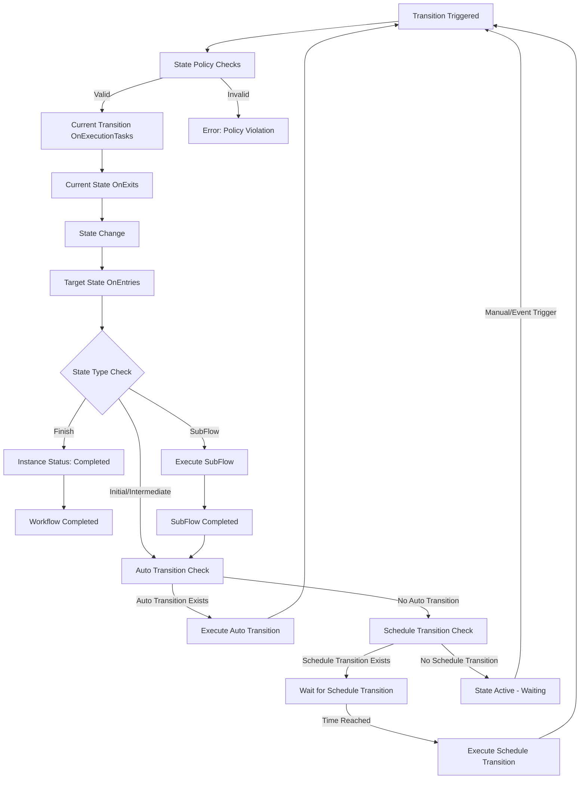

# Workflow

**Workflow**, vNext platformunda iş süreçlerini modelleyen ana **definable unit**'tir. JSON formatında tanımlanır ve `vnext-schema` üzerinden doğrulanır.

> **Schema:** [`vnext-schema/workflow-definition.schema.json`](https://github.com/burgan-tech/vnext-schema)

## Tanım JSON Örneği

> **Schema:** `workflow-definition.schema.json`

```json
{
  "key": "account-opening",
  "flow": "sys-flows",
  "flowVersion": "1.0.0",
  "domain": "banking",
  "version": "1.0.0",
  "tags": ["banking", "account", "onboarding"],
  "_comment": "Hesap açma iş akışı",
  "attributes": {
    "type": "F",
    "labels": [
      { "label": "Account Opening", "language": "en-US" },
      { "label": "Hesap Açma", "language": "tr-TR" }
    ],
    "schema": {
      "schema": {
        "key": "account-master-schema",
        "domain": "banking",
        "flow": "sys-schemas",
        "version": "1.0.0"
      }
    },
    "startTransition": {
      "key": "start",
      "target": "account-type-selection",
      "triggerType": 0,
      "versionStrategy": "Minor",
      "labels": [
        { "label": "Start", "language": "en-US" },
        { "label": "Başlat", "language": "tr-TR" }
      ],
      "schema": {
        "key": "start-schema",
        "domain": "banking",
        "flow": "sys-schemas",
        "version": "1.0.0"
      },
      "mapping": null
    },
    "states": [
      {
        "key": "account-type-selection",
        "stateType": 1,
        "versionStrategy": "Minor",
        "labels": [
          { "label": "Account Type Selection", "language": "en-US" },
          { "label": "Hesap Türü Seçimi", "language": "tr-TR" }
        ],
        "view": {
          "view": {
            "key": "account-type-selection-view",
            "domain": "banking",
            "flow": "sys-views",
            "version": "1.0.0"
          },
          "loadData": false
        },
        "transitions": [
          {
            "key": "select-demand-deposit",
            "target": "account-detail",
            "triggerType": 0,
            "versionStrategy": "Minor",
            "labels": [
              { "label": "Select Demand Deposit", "language": "en-US" },
              { "label": "Vadesiz Hesap Seç", "language": "tr-TR" }
            ],
            "schema": {
              "key": "demand-deposit-schema",
              "domain": "banking",
              "flow": "sys-schemas",
              "version": "1.0.0"
            },
            "mapping": {
              "location": "./src/SelectDemandDepositMapping.csx",
              "code": "<BASE64_ENCODED_CODE>"
            },
            "view": null,
            "rule": null,
            "timer": null
          }
        ]
      },
      {
        "key": "account-detail",
        "stateType": 2,
        "versionStrategy": "Minor",
        "labels": [
          { "label": "Account Detail", "language": "en-US" },
          { "label": "Hesap Detay", "language": "tr-TR" }
        ],
        "view": {
          "view": {
            "key": "account-detail-view",
            "domain": "banking",
            "flow": "sys-views",
            "version": "1.0.0"
          },
          "loadData": true,
          "extensions": ["extension-customer-detail"]
        },
        "transitions": [
          {
            "key": "complete-account",
            "target": "completed",
            "triggerType": 0,
            "versionStrategy": "Minor",
            "labels": [
              { "label": "Complete", "language": "en-US" },
              { "label": "Tamamla", "language": "tr-TR" }
            ],
            "onExecutionTasks": [
              {
                "order": 1,
                "task": {
                  "key": "create-account",
                  "domain": "banking",
                  "flow": "sys-tasks",
                  "version": "1.0.0"
                },
                "mapping": {
                  "location": "./src/CreateAccountMapping.csx",
                  "code": "<BASE64_ENCODED_CODE>"
                }
              }
            ],
            "mapping": null,
            "schema": null,
            "view": null,
            "rule": null,
            "timer": null
          }
        ]
      },
      {
        "key": "completed",
        "stateType": 3,
        "subType": 1,
        "versionStrategy": "None",
        "labels": [
          { "label": "Completed", "language": "en-US" },
          { "label": "Tamamlandı", "language": "tr-TR" }
        ]
      }
    ],
    "cancel": {
      "key": "cancel-account-opening",
      "target": "cancelled",
      "triggerType": 0,
      "versionStrategy": "None",
      "labels": [
        { "label": "Cancel", "language": "en-US" },
        { "label": "İptal", "language": "tr-TR" }
      ]
    },
    "timeout": {
      "key": "account-opening-timeout",
      "target": "timed-out",
      "versionStrategy": "None",
      "timer": {
        "reset": "None",
        "duration": "PT30M"
      }
    },
    "functions": [
      {
        "key": "function-get-customer-detail",
        "domain": "core",
        "flow": "sys-functions",
        "version": "1.0.0"
      }
    ],
    "extensions": [
      {
        "key": "extension-customer-detail",
        "domain": "core",
        "flow": "sys-extensions",
        "version": "1.0.0"
      }
    ],
    "queryRoles": [
      { "role": "account-officer", "grant": "allow" },
      { "role": "guest", "grant": "deny" }
    ]
  }
}
```

---

## Workflow Türleri

| Kod | Tür | Açıklama | Tipik Kullanım |
|---|---|---|---|
| **C** | Core | Platform çekirdek iş akışları | Sistem işlemleri, platform servisleri |
| **F** | Flow | Ana iş akışları | İşletme ana süreçleri, kullanıcı etkileşimi |
| **S** | SubFlow | Alt iş akışları | Tekrar kullanılabilir süreç parçaları |
| **P** | SubProcess | Alt süreçler | Paralel ve bağımsız işlemler (fire-and-forget) |

---

## Properties

### Top-Level Alanlar

| Alan | Tip | Zorunlu | Pattern / Kısıt | Açıklama |
|------|-----|---------|-----------------|----------|
| `$schema` | string | Hayır | — | JSON Schema referansı |
| `key` | string | **Evet** | `^[a-z0-9-]+$` | Workflow'un benzersiz tanımlayıcısı (domain içinde unique) |
| `flow` | string | **Evet** | `^[a-z0-9-]+$` | Kategorize amaçlı flow ismi |
| `flowVersion` | string | **Evet** | `^\d+\.\d+\.\d+(-[a-zA-Z]+\.\d+)?$` | Flow versiyonu (SemVer) |
| `domain` | string | **Evet** | `^[a-z0-9-]+$` | Workflow'un ait olduğu domain |
| `version` | string | **Evet** | `^\d+\.\d+\.\d+(-[a-zA-Z]+\.\d+)?$` | Workflow tanım versiyonu (SemVer) |
| `tags` | string[] | **Evet** | — | Etiketler — sorgu/filtre için |
| `_comment` | string | Hayır | — | Açıklama / yorum |
| `attributes` | object | **Evet** | — | Workflow'un asıl tanımı (aşağıda) |

### `attributes` Alanları

| Alan | Tip | Zorunlu | Açıklama |
|------|-----|---------|----------|
| `type` | string | **Evet** | Workflow türü: `C`, `F`, `S`, `P` (yukarıdaki tür tablosu) |
| `states` | array | **Evet** | State listesi. Tam olarak **bir** `Initial` state (`stateType: 1`) içermelidir |
| `startTransition` | object | **Evet** | Başlangıç transition tanımı (aşağıda) |
| `labels` | array | **Evet** | Çoklu dil etiketleri (`minItems: 1`). Her öğe: `label` + `language` |
| `schema` | object | Hayır | Master schema referansı. `schema.schema` ile `reference` objesi içerir |
| `timeout` | object \| null | Hayır | Workflow seviyesi timeout tanımı (aşağıda) |
| `functions` | array | Hayır | Workflow'da kullanılan function referansları |
| `features` | array | Hayır | Workflow'da kullanılan feature (extension) referansları |
| `extensions` | array | Hayır | Workflow'da kullanılan extension referansları |
| `sharedTransitions` | array | Hayır | Birden fazla state'den erişilebilen ortak transition'lar (aşağıda) |
| `errorBoundary` | object \| null | Hayır | Global hata yönetim tanımı (aşağıda) |
| `cancel` | object \| null | Hayır | Cancel transition tanımı. Yalnızca `triggerType: 0` (manual) |
| `exit` | object \| null | Hayır | Exit transition tanımı. Yalnızca `triggerType: 0` (manual) |
| `updateData` | object \| null | Hayır | Update data transition. `target` her zaman `$self` |
| `queryRoles` | array | Hayır | Root-level sorgu rolleri. DENY her zaman ALLOW'u geçersiz kılar |

---

## Reference Yapısı

Workflow tanımı içinde birçok yerde kullanılan genel referans objesidir. İki formdan biri kullanılır:

| Form | Zorunlu Alanlar | Açıklama |
|------|-----------------|----------|
| Explicit | `key`, `domain`, `flow`, `version` | Doğrudan bileşen referansı |
| Ref | `ref` | Dosya yolu ile bileşen referansı |

---

## State Yapısı

### State Alanları

| Alan | Tip | Zorunlu | Açıklama |
|------|-----|---------|----------|
| `key` | string | **Evet** | State benzersiz tanımlayıcısı (pattern: `^[a-z0-9-]+$`) |
| `stateType` | integer | **Evet** | State tipi — aşağıdaki enum tablosuna bakın |
| `subType` | integer | Hayır | State alt tipi — aşağıdaki enum tablosuna bakın. Varsayılan: `0` |
| `versionStrategy` | string | **Evet** | Versiyon stratejisi: `None`, `Patch`, `Minor`, `Major` |
| `labels` | array | **Evet** | Çoklu dil etiketleri (`minItems: 1`) |
| `view` | object \| null | Hayır | State view tanımı: `view` (reference), `loadData` (boolean), `extensions` (string[]) |
| `subFlow` | object \| null | Hayır | SubFlow state için alt akış tanımı: `type` (`S`/`P`), `process` (reference), `mapping` |
| `transitions` | array | Hayır | Bu state'den çıkan transition'lar. Wizard state (`stateType: 5`) için yalnızca **bir manuel transition** tanımlanabilir |
| `onEntries` | array | Hayır | State'e girildiğinde çalıştırılacak task'lar |
| `onExits` | array | Hayır | State'den çıkılırken çalıştırılacak task'lar |
| `errorBoundary` | object \| null | Hayır | State seviyesi hata yönetimi |
| `queryRoles` | array | Hayır | State seviyesi sorgu rolleri. Root `queryRoles`'u override eder |

### `stateType` Enum Değerleri

| Değer | Ad | Açıklama |
|-------|----|----------|
| `1` | **Initial** | Başlangıç state'i. Workflow'da tam olarak **bir tane** olmalıdır |
| `2` | **Intermediate** | Ara state |
| `3` | **Final** | Bitiş state'i |
| `4` | **SubFlow** | Alt akış çağıran state |
| `5` | **Wizard** | Wizard (sihirbaz) state. Yalnızca bir manuel transition'a sahip olabilir |

### Wizard State ve View Davranışı

Wizard state, kullanıcı girdisini transition tabanlı modellemek için kullanılan özel state tipidir. Bir Wizard state içinde yalnızca bir manuel transition tanımlanabilir; input, seçim ve onay gibi kullanıcı etkileşimleri state view içinde data alanı olarak değil, bu transition'ın view'ı üzerinden alınmalıdır.

State Function aktif state'in tipini Wizard olarak değerlendirdiğinde önce authorization/role evaluation sonrasında kullanılabilir transition listesini belirler. Kullanılabilir manuel transition varsa View Function, state view yerine bu transition'ın view'ını döndürür. Transition üzerinde view tanımlı değilse state'de tanımlı view fallback olarak kullanılır.

Loop oluşmaması için State Function yanıtındaki kullanılabilir transition listesinde ilgili transition'ın `hasView` bilgisi `false` döner. Bu sayede client, state aşamasında zaten gösterilen transition view için tekrar transition view kontrolü yapmaz.

Örneğin hesap açılışı akışında "hesap türü seçimi" state'inde kullanıcıdan vadeli/vadesiz seçimi alınacaksa bu seçim state view içinde veri alanı olarak modellenmemelidir. Seçim transition routing perspektifiyle tasarlanır; böylece her seçim ayrı transition görünürlüğü, loglama ve raporlama katkısı sağlar.

### `stateSubType` Enum Değerleri

| Değer | Ad | Açıklama |
|-------|----|----------|
| `0` | None | Belirli bir alt tip yok (varsayılan) |
| `1` | Success | Başarılı tamamlanma |
| `2` | Error | Hata durumu |
| `3` | Terminated | Manuel sonlandırılmış |
| `4` | Suspended | Geçici askıya alınmış |
| `5` | Busy | Meşgul |
| `6` | Human | İnsan müdahalesi gerektiren |

---

## State Yaşam Döngüsü

State machine aşağıdaki yaşam döngüsünü takip eder:



### Yaşam Döngüsü Adımları

1. **State Policy Kontrolleri**
   - State'de tanımlı transition'lar kontrol edilir
   - Client sadece manuel ve event transition'ları tetikleyebilir
   - Auto ve schedule transition'lar sadece sistem tarafından çalıştırılır

2. **Current Transition OnExecutionTasks**
   - Mevcut transition'ın OnExecutionTask'ları çalıştırılır

3. **Current State OnExits**
   - Mevcut state'in OnExit task'ları çalıştırılır

4. **State Değişimi**
   - Current Transition'ın target state'ine geçiş yapılır
   - State değişimi sadece transition'lar üzerinden gerçekleşir

5. **State OnEntries**
   - Yeni state'in OnEntry task'ları çalıştırılır

6. **State Tipi Kontrolü**
   - **Finish**: Instance durumu "Completed" olarak güncellenir
   - **SubFlow**: Sadece SubFlow çalıştırılır

7. **Auto Transition'lar**
   - Otomatik transition'lar çalıştırılır

8. **Schedule Transition'lar**
   - Zamanlanmış transition'lar çalıştırılır

---

## Transition Yapısı

### Transition Alanları

| Alan | Tip | Zorunlu | Açıklama |
|------|-----|---------|----------|
| `key` | string | **Evet** | Transition benzersiz tanımlayıcısı (pattern: `^[a-z0-9-]+$`) |
| `target` | string | **Evet** | Hedef state key'i. `$self` veya bir state key (pattern: `^(\$self\|[a-z0-9-]+)$`) |
| `from` | string | Hayır | Kaynak state key'i |
| `triggerType` | integer | **Evet** | Tetikleme tipi — aşağıdaki enum tablosuna bakın |
| `triggerKind` | integer | Hayır | Otomatik transition alt tipi. Varsayılan: `0` |
| `versionStrategy` | string | **Evet** | `None`, `Patch`, `Minor`, `Major` |
| `labels` | array | **Evet** | Çoklu dil etiketleri (`minItems: 1`) |
| `schema` | object \| null | Hayır | Transition schema referansı (request body validation) |
| `rule` | object \| null | **Koşullu** | Kural betiği. `triggerType: 1` (auto) ise **zorunlu** (triggerKind 10 hariç) |
| `timer` | object \| null | **Koşullu** | Timer betiği. `triggerType: 2` (scheduled) ise **zorunlu** |
| `view` | object \| null | Hayır | Transition view tanımı. Yalnızca `triggerType: 0` (manual) için geçerli |
| `onExecutionTasks` | array | Hayır | Transition sırasında çalıştırılacak task listesi |
| `mapping` | object \| null | Hayır | Transition input mapping betiği |
| `roles` | array | Hayır | Yetkilendirme rolleri. DENY her zaman ALLOW'u geçersiz kılar |
| `annotations` <sup>New</sup> | object \| null | Hayır | Client-side filtreleme ve UI bağlamı için key-value metadata. Platform annotations değerlerini yorumlamaz (passthrough). Çakışmaları önlemek için namespace'li key'ler kullanın (örn. `ui/visible-in`, `ui/priority`) |

### `triggerType` Enum Değerleri

| Değer | Ad | Açıklama | Zorunlu Alanlar |
|-------|----|----------|-----------------|
| `0` | **Manual** | Kullanıcı tarafından tetiklenir | — |
| `1` | **Automatic** | Otomatik tetiklenir | `rule` zorunlu (`triggerKind: 10` hariç) |
| `2` | **Scheduled** | Zamanlayıcı ile tetiklenir | `timer` zorunlu |
| `3` | **Event** | Olay ile tetiklenir | — |

### `triggerKind` Enum Değerleri

| Değer | Ad | Açıklama |
|-------|----|----------|
| `0` | Not applicable | Uygulanmaz (varsayılan) |
| `10` | Default auto | Varsayılan otomatik transition (rule opsiyonel) |

### `versionStrategy` Enum Değerleri

| Değer | Açıklama |
|-------|----------|
| `None` | Versiyon güncellemesi yok |
| `Patch` | Patch versiyon artırımı |
| `Minor` | Minor versiyon artırımı |
| `Major` | Major versiyon artırımı |

### Annotations

`annotations` alanı, platform tarafından yorumlanmayan serbest key-value metadata'dır. UI SDK'ları ve istemci uygulamaları transition'ları filtrelemek, gruplamak veya koşullu render etmek için kullanır. Çakışmaları önlemek için namespace'li key'ler kullanılması önerilir.

#### Tanımlı Key'ler

| Key | Tip | Açıklama |
|-----|-----|----------|
| `ui/visibility-channel` | string | Pipe (`\|`) ile ayrılmış kanal listesi. Yalnızca belirtilen kanallarda gösterilir |
| `ui/priority` | integer (string) | Sıralama önceliği. Düşük değer = yüksek öncelik |
| `ui/intent` | string | Görsel davranış ipucu |

#### `ui/visibility-channel` Değerleri

| Değer | Kanal |
|-------|-------|
| `IbWeb` | İnternet Bankacılığı |
| `backoffice` | Backoffice |
| `IbIvnApp` | Call Center |

#### `ui/intent` Değerleri

| Değer | Açıklama |
|-------|----------|
| `cancel` | İptal aksiyonu |
| `destructive` | Geri alınamaz / yıkıcı aksiyon |
| `close` | Ekran veya modal kapatma |
| `confirm` | Onay gerektiren aksiyon |

#### Örnek

```json
"annotations": {
  "ui/visibility-channel": "IbIvnApp|backoffice",
  "ui/priority": "1",
  "ui/intent": "cancel"
}
```

---

## StartTransition Yapısı

| Alan | Tip | Zorunlu | Açıklama |
|------|-----|---------|----------|
| `key` | string | **Evet** | Transition key'i |
| `target` | string | **Evet** | Hedef state (Initial state olmalı) |
| `triggerType` | integer | **Evet** | Sabit: `0` (yalnızca manual) |
| `versionStrategy` | string | **Evet** | `None`, `Patch`, `Minor`, `Major` |
| `labels` | array | **Evet** | Çoklu dil etiketleri |
| `schema` | object \| null | Hayır | Start request body validation schema'sı |
| `onExecutionTasks` | array | Hayır | Başlangıçta çalıştırılacak task'lar |
| `mapping` | object \| null | Hayır | Input mapping betiği |
| `roles` | array | Hayır | Yetkilendirme rolleri |
| `annotations` <sup>New</sup> | object \| null | Hayır | Client-side filtreleme ve UI bağlamı için key-value metadata (passthrough) |

---

## Özel Transition'lar

### Cancel Transition

| Alan | Tip | Zorunlu | Açıklama |
|------|-----|---------|----------|
| `key` | string | **Evet** | Cancel transition key'i |
| `target` | string | **Evet** | Hedef state (iptal state'i) |
| `triggerType` | integer | **Evet** | Sabit: `0` (yalnızca manual) |
| `versionStrategy` | string | **Evet** | Versiyon stratejisi |
| `labels` | array | **Evet** | Çoklu dil etiketleri |
| `availableIn` | string[] | Hayır | Cancel'ın geçerli olduğu state'ler |
| `view`, `schema`, `mapping`, `onExecutionTasks`, `roles` | — | Hayır | Standart transition alanları |
| `annotations` <sup>New</sup> | object \| null | Hayır | Client-side filtreleme ve UI bağlamı için key-value metadata (passthrough) |

Alt akışları varsa onlara da **cancel** bildirisi yayınlar. Alt akışlarda cancel tanımı **yoksa** bypass edilir.

### Exit Transition

Cancel ile aynı yapıda. **Client implementasyonlarında** ekran çıkışları veya ekrandan ayrılma durumlarında aktif instance'ları sonlandırır.

### Update Data Transition

Cancel ile aynı yapıda, tek fark: `target` her zaman `$self` olmalıdır. Alt akışlardan üst akış data'sını **ara bloklarda güncellemek** için kullanılır.

### Shared Transitions

Birden fazla state'den erişilebilen **ortak transition**'lardır. Standart transition alanlarına ek olarak:

| Alan | Tip | Zorunlu | Açıklama |
|------|-----|---------|----------|
| `availableIn` <sup>New</sup> | string[] | Hayır | Transition'ın geçerli olduğu state key'leri. Tanımlanmazsa **tüm state'lerden** erişilebilir |
| `annotations` <sup>New</sup> | object \| null | Hayır | Client-side filtreleme ve UI bağlamı için key-value metadata (passthrough) |

---

## Timeout Yapısı

| Alan | Tip | Zorunlu | Açıklama |
|------|-----|---------|----------|
| `key` | string | **Evet** | Timeout tanımlayıcısı |
| `target` | string | **Evet** | Timeout durumunda hedef state |
| `versionStrategy` | string | **Evet** | Versiyon stratejisi |
| `timer` | object | **Evet** | `reset` (string) + `duration` (ISO 8601, örn. `PT30M`) |
| `mapping` | object \| null | Hayır | Dinamik timeout hesaplama betiği. Başarısız olursa statik `timer.duration` kullanılır |

---

## Error Boundary Yapısı

Workflow (global), state ve task seviyesinde tanımlanabilir. Öncelik sırası: task > state > workflow.

### Error Boundary Alanları

| Alan | Tip | Açıklama |
|------|-----|----------|
| `onError` | array | Hata kuralları listesi. Priority sırasına göre (düşük değer = yüksek öncelik) değerlendirilir |
| `onTimeout` | object | Timeout hatası politikası |

### `onError` Kural Yapısı (errorHandlerRule)

| Alan | Tip | Zorunlu | Açıklama |
|------|-----|---------|----------|
| `action` | integer | **Evet** | Hata aksiyonu — aşağıdaki enum tablosuna bakın |
| `errorTypes` | string[] | Hayır | Eşlenecek exception tipleri. `*` veya boş = tümü |
| `errorCodes` | string[] | Hayır | Eşlenecek hata kodları (örn. `Task:400007`, `500`) |
| `transition` | string | **Koşullu** | Tetiklenecek transition key'i. `Rollback` ve `Notify` için **zorunlu**, `Abort` için **yasak** |
| `priority` | integer | Hayır | Kural önceliği (`minimum: 1`, varsayılan: `100`). Düşük değer = yüksek öncelik |
| `retryPolicy` | object | **Koşullu** | Retry konfigürasyonu. `action: 1` (Retry) ise **zorunlu** |
| `logOnly` | boolean | Hayır | `true` ise yalnızca log yazar, akışı etkilemez. Varsayılan: `false` |

### `errorAction` Enum Değerleri

| Değer | Ad | Açıklama | Kısıtlar |
|-------|----|----------|----------|
| `0` | **Abort** | İşlemi durdur | `transition` belirtilmemeli |
| `1` | **Retry** | Yeniden dene | `retryPolicy` zorunlu |
| `2` | **Rollback** | Telafi state'ine dön | `transition` zorunlu |
| `3` | **Ignore** | Hatayı yoksay, devam et | — |
| `4` | **Notify** | Bildirim gönder ve transition yap | `transition` zorunlu |
| `5` | **Log** | Yalnızca logla, akışı etkilemez | — |

### Retry Policy

| Alan | Tip | Zorunlu | Varsayılan | Açıklama |
|------|-----|---------|------------|----------|
| `maxRetries` | integer | Hayır | `3` | Maksimum yeniden deneme sayısı |
| `initialDelay` | string | **Evet** | — | İlk deneme öncesi bekleme süresi (ISO 8601, örn. `PT5S`) |
| `backoffType` | integer | Hayır | `1` | `0` = Fixed, `1` = Exponential |
| `backoffMultiplier` | number | Hayır | `2.0` | Exponential backoff çarpanı (`minimum: 1`) |
| `maxDelay` | string | Hayır | — | Denemeler arası maksimum bekleme süresi (ISO 8601) |
| `useJitter` | boolean | Hayır | `true` | Deneme gecikmesine rastgele jitter eklenip eklenmeyeceği |

---

## Diğer Yapılar

### MasterSchema

`attributes.schema` alanı, workflow'un **instance data** ana yapısını belirler. Gelişmiş filtreleme ve instance data'nın her değişim noktasında **tutarlılık kontrolü** sağlar. Bkz. [Schema component](/docs/components/schema).

### Functions ve Extensions

`attributes.functions` ve `attributes.extensions` alanları, workflow'a bağlı function ve extension **reference** listelerini içerir. Her öğe standart `reference` yapısındadır.

### Query Roles

`attributes.queryRoles` yetkilendirme mekanizmasıdır. Workflow ve instance içindeki state'leri **kimlerin sorgulayabileceği** bilgisini tutar. State seviyesinde `queryRoles` tanımlıysa root seviyeyi override eder.

| Alan | Tip | Zorunlu | Açıklama |
|------|-----|---------|----------|
| `role` | string | **Evet** | Rol adı |
| `grant` | string | **Evet** | `allow` veya `deny`. DENY her zaman ALLOW'u geçersiz kılar |

## İlgili

- [Mappings](/docs/components/mappings) — mapping türleri ve örnekler
- [Schema](/docs/components/schema) — schema tanımları
- [ITransitionMapping](/docs/components/interfaces#itransitionmapping) — transition mapping interface
- [Schema component](/docs/components/schema) — master schema
- [Tasks](/docs/components/tasks/) — task türleri
- Schema kaynağı: [vnext-schema (GitHub)](https://github.com/burgan-tech/vnext-schema)
