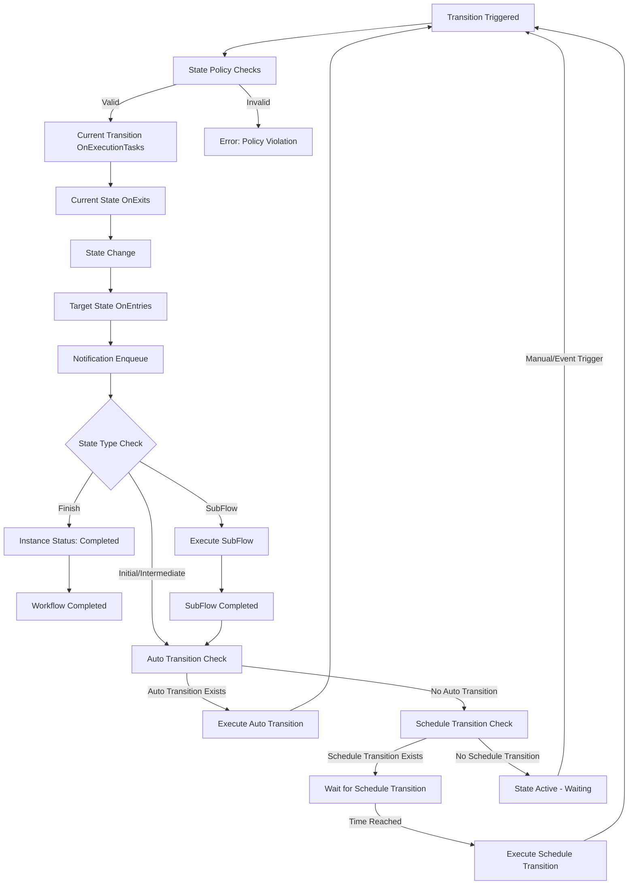

# Workflow

**Workflow**, vNext platformunda iş süreçlerini modelleyen ana **definable unit**'tir. JSON formatında tanımlanır ve `vnext-schema` üzerinden doğrulanır.

> **Schema:** [`vnext-schema/workflow-definition.schema.json`](https://github.com/burgan-tech/vnext-schema)

## Tanım JSON Örneği

> **Schema:** `workflow-definition.schema.json`

```json
{
  "key": "account-opening",
  "flow": "sys-flows",
  "flowVersion": "1.0.0",
  "domain": "banking",
  "version": "1.0.0",
  "tags": ["banking", "account", "account-opening"],
  "_comment": "Hesap açma iş akışı",
  "attributes": {
    "type": "F",
    "labels": [
      { "label": "Account Opening", "language": "en-US" },
      { "label": "Hesap Açma", "language": "tr-TR" }
    ],
    "schema": {
        "key": "account-master-schema",
        "domain": "banking",
        "flow": "sys-schemas",
        "version": "1.0.0"
    },
    "startTransition": {
      "key": "start",
      "target": "account-type-selection",
      "triggerType": 0,
      "versionStrategy": "Minor",
      "labels": [
        { "label": "Start", "language": "en-US" },
        { "label": "Başlat", "language": "tr-TR" }
      ],
      "schema": {
        "key": "start-schema",
        "domain": "banking",
        "flow": "sys-schemas",
        "version": "1.0.0"
      },
      "mapping": null
    },
    "states": [
      {
        "key": "account-type-selection",
        "stateType": 1,
        "versionStrategy": "Minor",
        "labels": [
          { "label": "Account Type Selection", "language": "en-US" },
          { "label": "Hesap Türü Seçimi", "language": "tr-TR" }
        ],
        "view": {
          "view": {
            "key": "account-type-selection-view",
            "domain": "banking",
            "flow": "sys-views",
            "version": "1.0.0"
          },
          "loadData": false
        },
        "transitions": [
          {
            "key": "select-demand-deposit",
            "target": "account-detail",
            "triggerType": 0,
            "versionStrategy": "Minor",
            "labels": [
              { "label": "Select Demand Deposit", "language": "en-US" },
              { "label": "Vadesiz Hesap Seç", "language": "tr-TR" }
            ],
            "schema": {
              "key": "demand-deposit-schema",
              "domain": "banking",
              "flow": "sys-schemas",
              "version": "1.0.0"
            },
            "mapping": {
              "location": "./src/SelectDemandDepositMapping.csx",
              "code": "<BASE64_ENCODED_CODE>"
            },
            "view": null,
            "rule": null,
            "timer": null
          }
        ]
      },
      {
        "key": "account-detail",
        "stateType": 2,
        "versionStrategy": "Minor",
        "labels": [
          { "label": "Account Detail", "language": "en-US" },
          { "label": "Hesap Detay", "language": "tr-TR" }
        ],
        "view": {
          "view": {
            "key": "account-detail-view",
            "domain": "banking",
            "flow": "sys-views",
            "version": "1.0.0"
          },
          "loadData": true,
          "extensions": ["extension-customer-detail"]
        },
        "transitions": [
          {
            "key": "complete-account",
            "target": "completed",
            "triggerType": 0,
            "versionStrategy": "Minor",
            "labels": [
              { "label": "Complete", "language": "en-US" },
              { "label": "Tamamla", "language": "tr-TR" }
            ],
            "onExecutionTasks": [
              {
                "order": 1,
                "task": {
                  "key": "create-account",
                  "domain": "banking",
                  "flow": "sys-tasks",
                  "version": "1.0.0"
                },
                "mapping": {
                  "location": "./src/CreateAccountMapping.csx",
                  "code": "<BASE64_ENCODED_CODE>"
                }
              }
            ],
            "mapping": null,
            "schema": null,
            "view": null,
            "rule": null,
            "timer": null
          }
        ]
      },
      {
        "key": "completed",
        "stateType": 3,
        "subType": 1,
        "versionStrategy": "None",
        "labels": [
          { "label": "Completed", "language": "en-US" },
          { "label": "Tamamlandı", "language": "tr-TR" }
        ]
      }
    ],
    "cancel": {
      "key": "cancel-account-opening",
      "target": "cancelled",
      "triggerType": 0,
      "versionStrategy": "None",
      "labels": [
        { "label": "Cancel", "language": "en-US" },
        { "label": "İptal", "language": "tr-TR" }
      ]
    },
    "timeout": {
      "key": "account-opening-timeout",
      "target": "timed-out",
      "versionStrategy": "None",
      "timer": {
        "reset": "None",
        "duration": "PT30M"
      }
    },
    "functions": [
      {
        "key": "function-get-customer-detail",
        "domain": "core",
        "flow": "sys-functions",
        "version": "1.0.0"
      }
    ],
    "extensions": [
      {
        "key": "extension-customer-detail",
        "domain": "core",
        "flow": "sys-extensions",
        "version": "1.0.0"
      }
    ],
    "queryRoles": [
      { "role": "account-officer", "grant": "allow" },
      { "role": "guest", "grant": "deny" }
    ]
  }
}
```

---

## Workflow Türleri

| Kod | Tür | Açıklama | Tipik Kullanım |
|---|---|---|---|
| **C** | Core | Platform çekirdek iş akışları | Sistem işlemleri, platform servisleri |
| **F** | Flow | Ana iş akışları | İşletme ana süreçleri, kullanıcı etkileşimi |
| **S** | SubFlow | Alt iş akışları | Tekrar kullanılabilir süreç parçaları |
| **P** | SubProcess | Alt süreçler | Paralel ve bağımsız işlemler (fire-and-forget) |

---

## Properties

### Top-Level Alanlar

| Alan | Tip | Zorunlu | Pattern / Kısıt | Açıklama |
|------|-----|---------|-----------------|----------|
| `$schema` | string | Hayır | — | JSON Schema referansı |
| `key` | string | **Evet** | `^[a-z0-9-]+$` | Workflow'un benzersiz tanımlayıcısı (domain içinde unique) |
| `flow` | string | **Evet** | `^[a-z0-9-]+$` | Kategorize amaçlı flow ismi |
| `flowVersion` | string | **Evet** | `^\d+\.\d+\.\d+(-[a-zA-Z]+\.\d+)?$` | Flow versiyonu (SemVer) |
| `domain` | string | **Evet** | `^[a-z0-9-]+$` | Workflow'un ait olduğu domain |
| `version` | string | **Evet** | `^\d+\.\d+\.\d+(-[a-zA-Z]+\.\d+)?$` | Workflow tanım versiyonu (SemVer) |
| `tags` | string[] | **Evet** | — | Etiketler — sorgu/filtre için |
| `_comment` | string | Hayır | — | Açıklama / yorum |
| `attributes` | object | **Evet** | — | Workflow'un asıl tanımı (aşağıda) |

### `attributes` Alanları

| Alan | Tip | Zorunlu | Açıklama |
|------|-----|---------|----------|
| `type` | string | **Evet** | Workflow türü: `C`, `F`, `S`, `P` (yukarıdaki tür tablosu) |
| `executionType` | string | Hayır | Flow'un varsayılan çalıştırma modu (v0.0.99): `S` (sync) veya `A` (async). Kendi `executionType`'ını tanımlamayan transition'lara uygulanır — bkz. [Çalıştırma Modu (`executionType`)](#çalıştırma-modu-executiontype) |
| `scripts` <sup>New</sup> | object | Hayır | Flow seviyesi helper ve izinli assembly tanımı (aşağıda) |
| `states` | array | **Evet** | State listesi. **En fazla bir** `Initial` state (`stateType: 1`) içerebilir (v0.0.99 öncesinde tam olarak bir tane zorunluydu). Hiç Initial yoksa instance runtime'ın örtük `$start` state'inde doğar — bkz. [Initial state olmadan başlangıç (`$start`)](#initial-state-olmadan-başlangıç-start) |
| `startTransition` | object | **Evet** | Başlangıç transition tanımı (aşağıda) |
| `labels` | array | **Evet** | Çoklu dil etiketleri (`minItems: 1`). Her öğe: `label` + `language` |
| `schema` | object | Hayır | Master schema referansı. `schema` ile `reference` objesi içerir |
| `timeout` | object \| null | Hayır | Workflow seviyesi timeout tanımı (aşağıda) |
| `functions` | array | Hayır | Workflow'da kullanılan function referansları |
| `features` | array | Hayır | Workflow'da kullanılan feature (extension) referansları |
| `extensions` | array | Hayır | Workflow'da kullanılan extension referansları |
| `sharedTransitions` | array | Hayır | Birden fazla state'den erişilebilen ortak transition'lar (aşağıda) |
| `errorBoundary` | object \| null | Hayır | Global hata yönetim tanımı (aşağıda) |
| `cancel` | object \| null | Hayır | Cancel transition tanımı. Yalnızca `triggerType: 0` (manual) |
| `exit` | object \| null | Hayır | Exit transition tanımı. Yalnızca `triggerType: 0` (manual) |
| `updateData` | object \| null | Hayır | Update data transition. `target` her zaman `$self` |
| `queryRoles` | array | Hayır | Root-level sorgu rolleri. DENY her zaman ALLOW'u geçersiz kılar. v0.0.99'dan itibaren `allOf` / `anyOf` kombinatörleri de kullanılabilir — bkz. [Query Roles](#query-roles) |
| `output` <sup>New</sup> | object \| null | Hayır | Sync yanıt için opsiyonel output mapping (`scriptCode`, `IOutputHandler`). Ayrıntı: [Output Mapping](#output-mapping) |
| `event` <sup>New</sup> | object \| null | Hayır | Workflow seviyesi event tanımı. Tanımlıysa harici bir event bu workflow'un **yeni bir instance'ını başlatabilir** (`action=start`). Transition seviyesi event'ten bağımsızdır. Ayrıntı: [Event Transition](#event-transition) |
| `config` <sup>New</sup> | object \| null | Hayır | Flow seviyesi yapılandırma. Şu an built-in function cache ayarını (`functionCache`) içerir. `null` ise host varsayılanları geçerlidir. Ayrıntı: [Config (Built-in Function Cache)](#config-built-in-function-cache) |

---

## Reference Yapısı

Workflow tanımı içinde birçok yerde kullanılan genel referans objesidir. İki formdan biri kullanılır:

| Form | Zorunlu Alanlar | Açıklama |
|------|-----------------|----------|
| Explicit | `key`, `domain`, `flow`, `version` | Doğrudan bileşen referansı |
| Ref | `ref` | Dosya yolu ile bileşen referansı |

---

## State Yapısı

### State Alanları

| Alan | Tip | Zorunlu | Açıklama |
|------|-----|---------|----------|
| `key` | string | **Evet** | State benzersiz tanımlayıcısı (pattern: `^[a-z0-9-]+$`) |
| `stateType` | integer | **Evet** | State tipi — aşağıdaki enum tablosuna bakın |
| `subType` | integer | Hayır | State alt tipi — aşağıdaki [`subType` enum tablosuna](#subtype-enum-değerleri) bakın. Varsayılan: `0` |
| `versionStrategy` | string | **Evet** | Versiyon stratejisi: `None`, `Patch`, `Minor`, `Major` |
| `labels` | array | **Evet** | Çoklu dil etiketleri (`minItems: 1`) |
| `view` | object \| null | Hayır | State view tanımı: `view` (reference), `loadData` (boolean), `extensions` (string[]) |
| `subFlow` | object \| null | Hayır | SubFlow state için alt akış tanımı: `type` (yalnızca `S`), `process` (reference), `mapping`, `overrides` — bkz. [SubFlow State](#subflow-state) |
| `transitions` | array | Hayır | Bu state'den çıkan transition'lar. Wizard state (`stateType: 5`) için yalnızca **bir manuel transition** tanımlanabilir |
| `onEntries` | array | Hayır | State'e girildiğinde çalıştırılacak task'lar |
| `onExits` | array | Hayır | State'den çıkılırken çalıştırılacak task'lar |
| `errorBoundary` | object \| null | Hayır | State seviyesi hata yönetimi |
| `queryRoles` | array | Hayır | State seviyesi sorgu rolleri. Root `queryRoles`'u override eder. Instance bu state'teyken okuma izni bu tanımla belirlenir; <sup>New</sup> v0.0.95 itibarıyla karar gateway'in çağırdığı `authorize?queryRoles=true` ile verilir, read fonksiyonları in-process `403` üretmez (bkz. [Query Roles](#query-roles)) |
| `alias` | array | Hayır | State için rol bazlı alternatif çoklu-dil etiketleri. Tanımlıysa State Function `state` değerini role göre maskeler |
| `notifications` | array | Hayır | State'e bağlı bildirim tanımları. Transition pipeline tamamlandıktan sonra enqueue edilir ve durable çalışır — bkz. [State Notifications](#state-notifications) |
| `interaction` | object \| null | Hayır | State etkileşim yapılandırması (ör. `longPoll`). Long-poll'un ne zaman sonlandırılacağını deklaratif tanımlar — bkz. [State Interaction (Long Poll)](#state-interaction-long-poll) |

### `stateType` Enum Değerleri

| Değer | Ad | Açıklama |
|-------|----|----------|
| `1` | **Initial** | Başlangıç state'i. Workflow'da **en fazla bir tane** olabilir (v0.0.99'dan itibaren opsiyonel). Tanımlanmazsa instance örtük `$start` state'inde doğar — bkz. [Initial state olmadan başlangıç](#initial-state-olmadan-başlangıç-start) |
| `2` | **Intermediate** | Ara state |
| `3` | **Final** | Bitiş state'i |
| `4` | **SubFlow** | Alt akış çağıran state |
| `5` | **Wizard** | Wizard (sihirbaz) state. Yalnızca bir manuel transition'a sahip olabilir |

### Wizard State ve View Davranışı

Wizard state, kullanıcı girdisini transition tabanlı modellemek için kullanılan özel state tipidir. Bir Wizard state içinde yalnızca bir manuel transition tanımlanabilir; input, seçim ve onay gibi kullanıcı etkileşimleri state view içinde data alanı olarak değil, bu transition'ın view'ı üzerinden alınmalıdır.

State Function aktif state'in tipini Wizard olarak değerlendirdiğinde önce authorization/role evaluation sonrasında kullanılabilir transition listesini belirler. Kullanılabilir manuel transition varsa View Function, state view yerine bu transition'ın view'ını döndürür. Transition üzerinde view tanımlı değilse state'de tanımlı view fallback olarak kullanılır.

Örneğin hesap açılışı akışında "hesap türü seçimi" state'inde kullanıcıdan vadeli/vadesiz seçimi alınacaksa bu seçim state view içinde veri alanı olarak modellenmemelidir. Seçim transition routing perspektifiyle tasarlanır; böylece her seçim ayrı transition görünürlüğü, loglama ve raporlama katkısı sağlar. State view varsa, summary veya wizard'a devam edeceği ekran olarak kullanılmalıdır.

### `subType` Enum Değerleri

State'in `subType` alanı, şemadaki `stateSubType` tanımını kullanır:

| Değer | Ad | Açıklama |
|-------|----|----------|
| `0` | None | Belirli bir alt tip yok (varsayılan) |
| `1` | Success | Başarılı tamamlanma |
| `2` | Error | Hata durumu |
| `3` | Terminated | Manuel sonlandırılmış |
| `4` | Suspended | Geçici askıya alınmış |
| `5` | Busy | Meşgul |
| `6` | Human | İnsan müdahalesi gerektiren |
| `7` | Cancelled | İptal edilmiş |
| `8` | Timeout | Zaman aşımına uğramış |

State Function yanıtında bu değer v0.0.99'dan itibaren üst seviye `stateSubType` alanında camelCase string olarak döner (`none`, `success`, `error`, `terminated`, `suspended`, `busy`, `human`, `cancelled`, `timeout`).

### SubFlow State

`stateType: 4` bir state, `subFlow` bloğuyla başka bir workflow'u **child instance** olarak başlatır ve child bir terminal state'e ulaşana kadar parent bu state'te bekler (parent instance bu sırada `Busy`'dir; client `metadata.effectiveStatus` / State Function `status` ile child'ın gerçek durumunu görür).

| Alan | Tip | Zorunlu | Açıklama |
|------|-----|---------|----------|
| `type` | string | **Evet** | Yalnızca `"S"` (SubFlow). <sup>New</sup> v0.0.95 state seviyesinde `"P"` (SubProcess) **publish'te reddedilir** (400) — fire-and-forget alt süreç için [SubProcess task](/docs/components/tasks/) kullanın |
| `process` | object | **Evet** | Child workflow referansı (`key`, `domain`, `flow`, `version`) |
| `mapping` | object \| null | Hayır | Child'ın start payload'ını üreten mapping betiği. Child'a iletilecek çağıran header'ları (ör. rol) da burada üretilir |
| `overrides` | object \| null | Hayır | Child'ı parent bağlamına göre ayarlayan override'lar: `timeout`, `transitions.<t>.roles`, `states.<s>.queryRoles`, `states.<s>.interaction.longPoll.{fallbackTimeoutSeconds, roles}` <sup>New</sup> v0.0.95, `states.<s>.views.<viewKey>` / `transitions.<t>.views.<viewKey>` <sup>New</sup> v0.0.95. Tam referans: [SubFlow Overrides](../how-to/subflow-overrides) |

- **Başarısız subflow start'ı** <sup>New</sup> v0.0.95: child başlatılamazsa parent artık `Busy`'de asılı kalmaz; parent **fault** eder ve bir incident açılır, `retry` subflow start'ını yeniden dener — bkz. [Instance Incidents](/docs/concepts/incidents).
- Override'lar child'a start anında damgalanır (start-time snapshot); zaten çalışan child'lar başladıkları override'larla devam eder. Kapsam **tek hop**tur: P → C → G zincirinde P'nin override'ları yalnızca C'nin state'lerine uygulanır.
- Eski `overrides.views` / `viewOverrides` **deprecated**'dır; scoped view override'larıyla aynı `subFlow` içinde karıştırmak doğrulama hatasıdır.

### State Alias (Rol Tabanlı State Maskeleme)

`alias`, bir state'in dış dünyaya nasıl görüneceğini **role göre** maskelemek için kullanılır. Bir süreç client tarafında başlayıp backoffice'te devam ederken, arka planda Fraud, Limit, KPS gibi kontrol state'leri çalışır. Client durumu [State Function](/docs/components/functions/custom#state-function) ile sorduğunda normalde ham `state.key` döner — bu da iç süreç adımlarının client'a sızmasına ve bir güvenlik açığına yol açar.

`alias` ile aynı state'e rol bazlı alternatif çoklu-dil etiketleri tanımlanabilir: client `"Değerlendirme Aşamasında"` gibi maskelenmiş bir değer görürken, backoffice aktörleri kendi rollerine uygun alias'ı (örn. `"Operasyon İncelemesinde"`) görür.

`alias` bir dizidir; her öğe aşağıdaki alanlara sahiptir:

| Alan | Tip | Zorunlu | Açıklama |
|------|-----|---------|----------|
| `name` | string | **Evet** | Alias adı. İstek diline uygun bir `label` bulunamazsa fallback olarak döner |
| `roles` | array | **Evet** | Bu alias'ın geçerli olduğu roller (`minItems: 1`) |
| `labels` | array | **Evet** | Alias'ın çoklu-dil etiketleri (`minItems: 1`) |

**`roles` alanları:**

| Alan | Tip | Zorunlu | Açıklama |
|------|-----|---------|----------|
| `role` | string | **Evet** | Rol adı |
| `grant` | string | **Evet** | `allow` veya `deny`. DENY her zaman ALLOW'u geçersiz kılar |

**`labels` alanları:**

| Alan | Tip | Zorunlu | Açıklama |
|------|-----|---------|----------|
| `label` | string | **Evet** | Etiket metni |
| `language` | string | **Evet** | Dil kodu (pattern: `^[a-z]{2}(-[A-Z]{2})?$`, örn. `tr`, `en`, `tr-TR`) |

**Örnek:**

```json
{
  "alias": [
    {
      "name": "Değerlendirme Aşamasında",
      "roles": [
        { "role": "backoffice.operator", "grant": "allow" }
      ],
      "labels": [
        { "label": "Operasyon İncelemesinde", "language": "tr" },
        { "label": "Under Operational Review", "language": "en" }
      ]
    }
  ]
}
```

**Çözümleme Davranışı:**

State Function `state` değerini döndürürken aşağıdaki sırayı izler:

1. State'te `alias` tanımı **yoksa** → `state.key` döner (mevcut davranış).
2. `alias` tanımı **varsa** → istek yapan aktörün rolleri her alias'ın `roles` listesine göre değerlendirilir (DENY her zaman ALLOW'u geçersiz kılar).
3. Eşleşen bir alias bulunursa → istek diline (Accept-Language) uygun `label` döner; o dilde label yoksa `alias.name` döner.
4. Hiçbir alias rolü eşleşmezse → `state.key` fallback olarak döner.

### State Notifications

State'e girildikten sonra, transition pipeline'ı tamamlandığında platform bildirim taleplerini **enqueue** eder ve **durable** olarak çalıştırır. Bu yapı Notification Task'tan bağımsızdır; task pipeline'ına bağlı kalmadan state geçişini takip eden bildirimleri kapsam dışında tutar.

Dapr Binding yapılandırması [Notification Task](./tasks/notification) ile aynı convention'ı izler (`vnext-notification-state`).

#### `stateNotification` Alanları

| Alan | Tip | Zorunlu | Açıklama |
|------|-----|---------|----------|
| `type` | integer | **Evet** | Bildirim tipi. Şu an yalnızca `0` (State) desteklenir |
| `mapping` | scriptCode | **Evet** | `IStateNotificationMapping` implementasyonu. Bildirim içeriğini ve hedef metadata'yı şekillendirir |
| `rule` | scriptCode \| null | Hayır | Koşul scripti. Tanımsız veya `null` ise bildirim her durumda çalışır |

**Örnek:**

```json
{
  "key": "waiting-approval",
  "stateType": 2,
  "notifications": [
    {
      "type": 0,
      "mapping": { "type": "L", "code": "<base64-encoded-script>", "encoding": "B64" },
      "rule": { "type": "L", "code": "<base64-encoded-condition>", "encoding": "B64" }
    }
  ]
}
```

:::tip
`rule` alanı yalnızca belirli koşullarda (örn. yalnızca belirli bir transition üzerinden gelindiğinde) bildirim göndermek için kullanılır. `rule` yoksa her state girişinde bildirim enqueue edilir.
:::

> İlgili: [IStateNotificationMapping](/docs/components/interfaces#istatenotificationmapping) · [Notification Task](./tasks/notification)

---

### State Interaction (Long Poll)

State Function, client tarafında **long-polling** ile süreç durumunu döner. `interaction.longPoll` ile bu açık tutulan isteğin **ne zaman sonlandırılacağı** state tanımında **deklaratif** olarak belirtilir. Runtime, isteği bir transition gerçekleşene veya fallback timeout dolana kadar açık tutar. Böylece bir süreç tasarımında farklı client'lar süreci kendi **durak noktaları** ile belirleyebilir.

:::tip Uçtan uca örnek
Onay adımı + "Bekleyen Onaylarım" senaryosunda `terminate: false` / `terminate: true` + `rule` kullanımının tamamı için bkz. [Human Task ve "Bekleyen Onaylarım"](/docs/how-to/human-task-approval).
:::

`interaction` opsiyoneldir ve şimdilik tek bir alt blok taşır: `longPoll`.

| Alan | Tip | Zorunlu | Açıklama |
|------|-----|---------|----------|
| `terminate` | boolean | **Evet** | `true`: state'e girişte pipeline **duraklatılır** ve client'a "long-poll'u sonlandır" sinyali verilir; `false`: pipeline duraklamaz, instance bu state'teyken `interaction` bloğu (ack'siz) yayınlanır ve client long-poll penceresini `fallbackTimeoutSeconds`'a göre ayarlar — bkz. [`terminate` semantiği](#terminate-semantiği) |
| `fallbackTimeoutSeconds` | integer | Hayır | İstek fallback'e düşmeden önce açık tutulacağı maksimum saniye (`minimum: 1`, varsayılan `60`). `terminate: true`'da client `ack` gönderemezse bu süre sonunda platform pipeline'ı otomatik devam ettirir; `terminate: false`'ta client'ın varsayılan long-poll penceresinin yerini alır |
| `roles` | array | **Koşullu** | Long-poll etkileşimini kullanabilecek roller. DENY her zaman ALLOW'u geçersiz kılar; v0.0.99'dan itibaren `allOf` / `anyOf` kombinatörleri de kullanılabilir. `roles` ve `rule`'dan **tam olarak biri** tanımlanabilir; ikisi de yoksa herkes izinlidir |
| `rule` <sup>New</sup> v0.0.94 | object | **Koşullu** | `roles` yerine **koşul betiği** ile yetkilendirme — view ve notification kurallarıyla aynı [IConditionMapping](/docs/components/interfaces#iconditionmapping) sözleşmesi. `roles` ile birlikte tanımlanamaz (publish'te reddedilir). Betik `false` dönerse, hata fırlatırsa veya derlenemezse **fail-closed** çalışır: state sinyali yayınlanmaz ve ack `403` alır |

**Örnek:**

```json
{
  "key": "waiting-approval",
  "stateType": 2,
  "interaction": {
    "longPoll": {
      "terminate": true,
      "fallbackTimeoutSeconds": 30,
      "roles": [
        { "role": "client.app", "grant": "allow" }
      ]
    }
  }
}
```

**`rule` ile örnek** <sup>New</sup> v0.0.94 — yalnızca `x-channel: mobile` header'ı taşıyan çağıranlar etkileşimi kullanabilir:

```json
{
  "key": "waiting-otp",
  "stateType": 2,
  "interaction": {
    "longPoll": {
      "terminate": true,
      "rule": { "location": "./src/InteractionGate.csx", "code": "<base64>" }
    }
  }
}
```

```csharp
public class InteractionGate : IConditionMapping
{
    public Task<bool> Handler(ScriptContext context)
    {
        try
        {
            if (context.Headers == null) return Task.FromResult(false);
            string channel = (string)context.Headers["x-channel"];
            return Task.FromResult(channel == "mobile");
        }
        catch (Exception) { return Task.FromResult(false); }
    }
}
```

`rule` betiğinin bağlamı workflow, instance, istek header'ları ve query parametrelerini taşır; instance verisine `context.Instance.Data` ile erişilir. **`context.Body` doldurulmaz** — bir view kuralını buraya taşırken `context.Body.*` okumalarını `context.Instance.Data.*` ile değiştirin, aksi halde betik fırlatır ve (fail-closed) reddeder. Rule-gated bir state gövdesi paylaşımlı body cache'e **yazılmaz**; ack endpoint'i kuralı her istekte taze değerlendirir.

#### `terminate` semantiği

| `terminate` | Pipeline | Instance durumu | State yanıtı |
|---|---|---|---|
| `true` | State'e giriş sonrası **OnEntry tamamlanınca duraklar** (pipeline adımı order 75): ack token'ı armlanır, `fallbackTimeoutSeconds` için tek seferlik fallback job'ı kurulur, epilog (schedule/auto/finish) çalışmaz | Ack veya fallback gelene kadar **Busy** kalır (SubFlow duraklamasıyla aynı dinlenme şekli) | `interaction` bloğu `terminateLongPoll: true` + `ack.href` ile döner |
| `false` | **Duraklamaz** — pipeline normal akar, ack token'ı armlanmaz, fallback job'ı kurulmaz; sunucu tarafında hiçbir şey armlanmaz | Değişmez | v0.0.98'den itibaren instance bu state'teyken `interaction` bloğu `terminateLongPoll: false` + `fallbackTimeoutSeconds` ile **her zaman** yayınlanır; `ack` yoktur (aşağıya bakın) |

Ack (veya fallback) geldiğinde pipeline kaldığı yerden devam eder: token temizlenir, Busy çözülür ve epilog (Schedule → Auto → Finish → Finalize) çalışır. Ack ve fallback aynı anda gelirse `:lpack` kilidi ikisini serileştirir; token zaten temizlenmişse ikinci istek güvenli no-op'tur. Error-boundary ve auto-chain profillerinde bu adım **hiç çalışmaz** — bu transition'lar asla duraklamaz.

#### State Yanıtındaki `interaction` Objesi

State Function yanıtındaki `interaction` objesinin ne zaman döndüğü `terminate` değerine bağlıdır:

- **`terminate: true`** — v0.0.95'ten beri blok **yalnızca instance gerçekten ack beklerken** (`IsAwaitingLongPollAck`) döner: state'e girilip pipeline duraklamışsa ve ack/fallback henüz gelmemişse. Blok `ack.href` taşır. (Önceki davranış bloğu tanımdan türetiyor ve client'ı bekleyen bir şey olmadığı hâlde her poll'da ack göndermeye yönlendiriyordu; `ResponseShapeVersion` aynı değişiklikte yükseltildi ve tüm state ETag'leri bir kez geçersiz kılındı.)
- **`terminate: false`** — v0.0.98'den itibaren blok, instance tanımı yapan state'te olduğu **her an** ve çağıran etkileşim gate'ini geçtiğinde (`rule`, yoksa `roles`, yoksa izin) döner. **`ack` yoktur**; sunucu tarafında hiçbir şey armlanmaz. v0.0.95–v0.0.97 arasında bu blok hatalı olarak bastırılıyordu; v0.0.98 bunu düzeltti (`ResponseShapeVersion` v12 → v13).

```json
"interaction": {
  "terminateLongPoll": true,
  "fallbackTimeoutSeconds": 60,
  "ack": { "href": "/api/v1/core/workflows/account-opening/instances/{id}/longpoll/ack" }
}
```

```json
"interaction": {
  "terminateLongPoll": false,
  "fallbackTimeoutSeconds": 120
}
```

| Alan | Açıklama |
|------|----------|
| `terminateLongPoll` | State'in `interaction.longPoll.terminate` değerini yansıtır (her zaman döner) |
| `fallbackTimeoutSeconds` | Etkin pencere (her zaman döner; state'in kendi değeri ya da parent subflow override'ı, varsayılan `60`) |
| `ack` | Acknowledge endpoint href'i (`{ "href": "…" }` şekli). **Yalnızca** `terminateLongPoll: true` iken |

Blok yalnızca etkileşimin yetkilendirme kolunu (`roles` ya da `rule`) geçen çağıranlara yayınlanır. Aktif bir subflow'daki state için blok parent'a **yukarı taşınır** ve `ack.href` poll edilen (en üst) instance'ın endpoint'ine yeniden yazılır — client her zaman en üst instance'ın ack'ini çağırır.

Client davranışı:

- **`terminateLongPoll: true`** → client aktif long-poll isteğini sonlandırır, girilen state'in ekranını render eder ve `ack` ile platformu bilgilendirir. Süre içinde ack gelmezse zamanlanmış fallback pipeline'ı otomatik devam ettirir.
- **`terminateLongPoll: false`** → ack gönderilmez; client `fallbackTimeoutSeconds` değerini kendi varsayılan long-poll penceresinin yerine kullanır (varsayılan 60 sn; state `120` tanımlıysa client 120 sn poll eder).
- **`interaction` bloğu yok** → state long-poll tanımlamıyor veya çağıran gate'i geçemiyor (`terminate: true`'da ayrıca bekleyen bir ack yok); client normal long-poll döngüsüne devam eder.

#### Long Poll Acknowledge

Client, açık tuttuğu long-poll isteğini tamamladığında **acknowledge** endpoint'ini çağırarak platformu bilgilendirir:

```
POST /api/v1/{domain}/workflows/{workflow}/instances/{instance}/longpoll/ack
```

Client hata alır veya talep gönderemezse `fallbackTimeoutSeconds` süresi dolduğunda platform pipeline'ı otomatik olarak devam ettirir. Bu sayede client çökmesi veya ağ hatası durumunda long-poll askıda kalmaz. Ack beklemeyen bir instance'a gelen ack idempotent olarak `200` döner (no-op). Aktif subflow zincirinde ack, parent'tan duraklamış (gerekirse cross-domain) child'a hop hop iletilir.

:::warning Ack yetkisi artık in-process denetlenmiyor <sup>New</sup> v0.0.95
Ack endpoint'i `roles`/`rule` kolunu artık **kendisi değerlendirmez**. Karar noktası tek: Internal Gateway isteği iletmeden önce [`authorize?ack=true`](/docs/components/functions/built-in#instance-authorize) fonksiyonunu çağırır; bu hedef, endpoint'in eskiden kullandığı aynı etkileşim gate'inden (`rule` → `roles` → izin) geçer — `rule` bir C# betiği olduğu için gateway'in kendisinin değerlendiremeyeceği tek kol budur. Önünde bu gateway olmayan bir runtime ack'i **reddetmez**. Bkz. [Yetkilendirme → Nerede Değerlendirilir?](/docs/concepts/authorization#nerede-değerlendirilir).
:::

#### Subflow'da parent override'ı

<sup>New</sup> v0.0.95 Bir state'i SubFlow olarak tüketen parent, child state'inin `fallbackTimeoutSeconds` (≥ 1) ve `roles` değerlerini `subFlow.overrides.states.<childState>.interaction.longPoll` altında alan bazında değiştirebilir; yazılmayan alan child değerini korur, `roles` listeyi bütün olarak değiştirir. `terminate` ve `rule` **override edilemez**; override, long-poll tanımlamayan bir state'e long-poll **eklemez** (log 20305) ve child `rule` kullanıyorsa `roles` override'ı yok sayılır (log 20306). Ayrıntı: [SubFlow Overrides](../how-to/subflow-overrides).

> İlgili doküman: [Async / Sync Yöntemi](/docs/how-to/async-sync)

---

## State Yaşam Döngüsü

State machine aşağıdaki yaşam döngüsünü takip eder:


```mermaid
flowchart TD
    A[Transition Triggered] --> B[State Policy Checks]
    B --> |Valid| C[Current Transition OnExecutionTasks]
    B --> |Invalid| END1["Error: Policy Violation"]

    C --> D[Current State OnExits]
    D --> E[State Change]
    E --> F[Target State OnEntries]

    F --> NOTIF[Notification Enqueue]
    NOTIF --> G{"State Type Check"}

    G --> |Finish| H["Instance Status: Completed"]
    G --> |SubFlow| I[Execute SubFlow]
    G --> |"Initial/Intermediate"| J[Auto Transition Check]

    H --> END2[Workflow Completed]
    I --> K[SubFlow Completed]
    K --> J

    J --> |Auto Transition Exists| L[Execute Auto Transition]
    J --> |No Auto Transition| M[Schedule Transition Check]

    L --> A

    M --> |Schedule Transition Exists| N[Wait for Schedule Transition]
    M --> |No Schedule Transition| O["State Active - Waiting"]

    N --> |Time Reached| P[Execute Schedule Transition]
    P --> A

    O --> |"Manual/Event Trigger"| A
```

### Yaşam Döngüsü Adımları

Yukarıdaki akış özetlenmiş bir görünümdür: policy kontrolü → transition'ın kendi task'ları → terk edilen state'in OnExit'i → state değişimi → yeni state'in OnEntry'si → bildirimler → state tipine göre sonlanma/subflow → auto transition kontrolü → (auto yoksa) schedule transition kontrolü.

- **Client yalnızca manuel ve event transition'ları tetikleyebilir**; auto ve schedule transition'lar yalnızca sistem tarafından çalıştırılır.
- **State değişimi yalnızca transition'lar üzerinden gerçekleşir.**
- **State Notifications**, state girişinden sonra enqueue edilir ve durable çalışır; `rule` koşulu varsa değerlendirilir.
- **State Tipi Kontrolü**: Finish → instance "Completed"; SubFlow → alt akış çalıştırılır.
- **Auto önce, Schedule sonra** <sup>New</sup> v0.0.90: Auto bir kazanan seçtiyse, Schedule adımı o hop için **hiçbir timer armamaz** — eski "arm et, bir sonraki hop'ta iptal et" churn'ü kaldırıldı.

Kanonik adım sırası (pipeline `LifecycleOrder` değerleri), her trigger tipine göre profiller ve `updateData`'nın `+Self` bileşimi için tek referans: **[Transition Pipeline](../concepts/transition-pipeline)**.

---

## Transition Yapısı

### Transition Alanları

| Alan | Tip | Zorunlu | Açıklama |
|------|-----|---------|----------|
| `key` | string | **Evet** | Transition benzersiz tanımlayıcısı (pattern: `^[a-z0-9-]+$`) |
| `target` | string | **Evet** | Hedef state key'i. `$self` veya bir state key (pattern: `^(\$self\|[a-z0-9-]+)$`) |
| `from` | string | Hayır | Kaynak state key'i |
| `triggerType` | integer | **Evet** | Tetikleme tipi — aşağıdaki enum tablosuna bakın |
| `triggerKind` | integer | Hayır | Otomatik transition alt tipi. Varsayılan: `0` |
| `versionStrategy` | string | **Evet** | `None`, `Patch`, `Minor`, `Major` |
| `labels` | array | **Evet** | Çoklu dil etiketleri (`minItems: 1`) |
| `schema` | object \| null | Hayır | Transition schema referansı (request body validation) |
| `rule` | object \| null | **Koşullu** | Kural betiği. `triggerType: 1` (auto) ise **zorunlu** (triggerKind 10 hariç) |
| `timer` | object \| null | **Koşullu** | Timer betiği (`ITimerMapping`). `triggerType: 2` (scheduled) ise **zorunlu**. Schedule transition'ın nasıl timer ürettiği için bkz. [Timer mapping](/docs/components/mappings#timer-mapping) |
| `view` | object \| null | Hayır | Transition view tanımı. Yalnızca `triggerType: 0` (manual) için geçerli |
| `onExecutionTasks` | array | Hayır | Transition sırasında çalıştırılacak task listesi |
| `mapping` | object \| null | Hayır | Transition input mapping betiği |
| `roles` | array | Hayır | Yetkilendirme rolleri. DENY her zaman ALLOW'u geçersiz kılar. v0.0.99'dan itibaren `allOf` / `anyOf` kombinatörleri kullanılabilir — bkz. [Yetkilendirme → Kombinatörler](/docs/concepts/authorization#kombinatörler-allof--anyof) |
| `executionType` | string | Hayır | Transition'ın çalıştırma modu (v0.0.99): `S` (sync) veya `A` (async). Flow'un `executionType`'ını ve çağıranın `?sync` parametresini ezer — bkz. [Çalıştırma Modu](#çalıştırma-modu-executiontype) |
| `annotations` <sup>New</sup> | object \| null | Hayır | Client-side filtreleme ve UI bağlamı için key-value metadata. Platform annotations değerlerini yorumlamaz (passthrough). Çakışmaları önlemek için namespace'li key'ler kullanın (örn. `ui/visible-in`, `ui/priority`) |
| `event` <sup>New</sup> | object \| null | **Koşullu** | Transition seviyesi event tanımı. `triggerType: 3` ise **zorunlu**. Ayrıntı: [Event Transition](#event-transition) |
| `resourceLock` <sup>New</sup> | object \| null | Hayır | Transition sırasında çalışan dağıtık kaynak kilidi (Dapr `lock.redis`). Yalnızca **Manual** profilde çalışır; start, state-level ve shared transition'larda geçerlidir. Ayrıntı: [Kaynak Kilitleme](/docs/how-to/resource-lock) |

### `triggerType` Enum Değerleri

| Değer | Ad | Açıklama | Zorunlu Alanlar |
|-------|----|----------|-----------------|
| `0` | **Manual** | Kullanıcı tarafından tetiklenir | — |
| `1` | **Automatic** | Otomatik tetiklenir | `rule` zorunlu (`triggerKind: 10` hariç) |
| `2` | **Scheduled** | Zamanlayıcı ile tetiklenir | `timer` zorunlu |
| `3` | **Event** | Harici pub/sub event'i ile tetiklenir — bkz. [Event Transition](#event-transition) | `event` zorunlu |

### `triggerKind` Enum Değerleri

| Değer | Ad | Açıklama |
|-------|----|----------|
| `0` | Not applicable | Uygulanmaz (varsayılan) |
| `10` | Default auto | Varsayılan otomatik transition (rule opsiyonel) |

### Çalıştırma Modu (`executionType`)

v0.0.99'dan itibaren bir istek sync mi async mi çalışacağı tanımda sabitlenebilir. `executionType` flow seviyesinde (`attributes.executionType`) ve state transition'larında, `sharedTransitions`'ta ve `startTransition`'da tanımlanabilir.

| Değer | Anlamı | Yanıt |
|-------|--------|-------|
| `S` | Senkron — istek pipeline oturana kadar bekler | `200` + tam instance |
| `A` | Asenkron — istek kabul edilir, pipeline arka planda çalışır | `202` + `{ id, status }` |

**Öncelik:** transition `executionType` → flow `executionType` → çağıranın `?sync` query parametresi (varsayılan `false` = async). Tanım bir değer belirttiğinde `?sync` parametresi **yok sayılır**.

- Otomatik transition'lara, runtime-iç yollara ve subflow start/forward'a uygulanmaz.
- Yanıta yeni bir alan eklenmez. Trace'te `vnext.execution.requested`, `vnext.execution.effective` (`SYNC` / `ASYNC`) ve yalnızca tanım çağıranın modunu değiştirdiğinde `vnext.execution.overridden=true` tag'leri bulunur.
- Geçersiz değer publish'te reddedilir: `Unknown execution type: X`.

```json
{ "key": "submit", "target": "review", "triggerType": 0, "executionType": "S" }
```

Bkz. [Async / Sync Yöntemi](/docs/how-to/async-sync).

### `versionStrategy` Enum Değerleri

| Değer | Açıklama |
|-------|----------|
| `None` | Versiyon güncellemesi yok |
| `Patch` | Patch versiyon artırımı |
| `Minor` | Minor versiyon artırımı |
| `Major` | Major versiyon artırımı |

### Annotations

`annotations` alanı, platform tarafından yorumlanmayan serbest key-value metadata'dır. UI SDK'ları ve istemci uygulamaları transition'ları filtrelemek, gruplamak veya koşullu render etmek için kullanır. Çakışmaları önlemek için namespace'li key'ler kullanılması önerilir.

`annotations`, state transition'ları, `sharedTransitions`, `cancel`, `exit` ve `updateData` üzerinde tanımlanabilir; **`startTransition` üzerinde yoktur**. <sup>New</sup> v0.0.95 itibarıyla State Function yanıtında ayrıca:

- `kind: "scheduled"` girişleri, zamanlayıcıyı kuran transition'ın `annotations` değerini taşır (job'ın kaynak state'i üzerinden çözülür);
- workflow seviyesi [`timeout`](#timeout-yapısı) bloğu kendi `annotations` alanını taşır ve bu değer state yanıtındaki `timeout` bloğunda yüzeye çıkar.

#### Tanımlı Key'ler

| Key | Tip | Açıklama |
|-----|-----|----------|
| `ui/visibility-channel` | string | Pipe (`\|`) ile ayrılmış kanal listesi. Yalnızca belirtilen kanallarda gösterilir |
| `ui/priority` | integer (string) | Sıralama önceliği. Düşük değer = yüksek öncelik |
| `ui/intent` | string | Görsel davranış ipucu |

#### `ui/visibility-channel` Değerleri

| Değer | Kanal |
|-------|-------|
| `IbWeb` | İnternet Bankacılığı |
| `backoffice` | Backoffice |
| `IbIvnApp` | Call Center |

#### `ui/intent` Değerleri

| Değer | Açıklama |
|-------|----------|
| `cancel` | İptal aksiyonu |
| `destructive` | Geri alınamaz / yıkıcı aksiyon |
| `close` | Ekran veya modal kapatma |
| `confirm` | Onay gerektiren aksiyon |

#### Örnek

```json
"annotations": {
  "ui/visibility-channel": "IbIvnApp|backoffice",
  "ui/priority": "1",
  "ui/intent": "cancel"
}
```

### Event Transition

Bir transition, harici bir **pub/sub event'i** ile tetiklenebilir. Bunun için transition'da `"triggerType": 3` ve bir `event` tanımı bulunmalıdır. Ayrıca workflow seviyesinde `attributes.event` tanımlanarak harici bir event ile **yeni instance başlatılabilir** (`action=start`). İki tanım birbirinden bağımsızdır.

`event` objesinin tek alanı vardır:

| Alan | Tip | Zorunlu | Açıklama |
|------|-----|---------|----------|
| `mapping` | object | **Evet** | [IEventMapping](/docs/components/interfaces#ieventmapping) uygulayan mapping betiği (standart `scriptCode` yapısı: `location` + base64 `code`). Ham event payload'ını **InstanceKey + Body**'ye (veya key yoksa **Selector**'e) dönüştürür |

```json
{
  "key": "abort-order",
  "target": "aborted",
  "triggerType": 3,
  "versionStrategy": "Minor",
  "labels": [{ "label": "Abort Order", "language": "en-US" }],
  "event": {
    "mapping": { "location": "./src/AbortEventMapping.csx", "code": "<base64>" }
  }
}
```

Kurallar:

- Event transition yalnızca **state transition'ları** ve **shared transition'lar** üzerinde tanımlanabilir; `startTransition`, `cancel`, `exit` ve `updateData` manuel kalır.
- `triggerType: 3` olan bir transition'a event dışı teslimat `NotAnEventTransition` hatasıyla reddedilir.
- Event teslimatı `POST /api/v1/{domain}/workflows/{workflow}/instances/events?action=transition&transitionKey=<key>` endpoint'i üzerinden yapılır; topic ve Dapr Subscription tanımları domain'e aittir.

> Uçtan uca akış (korelasyon kuralları, Dapr Subscription YAML'ları, runtime davranışları, test) için: [Event-Driven Workflow'lar](/docs/how-to/event-driven-workflows).

---

## StartTransition Yapısı

| Alan | Tip | Zorunlu | Açıklama |
|------|-----|---------|----------|
| `key` | string | **Evet** | Transition key'i |
| `target` | string | **Evet** | Hedef state. **Tanımlı bir state key'i** olmalıdır; `$self`, `$start` veya boş değer publish'te reddedilir |
| `triggerType` | integer | **Evet** | Sabit: `0` (yalnızca manual) |
| `versionStrategy` | string | **Evet** | `None`, `Patch`, `Minor`, `Major` |
| `labels` | array | **Evet** | Çoklu dil etiketleri |
| `schema` | object \| null | Hayır | Start request body validation schema'sı |
| `onExecutionTasks` | array | Hayır | Başlangıçta çalıştırılacak task'lar |
| `mapping` | object \| null | Hayır | Input mapping betiği |
| `roles` | array | Hayır | Yetkilendirme rolleri (`allOf` / `anyOf` kombinatörleri v0.0.99'dan itibaren desteklenir) |
| `executionType` | string | Hayır | `S` / `A` — start isteğinin çalıştırma modu (v0.0.99). Bkz. [Çalıştırma Modu](#çalıştırma-modu-executiontype) |
| `annotations` <sup>New</sup> | object \| null | Hayır | Client-side filtreleme ve UI bağlamı için key-value metadata (passthrough) |
| `resourceLock` <sup>New</sup> | object \| null | Hayır | Dağıtık kaynak kilidi. Ayrıntı: [Kaynak Kilitleme](/docs/how-to/resource-lock) |

### Initial state olmadan başlangıç (`$start`)

v0.0.99'dan itibaren bir workflow **en fazla bir** Initial state (`stateType: 1`) tanımlayabilir; Initial state artık zorunlu değildir.

- **Initial state tanımlıysa** davranış öncekiyle aynıdır.
- **Initial state yoksa** instance runtime'ın ayrılmış, örtük **`$start`** state'inde doğar ve `startTransition.target` instance'ın nereye gireceğini belirler. `$start` hiçbir zaman `states` listesinde yer almaz; task'ı, view'ı ve transition'ı yoktur (tip olarak Initial sayılır). İlk transition kaydı `$start → step-1` şeklindedir.
- `currentState`, start transition commit edilene kadar (async start, subflow child oluşturma) geçici olarak **`$start`** olabilir — client'lar bu değeri tanımalıdır.
- Async start job'ı kalıcı olarak başarısız olursa instance `$start`'ta kalabilir. Böyle bir instance yalnızca **`availableIn` kısıtı olmayan** well-known transition'larla (`cancel` / `exit` / `updateData`) çıkabilir; `availableIn` `$start`'ı adlandıramaz.
- Daha önce geçişli (pass-through) bir Initial state'ten otomatik hop'ta çalışan işler `startTransition.onExecutionTasks`'e taşınabilir; ancak bu durumda instance oluşturulurken çalışırlar ve instance verisi yalnızca start payload'ıdır.

```json
"attributes": {
  "type": "F",
  "startTransition": {
    "key": "start",
    "target": "step-1",
    "triggerType": 0,
    "versionStrategy": "Minor",
    "labels": [{ "label": "Başlat", "language": "tr-TR" }]
  },
  "states": [
    { "key": "step-1", "stateType": 2, "versionStrategy": "Minor", "labels": [{ "label": "Adım 1", "language": "tr-TR" }], "transitions": [] }
  ]
}
```

Publish hataları:

| Durum | Mesaj |
|-------|-------|
| Birden fazla Initial state | `Workflow may contain at most one initial state. Found: N.` |
| `$start` key'li bir state tanımı | `State key '$start' is reserved by the runtime.` |
| `startTransition.target` boş | `StartTransition must declare a target state.` |
| `target` tanımlı bir state değil (`$self` / `$start` dahil) | `The 'target' value in StartTransition does not match any state 'X'.` |

Bu özellik vnext-schema `0.0.55` gerektirir.

### Davranış

Start transition **view tanımı alamaz** (tabloda `view` alanı bilinçli olarak yoktur); yalnızca `schema` ile **başlangıç verisi** ve validation tanımlanabilir. Bu, instance'ın hangi veriyle başlatılacağını belirler.

- **Service-to-service (S2S) akışlar:** Start transition'da `schema` ile veri almak mantıklıdır; çağıran sistem başlangıç payload'ını doğrudan gönderir.
- **Client-base akışlar:** Instance genellikle **base bilgiyle** başlatılır; kullanıcı girdisi (gerekiyorsa) start'ta değil, **initial state view**'inde alınır. Çünkü client tarafı girdiyi view üzerinden toplar.

:::tip[Flow tasarım notu]
Girdi modelini bu ayrıma göre kurgulayın: S2S tetikleyiciler için start `schema`; kullanıcıdan girdi gereken client akışlarında ise minimal start payload'ı + initial state view. State vs transition view ayrımı için bkz. [Pseudo UI → Giriş](/docs/how-to/view-consept) ve [User Integration](/docs/concepts/user-integration).
:::

---

## Transition Yürütme Modeli: Lock ve Busy Check

<sup>New</sup> v0.0.79 ile transition yürütmesi **Busy-as-mutex** modeline geçmiştir: instance'ın `Busy` durumu, yürütme mutex'inin kendisidir. Bir transition kabul edilirken ilk adımda kısa süreli bir **status lock** (5 sn lease) + Postgres **compare-and-set** (`UPDATE … WHERE Status='A'`, v0.0.92) altında Active→Busy geçişi yapılır; pipeline ve otomatik transition zinciri sonrasında kilitsiz çalışır. Önceki uzun süreli dağıtık kilit (chain-token) transition yolundan tamamen kaldırılmıştır. Mekanik detay ve tüm pipeline adım sırası için bkz. **[Transition Pipeline](../concepts/transition-pipeline)**.

Her transition tipi bu modele farklı şekilde katılır ve **flow tasarımında bu davranış farkları belirleyicidir**:

| Transition tipi | Status lock | Busy check | Davranış |
|---|---|---|---|
| `stateTransition` / `sharedTransition` | Tutar | **Uygular** | Instance `Busy` ise istek **409** ile reddedilir; Active ise Busy'ye geçirilip pipeline çalıştırılır |
| `cancel` / `exit` | Tutar | **Muaf** | Busy 409'dan muaftır ama **accept anında** Busy'yi set eder (pipeline'da değil, v0.0.80) — iptal/çıkış akışını başlatır |
| `updateData` | **Tutmaz** | **Muaf** | **Lock yok, duplicate-job guard yok — hiçbir yolda** (v0.0.86). Status-neutral kabul edilir; Busy'yi ne set eder ne çözer; paralel istekler tümü kabul edilir |

### updateData: Reserve Transition

`updateData` **reserve** bir transition'dır: tüm lock ve busy check'lerden muaf, **status-neutral** çalışır — Busy'yi asla set etmez ve asla çözmez, dolayısıyla instance'ı Busy'de bırakma riski yoktur. **Paralel isteklerin aynı instance üzerinde datayı güncellemesi ve instance'ı ilerletmesi için kullanılacak tek yöntemdir** — aynı senaryoda `stateTransition` basmak Busy çakışmasında 409 üretir. v0.0.86'dan itibaren bu, yalnızca lock'suz değil aynı zamanda **duplicate-job guard'sız**dır: N eşzamanlı `updateData` isteği aynı mantıksal job kimliğini paylaşsa da her biri kendi payload'ını taşıdığı için hepsi meşrudur ve dedupe uygulanmaz.

Davranış, instance'ın durumuna göre ikiye ayrılır:

- **Düz instance (aktif subflow yok):** Data güncellenir ve **normal transition gibi pipeline ilerler** — `$self` state change, `onExecutionTasks` ve pipeline sonunda (order 80) otomatik transition değerlendirmesi çalışır. Koşulu sağlanan bir auto, continuation boundary'de sahipliği devralarak instance'ı ilerletir (canlı bir sahip yoksa park edilmiş Busy devralınır).
- **Aktif subflow'da:** Instance'ta `updateData` tanımı varsa, istek **aktif subflow'da olsa bile parent olarak karşılanır ve subflow'a forward edilmez** — parent'ın datası güncellenir ve bırakılır; pipeline instance'ı ilerletmez, subflow kesintiye uğramaz.

Otomatik transition'lar **her** `updateData` sonrasında değerlendirilir; böylece "veri biriktir, eşik sağlanınca ilerle" (fan-in) desenleri updateData fırtınası altında güvenle çalışır.

:::info $self ile updateData karıştırılmamalı <sup>New</sup> v0.0.80 (breaking)
`updateData`'nın hedefi her zaman `$self`'tir, ama `$self` **yalnızca `updateData` için** state lifecycle'ını atlar (OnEntry/OnExit çalışmaz, scheduled job'lar yeniden armlanmaz). `target: $self` yazan **başka herhangi bir transition** — tipik olarak bir **shared transition** — trigger'ının temel profilini korur ve state'in **tam** lifecycle'ını çalıştırır: OnExit/OnEntry ateşlenir, state'in timer'ları iptal edilip yeniden armlanır. Önceden `$self` hedefli her transition lifecycle'ı atlıyordu; domain tanımlarında `"target": "$self"` için grep yapıp bu davranışa dayanan mantığı `onExecutionTasks`'e taşımak gerekebilir. Ayrıntı: [Transition Pipeline → `+Self` Bileşimi](../concepts/transition-pipeline).
:::

:::tip[Flow tasarım notları]
- Instance aktifken sürekli veri basan senaryolarda (telemetri, paralel servis sonuçları, arka plan görevleri) client'a `stateTransition` değil **`updateData`** verin.
- Paralel `updateData` altında mapping'ler **yalnızca delta** döndürmelidir: tam echo döndüren bir mapping, eşzamanlı yazarların daha taze değerlerini bayat kopyayla ezebilir.
- Kabul edilen her `updateData` iki data satırı üretir (istek payload'ı + task çıktısı). Data versiyonu, instance başına `FOR UPDATE` kilidi altında `MAX(VersionNo)+1` ile hesaplanır; her satır üretildiği anda kalıcılaştırılır.
- Aynı order'da aynı task'ı birden fazla kez çalıştırmak için (v0.0.99) her girişe ayrı bir `variableKey` verin; aksi halde yanıtlar aynı slot'a düşer ve tanım publish'te reddedilir — bkz. [Tasks → Çalıştırma Sırası](/docs/components/tasks/).
:::

> **Referans:** [vnext #877](https://github.com/burgan-tech/vnext/pull/877) — Busy-as-mutex locking, status-neutral updateData ve anlık InstanceData kalıcılığı.

---

## Özel Transition'lar

### Cancel Transition

| Alan | Tip | Zorunlu | Açıklama |
|------|-----|---------|----------|
| `key` | string | **Evet** | Cancel transition key'i |
| `target` | string | **Evet** | Hedef state (iptal state'i) |
| `triggerType` | integer | **Evet** | Sabit: `0` (yalnızca manual) |
| `versionStrategy` | string | **Evet** | Versiyon stratejisi |
| `labels` | array | **Evet** | Çoklu dil etiketleri |
| `availableIn` | (string \| object)[] | Hayır | Cancel'ın geçerli olduğu state'ler. Öğeler bare state key veya rol daraltmalı `{ state, roles }` objesi olabilir <sup>New</sup> — bkz. [availableIn ve rol daraltması](#availablein-ve-rol-daraltması) |
| `view`, `schema`, `mapping`, `onExecutionTasks`, `roles` | — | Hayır | Standart transition alanları |
| `annotations` <sup>New</sup> | object \| null | Hayır | Client-side filtreleme ve UI bağlamı için key-value metadata (passthrough) |

Alt akışları varsa onlara da **cancel** bildirisi yayınlar. Alt akışlarda cancel tanımı **yoksa** bypass edilir.

### Exit Transition

Cancel ile aynı yapıda. **Client implementasyonlarında** ekran çıkışları veya ekrandan ayrılma durumlarında aktif instance'ları sonlandırır.

### Update Data Transition

Cancel ile aynı yapıda, tek fark: `target` her zaman `$self` olmalıdır. Instance datasını instance'ı kilitlemeden güncellemek — ve paralel senaryolarda instance'ı ilerletmek — için kullanılır. Yürütme semantiği (lock/busy muafiyeti, subflow'da parent'ta karşılanma, auto değerlendirmesi) için bkz. [Transition Yürütme Modeli](#transition-yürütme-modeli-lock-ve-busy-check).

:::info Well-known transition'ların keşfi ve yetkisi <sup>New</sup>
`cancel`, `updateData` ve `exit` artık State fonksiyonunun `availableTransitions` listesinde — trigger tipine ve `availableIn` kapsamına göre — **configured key**'leriyle listelenir ve `roles` tanımları diğer transition'lar gibi listeyi **filtreler** (önceden `updateData`/`exit` üzerindeki `roles` hiç değerlendirilmiyordu). Roller execution'da enforce edilmez; `roles` client'a *ne sunulacağını* belirler. Execution tarafında ise `availableIn` **state gate** olarak uygulanır: kapsam dışı bir state'ten gelen istek `Transition:100024` ile reddedilir (önceden her state'ten çağrılabiliyordu). Bkz. [Built-in Functions → Well-known transition'lar listede](/docs/components/functions/built-in#well-known-transitionlar-listede).
:::

### Shared Transitions

Birden fazla state'den erişilebilen **ortak transition**'lardır. Standart transition alanlarına ek olarak:

| Alan | Tip | Zorunlu | Açıklama |
|------|-----|---------|----------|
| `availableIn` | (string \| object)[] | Hayır | Transition'ın geçerli olduğu state'ler. Öğeler bare state key veya rol daraltmalı `{ state, roles }` objesi olabilir <sup>New</sup> (aşağıya bakın). Tanımlanmazsa **tüm state'lerden** erişilebilir |
| `executionType` | string | Hayır | `S` / `A` (v0.0.99) — bkz. [Çalıştırma Modu](#çalıştırma-modu-executiontype) |
| `annotations` <sup>New</sup> | object \| null | Hayır | Client-side filtreleme ve UI bağlamı için key-value metadata (passthrough) |
| `event` <sup>New</sup> | object \| null | **Koşullu** | Event tanımı. `triggerType: 3` ise **zorunlu** — bkz. [Event Transition](#event-transition) |
| `resourceLock` <sup>New</sup> | object \| null | Hayır | Dağıtık kaynak kilidi. Ayrıntı: [Kaynak Kilitleme](/docs/how-to/resource-lock) |

Shared transition'larda `triggerType` yalnızca `0` (Manual), `2` (Scheduled) veya `3` (Event) olabilir.

### availableIn ve rol daraltması

<sup>New</sup> `availableIn` dizisinin her öğesi iki formdan biri olabilir ve iki form **aynı dizide karışabilir**:

```json
"availableIn": [
  "review",
  {
    "state": "approval",
    "roles": [
      { "role": "backoffice.supervisor", "grant": "allow" }
    ]
  }
]
```

- **Bare string** — transition o state'te herkese (transition'ın kendi `roles` gate'i dahilinde) sunulur. Eski davranışla birebir aynıdır.
- **`{ state, roles }` objesi** — transition o state'te yalnızca `roles` daraltmasını da geçen çağıranlara sunulur.

Rol bileşimi **AND**'dir: `transition.roles` global gate'tir, eşleşen `availableIn` öğesinin `roles`'u onu o state için daraltır — **ikisi de izin vermelidir**. Her iki seviye de aynı grant değerlendirme çekirdeğinden geçer; DENY-wins ve allowlist/blacklist kuralları iki seviyede özdeştir (bkz. [Yetkilendirme → Grant Değerlendirme](/docs/concepts/authorization)). Rol'süz (`roles` boş/yok) öğe hiçbir daraltma uygulamaz.

Öğe `roles`'unda v0.0.99'dan itibaren `allOf` / `anyOf` kombinatörleri de kullanılabilir:

```json
"availableIn": [
  {
    "state": "approval",
    "roles": [
      { "allOf": [ { "role": "morph-idm.officer" }, { "role": "$user.branch" } ], "grant": "allow" }
    ]
  }
]
```

Doğrulama kuralları: `state` mevcut bir state key'i olmalıdır (`$start` adlandırılamaz), aynı state için **mükerrer öğe** reddedilir (ilk eşleşen kazandığı için mükerrer öğe sessizce ölü kalırdı), öğe içi rol grant'ları dynamic-role sözdizimi denetiminden geçer.

`availableIn`, shared transition'ların yanı sıra `cancel` / `exit` / `updateData` well-known transition'larında da aynı iki formu destekler ve execution'da **state gate** olarak uygulanır.

---

## Timeout Yapısı

| Alan | Tip | Zorunlu | Açıklama |
|------|-----|---------|----------|
| `key` | string | **Evet** | Timeout tanımlayıcısı |
| `target` | string | **Evet** | Timeout durumunda hedef state |
| `versionStrategy` | string | **Evet** | Versiyon stratejisi |
| `timer` | object | **Evet** | `reset` (string) + `duration` (ISO 8601, örn. `PT30M`) |
| `mapping` | object \| null | Hayır | Dinamik timeout hesaplama betiği. Başarısız olursa statik `timer.duration` kullanılır |
| `annotations` <sup>New</sup> v0.0.95 | object \| null | Hayır | Client UI bağlamı için key-value metadata; değerler string, namespace'li key önerilir (örn. `ui/countdown`). Platform yorumlamaz (passthrough). State Function yanıtındaki `timeout` bloğunda aynen yüzeye çıkar — bkz. [Built-in Functions → State Fonksiyonu](/docs/components/functions/built-in#state-fonksiyonu) |

```json
"timeout": {
  "key": "abandoned",
  "target": "cancelled",
  "versionStrategy": "None",
  "timer": { "reset": "N", "duration": "PT30M" },
  "annotations": { "ui/countdown": "visible" }
}
```

State Function yanıtında bu tanım, deadline bekliyorken şu şekilde görünür:

```json
"timeout": {
  "key": "abandoned",
  "executeAtUtc": "…Z",
  "target": { "key": "cancelled", "stateType": "finish", "stateSubType": "cancelled", "labels": [{ "label": "İptal", "language": "tr-TR" }] },
  "annotations": { "ui/countdown": "visible" }
}
```

:::warning v0.0.99 — `timeout.target` artık obje
State Function yanıtındaki `timeout.target` v0.0.99'da **string'den objeye** dönüştü (`{ key, stateType, stateSubType, labels, subFlow }`); hedef state key'ini `target.key` ile okuyun. Tanımdaki `timeout.target` (yukarıdaki tablo) string olarak kalır.
:::

:::info Subflow override'ı bloğu bütün olarak değiştirir
Parent'ın `subFlow.overrides.timeout` tanımı child'ın `timeout` bloğunu **annotations dahil bütün olarak** değiştirir; alanlar merge edilmez. <sup>New</sup> v0.0.95 öncesinde bu override hiç uygulanmıyordu — override ile başlatılan child instance'lar artık gerçekten timeout'a düşer. Ayrıntı: [SubFlow Overrides](../how-to/subflow-overrides).
:::

---

## Error Boundary Yapısı

Workflow (global), state ve task seviyesinde tanımlanabilir. Öncelik sırası: task > state > workflow.

### Error Boundary Alanları

| Alan | Tip | Açıklama |
|------|-----|----------|
| `onError` | array | Hata kuralları listesi. Priority sırasına göre (düşük değer = yüksek öncelik) değerlendirilir |
| `onTimeout` | object | Timeout hatası politikası |

### `onError` Kural Yapısı (errorHandlerRule)

| Alan | Tip | Zorunlu | Açıklama |
|------|-----|---------|----------|
| `action` | integer | **Evet** | Hata aksiyonu — aşağıdaki enum tablosuna bakın |
| `errorTypes` | string[] | Hayır | Eşlenecek exception tipleri. `*` veya boş = tümü |
| `errorCodes` | string[] | Hayır | Eşlenecek hata kodları (örn. `Task:400007`, `500`) |
| `transition` | string | **Koşullu** | Tetiklenecek transition key'i. `Rollback` ve `Notify` için **zorunlu**, `Abort` için **yasak** |
| `priority` | integer | Hayır | Kural önceliği (`minimum: 1`, varsayılan: `100`). Düşük değer = yüksek öncelik |
| `retryPolicy` | object | **Koşullu** | Retry konfigürasyonu. `action: 1` (Retry) ise **zorunlu** |
| `logOnly` | boolean | Hayır | `true` ise yalnızca log yazar, akışı etkilemez. Varsayılan: `false` |

### `errorAction` Enum Değerleri

| Değer | Ad | Açıklama | Kısıtlar |
|-------|----|----------|----------|
| `0` | **Abort** | İşlemi durdur | `transition` belirtilmemeli |
| `1` | **Retry** | Yeniden dene | `retryPolicy` zorunlu |
| `2` | **Rollback** | Telafi state'ine dön | `transition` zorunlu |
| `3` | **Ignore** | Hatayı yoksay, devam et | — |
| `4` | **Notify** | Bildirim gönder ve transition yap | `transition` zorunlu |
| `5` | **Log** | Yalnızca logla, akışı etkilemez | — |

### Retry Policy

| Alan | Tip | Zorunlu | Varsayılan | Açıklama |
|------|-----|---------|------------|----------|
| `maxRetries` | integer | Hayır | `3` | Maksimum yeniden deneme sayısı |
| `initialDelay` | string | **Evet** | — | İlk deneme öncesi bekleme süresi (ISO 8601, örn. `PT5S`) |
| `backoffType` | integer | Hayır | `1` | `0` = Fixed, `1` = Exponential |
| `backoffMultiplier` | number | Hayır | `2.0` | Exponential backoff çarpanı (`minimum: 1`) |
| `maxDelay` | string | Hayır | — | Denemeler arası maksimum bekleme süresi (ISO 8601) |
| `useJitter` | boolean | Hayır | `true` | Deneme gecikmesine rastgele jitter eklenip eklenmeyeceği |

---

## Diğer Yapılar

### Config (Built-in Function Cache)

`attributes.config`, flow seviyesi yazar-kontrollü ayarları tek bir obje altında toplar. Şu an tek üyesi, built-in **instance function**'larının (`data`, `view`, `schema`, …) cache süresini ayarlayan `functionCache`'dir.

```json
"config": {
  "functionCache": {
    "ttlSeconds": 120
  }
}
```

| Alan | Tip | Zorunlu | Varsayılan | Açıklama |
|------|-----|---------|------------|----------|
| `functionCache.ttlSeconds` | integer | Hayır | Host varsayılanı (**60 sn**) | Bu workflow'un built-in function yanıtları için cache TTL'i (saniye). `null` veya pozitif olmayan değer host varsayılanına düşer (`InstanceFunctionCache:DefaultTtlSeconds`) |

Çalışma modeli:

- Built-in function isteği cache'lenir; **aynı instance** için tekrarlanan istekler TTL boyunca cache'ten döner.
- **Instance değiştiğinde cache düşer** ve yeni istek yeniden cache'lenir.
- **State Function bu kapsamın dışındadır** — State Function cache'ini **platform kendisi yönetir** (host tarafındaki `StateFunctionCache` ayarları); `config.functionCache` onu etkilemez.

Host seviyesi cache katmanları (component cache, state function cache, secret cache vb.) ve varsayılan değerleri için bkz. [Cache Yapılandırması](/docs/configuration/caching).

### Resource Lock

Transition tanımına eklenen `resourceLock` bloğu, paylaşılan bir kaynağı (koltuk, günlük limit, hesap vb.) birden fazla instance'ın aynı anda değiştirmesini engelleyen **dağıtık kilit** mekanizmasıdır (Dapr `lock.redis`). `start`, state-level ve `sharedTransitions` transition'larında geçerlidir ve yalnızca **Manual** profilde çalışır. Önerilen model, kilidi giriş transition'ında `Acquire` ile almak ve bırakmayı runtime'a devretmektir (instance terminal olduğunda otomatik release). Tam davranış modeli, `keyExpression` yazımı, conflict/409 ve örnekler için bkz. **[Kaynak Kilitleme (Resource Lock)](/docs/how-to/resource-lock)**.

### MasterSchema

`attributes.schema` alanı, workflow'un **instance data** ana yapısını belirler. Gelişmiş filtreleme ve instance data'nın her değişim noktasında **tutarlılık kontrolü** sağlar.

:::caution
Instance data her state'de merge ile genişlediğinden master schema'da **`required` kullanılmamalı** ve **`additionalProperties: true`** olmalıdır. Alan görünürlüğü (`x-roles`), filtrelenebilirlik/sıralanabilirlik (`x-filterOperators` / `x-sortable`) gibi davranışlar da master şemada tanımlanır. Davranış kuralları, filtering ve view kullanımı için bkz. [Schema → Master Schema Davranışı](/docs/components/schema#master-schema-davranışı).
:::

### Functions ve Extensions

`attributes.functions` ve `attributes.extensions` alanları, workflow'a bağlı function ve extension **reference** listelerini içerir. Her öğe standart `reference` yapısındadır.

### Scripts (Helpers & Allowed Assemblies)

`attributes.scripts`, flow boyunca geçerli olacak **helper** referanslarını ve **izinli assembly**'leri tanımlar. Tek tek mapping objelerine `scripts` eklemek yerine, tüm flow'da kullanılacak bir helper/assembly burada bir kez bildirilir.

```json
"scripts": {
  "helpers": [
    { "key": "rsa-crypto", "version": "1.0.0", "domain": "core", "flow": "sys-mappings" }
  ],
  "allowedAssemblies": ["System.Security.Cryptography"]
}
```

| Alan | Tip | Açıklama |
|------|-----|----------|
| `helpers` | array | [sys-mappings](/docs/components/mapping-component) bileşenlerine referans (`key`, `version`, `domain`, `flow: "sys-mappings"`) |
| `allowedAssemblies` | string[] | Script bağlamı için izinli .NET assembly'leri (sandbox allow-list'e eklenir) |

Aynı `scripts` yapısı her mapping objesinde (transition `mapping`, `rule`, `timer`, subflow `mapping`, task `onExecutionTasks[].mapping` vb.) de tanımlanabilir.

:::warning Publish kontrolü (v0.0.99)
`scripts.allowedAssemblies` (flow seviyesinde veya herhangi bir script slot'unda) bildiren her workflow publish'te denetlenir: her **basit assembly adı** ya bir framework (TPA) assembly'si olarak ya da `Scripting:Sandbox:PluginDirectory` içindeki bir DLL olarak çözülmelidir. Çözülemezse publish `400` döner:

```
Assembly '{name}' declared in '{member}' is not available in this runtime (neither a framework assembly nor in the plugin directory). Use the simple assembly name without extension, or have the assembly mounted by the platform team.
```

`member` hatanın yerini gösterir (ör. `sys-flows.states[0].onEntries[1].mapping.scripts.allowedAssemblies[0]`). Kontrol `Scripting:Sandbox:Enabled=false` olsa bile çalışır — önceden zararsız olan eski/yanlış adlar bir sonraki publish'te `400` üretir. Script derlenmez, helper/REF çözülmez; bildirilmemiş bir assembly ihtiyacı hâlâ çalışma anında hata verir. Ayrıntı: [Scripting / Sandbox](/docs/configuration/scripting).
::: Helper bileşenleri, `REF` encoding ve sandbox ayrıntıları için bkz. [Mapping Bileşeni](/docs/components/mapping-component) ve [Scripting / Sandbox](/docs/configuration/scripting).

### Mapping `encoding` ve `REF`

Tüm mapping/scriptCode objelerinde `encoding` değeri `B64`, `NAT` veya **`REF`** olabilir. `REF` ile `code`, gömülü string yerine bir sys-mappings bileşenine referans objesidir:

```json
"mapping": {
  "encoding": "REF",
  "code": { "key": "initial-mapping", "version": "1.0.0", "flow": "sys-mappings", "domain": "core" }
}
```

Ayrıntı için bkz. [Mapping Bileşeni → REF Encoding](/docs/components/mapping-component#ref-encoding-ile-referans-kullanımı).

### Output Mapping

`attributes.output`, workflow için opsiyonel bir **output mapping** tanımıdır — **sync yanıtları** şekillendirir (standart `scriptCode` yapısı, `IOutputHandler` implementasyonu). Instance **`sync=true`** ile başlatıldığında veya transition edildiğinde, output script'in ürettiği sonuç standart `StartInstanceOutput` / `TransitionOutput` zarfı yerine **doğrudan HTTP yanıt gövdesi** olarak döner — script'in belirlediği `statusCode` ve `headers` değerleri ile birlikte. Bu, [Function](/docs/components/functions/custom) endpoint'lerindeki `output` davranışının workflow'a taşınmış halidir; flow kendi API sözleşmesini şekillendirebilir.

```json
"attributes": {
  "type": "F",
  "output": {
    "type": "L",
    "code": "<base64-encoded IOutputHandler script>",
    "encoding": "B64"
  }
}
```

**Davranış kuralları:**

- Sadece **`sync=true`** isteklerde devreye girer; `sync=false` yanıtı (`{ id, status }`) değişmez.
- Doğrudan yanıt, output script **gerçekten çalıştığında** uygulanır — script bilinçli olarak boş gövde de dönebilir (kendi status code / header'ları ile).
- **Subflow instance'ları hariçtir**: `/sub/instances/start` ve subflow transition'ları standart modeli korur (parent/child correlation bu modele dayanır).
- Output script hata alırsa platform hatayı loglar ve **standart yanıta geri döner** — output mapping isteği asla bozmaz.

Bkz. [Async / Sync Yöntemi](/docs/how-to/async-sync) ve mapping yapısı için [Mapping Bileşeni](/docs/components/mapping-component).

### Query Roles

`attributes.queryRoles` yetkilendirme mekanizmasıdır. Workflow ve instance içindeki state'leri **kimlerin sorgulayabileceği** bilgisini tutar. `queryRoles` iki seviyede tanımlanabilir: **flow (root)** seviyesinde ve her **state** seviyesinde.

**Öncelik:** Değerlendirmede önce instance'ın **mevcut (current) state**'inin `queryRoles` tanımı baz alınır. State'de tanım **yoksa** flow seviyesindeki `queryRoles` kullanılır. Yani state tanımı, varsa flow (root) tanımını override eder; yoksa flow tanımına geri düşülür.

| Alan | Tip | Zorunlu | Açıklama |
|------|-----|---------|----------|
| `role` | string | **Koşullu** | Rol adı. `role`, `allOf`, `anyOf`'tan **tam olarak biri** verilir |
| `allOf` / `anyOf` | array | **Koşullu** | v0.0.99: kombinatör. Çocuklar yalnızca `{ "role": "..." }` (tek seviye, `grant` yok, iç içe yok) |
| `grant` | string | **Evet** | `allow` veya `deny`. DENY her zaman ALLOW'u geçersiz kılar |

```json
"queryRoles": [
  { "allOf": [ { "role": "morph-idm.officer" }, { "role": "$user.branch" } ], "grant": "allow" },
  { "anyOf": [ { "role": "morph-idm.auditor" }, { "role": "morph-idm.risk" } ], "grant": "deny" }
]
```

Kombinatörlerin üç değerli değerlendirmesi için bkz. [Yetkilendirme → Kombinatörler](/docs/concepts/authorization#kombinatörler-allof--anyof). İlk kombinatörü ancak tüm pod'lar — ve bu domain'e override damgalayan tüm domain'ler — v0.0.99 çalıştırdıktan sonra yayınlayın.

**Etki alanı:** `queryRoles`, instance'ın **mevcut (current) state**'i üzerinde değerlendirilir ve built-in read yüzeylerinin (**state**, **data**, **view**, **schema**, **master**, **tasks**, **actions**, **incidents**) tamamı için tek bir "bu instance okunabilir mi?" cevabı verir. State seviyesi tanımı flow (root) seviyesini override eder.

<sup>New</sup> v0.0.95 **In-process gate kaldırıldı.** Read fonksiyonları `queryRoles`'u artık kendi içlerinde **denetlemez** ve `403` üretmez. Karar tek bir yerde verilir: Internal Gateway, isteği iletmeden önce [`authorize?queryRoles=true`](/docs/components/functions/built-in#instance-authorize) fonksiyonunu çağırır ve cevabına göre isteği kabul veya reddeder. v0.0.95–v0.0.98 arasında bu fonksiyon `queryRoles`'u aktif subflow zincirinin **her hop'u için** değerlendirip sonuçları AND'liyordu. **v0.0.99'dan itibaren karar yalnızca en derin aktif SubFlow yaprağında** verilir: parent'ın damgaladığı `subFlow.overrides.states.<s>.queryRoles` ?? yaprak state'in `queryRoles`'u ?? yaprak workflow'un `queryRoles`'u. Root/ara seviye AND'i kaldırıldığından, root'un `queryRoles` tanımladığı ama yaprağın tanımlamadığı akışlarda erişim **gevşer** — gerekirse `subFlow.overrides.states.<state>.queryRoles` veya yaprakta `queryRoles` ekleyin. Parent'a ait transition'lar ve `?ack=true` değişmedi. Önünde bu gateway olmayan bir runtime bu okumaları **reddetmez** — `queryRoles` tek başına bu process'in savunduğu bir sınır değildir. Rol *çözümü* (transition filtreleme, `x-roles`, human-task listesi) değişmemiştir. Ayrıntı için bkz. [Built-in Functions → Read fonksiyonlarında queryRoles authorize](/docs/components/functions/built-in#read-fonksiyonlarında-queryroles-authorize) ve [Yetkilendirme → Nerede Değerlendirilir?](/docs/concepts/authorization#nerede-değerlendirilir).

## İlgili

- [Mappings](/docs/components/mappings) — mapping türleri ve örnekler
- [Mapping Bileşeni](/docs/components/mapping-component) — sys-mappings helper'ları, `scripts`, `REF`
- [Scripting / Sandbox](/docs/configuration/scripting) — flow `scripts.allowedAssemblies` ve sandbox
- [Schema](/docs/components/schema) — schema tanımları
- [ITransitionMapping](/docs/components/interfaces#itransitionmapping) — transition mapping interface
- [Schema component](/docs/components/schema) — master schema
- [Tasks](/docs/components/tasks/) — task türleri
- Schema kaynağı: [vnext-schema (GitHub)](https://github.com/burgan-tech/vnext-schema)
