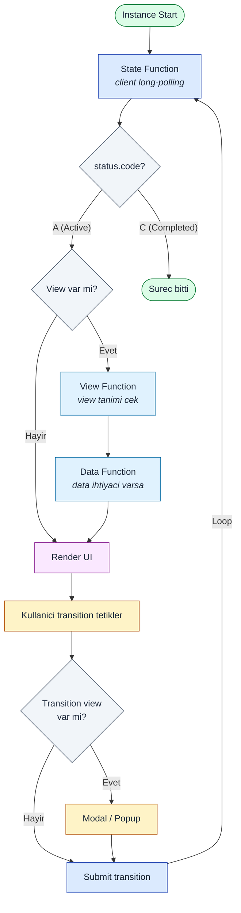

# User Integration

vNext platformu, **kullanıcı etkileşimini** workflow akışının doğal bir parçası olarak modeller. Bir süreç içinde **state** veya **transition** seviyesinde **view** tanımları yapılır. **vNext Client Workflow Manager SDK** bu yapıyı yöneterek state ve transition döngülerinde kullanıcıya **doğru view'i** ve **veriyi** sunar.

**Backend-Driven View** yaklaşımı sayesinde mobil/web platformların **sürüm çıkışları minimize** edilir — UI değişiklikleri sadece backend deploy ile yayınlanır.

## Etkileşim Döngüsü

## Adım Adım

1. **Instance başlatılır**: `POST /api/v1/{domain}/workflows/{wf}/instances/start` (genelde `sync=false`)
2. **Long-polling**: Client `GET /functions/state` çağırarak `status.code = "A"` (Active) olana kadar bekler
3. **State response**: Active state'e ulaşıldığında response, mevcut state'i ve view ihtiyacı bilgisini içerir
4. **View talebi**: View var ise client `GET /functions/view` ile view tanımını çeker
5. **Data talebi**: View'in data ihtiyacı varsa client `GET /functions/data` ile veri çeker
6. **Render**: View, data ile birlikte render edilir
7. **Transition önce kontrolü**: Kullanıcı bir transition'ı submit etmeden önce, transition'a özel view var mı kontrol edilir (popup/modal onay)
8. **Submit**: `PATCH /instances/{id}/transitions/{key}` ile transition tetiklenir
9. **Tekrar long-polling**: Status değişimi için tekrar State function'a long-polling yapılır
10. **Süreç sonu**: `status.code = "C"` (Completed) olduğunda döngü biter

## Validation

- **Schema** tanımları varsa form validation **annotation**'larını client kullanır
- Ön uçta real-time validation; backend'de submit'te re-validation
- Bkz. [Schema component](/docs/components/schema)

## İlgili

- [Async / Sync](/docs/how-to/async-sync) — long-polling neden gerekli
- [View component](/docs/components/view) — view tanımı
- [Built-in Functions](/docs/components/functions/built-in) — State / Data / View
- [Schema component](/docs/components/schema) — form validation
