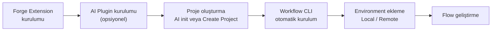

# Geliştirme Ortamı Kurulumu (Forge)

Bir vNext geliştiricisinin ilk adımı **vNext Forge** VS Code extension'ını kurmaktır. Runtime kurulumu, domain (proje) oluşturma, Workflow CLI entegrasyonu ve environment yönetimi artık Forge üzerinden yürütülür — `docker-compose` dosyalarıyla veya CLI komutlarıyla elle uğraşmanız gerekmez.



:::info[Forge, CLI ve Runtime ilişkisi]
Forge tek başına çalışmaz; perde arkasında iki bileşeni **entegre olarak yönetir**:

- **[vNext Workflow CLI](/docs/tools/workflow-cli)** (`wf`) — component'lerin runtime'a deploy edilmesi (publish, `wf update`) ve domain kaydı Forge'un CLI entegrasyonu üzerinden yapılır.
- **[vNext Runtime](https://github.com/burgan-tech/vnext-runtime)** — lokal environment eklediğinizde Forge, runtime'ı sizin adınıza kurar, başlatır/durdurur ve sağlığını izler.

Bu yüzden CLI veya runtime kaynaklı bir sorun yaşarsanız çözümü ilgili repo dokümanlarında arayın: CLI sorunları için [`vnext-workflow-cli`](https://github.com/burgan-tech/vnext-workflow-cli), runtime sorunları için [`vnext-runtime`](https://github.com/burgan-tech/vnext-runtime). Forge çoğu durumda hatayı yüzeye çıkarır ama düzeltme adımları bu repoların dokümanlarındadır.
:::

## 1. vNext Forge Extension'ı Kurun

1. VS Code'da Extensions panelini açın (`Cmd+Shift+X` / `Ctrl+Shift+X`).
2. **"vNext Forge"** aratın ve **Install** butonuna tıklayın.
3. Kurulum sonrası sol Activity Bar'da **vNext Forge Tools** ikonu görünür.


Extension, açık workspace'te `vnext.config.json` bulursa otomatik aktifleşir ve tüm panelleri gösterir; henüz bir proje yoksa yalnızca **Settings** ve **Create Project** panelleri görünür.

## 2. (Opsiyonel) AI Plugin'ini Kurun

Yapay zeka destekli geliştirme için [vNext AI Toolkit](/docs/tools/ai-assisted-development) Claude Code plugin'ini kurun:

```bash
claude plugin marketplace add burgan-tech/vnext-ai-toolkit
```

```bash
claude plugin install vnext-ai-toolkit@burgan-tech
```

Plugin; analiz → tasarım → component üretimi → validasyon → güvenlik incelemesi pipeline'ını çalıştıran agent'lar ve `workflow-scaffold`, `schema-design`, `view-design` gibi skill'ler içerir.

## 3. Proje Oluşturun

İki yoldan biriyle proje (domain) oluşturabilirsiniz:

### Yol A — AI ile (`vnext-init`)

Claude Code'da proje klasörünüzü açıp init komutunu çalıştırın:

```bash
claude /vnext-ai-toolkit:vnext-init
```

Bu komut, resmi `@burgan-tech/vnext-template` CLI ile temel projeyi iskeletler; üzerine docker-compose + MockLab, `CLAUDE.md`, `.http` API testleri ve entegrasyon testleri gibi toolkit katmanını ekler.

### Yol B — Forge Tools ile (Create Project)

1. Activity Bar'dan **vNext Forge Tools** ikonuna tıklayın.
2. **Create Project** panelinde **Create vNext Project** butonuna tıklayın.
3. Domain adı ve hedef klasörü girin — Forge, `@burgan-tech/vnext-template` ile projeyi oluşturur ve workspace'i açar.


Proje açıldığında Forge Tools paneli **Settings, Project, Environments, Package Deploy, Quick Run** bölümleriyle tam olarak yüklenir.


## 4. Workflow CLI Kurulumu

Forge, ilk çalıştığında makinede **Workflow CLI**'ın (`wf`) kurulu olup olmadığını kendisi tespit eder. Kurulu değilse **Install Workflow CLI** aksiyonunu sunar ve kurulumu entegre terminal üzerinden kendisi yürütür.

:::warning[İzin sorunlarında manuel kurulum]
Şirket bilgisayarlarında npm global kurulumu makine izinlerine takılabilir. Bu durumda CLI'ı manuel kurun:

```bash
npm install -g @burgan-tech/vnext-workflow-cli
```

Kurulum sonrası doğrulayın:

```bash
wf --version
```

`EACCES` benzeri yetki hataları ve alternatif kurulum yöntemleri için [Workflow CLI dokümanına](/docs/tools/workflow-cli) ve [`vnext-workflow-cli`](https://github.com/burgan-tech/vnext-workflow-cli) repo README'sine bakın. Kurulumdan sonra Forge Tools panelinde sidebar'ı yenileyin.
:::

## 5. Environment Ekleyin

Component'leri test edebilmek için Forge'a bir çalışma ortamı tanıtmanız gerekir. **Forge Tools → Environments** panelinin başlığındaki **Add Environment** (+) butonuna tıklayın.


İki ortam tipi vardır:

### Local (Docker) Environment

Forge, [`vnext-runtime`](https://github.com/burgan-tech/vnext-runtime)'ı sizin adınıza indirir, domain'iniz için yapılandırır ve Docker Compose ile ayağa kaldırır. Ortam eklendikten sonra environment satırındaki aksiyonlarla yönetirsiniz:

| Aksiyon | Açıklama |
|---------|----------|
| **Start / Stop / Restart Local Runtime** | Domain container'larını başlatır/durdurur |
| **Check Environment Health** | Runtime `health/check` endpoint'ini sorgular |
| **Show Local Runtime Logs** | Container loglarını VS Code'da açar |
| **Reveal Ports** | Domain'e atanan portları gösterir |
| **Update Runtime** | Runtime sürümünü günceller |
| **Register with Workflow CLI** | Domain'i CLI'a kaydeder (deploy için gereklidir) |
| **Start / Stop Infrastructure** | Paylaşılan altyapıyı (PostgreSQL, Redis, Vault, Dapr) yönetir |


:::tip
Lokal runtime'ın domain'i CLI'a kayıtlı değilse Forge bunu environment satırında işaretler ve **Register with Workflow CLI** aksiyonunu önerir. Deploy (publish) işlemleri bu kayıt olmadan çalışmaz.
:::

### Remote Environment

Halihazırda çalışan bir runtime'a (test/staging ortamı gibi) bağlanmak için **Remote / existing** seçeneğini seçip runtime'ın **base URL**'ini girin. Forge, health check ile erişilebilirliği doğrular; Quick Run ve Instance Monitor bu ortama karşı çalışır.


Birden fazla environment tanımlayıp **Set Active Environment** ile aralarında geçiş yapabilirsiniz.

## 6. Flow Geliştirmeye Başlayın

Ortam hazır — artık workflow geliştirebilirsiniz. İki yaklaşım:

**AI ile:** İlgili skill'i çağırarak uçtan uca tasarım yapın. Örneğin yeni bir süreç tasarlamak için:

```bash
claude /vnext-ai-toolkit:vnext-design-process "Hesap açılış süreci"
```

veya tek bir workflow iskeletlemek için Claude Code içinde `workflow-scaffold` skill'ini kullanın:

```text
> Yeni bir onay akışı workflow'u oluştur: taslak, yönetici onayı ve tamamlandı state'leri olsun
```

AI; state/transition grafiğini planlar, workflow JSON + `.csx` mapping + `.http` test dosyalarını üretir ve `npm run validate` ile doğrular.

**Forge Designer ile:** Explorer'da `Workflows/` klasörüne sağ tıklayıp **Forge: Workflow Create** ile görsel tasarımcıda çalışın. Detaylar için [Forge Kullanım Kılavuzu](/docs/tools/forge-usage)'na bakın.

## Sonraki Adımlar

- **[Tutorial: İlk Workflow](./tutorial)** — adım adım basit bir onay akışı oluşturun.
- **[Forge Kullanım Kılavuzu](/docs/tools/forge-usage)** — Forge Tools, component tasarımcıları, publish ve CLI ilişkisi.
- **[AI Destekli Geliştirme](/docs/tools/ai-assisted-development)** — agent pipeline ve skill'lerin tamamı.

## Sorun Giderme — Hangi Repo?

| Sorun | Bakılacak yer |
|-------|---------------|
| Forge panelleri/designer sorunları | [`vnext-forge`](https://github.com/burgan-tech/vnext-forge) |
| `wf` komut hataları, deploy/publish sorunları | [`vnext-workflow-cli`](https://github.com/burgan-tech/vnext-workflow-cli) |
| Runtime container'ları, port çakışmaları, altyapı | [`vnext-runtime`](https://github.com/burgan-tech/vnext-runtime) |
| AI agent/skill sorunları | [`vnext-ai-toolkit`](https://github.com/burgan-tech/vnext-ai-toolkit) |

Manuel (Forge'suz) runtime kurulumu gerekiyorsa arşivdeki [Local Development](/docs/archive/local-dev) ve [Multi-Domain Kurulumu](/docs/archive/multi-domain) rehberleri referans olarak duruyor.
