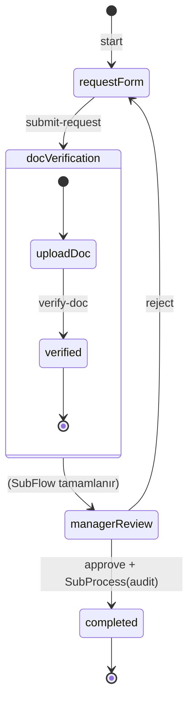

# Tutorial: SubFlow ve SubProcess

Bu rehberde [İlk Workflow Tutorial](./tutorial)'ındaki **simple-approval** akışını genişleterek iki temel orkestrasyon kalıbını öğreneceksiniz:

- **SubFlow** — Parent workflow'u bloklar, sonucu merge eder (doküman doğrulama)
- **SubProcess** — Fire-and-forget, bağımsız çalışır (audit loglama)

:::tip[Ön Koşullar]

- [Tutorial: İlk Workflow](./tutorial) rehberini tamamlamış ve `simple-approval` workflow'u publish edilmiş olmalı.
- Runtime çalışıyor olmalı (`http://localhost:4201`).

:::

## Senaryo

Talep formu gönderildikten sonra, yönetici incelemesinden önce doküman doğrulama zorunlu hale gelir. Ayrıca onay verildiğinde arka planda bir audit kaydı oluşturulur:



---

## 1. SubFlow: Doküman Doğrulama

SubFlow, parent workflow'un bir state'inde çalışan **bağımlı** alt akıştır. Tamamlandığında sonucu parent instance'a merge eder.

### 1.1 SubFlow Workflow Tanımı

Workflows klasöründe yeni bir workflow oluşturun. Bu workflow `type: "S"` ile SubFlow olarak tanımlanır.

#### `doc-verification.json`

> **Schema:** `workflow-definition.schema.json`

```json
{
  "key": "doc-verification",
  "flow": "sys-flows",
  "flowVersion": "1.0.0",
  "domain": "demo",
  "version": "1.0.0",
  "tags": ["demo", "verification", "subflow"],
  "attributes": {
    "type": "S",
    "labels": [
      { "label": "Document Verification", "language": "en-US" },
      { "label": "Doküman Doğrulama", "language": "tr-TR" }
    ],
    "startTransition": {
      "key": "start",
      "target": "upload-doc",
      "triggerType": 0,
      "versionStrategy": "Minor",
      "labels": [
        { "label": "Start", "language": "en-US" },
        { "label": "Başlat", "language": "tr-TR" }
      ]
    },
    "states": [
      {
        "key": "upload-doc",
        "stateType": 1,
        "versionStrategy": "Minor",
        "labels": [
          { "label": "Upload Document", "language": "en-US" },
          { "label": "Doküman Yükle", "language": "tr-TR" }
        ],
        "transitions": [
          {
            "key": "verify-doc",
            "target": "verified",
            "triggerType": 0,
            "versionStrategy": "Minor",
            "labels": [
              { "label": "Verify Document", "language": "en-US" },
              { "label": "Dokümanı Doğrula", "language": "tr-TR" }
            ]
          }
        ]
      },
      {
        "key": "verified",
        "stateType": 3,
        "versionStrategy": "Minor",
        "labels": [
          { "label": "Verified", "language": "en-US" },
          { "label": "Doğrulandı", "language": "tr-TR" }
        ]
      }
    ]
  }
}
```

:::info
SubFlow workflow'ları `type: "S"` ile tanımlanır. Kendi state'leri, transition'ları ve yaşam döngüsü vardır ancak parent workflow ile entegre çalışırlar.
:::

### 1.2 Parent Workflow'a SubFlow State Ekleme

`simple-approval.json` workflow'unda `submit-request` transition'ının hedefini `doc-verification-state` yapın ve bu state'i `stateType: 4` (SubFlow) olarak tanımlayın:

```json
{
  "key": "doc-verification-state",
  "stateType": 4,
  "versionStrategy": "Minor",
  "labels": [
    { "label": "Document Verification", "language": "en-US" },
    { "label": "Doküman Doğrulama", "language": "tr-TR" }
  ],
  "subFlow": {
    "type": "S",
    "process": {
      "key": "doc-verification",
      "domain": "demo",
      "version": "1.0.0",
      "flow": "sys-flows"
    },
    "mapping": {
      "type": "L",
      "location": "./src/DocVerificationMapping.csx",
      "code": "",
      "encoding": "NAT"
    }
  },
  "transitions": [
    {
      "key": "to-manager-review",
      "target": "manager-review",
      "triggerType": 1,
      "triggerKind": 10,
      "versionStrategy": "Minor",
      "labels": [
        { "label": "To Manager Review", "language": "en-US" },
        { "label": "Yönetici İncelemesine", "language": "tr-TR" }
      ]
    }
  ]
}
```

SubFlow state tamamlandığında `triggerKind: 10` (default auto) transition otomatik olarak tetiklenir ve akış `manager-review` state'ine geçer.

### 1.3 Mapping: ISubFlowMapping

SubFlow mapping'i iki metod içerir: SubFlow başlarken veri hazırlayan `InputHandler` ve tamamlandığında sonucu parent'a merge eden `OutputHandler`.

#### `DocVerificationMapping.csx`

```csharp
using System.Threading.Tasks;
using BBT.Workflow.Scripting;

public class DocVerificationMapping : ISubFlowMapping
{
    public async Task<ScriptResponse> InputHandler(ScriptContext context)
    {
        var response = new ScriptResponse();

        response.Data.requestTitle = context.Instance.Data.title;
        response.Data.requestPriority = context.Instance.Data.priority;

        return await Task.FromResult(response);
    }

    public async Task<ScriptResponse> OutputHandler(ScriptContext context)
    {
        var response = new ScriptResponse();

        response.Data.docVerified = true;
        response.Data.verifiedAt = context.Instance.Data.verifiedAt;

        return await Task.FromResult(response);
    }
}
```

`InputHandler` parent'tan SubFlow'a veri aktarır, `OutputHandler` SubFlow sonucunu parent instance'a merge eder.

### 1.4 Güncel Akış

`simple-approval.json` içindeki `submit-request` transition'ının `target` değerini güncelleyin:

```json
{
  "key": "submit-request",
  "target": "doc-verification-state",
  "triggerType": 0,
  "versionStrategy": "Minor",
  "labels": [
    { "label": "Submit Request", "language": "en-US" },
    { "label": "Talep Gönder", "language": "tr-TR" }
  ],
  "schema": {
    "key": "request-schema",
    "domain": "demo",
    "flow": "sys-schemas",
    "version": "1.0.0"
  }
}
```

---

## 2. SubProcess: Audit Loglama

SubProcess, parent workflow'dan bağımsız çalışan **fire-and-forget** alt süreçtir. Parent'a sonuç döndürmez.

### 2.1 SubProcess Workflow Tanımı

#### `audit-log.json`

> **Schema:** `workflow-definition.schema.json`

```json
{
  "key": "audit-log",
  "flow": "sys-flows",
  "flowVersion": "1.0.0",
  "domain": "demo",
  "version": "1.0.0",
  "tags": ["demo", "audit", "subprocess"],
  "attributes": {
    "type": "P",
    "labels": [
      { "label": "Audit Log", "language": "en-US" },
      { "label": "Audit Kaydı", "language": "tr-TR" }
    ],
    "startTransition": {
      "key": "start",
      "target": "log-entry",
      "triggerType": 0,
      "versionStrategy": "Minor",
      "labels": [
        { "label": "Start", "language": "en-US" },
        { "label": "Başlat", "language": "tr-TR" }
      ]
    },
    "states": [
      {
        "key": "log-entry",
        "stateType": 1,
        "versionStrategy": "Minor",
        "labels": [
          { "label": "Log Entry", "language": "en-US" },
          { "label": "Kayıt Girişi", "language": "tr-TR" }
        ],
        "transitions": [
          {
            "key": "complete-log",
            "target": "logged",
            "triggerType": 1,
            "triggerKind": 10,
            "versionStrategy": "Minor",
            "labels": [
              { "label": "Complete Log", "language": "en-US" },
              { "label": "Kaydı Tamamla", "language": "tr-TR" }
            ]
          }
        ]
      },
      {
        "key": "logged",
        "stateType": 3,
        "versionStrategy": "Minor",
        "labels": [
          { "label": "Logged", "language": "en-US" },
          { "label": "Kaydedildi", "language": "tr-TR" }
        ]
      }
    ]
  }
}
```

### 2.2 SubProcessTask Tanımı

Tasks klasöründe bir SubProcessTask (type `14`) oluşturun. Bu task, `approve` transition'ında tetiklenecek.

#### `start-audit-log.json`

> **Schema:** `task-definition.schema.json`

```json
{
  "key": "start-audit-log",
  "version": "1.0.0",
  "domain": "demo",
  "flow": "sys-tasks",
  "flowVersion": "1.0.0",
  "tags": ["demo", "audit", "subprocess"],
  "attributes": {
    "type": "14",
    "config": {
      "domain": "demo",
      "flow": "audit-log",
      "version": "1.0.0",
      "sync": false
    }
  }
}
```

:::warning
`sync: false` subprocess'in parent'ı bloklamadan bağımsız çalışmasını sağlar. Bu, SubProcess'in temel davranışıdır.
:::

### 2.3 Parent Workflow'a SubProcessTask Ekleme

`simple-approval.json` içindeki `approve` transition'ının `onExecutionTasks` dizisine SubProcessTask'ı ekleyin:

```json
{
  "key": "approve",
  "target": "completed",
  "triggerType": 0,
  "versionStrategy": "Minor",
  "labels": [
    { "label": "Approve", "language": "en-US" },
    { "label": "Onayla", "language": "tr-TR" }
  ],
  "schema": {
    "key": "approval-schema",
    "domain": "demo",
    "flow": "sys-schemas",
    "version": "1.0.0"
  },
  "onExecutionTasks": [
    {
      "order": 1,
      "task": {
        "key": "send-notification",
        "domain": "demo",
        "flow": "sys-tasks",
        "version": "1.0.0"
      }
    },
    {
      "order": 2,
      "task": {
        "key": "start-audit-log",
        "domain": "demo",
        "flow": "sys-tasks",
        "version": "1.0.0"
      }
    }
  ]
}
```

### 2.4 Mapping: ISubProcessMapping

SubProcess mapping'i yalnızca `InputHandler` içerir — sonuç parent'a dönmez.

#### `AuditLogMapping.csx`

```csharp
using System.Threading.Tasks;
using BBT.Workflow.Scripting;

public class AuditLogMapping : ISubProcessMapping
{
    public async Task<ScriptResponse> InputHandler(ScriptContext context)
    {
        var response = new ScriptResponse();

        response.Data.action = "approved";
        response.Data.requestTitle = context.Instance.Data.title;
        response.Data.approvedBy = context.Headers["x-user-id"];
        response.Data.timestamp = System.DateTime.UtcNow.ToString("o");

        return await Task.FromResult(response);
    }
}
```

---

## 3. SubFlow vs SubProcess

| | SubFlow (`S`) | SubProcess (`P`) |
|---|---|---|
| **Senkronizasyon** | Sonuç parent'a merge edilir | Fire-and-forget |
| **Parent'ı bloklar mı?** | Evet, tamamlanana kadar | Hayır |
| **Mapping arayüzü** | `ISubFlowMapping` (InputHandler + OutputHandler) | `ISubProcessMapping` (yalnızca InputHandler) |
| **Tetikleme** | `stateType: 4` SubFlow state | `SubProcessTask` (type `14`) veya `stateType: 4` ile `type: "P"` |
| **Tipik kullanım** | Doğrulama, hesaplama, onay alt akışı | Audit, bildirim, arka plan işleri |

---

## 4. Publish ve Test

### 4.1 Publish

Tüm yeni bileşenleri deploy edin:

```bash
wf update --all
```

### 4.2 Quick Runner ile Test

1. Quick Runner'da **+ New Run** ile yeni instance başlatın.
2. `submit-request` transition'ını tetikleyin (title, priority girin).
3. Instance `doc-verification-state`'e geçer — SubFlow otomatik başlar.
4. SubFlow instance'ında `verify-doc` transition'ını tetikleyin.
5. SubFlow tamamlanınca parent otomatik olarak `manager-review`'a geçer.
6. `approve` tetikleyin — arka planda `audit-log` SubProcess başlar.
7. **History** tab'ında SubFlow ve SubProcess geçişlerini inceleyin.

### 4.3 HTTP ile Test

**Instance başlatma ve talep gönderme:**

```bash
curl -X POST http://localhost:4201/api/v1/demo/workflows/simple-approval/instances/start \
  -H "Content-Type: application/json" \
  -d '{ "key": "subflow-test-001", "tags": ["tutorial"], "attributes": {} }'
```

```bash
curl -X PATCH http://localhost:4201/api/v1/demo/workflows/simple-approval/instances/{instanceId}/transitions/submit-request \
  -H "Content-Type: application/json" \
  -d '{
    "attributes": {
      "title": "Yeni Ekipman Talebi",
      "description": "Doküman doğrulaması gerekli",
      "priority": "high"
    }
  }'
```

**SubFlow instance'ını sorgulama:**

Instance sorgulandığında SubFlow korelasyon bilgileri `activeCorrelations` alanında görünür:

```bash
curl http://localhost:4201/api/v1/demo/workflows/simple-approval/instances/{instanceId}
```

**SubFlow'u tamamlama (doğrulama):**

SubFlow instance'ı kendi workflow'u üzerinden ilerletilir:

```bash
curl -X PATCH http://localhost:4201/api/v1/demo/workflows/doc-verification/instances/{subFlowInstanceId}/transitions/verify-doc \
  -H "Content-Type: application/json" \
  -d '{ "attributes": {} }'
```

SubFlow tamamlandığında parent otomatik olarak `manager-review` state'ine geçer.

---

## Sonraki Adımlar

- **[Tutorial: Views ve Extensions](./tutorial-views-extensions)** — Platforma özel view seçimi ve extension kullanımı.
- **[Workflow Bileşenleri](/docs/components/workflow)** — State türleri ve SubFlow detayları.
- **[Mapping Arayüzleri](/docs/components/interfaces)** — ISubFlowMapping ve ISubProcessMapping referansı.
- **[Trigger Tasks](/docs/components/tasks/trigger)** — SubProcessTask ve diğer trigger task türleri.
