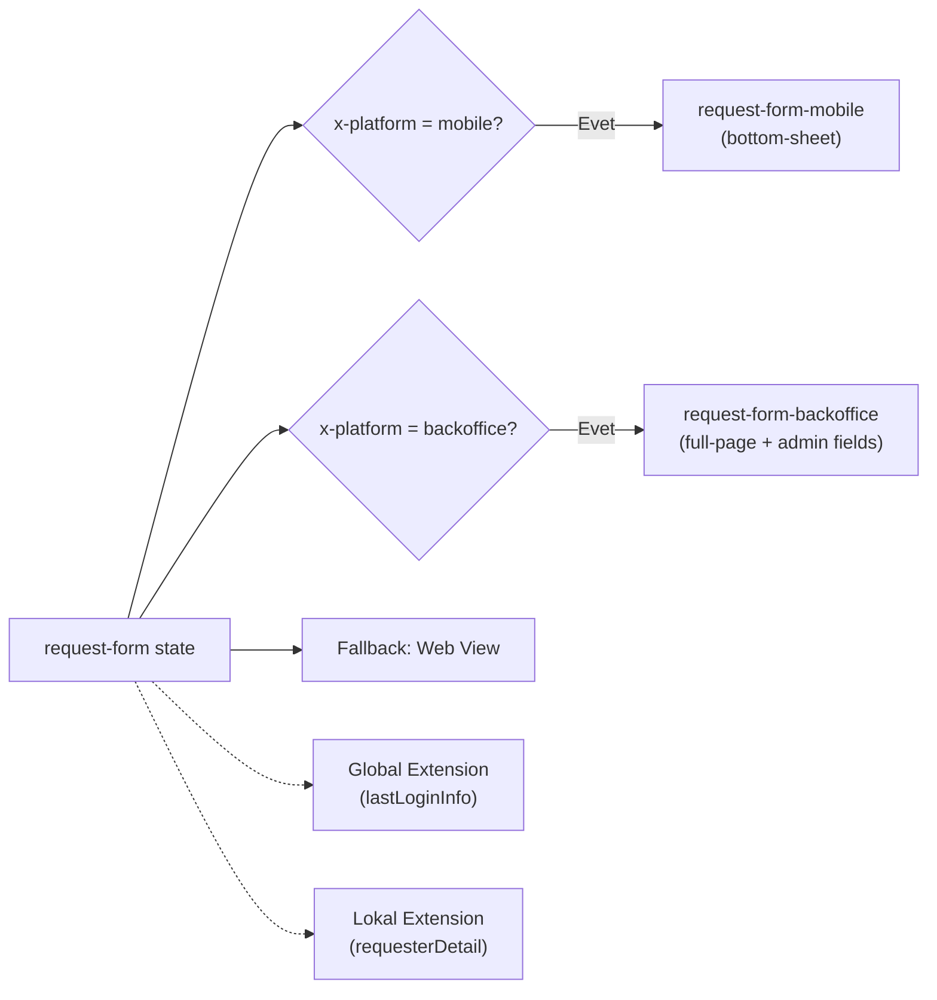

# Tutorial: Views ve Extensions

Bu rehberde [İlk Workflow Tutorial](./tutorial)'ındaki **simple-approval** akışını genişleterek iki temel kavramı öğreneceksiniz:

- **Kural tabanlı view seçimi** — Aynı state'te mobile, backoffice ve web için farklı view'lar gösterme
- **Global ve Lokal Extension** — Instance verisi zenginleştirme kapsamları

:::tip[Ön Koşullar]

- [Tutorial: İlk Workflow](./tutorial) rehberini tamamlamış ve `simple-approval` workflow'u publish edilmiş olmalı.
- Runtime çalışıyor olmalı (`http://localhost:4201`).

:::

## Senaryo

Onay talebi akışında `request-form` state'i artık platforma göre farklı ekranlar gösterecek:

- **Mobile** kullanıcılar sadeleştirilmiş bir `bottom-sheet` form görür
- **Backoffice** operatörleri ek yönetim alanları içeren `full-page` ekran görür
- **Web** kullanıcıları varsayılan `full-page` form görür

Ayrıca iki extension devreye girer: biri tüm workflow'larda çalışan **global** extension, diğeri yalnızca onay akışında çalışan **lokal** extension.



---

## 1. Platforma Özel View Tanımları

Üç farklı view oluşturacağız: mobile, backoffice ve web (varsayılan).

### 1.1 Mobile View

Mobile kullanıcılar için sadeleştirilmiş form. `display: "bottom-sheet"` ile alt panelde açılır, sadece zorunlu alanları içerir.

#### `request-form-mobile.json`

> **Schema:** `view-definition.schema.json`

```json
{
  "key": "request-form-mobile",
  "version": "1.0.0",
  "domain": "demo",
  "flow": "sys-views",
  "flowVersion": "1.0.0",
  "tags": ["demo", "approval", "mobile"],
  "attributes": {
    "type": 1,
    "display": "bottom-sheet",
    "content": {
      "type": "form",
      "title": {
        "en-US": "New Request",
        "tr-TR": "Yeni Talep"
      },
      "fields": [
        {
          "name": "title",
          "type": "text",
          "label": { "en-US": "Title", "tr-TR": "Başlık" },
          "required": true
        },
        {
          "name": "priority",
          "type": "select",
          "label": { "en-US": "Priority", "tr-TR": "Öncelik" },
          "required": true,
          "options": [
            { "value": "low", "label": { "en-US": "Low", "tr-TR": "Düşük" } },
            { "value": "medium", "label": { "en-US": "Medium", "tr-TR": "Orta" } },
            { "value": "high", "label": { "en-US": "High", "tr-TR": "Yüksek" } }
          ]
        }
      ]
    },
    "labels": [
      { "label": "Request Form (Mobile)", "language": "en-US" },
      { "label": "Talep Formu (Mobil)", "language": "tr-TR" }
    ]
  }
}
```

### 1.2 Backoffice View

Backoffice operatörleri için ek yönetim alanları (`assignee`, `internalNote`) içeren `full-page` ekran.

#### `request-form-backoffice.json`

> **Schema:** `view-definition.schema.json`

```json
{
  "key": "request-form-backoffice",
  "version": "1.0.0",
  "domain": "demo",
  "flow": "sys-views",
  "flowVersion": "1.0.0",
  "tags": ["demo", "approval", "backoffice"],
  "attributes": {
    "type": 1,
    "display": "full-page",
    "content": {
      "type": "form",
      "title": {
        "en-US": "New Approval Request (Backoffice)",
        "tr-TR": "Yeni Onay Talebi (Backoffice)"
      },
      "description": {
        "en-US": "Create a request on behalf of the customer.",
        "tr-TR": "Müşteri adına talep oluşturun."
      },
      "fields": [
        {
          "name": "title",
          "type": "text",
          "label": { "en-US": "Title", "tr-TR": "Başlık" },
          "required": true
        },
        {
          "name": "description",
          "type": "textarea",
          "label": { "en-US": "Description", "tr-TR": "Açıklama" },
          "required": false
        },
        {
          "name": "priority",
          "type": "select",
          "label": { "en-US": "Priority", "tr-TR": "Öncelik" },
          "required": true,
          "options": [
            { "value": "low", "label": { "en-US": "Low", "tr-TR": "Düşük" } },
            { "value": "medium", "label": { "en-US": "Medium", "tr-TR": "Orta" } },
            { "value": "high", "label": { "en-US": "High", "tr-TR": "Yüksek" } }
          ]
        },
        {
          "name": "assignee",
          "type": "text",
          "label": { "en-US": "Assign To", "tr-TR": "Atanan Kişi" },
          "required": false
        },
        {
          "name": "internalNote",
          "type": "textarea",
          "label": { "en-US": "Internal Note", "tr-TR": "İç Not" },
          "required": false
        }
      ]
    },
    "labels": [
      { "label": "Request Form (Backoffice)", "language": "en-US" },
      { "label": "Talep Formu (Backoffice)", "language": "tr-TR" }
    ]
  }
}
```

### 1.3 Web View (Varsayılan)

Web kullanıcıları için standart form. İlk tutorial'daki `request-form-view.json` zaten bu rolü üstlenir — aynen kullanmaya devam edebilirsiniz.

---

## 2. Kural Tabanlı View Seçimi

View'lar tanımlandıktan sonra, workflow state'ine `views` dizisi ekleyerek kural tabanlı seçim yapılır. Her girişteki `rule` bir `IConditionMapping` C# script'idir; **ilk eşleşen kural kazanır**, kuralı olmayan giriş fallback olur.

### 2.1 State'e `views` Dizisi Ekleme

`simple-approval.json` içindeki `request-form` state'ini güncelleyin. Tek `view` yerine `views` dizisi kullanın:

```json
{
  "key": "request-form",
  "stateType": 1,
  "versionStrategy": "Minor",
  "labels": [
    { "label": "Request Form", "language": "en-US" },
    { "label": "Talep Formu", "language": "tr-TR" }
  ],
  "views": [
    {
      "rule": {
        "location": "inline",
        "code": "using System.Threading.Tasks;\nusing BBT.Workflow.Scripting;\npublic class MobileRule : IConditionMapping\n{\n    public async Task<bool> Handler(ScriptContext context)\n    {\n        return context.Headers?[\"x-platform\"] == \"mobile\";\n    }\n}",
        "encoding": "NAT"
      },
      "view": {
        "key": "request-form-mobile",
        "domain": "demo",
        "flow": "sys-views",
        "version": "1.0.0"
      },
      "loadData": false
    },
    {
      "rule": {
        "location": "inline",
        "code": "using System.Threading.Tasks;\nusing BBT.Workflow.Scripting;\npublic class BackofficeRule : IConditionMapping\n{\n    public async Task<bool> Handler(ScriptContext context)\n    {\n        return context.Headers?[\"x-platform\"] == \"backoffice\";\n    }\n}",
        "encoding": "NAT"
      },
      "view": {
        "key": "request-form-backoffice",
        "domain": "demo",
        "flow": "sys-views",
        "version": "1.0.0"
      },
      "loadData": false
    },
    {
      "view": {
        "key": "request-form-view",
        "domain": "demo",
        "flow": "sys-views",
        "version": "1.0.0"
      },
      "loadData": false
    }
  ],
  "transitions": [
    {
      "key": "submit-request",
      "target": "manager-review",
      "triggerType": 0,
      "versionStrategy": "Minor",
      "labels": [
        { "label": "Submit Request", "language": "en-US" },
        { "label": "Talep Gönder", "language": "tr-TR" }
      ],
      "schema": {
        "key": "request-schema",
        "domain": "demo",
        "flow": "sys-schemas",
        "version": "1.0.0"
      }
    }
  ]
}
```

### 2.2 Değerlendirme Sırası

1. `x-platform: mobile` header'ı varsa → `request-form-mobile` (bottom-sheet)
2. `x-platform: backoffice` header'ı varsa → `request-form-backoffice` (full-page + ek alanlar)
3. Hiçbir kural eşleşmezse → `request-form-view` (varsayılan web formu)

:::tip
Varsayılan (fallback) view'ı her zaman dizinin **sonuna** koyun. Kuralı olmayan giriş, hiçbir kural eşleşmediğinde devreye girer.
:::

---

## 3. Transition View Örneği

Aynı `views` dizi formatı transition'larda da kullanılabilir. Örneğin `approve` transition'ında mobile'da `bottom-sheet` onay ekranı, desktop'ta `popup` modal göstermek için:

```json
{
  "key": "approve",
  "target": "completed",
  "triggerType": 0,
  "versionStrategy": "Minor",
  "labels": [
    { "label": "Approve", "language": "en-US" },
    { "label": "Onayla", "language": "tr-TR" }
  ],
  "views": [
    {
      "rule": {
        "location": "inline",
        "code": "using System.Threading.Tasks;\nusing BBT.Workflow.Scripting;\npublic class MobileConfirmRule : IConditionMapping\n{\n    public async Task<bool> Handler(ScriptContext context)\n    {\n        return context.Headers?[\"x-platform\"] == \"mobile\";\n    }\n}",
        "encoding": "NAT"
      },
      "view": {
        "key": "approve-confirm-mobile",
        "domain": "demo",
        "flow": "sys-views",
        "version": "1.0.0"
      },
      "loadData": true
    },
    {
      "view": {
        "key": "approve-confirm-desktop",
        "domain": "demo",
        "flow": "sys-views",
        "version": "1.0.0"
      },
      "loadData": true
    }
  ]
}
```

---

## 4. Global Extension: Son Giriş Bilgisi

**Global** extension (`attributes.type: 1`) domain'deki **tüm** workflow'larda otomatik çalışır. Workflow tanımına ayrıca kayıt etmenize gerek yoktur.

### 4.1 Extension Tanımı

Extensions klasöründe oluşturun:

#### `extension-last-login.json`

> **Schema:** `extension-definition.schema.json`

```json
{
  "key": "extension-last-login",
  "version": "1.0.0",
  "domain": "demo",
  "flow": "sys-extensions",
  "flowVersion": "1.0.0",
  "tags": ["demo", "global", "login"],
  "attributes": {
    "type": 1,
    "scope": 3,
    "task": {
      "order": 1,
      "task": {
        "key": "send-notification",
        "domain": "demo",
        "flow": "sys-tasks",
        "version": "1.0.0"
      },
      "mapping": {
        "type": "L",
        "location": "./src/LastLoginMapping.csx",
        "code": "",
        "encoding": "NAT"
      }
    },
    "labels": [
      { "label": "Last Login Info", "language": "en-US" },
      { "label": "Son Giriş Bilgisi", "language": "tr-TR" }
    ]
  }
}
```

| Alan | Değer | Anlam |
|------|-------|-------|
| `type` | `1` (Global) | Tüm akışlarda çalışır |
| `scope` | `3` (Everywhere) | Tüm get endpoint'lerinde çalışır |

### 4.2 Davranış

`type: 1` (Global) olduğu için bu extension herhangi bir workflow'a kayıt edilmesine gerek kalmadan domain'deki tüm instance sorgularında otomatik çalışır:

```bash
curl http://localhost:4201/api/v1/demo/workflows/simple-approval/instances/{instanceId}
```

Response'da `extensions` altında görünür:

```json
{
  "id": "...",
  "metadata": { "currentState": "manager-review", "status": "Active" },
  "attributes": { "title": "Yeni Laptop Talebi", "priority": "high" },
  "extensions": {
    "extensionLastLogin": {
      "lastLoginAt": "2026-05-11T14:30:00Z",
      "lastLoginIp": "192.168.1.100",
      "device": "Chrome / macOS"
    }
  }
}
```

---

## 5. Lokal Extension: Talep Sahibi Detayı

**Lokal** extension (`attributes.type: 3`, DefinedFlows) yalnızca **kayıt edildiği** workflow'larda çalışır. Hem workflow `attributes.extensions` dizisine hem de ilgili state'in `view.extensions` alanına eklenmesi gerekir.

### 5.1 Extension Tanımı

#### `extension-requester-detail.json`

> **Schema:** `extension-definition.schema.json`

```json
{
  "key": "extension-requester-detail",
  "version": "1.0.0",
  "domain": "demo",
  "flow": "sys-extensions",
  "flowVersion": "1.0.0",
  "tags": ["demo", "approval", "requester"],
  "attributes": {
    "type": 3,
    "scope": 1,
    "task": {
      "order": 1,
      "task": {
        "key": "send-notification",
        "domain": "demo",
        "flow": "sys-tasks",
        "version": "1.0.0"
      },
      "mapping": {
        "type": "L",
        "location": "./src/RequesterDetailMapping.csx",
        "code": "",
        "encoding": "NAT"
      }
    },
    "labels": [
      { "label": "Requester Detail", "language": "en-US" },
      { "label": "Talep Sahibi Detayı", "language": "tr-TR" }
    ]
  }
}
```

| Alan | Değer | Anlam |
|------|-------|-------|
| `type` | `3` (DefinedFlows) | Yalnızca kayıtlı akışlarda çalışır |
| `scope` | `1` (GetInstance) | Sadece tek instance sorgusunda çalışır |

### 5.2 Workflow'a Kayıt

`simple-approval.json` içinde iki yere ekleme yapın:

**1. Workflow `attributes.extensions` dizisine:**

```json
{
  "attributes": {
    "extensions": [
      {
        "key": "extension-requester-detail",
        "domain": "demo",
        "flow": "sys-extensions",
        "version": "1.0.0"
      }
    ]
  }
}
```

**2. İlgili state'in `view.extensions` alanına:**

```json
{
  "key": "manager-review",
  "stateType": 2,
  "view": {
    "view": {
      "key": "manager-review-view",
      "domain": "demo",
      "flow": "sys-views",
      "version": "1.0.0"
    },
    "loadData": true,
    "extensions": ["extension-requester-detail"]
  }
}
```

### 5.3 Davranış

Lokal extension yalnızca kayıtlı olduğu workflow'da ve belirtilen state'in view'ı sorgulandığında çalışır:

```bash
curl "http://localhost:4201/api/v1/demo/workflows/simple-approval/instances/{instanceId}?extensions=extension-requester-detail"
```

Response:

```json
{
  "id": "...",
  "metadata": { "currentState": "manager-review", "status": "Active" },
  "attributes": { "title": "Yeni Laptop Talebi", "priority": "high" },
  "extensions": {
    "extensionLastLogin": {
      "lastLoginAt": "2026-05-11T14:30:00Z",
      "lastLoginIp": "192.168.1.100",
      "device": "Chrome / macOS"
    },
    "extensionRequesterDetail": {
      "name": "Ahmet Yılmaz",
      "department": "Engineering",
      "email": "ahmet@example.com",
      "employeeId": "EMP-1234"
    }
  }
}
```

`extensionLastLogin` global olduğu için otomatik gelir, `extensionRequesterDetail` ise lokal kayıt + istek ile gelir.

---

## 6. Global vs Lokal Extension Karşılaştırması

| | Global Extension | Lokal Extension |
|---|---|---|
| **`attributes.type`** | `1` (Global) veya `2` (GlobalAndRequested) | `3` (DefinedFlows) veya `4` (DefinedFlowAndRequested) |
| **Workflow kaydı** | Gerekli değil | `attributes.extensions` dizisine eklenmeli |
| **State/View kaydı** | Gerekli değil | `view.extensions` dizisine eklenmeli |
| **Kapsam** | Domain'deki tüm workflow'lar | Yalnızca kayıtlı workflow'lar |
| **Tipik kullanım** | Kullanıcı bilgisi, session verisi, platform metadata | İş akışına özel zenginleştirme (müşteri detayı, kredi geçmişi) |

:::info
`type: 2` (GlobalAndRequested) ve `type: 4` (DefinedFlowAndRequested) varyantları, extension'ın hem otomatik hem de `?extensions=` parametresiyle talep edildiğinde çalışmasını sağlar.
:::

---

## 7. Publish ve Test

### 7.1 Publish

```bash
wf update --all
```

### 7.2 Platforma Göre View Testi

**Mobile view:**

```bash
curl http://localhost:4201/api/v1/demo/workflows/simple-approval/instances/{instanceId}/functions/view \
  -H "x-platform: mobile"
```

Response'da `display: "bottom-sheet"` ve sadeleştirilmiş form alanları döner.

**Backoffice view:**

```bash
curl http://localhost:4201/api/v1/demo/workflows/simple-approval/instances/{instanceId}/functions/view \
  -H "x-platform: backoffice"
```

Response'da `display: "full-page"` ve ek `assignee`, `internalNote` alanları döner.

**Web view (varsayılan):**

```bash
curl http://localhost:4201/api/v1/demo/workflows/simple-approval/instances/{instanceId}/functions/view
```

Header gönderilmediğinde fallback view döner.

### 7.3 Extension Testi

**Global extension otomatik gelir:**

```bash
curl http://localhost:4201/api/v1/demo/workflows/simple-approval/instances/{instanceId}
```

**Lokal extension talep ile gelir:**

```bash
curl "http://localhost:4201/api/v1/demo/workflows/simple-approval/instances/{instanceId}?extensions=extension-requester-detail"
```

---

## Sonraki Adımlar

- **[View Selection](/docs/how-to/view-selection)** — Kural tabanlı view seçiminin detaylı referansı.
- **[View Bileşeni](/docs/components/view)** — Display türleri ve platform override mekanizması.
- **[Extension Bileşeni](/docs/components/extension)** — Type ve scope enum'ları, mapping detayları.
- **[Built-in Functions](/docs/components/functions/built-in)** — View function ve extension entegrasyonu.
