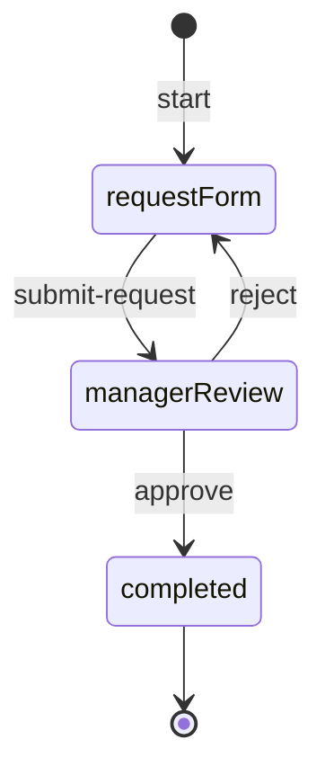

# Tutorial: İlk Workflow'unuzu Oluşturun

Bu rehberde **vNext Forge Studio** (VS Code Extension) kullanarak sektörden bağımsız basit bir **Onay Talebi (Approval Request)** workflow'u oluşturacak, runtime'a publish edecek ve hem **Quick Runner** hem de **HTTP istekleri** ile test edeceksiniz.

:::tip[Ön Koşullar]

- [Local Development](./local-dev) rehberini tamamlamış ve runtime çalışıyor olmalı (`http://localhost:4201`).
- VS Code'da **[vNext Forge Studio](/docs/tools/forge-studio)** extension yüklü olmalı.

:::

## Senaryo

Kullanıcı bir talep oluşturur, yönetici onaylar veya reddeder. Üç state, iki ana transition:



---

## 1. Proje Oluşturma

[vNext Forge Studio](/docs/tools/forge-studio) extension aktifken Command Palette'i açın (`Cmd+Shift+P`) ve **Forge: Create vnext Project** komutunu çalıştırın.

| Alan | Değer |
|------|-------|
| Domain | `demo` |
| Description | Simple Approval Workflow |
| Folder | İstediğiniz bir klasör |

Komut tamamlandığında aşağıdaki yapı oluşur:

```
demo-project/
├── vnext.config.json
├── demo
    ├── Workflows/
    ├── Tasks/
    ├── Schemas/
    ├── Views/
    ├── Functions/
    ├── Extensions/
    └── Mappings/
```

:::info
`vnext.config.json` dosyası mevcut olduğunda Forge Studio otomatik olarak aktive olur; sidebar, komutlar ve explorer menüleri kullanıma hazır hale gelir.
:::

---

## 2. Bileşenlerin Tasarlanması

### 2.1 Schema Tanımları

Schemas klasöründe iki schema oluşturun. Context menu ile **Forge: Schema Create** komutunu kullanabilirsiniz.

#### `request-schema.json` — Talep Formu Validasyonu

> **Schema:** `schema-definition.schema.json`

```json
{
  "key": "request-schema",
  "version": "1.0.0",
  "domain": "demo",
  "flow": "sys-schemas",
  "flowVersion": "1.0.0",
  "tags": ["demo", "approval", "request"],
  "attributes": {
    "type": "workflow",
    "schema": {
      "$schema": "https://json-schema.org/draft/2020-12/schema",
      "$id": "https://schemas.vnext.com/demo/request-schema.json",
      "title": "Approval Request",
      "type": "object",
      "required": ["title", "priority"],
      "properties": {
        "title": {
          "type": "string",
          "title": "Request Title",
          "minLength": 3,
          "maxLength": 120
        },
        "description": {
          "type": "string",
          "title": "Description"
        },
        "priority": {
          "type": "string",
          "title": "Priority",
          "oneOf": [
            { "const": "low", "description": "Low" },
            { "const": "medium", "description": "Medium" },
            { "const": "high", "description": "High" }
          ]
        }
      },
      "additionalProperties": false
    },
    "labels": [
      { "label": "Request Schema", "language": "en-US" },
      { "label": "Talep Şeması", "language": "tr-TR" }
    ]
  }
}
```

#### `approval-schema.json` — Onay/Red Validasyonu

> **Schema:** `schema-definition.schema.json`

```json
{
  "key": "approval-schema",
  "version": "1.0.0",
  "domain": "demo",
  "flow": "sys-schemas",
  "flowVersion": "1.0.0",
  "tags": ["demo", "approval", "decision"],
  "attributes": {
    "type": "workflow",
    "schema": {
      "$schema": "https://json-schema.org/draft/2020-12/schema",
      "$id": "https://schemas.vnext.com/demo/approval-schema.json",
      "title": "Approval Decision",
      "type": "object",
      "required": ["decision"],
      "properties": {
        "decision": {
          "type": "string",
          "title": "Decision",
          "oneOf": [
            { "const": "approved", "description": "Approved" },
            { "const": "rejected", "description": "Rejected" }
          ]
        },
        "comment": {
          "type": "string",
          "title": "Comment",
          "maxLength": 500
        }
      },
      "additionalProperties": false
    },
    "labels": [
      { "label": "Approval Schema", "language": "en-US" },
      { "label": "Onay Şeması", "language": "tr-TR" }
    ]
  }
}
```

---

### 2.2 View Tanımları

Views klasöründe iki view oluşturun (**Forge: View Create**).

#### `request-form-view.json` — Talep Formu Ekranı

> **Schema:** `view-definition.schema.json`

```json
{
  "key": "request-form-view",
  "version": "1.0.0",
  "domain": "demo",
  "flow": "sys-views",
  "flowVersion": "1.0.0",
  "tags": ["demo", "approval", "form"],
  "attributes": {
    "type": 1,
    "display": "full-page",
    "content": {
      "type": "form",
      "title": {
        "en-US": "New Approval Request",
        "tr-TR": "Yeni Onay Talebi"
      },
      "description": {
        "en-US": "Fill in the details for your request.",
        "tr-TR": "Talebiniz için gerekli bilgileri doldurun."
      },
      "fields": [
        {
          "name": "title",
          "type": "text",
          "label": { "en-US": "Title", "tr-TR": "Başlık" },
          "required": true
        },
        {
          "name": "description",
          "type": "textarea",
          "label": { "en-US": "Description", "tr-TR": "Açıklama" },
          "required": false
        },
        {
          "name": "priority",
          "type": "select",
          "label": { "en-US": "Priority", "tr-TR": "Öncelik" },
          "required": true,
          "options": [
            { "value": "low", "label": { "en-US": "Low", "tr-TR": "Düşük" } },
            { "value": "medium", "label": { "en-US": "Medium", "tr-TR": "Orta" } },
            { "value": "high", "label": { "en-US": "High", "tr-TR": "Yüksek" } }
          ]
        }
      ]
    },
    "labels": [
      { "label": "Request Form View", "language": "en-US" },
      { "label": "Talep Formu Ekranı", "language": "tr-TR" }
    ]
  }
}
```

#### `manager-review-view.json` — Yönetici İnceleme Ekranı

> **Schema:** `view-definition.schema.json`

```json
{
  "key": "manager-review-view",
  "version": "1.0.0",
  "domain": "demo",
  "flow": "sys-views",
  "flowVersion": "1.0.0",
  "tags": ["demo", "approval", "review"],
  "attributes": {
    "type": 1,
    "display": "full-page",
    "content": {
      "type": "form",
      "title": {
        "en-US": "Review Request",
        "tr-TR": "Talebi İncele"
      },
      "description": {
        "en-US": "Review the request and make your decision.",
        "tr-TR": "Talebi inceleyip kararınızı verin."
      },
      "fields": [
        {
          "name": "decision",
          "type": "select",
          "label": { "en-US": "Decision", "tr-TR": "Karar" },
          "required": true,
          "options": [
            { "value": "approved", "label": { "en-US": "Approve", "tr-TR": "Onayla" } },
            { "value": "rejected", "label": { "en-US": "Reject", "tr-TR": "Reddet" } }
          ]
        },
        {
          "name": "comment",
          "type": "textarea",
          "label": { "en-US": "Comment", "tr-TR": "Yorum" },
          "required": false
        }
      ]
    },
    "labels": [
      { "label": "Manager Review View", "language": "en-US" },
      { "label": "Yönetici İnceleme Ekranı", "language": "tr-TR" }
    ]
  }
}
```

---

### 2.3 Task Tanımı

Tasks klasöründe bir HTTP Task oluşturun (**Forge: Task Create**).

#### `send-notification.json` — Bildirim Gönderimi

> **Schema:** `task-definition.schema.json`

```json
{
  "key": "send-notification",
  "version": "1.0.0",
  "domain": "demo",
  "flow": "sys-tasks",
  "flowVersion": "1.0.0",
  "tags": ["demo", "notification", "http"],
  "attributes": {
    "type": "6",
    "config": {
      "url": "http://localhost:3000/api/notifications",
      "method": "POST",
      "headers": {
        "Content-Type": "application/json"
      },
      "timeoutSeconds": 10,
      "validateSsl": false
    }
  }
}
```

:::tip
Gerçek bir notification servisi olmasa bile task tanımını oluşturabilirsiniz. `acceptedStatusCodes` alanına `"4xx"` ekleyerek harici servis yokken hata alınmasını engelleyebilirsiniz.
:::

---

### 2.4 Workflow Tanımı

Workflows klasöründe workflow'u oluşturun (**Forge: Workflow Create**) veya Workflow Designer'da görsel olarak tasarlayın.

#### `simple-approval.json`

> **Schema:** `workflow-definition.schema.json`

```json
{
  "key": "simple-approval",
  "flow": "sys-flows",
  "flowVersion": "1.0.0",
  "domain": "demo",
  "version": "1.0.0",
  "tags": ["demo", "approval"],
  "_comment": "Basit onay talebi workflow'u",
  "attributes": {
    "type": "F",
    "labels": [
      { "label": "Simple Approval", "language": "en-US" },
      { "label": "Basit Onay", "language": "tr-TR" }
    ],
    "startTransition": {
      "key": "start",
      "target": "request-form",
      "triggerType": 0,
      "versionStrategy": "Minor",
      "labels": [
        { "label": "Start", "language": "en-US" },
        { "label": "Başlat", "language": "tr-TR" }
      ]
    },
    "states": [
      {
        "key": "request-form",
        "stateType": 1,
        "versionStrategy": "Minor",
        "labels": [
          { "label": "Request Form", "language": "en-US" },
          { "label": "Talep Formu", "language": "tr-TR" }
        ],
        "view": {
          "view": {
            "key": "request-form-view",
            "domain": "demo",
            "flow": "sys-views",
            "version": "1.0.0"
          },
          "loadData": false
        },
        "transitions": [
          {
            "key": "submit-request",
            "target": "manager-review",
            "triggerType": 0,
            "versionStrategy": "Minor",
            "labels": [
              { "label": "Submit Request", "language": "en-US" },
              { "label": "Talep Gönder", "language": "tr-TR" }
            ],
            "schema": {
              "key": "request-schema",
              "domain": "demo",
              "flow": "sys-schemas",
              "version": "1.0.0"
            }
          }
        ]
      },
      {
        "key": "manager-review",
        "stateType": 2,
        "versionStrategy": "Minor",
        "labels": [
          { "label": "Manager Review", "language": "en-US" },
          { "label": "Yönetici İncelemesi", "language": "tr-TR" }
        ],
        "view": {
          "view": {
            "key": "manager-review-view",
            "domain": "demo",
            "flow": "sys-views",
            "version": "1.0.0"
          },
          "loadData": true
        },
        "transitions": [
          {
            "key": "approve",
            "target": "completed",
            "triggerType": 0,
            "versionStrategy": "Minor",
            "labels": [
              { "label": "Approve", "language": "en-US" },
              { "label": "Onayla", "language": "tr-TR" }
            ],
            "schema": {
              "key": "approval-schema",
              "domain": "demo",
              "flow": "sys-schemas",
              "version": "1.0.0"
            },
            "onExecutionTasks": [
              {
                "order": 1,
                "task": {
                  "key": "send-notification",
                  "domain": "demo",
                  "flow": "sys-tasks",
                  "version": "1.0.0"
                }
              }
            ]
          },
          {
            "key": "reject",
            "target": "request-form",
            "triggerType": 0,
            "versionStrategy": "Minor",
            "labels": [
              { "label": "Reject", "language": "en-US" },
              { "label": "Reddet", "language": "tr-TR" }
            ],
            "schema": {
              "key": "approval-schema",
              "domain": "demo",
              "flow": "sys-schemas",
              "version": "1.0.0"
            }
          }
        ]
      },
      {
        "key": "completed",
        "stateType": 5,
        "versionStrategy": "Minor",
        "labels": [
          { "label": "Completed", "language": "en-US" },
          { "label": "Tamamlandı", "language": "tr-TR" }
        ]
      }
    ]
  }
}
```

:::warning
`stateType` değerleri: `1` = Initial, `2` = Intermediate, `5` = Final. Her workflow'da tam olarak **bir** Initial state olmalıdır.
:::

---

## 3. Publish (Yayınlama)

### Environment Ekleme

Forge Tools sidebar'ından **Environments** bölümüne gidin ve **+** ile yeni bir ortam ekleyin:

| Alan | Değer |
|------|-------|
| Name | `local` |
| Base URL | `http://localhost:4201` |

### Publish Yöntemleri

**Yöntem A — Forge Studio UI:**
Workflow Designer'da toolbar'daki **Publish** (upload) butonuna tıklayın. Bu, seçili workflow'u tek seferde deploy eder.

**Yöntem B — Tüm bileşenleri CLI ile deploy:**

```bash
wf update --all
```

**Yöntem C — REST API ile publish:**

```bash
curl -X POST http://localhost:4201/api/v1/definitions/publish \
  -H "Content-Type: application/json" \
  -d '{
    "key": "simple-approval",
    "flow": "sys-flows",
    "domain": "demo",
    "version": "1.0.0",
    "flowVersion": "1.0.0",
    "tags": ["demo", "approval"],
    "attributes": { ... }
  }'
```

:::tip
`wf update --all` komutu tüm bileşenleri (schema, view, task, workflow, function, extension) toplu olarak deploy eder. İlk kurulumda bu yöntemi tercih edin.
:::

---

## 4. Test: Quick Runner

Quick Runner, workflow'unuzu doğrudan VS Code içinden canlı runtime üzerinde test etmenizi sağlar.

### Quick Runner'ı Açma

1. Workflow Designer toolbar'ında **Quick Run** (play) butonuna tıklayın, veya
2. Explorer'da `simple-approval.json` üzerine sağ tıklayıp **Open Quick Run** seçin

### Adım 1: Yeni Instance Başlatma

**+ New Run** butonuna tıklayın. Açılan dialog'da:

| Alan | Değer |
|------|-------|
| Instance Key | _(boş bırakın — otomatik UUID üretilir)_ |
| Attributes (JSON) | `{}` |

**Start Run** ile instance'ı başlatın. Sol panelde yeni instance görünür.

### Adım 2: Talep Gönderme (`submit-request`)

Instance seçildiğinde dashboard'da **Available Transitions** bölümünde `submit-request` butonu görünür. Tıklayın ve schema-driven formda şu değerleri girin:

| Alan | Değer |
|------|-------|
| title | `Yeni Laptop Talebi` |
| description | `Geliştirme ekibi için MacBook Pro` |
| priority | `high` |

**Fire Transition** ile talebi gönderin. Instance `manager-review` state'ine geçer.

### Adım 3: Onaylama (`approve`)

Dashboard'da artık `approve` ve `reject` transition'ları görünür. **approve** butonuna tıklayın:

| Alan | Değer |
|------|-------|
| decision | `approved` |
| comment | `Bütçe uygun, onaylandı.` |

**Fire Transition** ile onaylayın. Instance `completed` state'ine geçer ve **Status** badge yeşile döner.

### Sonucu İnceleme

- **History** tab'ında tüm transition geçmişi ve süreleri görünür.
- **Data** tab'ında instance'ın son data yapısı (title, priority, decision vb.) JSON olarak incelenebilir.
- **View** tab'ında aktif state'in view tanımı render edilir.

---

## 5. Test: HTTP İstekleri

Geliştiriciler ve CI/CD pipeline'ları için aynı akışı REST API ile de yürütebilirsiniz.

### 5.1 Instance Başlatma

```bash
curl -X POST http://localhost:4201/api/v1/demo/workflows/simple-approval/instances/start \
  -H "Content-Type: application/json" \
  -d '{
    "key": "test-001",
    "tags": ["tutorial"],
    "attributes": {}
  }'
```

**Response (200 OK):**

```json
{
  "id": "a1b2c3d4-e5f6-7890-abcd-ef1234567890",
  "key": "test-001",
  "status": "Active",
  "attributes": {},
  "eTag": "\"1\""
}
```

### 5.2 Talep Gönderme (submit-request)

```bash
curl -X PATCH http://localhost:4201/api/v1/demo/workflows/simple-approval/instances/a1b2c3d4-e5f6-7890-abcd-ef1234567890/transitions/submit-request \
  -H "Content-Type: application/json" \
  -d '{
    "attributes": {
      "title": "Yeni Laptop Talebi",
      "description": "Geliştirme ekibi için MacBook Pro",
      "priority": "high"
    }
  }'
```

**Response (200 OK):**

```json
{
  "id": "a1b2c3d4-e5f6-7890-abcd-ef1234567890",
  "status": "Active",
  "attributes": {
    "title": "Yeni Laptop Talebi",
    "description": "Geliştirme ekibi için MacBook Pro",
    "priority": "high"
  },
  "eTag": "\"2\""
}
```

### 5.3 Durumu Sorgulama

```bash
curl http://localhost:4201/api/v1/demo/workflows/simple-approval/instances/a1b2c3d4-e5f6-7890-abcd-ef1234567890
```

**Response (200 OK):**

```json
{
  "id": "a1b2c3d4-e5f6-7890-abcd-ef1234567890",
  "key": "test-001",
  "flow": "sys-flows",
  "domain": "demo",
  "metadata": {
    "currentState": "manager-review",
    "status": "Active",
    "createdAt": "2026-05-11T00:00:00Z"
  },
  "attributes": {
    "title": "Yeni Laptop Talebi",
    "description": "Geliştirme ekibi için MacBook Pro",
    "priority": "high"
  }
}
```

### 5.4 Onaylama (approve)

```bash
curl -X PATCH http://localhost:4201/api/v1/demo/workflows/simple-approval/instances/a1b2c3d4-e5f6-7890-abcd-ef1234567890/transitions/approve \
  -H "Content-Type: application/json" \
  -d '{
    "attributes": {
      "decision": "approved",
      "comment": "Bütçe uygun, onaylandı."
    }
  }'
```

**Response (200 OK):**

```json
{
  "id": "a1b2c3d4-e5f6-7890-abcd-ef1234567890",
  "status": "Completed",
  "attributes": {
    "title": "Yeni Laptop Talebi",
    "description": "Geliştirme ekibi için MacBook Pro",
    "priority": "high",
    "decision": "approved",
    "comment": "Bütçe uygun, onaylandı."
  },
  "eTag": "\"3\""
}
```

---

## 6. Function ve Extension Örnekleri

Workflow'unuzda ek yetenekler tanımlamak için **Function** ve **Extension** bileşenlerini kullanabilirsiniz.

### 6.1 Function: Talep Özeti

Function, workflow instance context'inde veya domain seviyesinde çalışan BFF benzeri bir sorgulama katmanıdır.

#### `function-get-request-summary.json`

> **Schema:** `function-definition.schema.json`

```json
{
  "key": "function-get-request-summary",
  "version": "1.0.0",
  "domain": "demo",
  "flow": "sys-functions",
  "flowVersion": "1.0.0",
  "tags": ["demo", "approval", "summary"],
  "attributes": {
    "scope": "I",
    "task": {
      "order": 1,
      "task": {
        "key": "send-notification",
        "domain": "demo",
        "flow": "sys-tasks",
        "version": "1.0.0"
      },
      "mapping": {
        "type": "L",
        "location": "./src/GetRequestSummaryMapping.csx",
        "code": "",
        "encoding": "NAT"
      }
    },
    "labels": [
      { "label": "Get Request Summary", "language": "en-US" },
      { "label": "Talep Özeti Getir", "language": "tr-TR" }
    ]
  }
}
```

#### Function'ı Çağırma

```bash
curl http://localhost:4201/api/v1/demo/workflows/simple-approval/instances/a1b2c3d4-e5f6-7890-abcd-ef1234567890/functions/function-get-request-summary
```

**Response:** Function'ın task'ı çalışır ve sonuç doğrudan döner.

#### Workflow'a Ekleme

Workflow JSON'ında `attributes` altına function referansını ekleyin:

```json
{
  "attributes": {
    "functions": [
      {
        "key": "function-get-request-summary",
        "domain": "demo",
        "flow": "sys-functions",
        "version": "1.0.0"
      }
    ]
  }
}
```

---

### 6.2 Extension: Talep Sahibi Bilgileri

Extension, instance data okunduğunda otomatik olarak zenginleştirme yapan bileşendir.

#### `extension-requester-info.json`

> **Schema:** `extension-definition.schema.json`

```json
{
  "key": "extension-requester-info",
  "version": "1.0.0",
  "domain": "demo",
  "flow": "sys-extensions",
  "flowVersion": "1.0.0",
  "tags": ["demo", "approval", "requester"],
  "attributes": {
    "type": 3,
    "scope": 1,
    "task": {
      "order": 1,
      "task": {
        "key": "send-notification",
        "domain": "demo",
        "flow": "sys-tasks",
        "version": "1.0.0"
      },
      "mapping": {
        "type": "L",
        "location": "./src/RequesterInfoMapping.csx",
        "code": "",
        "encoding": "NAT"
      }
    },
    "labels": [
      { "label": "Requester Info", "language": "en-US" },
      { "label": "Talep Sahibi Bilgileri", "language": "tr-TR" }
    ]
  }
}
```

#### Extension ile Veri Sorgulama

Instance sorgulanırken `extensions` query parameter'ı ile zenginleştirilmiş data alabilirsiniz:

```bash
curl "http://localhost:4201/api/v1/demo/workflows/simple-approval/instances/a1b2c3d4-e5f6-7890-abcd-ef1234567890?extensions=extension-requester-info"
```

**Response:**

```json
{
  "id": "a1b2c3d4-e5f6-7890-abcd-ef1234567890",
  "metadata": { "currentState": "manager-review", "status": "Active" },
  "attributes": {
    "title": "Yeni Laptop Talebi",
    "priority": "high"
  },
  "extensions": {
    "requesterInfo": {
      "name": "Ahmet Yılmaz",
      "department": "Engineering",
      "email": "ahmet@example.com"
    }
  }
}
```

#### Workflow'a Ekleme

Workflow JSON'ında `attributes.extensions` dizisine ve ilgili state'in `view.extensions` alanına ekleyin:

```json
{
  "attributes": {
    "extensions": [
      {
        "key": "extension-requester-info",
        "domain": "demo",
        "flow": "sys-extensions",
        "version": "1.0.0"
      }
    ],
    "states": [
      {
        "key": "manager-review",
        "view": {
          "view": { "key": "manager-review-view", "domain": "demo", "flow": "sys-views", "version": "1.0.0" },
          "loadData": true,
          "extensions": ["extension-requester-info"]
        }
      }
    ]
  }
}
```

Bu sayede `manager-review` state'inde Data Function çağrıldığında talep sahibi bilgileri otomatik olarak response'a eklenir.

---

## Sonraki Adımlar

- **[Tutorial: SubFlow ve SubProcess](./tutorial-subflow)** — SubFlow ile alt akış ve SubProcess ile bağımsız süreç kullanımı.
- **[Tutorial: Views ve Extensions](./tutorial-views-extensions)** — Platforma özel view seçimi ve global/lokal extension kullanımı.
- **[vNext Forge Studio](/docs/tools/forge-studio)** — Designer, Quick Run, CSX Editor ve deploy özelliklerinin tam kılavuzu.
- **[Workflow Bileşenleri](/docs/components/workflow)** — State türleri, transition mekanizmaları ve gelişmiş özellikler.
- **[Mappings](/docs/components/mappings)** — C# Roslyn script ile data dönüşümleri.
- **[Error Handling](/docs/how-to/error-handling)** — Hata yönetimi ve ErrorBoundary.
- **[Async / Sync](/docs/how-to/async-sync)** — Senkron ve asenkron transition farkları.
