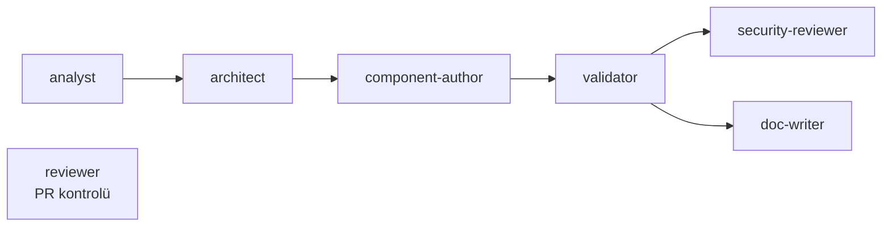

# AI Destekli Geliştirme

**vNext AI Toolkit**, vNext workflow-domain bileşenlerini (`schema`, `workflow`, `task`, `view`, `function`, `extension`) AI yardımıyla üretmek için geliştirilmiş resmi bir **Claude Code plugin**'idir. Bir isteği analiz eder, tasarlar, JSON'unu yazar, doğrular, güvenlik incelemesinden geçirir ve dökümante eder — hepsi proje içinde, rehberli bir akışla.

> Plugin kaynağı: [`burgan-tech/vnext-ai-toolkit`](https://github.com/burgan-tech/vnext-ai-toolkit)

## Amaç

vNext platformunda bir domain, her biri bir JSON Schema'ya göre doğrulanan JSON bileşen dosyalarından oluşur. Bunları elle yazmak; çapraz referansları takip etmeyi, enum değerlerini doğru vermeyi, `.csx` mapping dosyalarını doğru C# arayüzlerine göre yazmayı ve her değişikliği `npm run validate`'ten geçirmeyi gerektirir. Toolkit, bu işi domain projeniz içinde **rehberli, agent-güdümlü** bir akışa dönüştürür.

:::tip[Schema-first yaklaşım]
Toolkit'in en temel kuralı: **hardcoded enum yok, varsayılan zorunlu alan yok, tahmini JSON yapısı yok.** Her bileşen, projenizin `package.json`'ında sabitlenmiş (`pinned`) [`@burgan-tech/vnext-schema`](https://github.com/burgan-tech/vnext-schema) içindeki JSON Schema'lara göre yazılır — varsayıma göre değil.
:::

Plugin şunları getirir:

- **Sekiz uzman agent** — bir build pipeline'ı oluşturan yedi agent (`analyst → architect → component-author → validator → security-reviewer + doc-writer`, ayrıca PR kontrolü için `reviewer`) ve uçtan uca tasarım orkestratörü `vnext-architect`.
- **Dokuz skill** — bir şemsiye referans skill'i (`authoring-vnext-components`) ve sekiz odaklı yazım skill'i.
- **Beş slash command** — giriş noktaları olarak `vnext-init`, `new-component`, `vnext-design-process`, `validate`, `build`.

## Neden?

| Elle yazım | vNext AI Toolkit ile |
|------------|----------------------|
| Bileşen path'leri tahmin edilir, yanlış klasöre yazılır | Path'ler `vnext.config.json`'dan çözülür (domain-agnostic) |
| Enum/zorunlu alanlar uydurulur, validation'dan geçmez | Bileşenler pinned schema'ya göre, **ilk seferde** `npm run validate`'ten geçecek şekilde yazılır |
| `.csx` mapping'lerde double-wrap / yanlış kontrat hataları tekrarlar | `authoring-vnext-components` skill'i doğru `.csx` kontratını dayatır |
| Güvenlik ve dokümantasyon manuel/atlanır | Pipeline'da `security-reviewer` + `doc-writer` otomatik çalışır |
| Güncel olmayan eğitim verisinden çalışılır | Pinned schema → Context7 → vnext-docs sırasıyla güncel kaynak sorgulanır |

## Önkoşullar

Plugin, bir **vNext domain projesinin içinde** çalışır:

- **Claude Code** kurulu olmalı.
- Kökte **`vnext.config.json`** bulunan, [`@burgan-tech/vnext-template`](https://github.com/burgan-tech)'ten oluşturulmuş bir domain projesi.
- `node_modules` içinde sabitlenmiş **`@burgan-tech/vnext-schema`**.

Henüz bir projeniz yoksa, `/vnext-ai-toolkit:vnext-init` komutu temel projeyi (template üzerinden) ve toolkit dosyalarını sizin için kurar. Sıfırdan proje oluşturmak için ayrıca bkz. [Template CLI](./template-cli).

## Kurulum

Marketplace üzerinden kurun:

```bash
claude plugin marketplace add burgan-tech/vnext-ai-toolkit
claude plugin install vnext-ai-toolkit@burgan-tech
```

Daha sonra güncellemek için:

```bash
claude plugin marketplace update burgan-tech
```

Geliştirme amaçlı doğrudan klonlamak isterseniz:

```bash
git clone https://github.com/burgan-tech/vnext-ai-toolkit.git ~/.claude/plugins/vnext-ai-toolkit
```

## Hızlı Başlangıç

```bash
# 1. Workspace'i kur veya tazele. vnext.config.json yoksa temel projeyi
#    @burgan-tech/vnext-template ile iskeleler, ardından toolkit dosyalarını
#    (docker-compose + MockLab, CLAUDE.md, entegrasyon testleri ...) ekler.
#    Üzerine yazmadan önce diff gösterir.
claude /vnext-ai-toolkit:vnext-init

# 2a. Tek bir bileşeni agent pipeline'ı üzerinden uçtan uca iskeleler
#     (analyst → architect → component-author → validator, sonra security-reviewer + doc-writer)
claude /vnext-ai-toolkit:new-component workflow account-opening "Yeni vadesiz hesap aç"

# 2b. ...veya tüm bir workflow'u architect orkestratörü ile uçtan uca tasarla
claude /vnext-ai-toolkit:vnext-design-process "Hesap açılışı"

# 3. Her şeyi doğrula (ve hataları düzeltmeyi öner)
claude /vnext-ai-toolkit:validate

# 4. Domain paketini build et
claude /vnext-ai-toolkit:build
```

## Komut Setleri

Plugin beş slash command sunar; hepsi `/vnext-ai-toolkit:` namespace'i altındadır.

| Komut | Ne yapar |
|-------|----------|
| `/vnext-ai-toolkit:vnext-init` | Workspace'i kurar veya tazeler. `vnext.config.json` yoksa temel projeyi `@burgan-tech/vnext-template` (npx) ile iskeler, sonra toolkit dosyalarını (docker-compose + MockLab, `CLAUDE.md`/`AGENTS.md`, `.claude/references`, entegrasyon testleri) ekler — üzerine yazmadan önce **diff** gösterir. `runtimeVersion`/`schemaVersion` yükseltmeyi önerir. |
| `/vnext-ai-toolkit:new-component <type> <key> [desc]` | Bir bileşeni agent pipeline'ı üzerinden uçtan uca iskeler. `<type>` ∈ `schema \| workflow \| task \| view \| function \| extension`. |
| `/vnext-ai-toolkit:vnext-design-process [name]` | `vnext-architect` orkestratörü ile çok-turlu, uçtan uca workflow tasarımı (discovery → state'ler → bileşenler → testler). |
| `/vnext-ai-toolkit:validate` | `npm run validate` çalıştırır, hataları dosya bazında ihlal edilen schema kuralıyla özetler ve düzeltmeyi önerir. |
| `/vnext-ai-toolkit:build [runtime\|reference] [flags]` | Domain paketini `npm run build` / `build:reference` ile derler. |

## Agent Pipeline

`/vnext-ai-toolkit:new-component` agent'ları sırayla orkestre eder; istenirse her biri doğrudan da çağrılabilir.



`validator` geçtikten sonra `security-reviewer` ve `doc-writer` **paralel** çalışır — çakışmazlar (doc-writer `docs/` altına yazar, security-reviewer yalnızca okur).

| Agent | Rolü | JSON yazar mı? |
|-------|------|:---:|
| `analyst` | Docs-first. `docs/<Type>/<key>.md`'yi kontrol eder, kapsamı netleştirir, kabul kriterleri ve sıralı görev listesi üretir. | Hayır |
| `architect` | Analizi teknik tasarıma çevirir — klasör yerleşimi, state/transition modeli, task/function bağlantıları, referanslar, export'lar. | Hayır |
| `component-author` | Tasarımı schema-valid bileşen JSON'u ve `.csx` mapping'leri olarak uygular. | **Evet** |
| `validator` | Bağımsız QA — `npm run validate` ve `npm test` çalıştırır, build'i kontrol eder. | Hayır |
| `security-reviewer` | Sızan secret, güvenilmeyen referans host'u, aşırı geniş export, güvensiz task/function/extension config avlar. | Hayır |
| `doc-writer` | `docs/<Type>/<key>.md` (bileşen başına bir dosya) ve `CHANGELOG.md` girdisini yazar/günceller. | Yalnız docs |
| `reviewer` | PR-kontrol rolü — schema uyumu, isim/versiyon kuralları, referans bütünlüğü, config/export doğruluğu. | Hayır |

Bileşen-bazlı pipeline'ın ötesinde, **`vnext-architect`** *tüm bir workflow*'u uçtan uca tasarlamak için çok-turlu bir orkestratördür (`/vnext-ai-toolkit:vnext-design-process` ile çağrılır). Discovery → state machine → bileşenler → testler yolunu yürür ve aşağıdaki skill'lere delege eder.

## Skill'ler

- **`authoring-vnext-components`** — çekirdek referans: ortak bileşen envelope'u, tipe özgü `attributes`, `.csx` `scriptCode` yapısı, transition trigger tipleri ve validate-fix döngüsü. Agent'lar ve komutlar alan kuralları için buna dayanır.
- **`workflow-scaffold`** — state/transition grafiğini planlar; workflow JSON + `.csx` mapping'leri + `.http` test dosyasını iskeler.
- **`view-design`** — renderer seçimi (pseudo-ui önerilir), vocabulary yükleme, view ağacı üretimi.
- **`schema-design`** — lokalizasyon (`x-labels`) ve rol bazlı erişimle interaktif alan toplama; JSON Schema draft 2020-12 üretir.
- **`component-task`** — schema enum'ından sürülen task `type` + tipe özgü `config`, `.csx` mapping, MockLab seed önerisi.
- **`component-function`** — scope `D`/`I`, tek vs çok task kompozisyonu, `IMapping`/`IOutputHandler` `.csx`.
- **`component-extension`** — performans uyarılarıyla type × scope matrisi.
- **`integration-test`** — `VNext.Testing.Sdk`'ya karşı xUnit sınıfı (projeyi resmi `VNext.Testing.Template` ile iskeler); workflow yaşam döngüsünü doğrular.
- **`validate-and-fix`** — `npm run validate` çalıştırır, hataları kategorize eder, uygulamadan önce schema-referanslı düzeltmeler önerir.

## Tasarım Felsefesi

### Schema-first

Tek en önemli kural: **hardcoded enum yok, varsayılan zorunlu alan yok, tahmini JSON yapısı yok.** Agent'lar ve skill'ler, bir bileşeni yazmadan/düzenlemeden önce projenizde sabitlenmiş yetkili schema'yı okur:

```
node_modules/@burgan-tech/vnext-schema/schemas/<component>-definition.schema.json
```

Schema veya platform davranışı yerel schema ve mevcut bileşenlerden net değilse, bilgi erişim sırası şudur: **pinned local schema → Context7 MCP** (`/burgan-tech/vnext-docs`, `/burgan-tech/vnext-example`) **→ vnext-docs sitesinin `WebFetch`'i**. Pinned schema ile çelişen bir docs iddiası kazanmaz — **schema kazanır**.

### Domain-agnostic

Plugin bir domain adı varsaymaz. `domain` ve `paths.*` değerlerini `vnext.config.json`'dan okur ve her bileşen klasörünü oradan çözer. `payments`, `lending`, `core` veya başka bir domain'de aynı şekilde çalışır.

### Schema-driven, schema-validated

Bileşenler `npm run validate`'i ilk seferde geçecek şekilde yazılır — çünkü yazan (author) ve doğrulayan (validator) tek bir doğruluk kaynağını, sabitlenmiş `@burgan-tech/vnext-schema`'yı paylaşır.

## `new-component` sonrası ne elde edersiniz?

`/vnext-ai-toolkit:new-component workflow <key>` sonrası tipik bir workflow için (path'ler `vnext.config.json`'dan çözülür):

- `Workflows/<key>.json` — state machine (zorunlu master payload schema referansıyla)
- `Workflows/.../src/*.csx` — C# mapping'ler (`IMapping`), auto-transition kuralları (`IConditionMapping`), timer'lar (`ITimerMapping`)
- `Workflows/<key>.http` — REST Client probe dosyası
- `Views/<key>-view.json`, `Schemas/<key>.json`, `Tasks/<key>.json`, `Functions/<key>.json`, `Extensions/<key>.json` — tasarımın gerektirdiği destekleyici bileşenler
- `docs/Workflows/<key>.md` — bileşen dokümantasyonu
- bir `CHANGELOG.md` girdisi

Hepsi `npm run validate`'ten geçer.

## Uyumluluk

| AI ajanı | Durum |
|----------|-------|
| Claude Code | Birincil hedef |
| Codex (`AGENTS.md` ile) | Destekleniyor — her `CLAUDE.md`, `AGENTS.md`'ye yansıtılır |
| Cursor (`.cursor/rules/*.mdc`) | Planlanıyor |

Plugin, projenizin `package.json`'ında sabitlediğiniz `@burgan-tech/vnext-schema` versiyonunu takip eder — vNext yeni bir state tipi veya task tipi eklediğinde, plugin bunu bir sonraki okumada görür; burada değişiklik gerekmez.

:::tip[Context7 ile güncel bilgi]
Bu docs portalı da Context7'ye kayıtlıdır ([`context7.com/burgan-tech/vnext-docs`](https://context7.com/burgan-tech/vnext-docs)). Böylece AI asistanları bu sayfaları da güncel runtime bilgi kaynağı olarak sorgulayabilir.
:::

:::info[Runtime keşfi için MCP]
Doküman keşfi Context7 ile yapılırken, **canlı runtime ve bileşen keşfi** için ayrı bir [vnext-runtime MCP Server](./mcp-runtime) bulunur — bir domain'in bileşenlerini, instance verisini ve `vnext-meta`'sını MCP ajanlarına açar.
:::

## İlgili

- [`burgan-tech/vnext-ai-toolkit`](https://github.com/burgan-tech/vnext-ai-toolkit) — plugin'in kaynağı
- [`burgan-tech/vnext-example`](https://github.com/burgan-tech/vnext-example) — her bileşen tipinin çalışan örneklerini içeren referans domain
- [`burgan-tech/vnext-schema`](https://github.com/burgan-tech/vnext-schema) — kanonik JSON Schema'lar + vocabulary'ler (plugin'in kontrat kaynağı)
- [`burgan-tech/mocklab`](https://github.com/burgan-tech/mocklab) — HTTP task geliştirmede kullanılan mock API
- [`burgan-tech/vnext-integration-test`](https://github.com/burgan-tech/vnext-integration-test) — entegrasyon test SDK'sı + proje şablonu
- [Template CLI](./template-cli) — domain projesi oluşturma · [Workflow CLI](./workflow-cli) — `npm run validate` ve deploy
- [Workflow bileşeni](../components/workflow) — state machine kontratı
