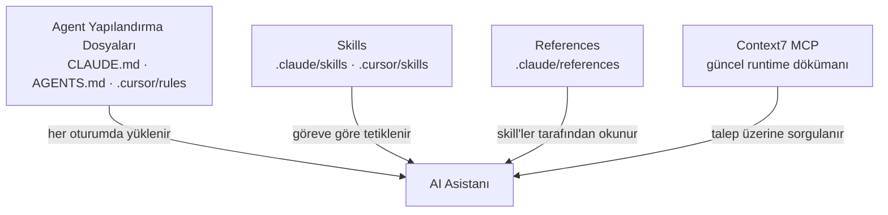

# AI Destekli Geliştirme

vNext bileşenleri — workflow, task, schema, view, function, extension — JSON ve `.csx` dosyaları olarak yazılır. Bu yapı, AI kodlama asistanları (Claude Code, Cursor, Codex vb.) için son derece uygundur: kontratlar nettir, kurallar deterministiktir ve `npm run validate` ile her değişiklik doğrulanabilir.

Ancak AI asistanı **bağlam olmadan** vNext'in kurallarını bilemez: bileşen path'lerinin `vnext.config.json`'dan çözülmesi gerektiğini, auto-transition'ların çiftler hâlinde gelmesi gerektiğini veya view renderer kararının kullanıcıya sorulması gerektiğini tahmin edemez. İşte bu bağlamı asistana taşıyan üç yapı vardır: **agent yapılandırma dosyaları**, **skill'ler** ve **reference'lar**.

Bu sayfa, [`burgan-tech/vnext-example`](https://github.com/burgan-tech/vnext-example) referans projesindeki AI yapılandırmasını örnek alarak, kendi domain reponuzda aynı kurulumu nasıl yapacağınızı anlatır. Amaç dosyaları birebir kopyalamak değil — hangi yapıların var olduğunu, geliştiriciye nasıl fayda sağladığını ve kendi reponuza nasıl uyarlayacağınızı göstermektir.

## Neden önemli?

| AI bağlamı olmadan | AI bağlamı ile |
|--------------------|----------------|
| Asistan path'leri tahmin eder, yanlış klasöre dosya yazar | Path'ler `vnext.config.json`'dan çözülür |
| Schema'lar validation'dan geçmez, alanlar uydurulur | Skill önce kullanıcıdan alan/validation/rol bilgisini toplar |
| Tek başına auto-transition gibi geçersiz yapılar üretilir | Critical Rules ihlal edilmeden üretilir |
| `.csx` mapping'lerde double-wrap / raw response hataları tekrarlar | Reference, doğru kontratı baştan dayatır |
| Güncel olmayan eğitim verisinden çalışır | Context7 MCP ile güncel runtime dökümanı sorgulanır |

## Üç temel yapı

- **Agent yapılandırma dosyaları** her oturumda otomatik yüklenir — projenin "anayasası"dır.
- **Skill'ler** belirli bir göreve girişildiğinde devreye girer — "bunu şu adımlarla yap" rehberidir.
- **Reference'lar** skill'ler tarafından gerektiğinde okunan derin kalıp dökümanlarıdır.

---

## 1. Agent yapılandırma dosyaları

Bunlar projenin kök dizinindeki, AI asistanının **her oturumda** okuduğu dosyalardır. Bileşen yapısını, dizin kurallarını, kritik kuralları ve bilgi erişim stratejisini içerirler.

| Dosya | Kimin için | Rolü |
|-------|------------|------|
| [`CLAUDE.md`](https://github.com/burgan-tech/vnext-example/blob/master/CLAUDE.md) | Claude Code | Bileşen envelope'u, path çözümü, flow zihinsel modeli, kritik kurallar, skill kataloğu |
| [`AGENTS.md`](https://github.com/burgan-tech/vnext-example/blob/master/AGENTS.md) | Codex / diğer ajanlar | `CLAUDE.md` ile **senkron** ikiz — aynı kuralları farklı ajan için tutar |
| [`.cursor/rules/cursorrules.mdc`](https://github.com/burgan-tech/vnext-example/blob/master/.cursor/rules/cursorrules.mdc) | Cursor | `alwaysApply: true` MDC kuralı — bileşen yapısı ve flow tipleri her promptta enjekte edilir |

vnext-example'daki `CLAUDE.md` şu bölümleri kapsar (kendi reponuz için iyi bir iskelet):

- **Commands** — `npm run validate`, build, local dev sunucuları
- **Component path resolution** — bileşenlere dokunmadan önce `vnext.config.json`'ın nasıl okunacağı
- **Standard component JSON envelope** — `key`, `version`, `domain`, `flow`, `attributes` kabuğu
- **Component creation map** — hangi bileşen tipi hangi klasöre, hangi şablonla
- **Flow execution mental model** — state / transition / task çalışma sırası
- **Knowledge access strategy** — önce Context7, sonra repo örnekleri
- **Critical Rules** — ihlal edilmemesi gereken deterministik kurallar (aşağıda)
- **Skills** — hangi görevde hangi skill'in çağrılacağı

:::tip Senkron tutun
`CLAUDE.md` ve `AGENTS.md` aynı kuralları farklı ajanlar için anlatır. Birini değiştirdiğinizde diğerini de güncelleyin — yoksa Claude ve Codex farklı kurallarla çalışır.
:::

### Kritik kurallar örneği

`CLAUDE.md`'nin en değerli bölümü, asistanın asla ihlal etmemesi gereken deterministik kurallardır. vnext-example'dan birkaç örnek:

- Her workflow'un **tam olarak bir** initial state'i olmalı (`startTransition.target`).
- Auto transition'lar (`triggerType: 1`) birbirini dışlayan koşullarla **çiftler hâlinde** gelmeli; tek başına auto transition yalnızca koşulu her zaman `true` dönerse geçerlidir.
- Tüm bileşen referansları `{domain}/{component-type}/{key}/{version}` formatında.
- Her değişiklikten sonra `npm run validate` çalıştır.
- Bileşen klasör path'lerini **asla** sabit kodlama — daima `vnext.config.json`'dan çöz.
- View oluşturmadan önce **daima** kullanıcıya `renderer` sor.

Bu kurallar, AI'ın "makul görünen ama geçersiz" çıktılar üretmesini engeller.

---

## 2. Skills (Skill'ler)

Skill'ler, belirli bir görev için adım adım çalışma talimatlarıdır. Kullanıcı "bir workflow oluştur" dediğinde asistan serbest doğaçlama yapmak yerine ilgili skill'i çağırır ve onun adımlarını izler.

vnext-example'daki [`.claude/skills/`](https://github.com/burgan-tech/vnext-example/tree/master/.claude/skills) altında dört skill bulunur:

| Skill | Ne zaman tetiklenir | Geliştiriciye faydası |
|-------|---------------------|------------------------|
| [`workflow-scaffold`](https://github.com/burgan-tech/vnext-example/blob/master/.claude/skills/workflow-scaffold/SKILL.md) | Yeni bir workflow uçtan uca oluşturulurken | State/transition grafiğini planlar; workflow JSON + `.csx` mapping + `.http` test dosyasını birlikte iskeleler; gerektiğinde `view-design` ve `schema-design`'a zincirler |
| [`schema-design`](https://github.com/burgan-tech/vnext-example/blob/master/.claude/skills/schema-design/SKILL.md) | Schema bileşeni oluşturulurken/düzenlenirken | Önce kullanıcıdan alan, tip, validation, lokalizasyon (`x-labels`) ve rol bazlı erişimi (`roles[]`) toplar; ardından doğru path'e JSON Schema draft 2020-12 üretir |
| [`view-design`](https://github.com/burgan-tech/vnext-example/blob/master/.claude/skills/view-design/SKILL.md) | View bileşeni oluşturulurken/düzenlenirken | İlk ve en kritik kararı — `renderer` — sorar; pseudo-ui ise JSON üretmeden önce vocabulary yükler |
| [`validate-and-fix`](https://github.com/burgan-tech/vnext-example/blob/master/.claude/skills/validate-and-fix/SKILL.md) | Doğrulama istenince / commit öncesi | `npm run validate` çalıştırır, hataları kategorize eder, ilgili dökümanı sorgular ve onay alarak hedefli düzeltmeler önerir — validation'ı asla bypass etmeden |

**Skill'lerin ortak deseni:** Hepsi önce `vnext.config.json`'dan path'leri çözer, sonra eksik bilgiyi kullanıcıdan toplar, ancak ondan sonra JSON üretir. Bu "önce sor, sonra üret" yaklaşımı, validation'dan geçmeyen tahmin tabanlı çıktıları önler.

:::info Skill anatomisi
Her skill bir `SKILL.md` dosyasıdır: `name` ve `description` içeren frontmatter + adım adım talimatlar. `description` alanı asistanın skill'i ne zaman çağıracağına karar vermesini sağlar — bu yüzden net ve tetikleyici olmalıdır.
:::

---

## 3. References (Reference'lar)

Reference'lar, skill'lerin gerektiğinde okuduğu derin kalıp dökümanlarıdır. Tekrar eden hataları önlemeye odaklanırlar. vnext-example'daki [`.claude/references/`](https://github.com/burgan-tech/vnext-example/tree/master/.claude/references) altında üç tane vardır:

| Reference | Kapsam | Önlediği hata |
|-----------|--------|----------------|
| [`function-mapping-pattern.md`](https://github.com/burgan-tech/vnext-example/blob/master/.claude/references/function-mapping-pattern.md) | `sys-functions` için `.csx` mapping yazımı | "Function double-wrapped / raw `StandardTaskResponse` döndürüyor" hatası; GET vs POST için doğru input kaynağının seçimi |
| [`view-author-guide.md`](https://github.com/burgan-tech/vnext-example/blob/master/.claude/references/view-author-guide.md) | Pseudo-ui view + schema yapısı | Yanlış action vocabulary, hatalı expression namespace, yanlış view/schema eşleşmesi |
| [`mocklab-seed-format.md`](https://github.com/burgan-tech/vnext-example/blob/master/.claude/references/mocklab-seed-format.md) | MockLab mock endpoint seed JSON formatı | Hatalı seed layout, kural semantiği, Scriban helper ve dapr invocation hataları |

Skill'lerle farkı: skill bir **görev akışıdır** ("şu adımları izle"), reference bir **kalıp kataloğudur** ("bu desende şöyle yazılır"). Skill içinden reference'a yönlendirme yapılır.

---

## 4. Cursor entegrasyonu

Cursor kullanıcıları için vnext-example iki yapı sunar:

- [`.cursor/rules/cursorrules.mdc`](https://github.com/burgan-tech/vnext-example/blob/master/.cursor/rules/cursorrules.mdc) — `alwaysApply: true` ile her promptta enjekte edilen kural seti (bileşen yapısı, flow tipleri, bilgi kaynakları).
- [`.cursor/skills/vnext-features/SKILL.md`](https://github.com/burgan-tech/vnext-example/blob/master/.cursor/skills/vnext-features/SKILL.md) — **repo-geneli** domain referansı. Tek bir workspace'e bağlı değildir; monorepo'nun veya hedef domain repolarının her yerinde vNext bileşeni (JSON veya `.csx`) oluşturulurken/düzenlenirken tetiklenir. Workflow, state, transition, task, schema, view, function, extension kavramlarını, JSON yapılarını ve C# mapping/rule kalıplarını kompakt biçimde özetler.

---

## 5. Context7 — güncel runtime bilgisi

AI asistanlarının eğitim verisi her zaman güncel runtime davranışını yansıtmaz. Bu boşluğu **Context7 MCP** kapatır: asistan, vNext runtime dökümanını talep üzerine sorgular.

vnext-example'ın bilgi erişim stratejisi şu sırayı izler:

1. **Önce Context7** — bileşen yapısı, şema örnekleri, runtime kavramları için güncel resmi dökümanı sorgula.
2. **Sonra repo örnekleri** — `core/` altındaki çalışan JSON ve `.csx` dosyalarını kanonik örnek olarak kullan.
3. **Son olarak** — yerel kurallar (`CLAUDE.md` / reference'lar).

Bu docs portalı da Context7'ye kayıtlıdır ([`context7.com/burgan-tech/vnext-docs`](https://context7.com/burgan-tech/vnext-docs)), yani AI asistanları bu sayfaları da güncel bilgi kaynağı olarak kullanabilir.

---

## Kendi domain reponuza uyarlama

vnext-example'ı kalıp alarak kendi domain reponuzda aynı kurulumu adım adım kurabilirsiniz:

1. **`vnext.config.json`** zaten reponuzun kökünde olmalı — tüm path çözümü buna dayanır.
2. **`CLAUDE.md` oluşturun** — vnext-example'ı şablon alın; bölümleri kendi domain'inize göre uyarlayın (komutlar, path'ler, kritik kurallar, skill kataloğu). Birebir kopyalamayın — kendi domain'inizin bileşen haritasını ve kurallarını yazın.
3. **`AGENTS.md`'yi senkronlayın** — Codex de kullanıyorsanız `CLAUDE.md` ile aynı içeriği tutun.
4. **Cursor kullanıyorsanız** `.cursor/rules/*.mdc` ekleyin.
5. **Skill'leri uyarlayın** — `.claude/skills/` altına ihtiyacınız olan görev akışlarını koyun. vnext-example'ın dört skill'i çoğu domain için iyi bir başlangıçtır.
6. **Tekrar eden hatalarınızı reference'a dönüştürün** — ekibinizin sürekli yaptığı bir hatayı fark ettiğinizde `.claude/references/` altına bir kalıp dökümanı yazın.
7. **Context7 MCP'yi bağlayın** — asistanın güncel runtime dökümanına erişmesi için.

:::tip Altın kural
AI yapılandırması "yaz ve unut" değildir. Asistanın tekrar tekrar yaptığı bir hatayı gördüğünüzde, onu düzeltmek yerine **kuralı yapılandırma dosyasına ekleyin**. Böylece bağlam zamanla zenginleşir ve asistan giderek daha isabetli çalışır.
:::

---

## İlgili

- [Developer Tools](./index.md) — Forge Studio, Workflow CLI, Template CLI
- [vNext Forge Studio](./forge-studio) — görsel tasarımcı; CSX mapping editörü ve Quick Run
- [Workflow CLI](./workflow-cli) — `npm run validate` ve deploy
- [Workflow bileşeni](../components/workflow) — state machine kontratı
- [`burgan-tech/vnext-example`](https://github.com/burgan-tech/vnext-example) — tüm AI yapılandırmasının kanonik kaynağı
