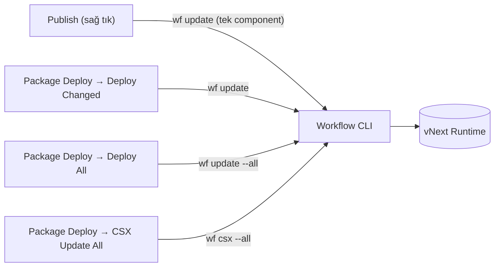

# Forge Kullanım Kılavuzu

Bu kılavuz, **vNext Forge** VS Code extension'ının günlük kullanımını anlatır: Forge Tools panelleri, Explorer context menüleri, her component tipinin görsel tasarımcısı ve publish işleminin [Workflow CLI](/docs/tools/workflow-cli) ile ilişkisi.

Kurulum ve ilk proje oluşturma için [Geliştirme Ortamı Kurulumu (Forge)](/docs/getting-started/forge-setup) rehberine bakın.

## Forge Tools Panelleri

Activity Bar'daki **vNext Forge Tools** ikonuna tıkladığınızda beş panel görürsünüz (proje açık değilse yalnızca Settings ve Create Project görünür):

### Settings

Workspace ve global Forge ayarlarını yönetir. Her ayar satırındaki kalem ikonuyla (**Change Setting**) değeri değiştirebilirsiniz. Panel başlığındaki aksiyonlar:

| Aksiyon | Açıklama |
|---------|----------|
| **Share Config With Workspace** | Kişisel ayarlarınızı workspace config'ine yazar; ekip üyeleri aynı ayarlarla çalışır |
| **Export Forge Tools Config** | Ayarları dosya olarak dışa aktarır |
| **Import Forge Tools Config** | Dışa aktarılmış bir config'i içe alır |

### Project

Aktif domain projesinin build ve doğrulama aksiyonlarını içerir:

| Aksiyon | Açıklama |
|---------|----------|
| **Validate Project** | `npm run validate` — tüm component'leri şemaya karşı doğrular |
| **Build Runtime** | Runtime paketi üretir (deploy edilebilir çıktı) |
| **Build Reference** | Reference paketi üretir (diğer domain'lerin referans alacağı çıktı) |
| **Generate Documents** | Component'lerden otomatik dokümantasyon üretir |

### Environments

Lokal ve remote ortamların eklendiği, başlatılıp durdurulduğu paneldir. Detaylı anlatım [Geliştirme Ortamı Kurulumu](/docs/getting-started/forge-setup#5-environment-ekleyin) rehberindedir. Özet:

- **Local (Docker)** — Forge, `vnext-runtime`'ı kurar ve yönetir: Start/Stop/Restart, Health Check, Logs, Reveal Ports, Update Runtime, Register with Workflow CLI, Reset Components.
- **Remote / existing** — çalışan bir runtime'a base URL ile bağlanır.
- **Infrastructure** satırı — paylaşılan altyapıyı (PostgreSQL, Redis, Vault, Dapr) yönetir: Start/Stop/Restart Infrastructure, Show Infrastructure Logs/Status, Stop All Domains, Stop All Domains and Infrastructure.

### Package Deploy

Domain'deki component değişikliklerini aktif environment'a deploy eder. Bu panel, Workflow CLI komutlarının görsel karşılığıdır — her aksiyonun altında hangi `wf` komutunu çalıştırdığı yazar:

| Aksiyon | CLI karşılığı | Açıklama |
|---------|---------------|----------|
| **Deploy All** | `wf update --all` | Tüm component'leri deploy eder |
| **Deploy Changed** | `wf update` | Yalnızca değişen component'leri deploy eder |
| **CSX Update All** | `wf csx --all` | Tüm `.csx` mapping'leri günceller |

### Quick Run

Aktif environment üzerinde workflow'ları anlık test etme aracı: yeni instance başlatma, transition tetikleme, instance detayları (View, Data, History, Correlations), global header ve filtre yönetimi.

Function'lar için ayrıca **Function Quick Run** vardır — `Functions/` altındaki bir JSON dosyasına sağ tıklayıp **Open Function Quick Run** ile açılır.

:::tip[Detaylı kılavuz]
Ana ekranın numaralandırılmış anlatımı, instance başlatma, transition tetikleme, State View render'ı, Data/History/Correlations/Raw sekmeleri ve Function Quick Runner için **[Flow Quick Runner](./quick-runner)** sayfasına bakın.
:::

## Explorer Context Menüleri

Forge, Explorer'da dosya/klasör tipine göre sağ tık menüsüne aksiyonlar ekler.

### Component klasörlerinde (sağ tık → Create)

Her component klasörü, kendi tipine uygun **Create** aksiyonunu gösterir:

| Klasör | Menü aksiyonu |
|--------|---------------|
| `Workflows/` | **Forge: Workflow Create** |
| `Tasks/` | **Forge: Task Create** |
| `Schemas/` | **Forge: Schema Create** |
| `Views/` | **Forge: View Create** |
| `Functions/` | **Forge: Function Create** |
| `Extensions/` | **Forge: Extension Create** |
| `Mappings/` | **Forge: Mapping Create** |

### Component JSON dosyalarında

Bir component `.json` dosyasına sağ tıkladığınızda:

| Aksiyon | Açıklama |
|---------|----------|
| **Forge: Open with vNext Forge** | Dosyayı görsel tasarımcıda açar |
| **Forge: Open with Text Editor** | Ham JSON olarak açar |
| **Open Quick Run** | (Workflows) İlgili workflow'u Quick Run'da açar |
| **Open Function Quick Run** | (Functions) Function'ı test panelinde açar |
| **Publish** | Component'i aktif environment'a deploy eder (aşağıya bakın) |

### `.csx` dosyalarında

`.csx` mapping dosyasına sağ tık → **Sync Current CSX to JSON**: script içeriğini bağlı component JSON'ının `code` alanına (Base64) yazar. Command Palette'ten **Enable/Disable CSX → JSON Auto-Sync** ile bu senkronizasyonu otomatiğe bağlayabilirsiniz; **Sync All CSX Files to JSON** tüm dosyaları tek seferde eşitler.

## Component Tasarımcıları

Her component tipi için Forge özel bir görsel editör sunar. Tasarımcıyı açmanın iki yolu: dosyaya çift tıklamak (Forge varsayılan editördür) veya sağ tık → **Forge: Open with vNext Forge**.

### Workflow Designer

State-machine tabanlı görsel canvas: state ekleme/düzenleme, transition bağlantıları, auto-layout, arama ve property sidebar (General, Tasks, Transitions, Error Boundary).

### Schema Designer

JSON Schema'ları görsel olarak tasarlar: alan ekleme, tip/validasyon kuralları, lokalizasyon (`x-labels`), rol bazlı erişim (`x-roles`) ve sorgu metadata'sı.

Alan ağacında iç içe object'ler, tip rozetleri ve **Add nested** ile alt alan ekleme:

### View Designer

View component'lerini düzenler: renderer seçimi (pseudo-ui önerilir), view ağacı ve schema bağlantıları. Pseudo-UI sözlüğü için [View Concept](/docs/how-to/view-consept) dokümanlarına bakın.

Metadata'nın altında üç panelli düzen açılır: solda **Outline/Components** ağacı, ortada canlı **Canvas** önizlemesi, sağda **View Settings** (Data Schema bağlama, Lookups, UI State, `$schema`):

### Task Editor

Task tipini (HTTP, Script, Dapr, Notification, …) ve tipe özel config alanlarını form tabanlı düzenler; mapping bağlantılarını yönetir.

Metadata'nın altında task tipi kart olarak seçilir ve tipe özel **Configuration** bölümü gelir — ör. HTTP task'ta Method, URL, Body, Content-Type, Headers, Timeout, Validate SSL ve Accepted Status Codes:

### Function Editor

Function scope'u (Domain/Flow/Instance), task kompozisyonu ve `IMapping`/`IOutputHandler` script bağlantılarını yönetir.

**Task Execution** bölümünde Single Task / Multiple Tasks seçimi, Raw response anahtarı, bağlı task ve `.csx` mapping önizlemesi (Helpers & Assemblies dahil) ile opsiyonel **Cache** yapılandırması bulunur:

### Extension Editor

Extension type × scope matrisini ve hedef workflow bağlantılarını düzenler.

Scope kartlarının (Global, Defined Flows, Everywhere…) altında extension tetiklendiğinde çalışacak **Task** bölümü yer alır — bağlı script-task ve `.csx` kaynağı önizlemesiyle:

### Mapping (CSX) Editor

C# script editörü: syntax highlighting, IntelliSense, Snippet Quick Bar ve C# API Reference paneli. `encoding` alanı `REF` seçildiğinde gömülü kod yerine bir [sys-mappings bileşeni](/docs/components/mapping-component) referansı kullanılır ve pickup dialog ile seçilir.

Mapping metadata'sının altında helper sınıf adı (**NAME**, `scripts.helpers` üzerinden referans verilir) ve `.csx` kaynağının önizlemesi yer alır:

## Publish ve CLI İlişkisi

Forge'daki tüm deploy aksiyonları perde arkasında **Workflow CLI**'ı (`wf`) çalıştırır — Forge, CLI'ın görsel bir kabuğudur:

Bunun pratik sonuçları:

1. **CLI kurulu olmalı** — Forge kurulu değilse tespit edip kurulumu önerir ([detay](/docs/getting-started/forge-setup#4-workflow-cli-kurulumu)).
2. **Domain CLI'a kayıtlı olmalı** — lokal environment'ta **Register with Workflow CLI** aksiyonu bu kaydı yapar. Kayıt yoksa publish başarısız olur; Forge environment satırında uyarı gösterir.
3. **Hata mesajları CLI'dan gelir** — publish sırasında görülen hataların çözümü için [`vnext-workflow-cli`](https://github.com/burgan-tech/vnext-workflow-cli) dokümanlarına bakın (DB bağlantısı, credentials, Docker gereksinimleri vb.).

:::tip[Publish akışı önerisi]
Tek component üzerinde çalışırken sağ tık → **Publish** en hızlı yoldur. Birden fazla component değiştiyse **Package Deploy → Deploy Changed** kullanın; **Deploy All**'u yalnızca ortamı sıfırdan beslerken tercih edin.
:::

## İlgili Sayfalar

- [vNext Forge Studio](/docs/tools/forge-studio) — genel bakış ve kurulum
- [Geliştirme Ortamı Kurulumu (Forge)](/docs/getting-started/forge-setup) — ilk kurulum akışı
- [Workflow CLI](/docs/tools/workflow-cli) — `wf` komut referansı
- [AI Destekli Geliştirme](/docs/tools/ai-assisted-development) — vNext AI Toolkit
