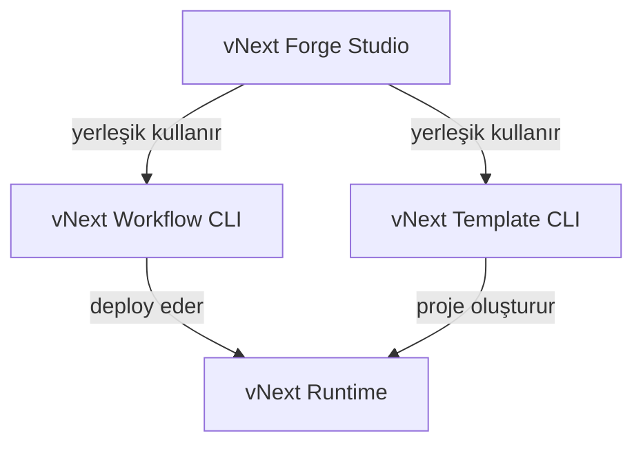

# Developer Tools

vNext platformu, geliştirme sürecini hızlandırmak için üç temel araç sunar. Bu araçlar birlikte çalışarak workflow tasarımından deploy'a kadar tüm geliştirme döngüsünü kapsar.

## Araç Ekosistemi

| Araç | Açıklama | Kurulum |
|------|----------|---------|
| [vNext Forge Studio](./forge-studio) | Görsel workflow tasarımcısı (VS Code Extension + Desktop) | VS Code Marketplace / VSIX |
| [vNext Workflow CLI](./workflow-cli) | Deploy, validation, CSX mapping işlemleri | `npm install -g @burgan-tech/vnext-workflow-cli` |
| [vNext Template CLI](./template-cli) | Hazır workflow projesi oluşturma | `npx @burgan-tech/vnext-template <domain>` |

## Araçlar Arası İlişki

**vNext Forge Studio**, diğer iki CLI aracını yerleşik olarak kullanır. Dolayısıyla Forge Studio kurulduğunda Workflow CLI ve Template CLI yetenekleri otomatik olarak dahildir. Ancak bu CLI araçları bağımsız olarak terminal üzerinden de kullanılabilir.

## Ne Zaman Hangisi?

- **Görsel tasarım** yapmak istiyorsanız → [Forge Studio](./forge-studio)
- **Terminal üzerinden hızlı deploy/sync** yapmak istiyorsanız → [Workflow CLI](./workflow-cli)
- **Sıfırdan yeni bir workflow projesi** başlatmak istiyorsanız → [Template CLI](./template-cli)
