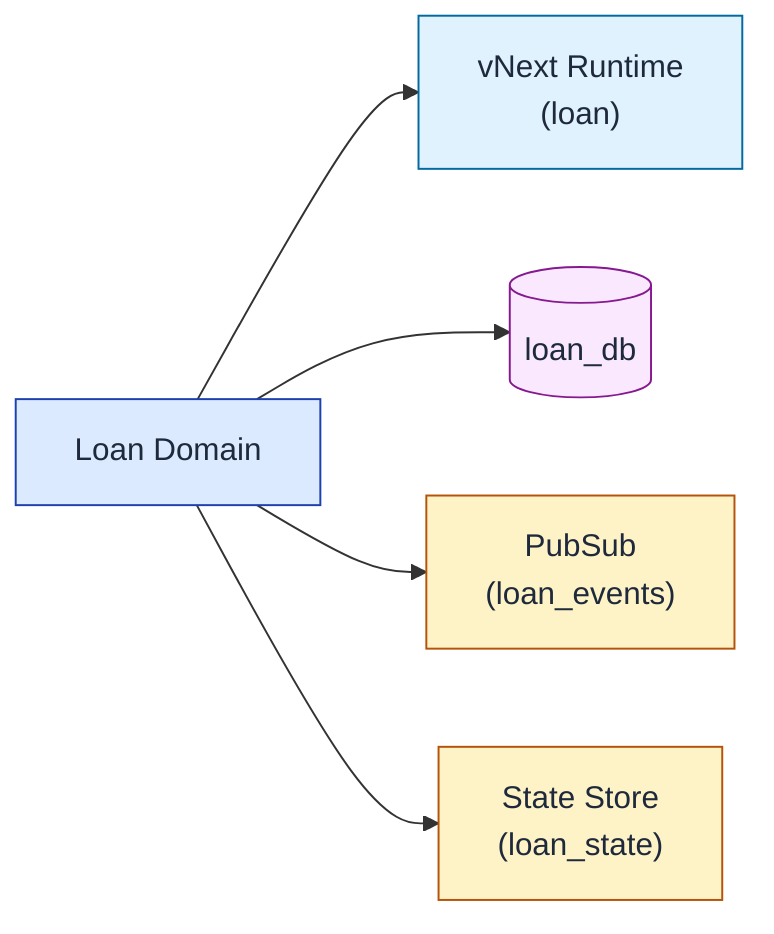
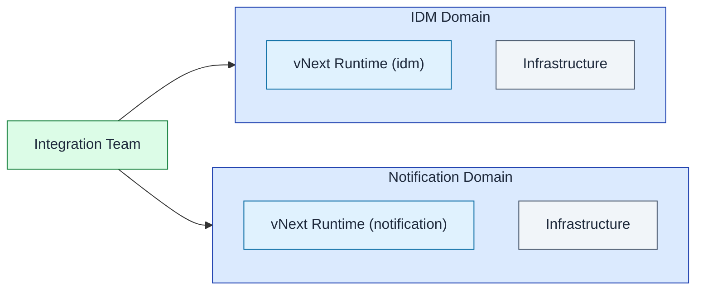
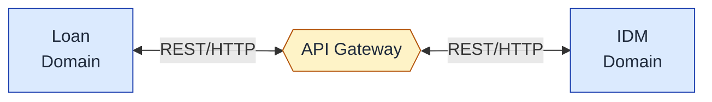
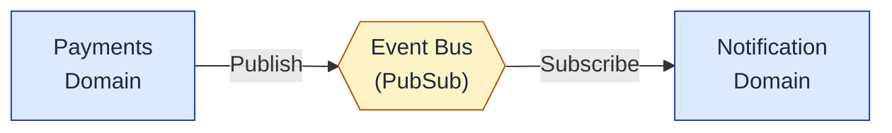
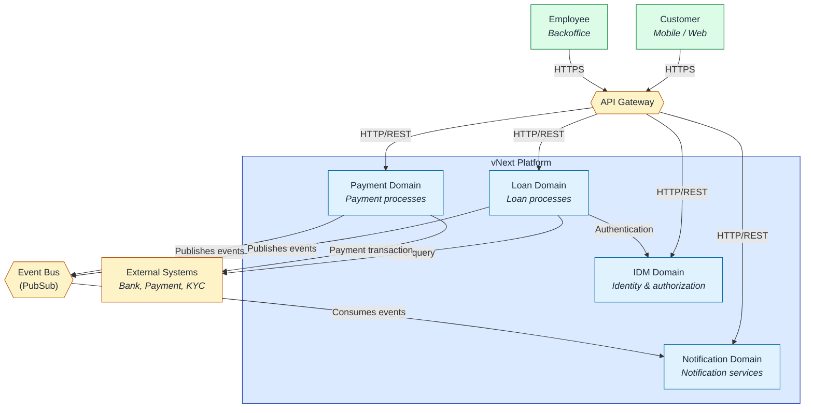
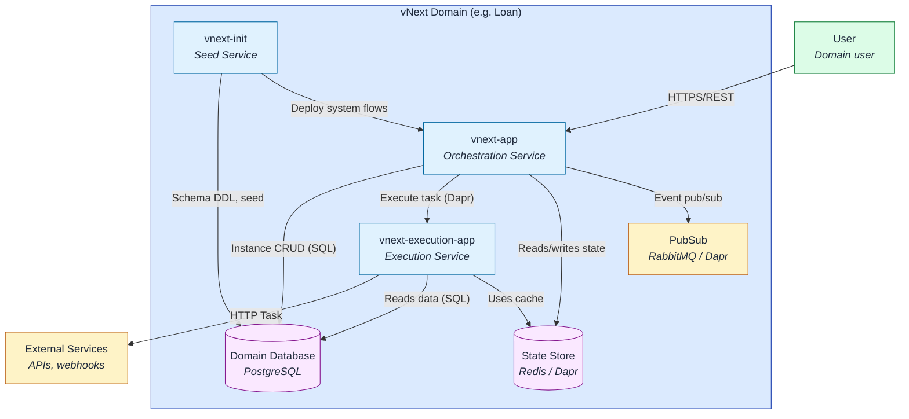

# Domain Topology and Architecture

## Platform Domain Concept

The vNext Runtime platform is based on the **Domain** concept. A domain represents an isolated runtime environment that corresponds to a business area, product group, or team responsibility.

### Domain = Runtime Principle

**Each domain has its own independent runtime.** This principle forms the foundation of the platform architecture:

- One domain = One vNext Runtime instance
- Each domain is unique and independent
- Complete isolation is provided between domains

## Domain Examples

In an organization, domains can be organized as follows:

### Product Group-Based Domain



**Example:** The lending team managing loan processes has its own domain.

### Team Responsibility-Based Domains



**Example:** The integration team manages IDM and Notification systems under their responsibility as separate domains.

## Benefits of Domain Isolation

### 1. Infrastructure Isolation
Each domain has its own infrastructure components:
- **Database**: Domain-specific database
- **PubSub**: Domain-specific messaging channels
- **State Store**: Domain-specific state management
- **Secrets**: Domain-specific security configuration

### 2. Independent Development
- Each domain team can develop at their own pace
- Inter-domain dependencies are minimal
- Version management is done per domain
- Deployment is performed independently

### 3. Scalability
- Each domain scales according to its needs
- High-load domains can receive more resources
- Low-load domains run with minimal resources
- Resource utilization is optimized

### 4. Fault Isolation
- Issues in one domain do not affect others
- Backup and restore are done per domain
- Maintenance and updates are planned independently

## Inter-Domain Communication

Although domains are isolated from each other, they can communicate according to business requirements:

### 1. Through API Gateway



- Synchronous communication
- REST API calls
- HTTP Task usage

### 2. Event-Driven Structures



- Asynchronous communication
- Event-based integration
- Loose coupling
- DaprPubSub Task usage

## C4 Context Diagram - Multi-Domain Architecture



## C4 Container Diagram - Domain Internal Structure



## Domain Management Best Practices

### Define Domain Boundaries Correctly
- **By business area**: Each domain should represent a specific business function
- **By team responsibility**: Domain ownership should be clear
- **By scale requirements**: Areas with different load characteristics should be separate domains

### Maintain Domain Isolation
- Direct database access between domains is prohibited
- All communication should be through API or Events
- Shared infrastructure should be minimized

### Monitoring and Observability
- Separate monitoring dashboards for each domain
- Domain-based metric collection
- Distributed tracing for inter-domain call tracking

### Version Management
- Domains are versioned independently
- API contracts are managed with semantic versioning
- Breaking changes are coordinated but deployment is independent

## Domain Lifecycle

### 1. Domain Creation
```bash
# Infrastructure provisioning
- Create domain database
- Configure domain state store
- Configure domain PubSub

# vNext Runtime deployment
- System setup with vnext-init
- vnext-app deployment
- vnext-execution-app deployment
```

### 2. Domain Operations
- Flow deployment and management
- Monitoring and alerting
- Scaling and optimization
- Backup and disaster recovery

### 3. Domain Retirement
- Migration planning
- Dependency analysis
- Graceful shutdown
- Data archiving

## Conclusion

Domain topology is the fundamental architectural decision that makes the vNext Runtime platform scalable, flexible, and manageable. Each domain having its own independent runtime enables teams to move quickly, systems to be resilient, and resources to be used efficiently.

## Related Documentation

- [Database Architecture](/architecture/data/database) - Database structure at domain level
- [Persistence](/architecture/data/persistence) - Data storage strategies