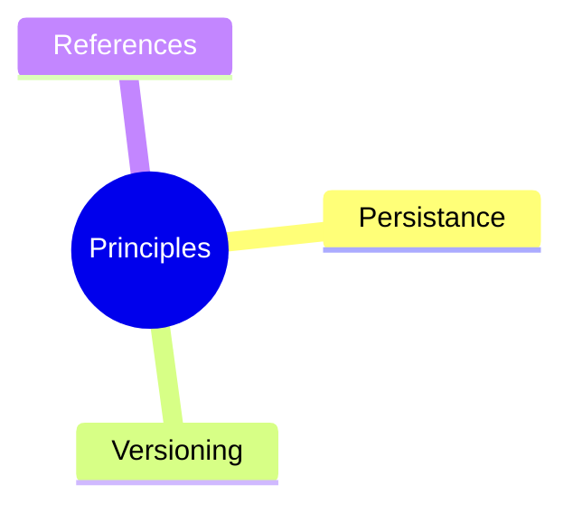
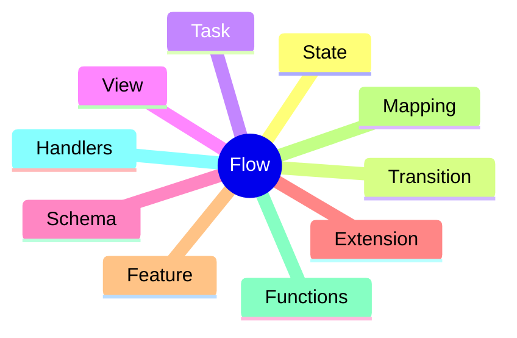
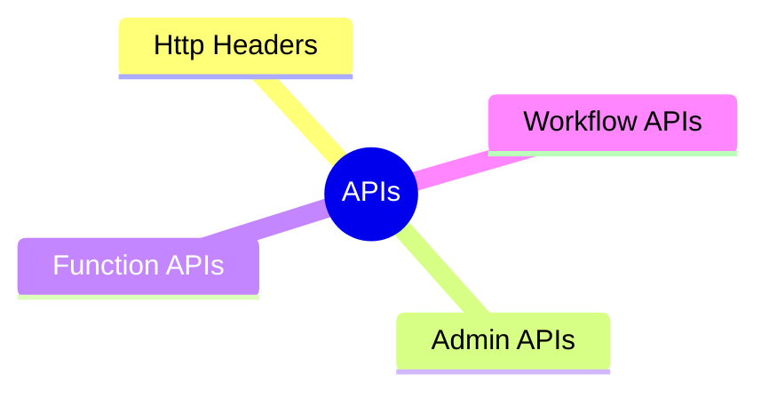
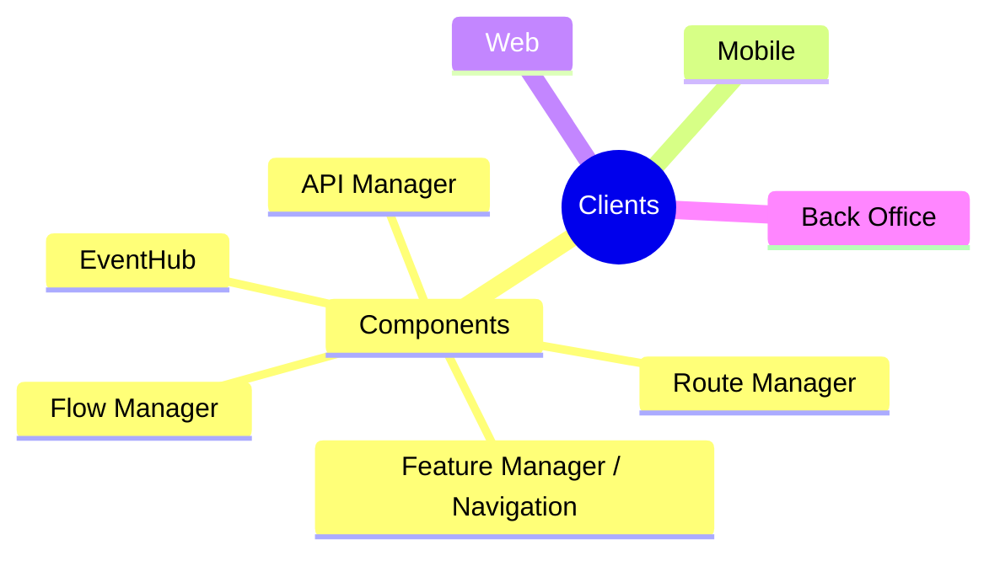
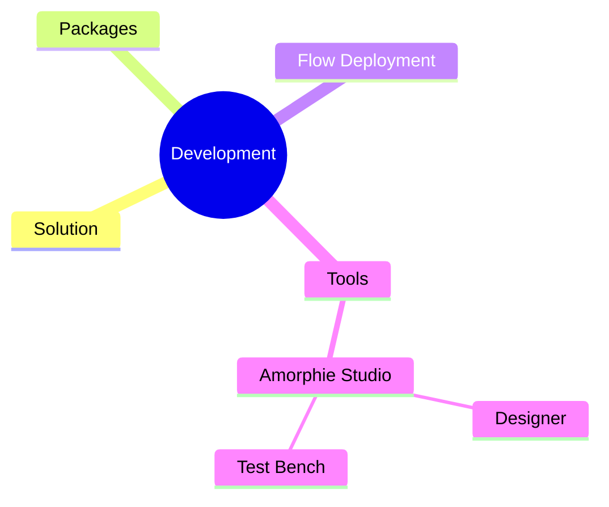
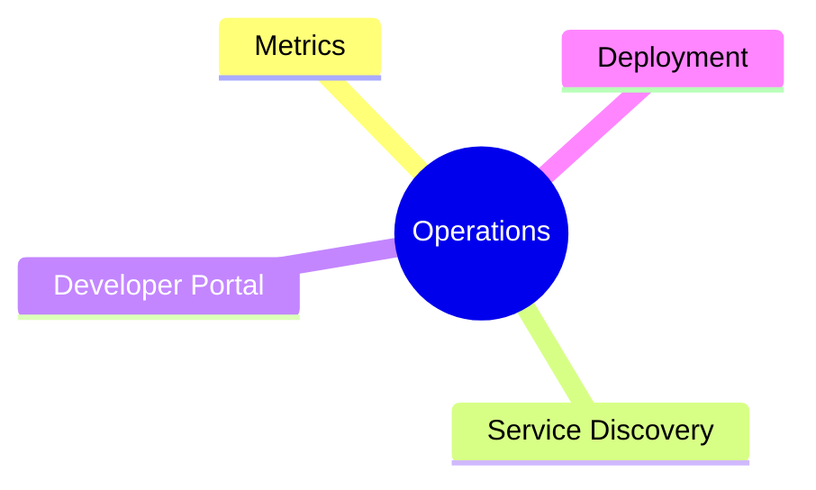

# Fundamentals

The vNext Platform is a cloud-based application development platform that supports low-code, no-code, and full-code development.

The platform has a horizontally scalable service cluster and can perform all kinds of workflows and functions with high security by providing interfaces to customers, employees, and systems through frontend applications managed by these services.

## Platform Architecture

### Architecture and Topology

For platform architecture and domain topology, you can review the following documentation:

- **[Domain Topology](/architecture/domain-model/topology)** - Domain concept, isolation, and multi-domain architecture
- **[Database Architecture](/architecture/data/database)** - Multi-schema structure, migration system, and DB isolation

### Core Principles

For core principles, it is recommended to refer to the **Principles** directory contents:

### Workflow Logic and Definition

For workflow logic and definition, it is recommended to refer to the **Flow** directory contents:

### API Definitions

vNext applications interact only through APIs. For API definitions, it is recommended to refer to the **APIs** directory contents.

*Note: For asynchronous API responses, interaction is also provided through SignalR and MQTT channels. This structure (EventBus) is an extension of APIs.*

### Ready-to-Use Applications

For ready-to-use applications that consume vNext services, it is recommended to refer to the **Clients** directory contents:

### Development Environment

For technical information and tools for developing solutions on vNext, it is recommended to refer to the **Development** directory contents:

### Operations Management

For technical information and tools for monitoring and developing deployment solutions running on vNext, it is recommended to refer to the **Operations** directory contents:

