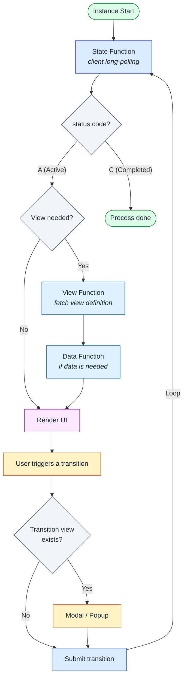

# User Integration

The vNext platform models **user interaction** as a natural part of the workflow flow. **View** definitions are made at **state** or **transition** level within a process. The **vNext Client Workflow Manager SDK** orchestrates this, delivering the **correct view** and **data** to the user during state and transition cycles.

The **Backend-Driven View** approach **minimizes** mobile/web platform release cycles — UI changes ship with backend deploys only.

## Interaction Loop

## Step by Step

1. **Start instance**: `POST /api/v1/{domain}/workflows/{wf}/instances/start` (typically `sync=false`)
2. **Long-polling**: Client calls `GET /functions/state` and waits until `status.code = "A"` (Active)
3. **State response**: Once an active state is reached, the response includes the current state and whether a view is required
4. **View request**: If a view exists, the client fetches the view definition via `GET /functions/view`
5. **Data request**: If the view needs data, the client fetches via `GET /functions/data`
6. **Render**: The view is rendered with data
7. **Pre-transition check**: Before the user submits a transition, check whether a transition-specific view exists (popup/modal confirmation)
8. **Submit**: Transition is triggered via `PATCH /instances/{id}/transitions/{key}`
9. **Long-poll again**: Re-poll the State function for status changes
10. **End of process**: Loop ends when `status.code = "C"` (Completed)

## Validation

- The client uses form validation **annotations** if **Schema** definitions exist
- Real-time validation on the front-end; re-validation on submit at the backend
- See [Schema component](/docs/components/schema)

## Related

- [Async / Sync](/docs/how-to/async-sync) — why long-polling is needed
- [View component](/docs/components/view) — view definition
- [Built-in Functions](/docs/components/functions/built-in) — State / Data / View
- [Schema component](/docs/components/schema) — form validation
