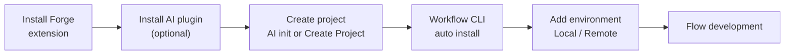

# Development Environment Setup (Forge)

The first step for a vNext developer is installing the **vNext Forge** VS Code extension. Runtime setup, domain (project) creation, Workflow CLI integration, and environment management are all driven through Forge — no need to wrestle with `docker-compose` files or CLI commands by hand.



:::info[How Forge relates to the CLI and the Runtime]
Forge doesn't work alone; behind the scenes it **manages two components in an integrated way**:

- **[vNext Workflow CLI](/docs/tools/workflow-cli)** (`wf`) — deploying components to the runtime (publish, `wf update`) and domain registration go through Forge's CLI integration.
- **[vNext Runtime](https://github.com/burgan-tech/vnext-runtime)** — when you add a local environment, Forge installs the runtime on your behalf, starts/stops it, and monitors its health.

So when you hit a CLI- or runtime-related problem, look for the fix in the corresponding repo docs: [`vnext-workflow-cli`](https://github.com/burgan-tech/vnext-workflow-cli) for CLI issues, [`vnext-runtime`](https://github.com/burgan-tech/vnext-runtime) for runtime issues. Forge surfaces most errors, but the remediation steps live in those repos' documentation.
:::

## 1. Install the vNext Forge Extension

1. Open the Extensions panel in VS Code (`Cmd+Shift+X` / `Ctrl+Shift+X`).
2. Search for **"vNext Forge"** and click **Install**.
3. After installation, the **vNext Forge Tools** icon appears in the left Activity Bar.


The extension activates automatically when it finds a `vnext.config.json` in the open workspace and shows all panels; if there is no project yet, only the **Settings** and **Create Project** panels are visible.

## 2. (Optional) Install the AI Plugin

For AI-assisted development, install the [vNext AI Toolkit](/docs/tools/ai-assisted-development) Claude Code plugin:

```bash
claude plugin marketplace add burgan-tech/vnext-ai-toolkit
```

```bash
claude plugin install vnext-ai-toolkit@burgan-tech
```

The plugin ships agents that run the analyze → design → author → validate → security-review pipeline, plus skills like `workflow-scaffold`, `schema-design`, and `view-design`.

## 3. Create a Project

You can create a project (domain) in one of two ways:

### Option A — With AI (`vnext-init`)

Open your project folder in Claude Code and run the init command:

```bash
claude /vnext-ai-toolkit:vnext-init
```

This scaffolds the base project with the official `@burgan-tech/vnext-template` CLI, then layers the toolkit files on top: docker-compose + MockLab, `CLAUDE.md`, `.http` API tests, and integration tests.

### Option B — With Forge Tools (Create Project)

1. Click the **vNext Forge Tools** icon in the Activity Bar.
2. In the **Create Project** panel, click **Create vNext Project**.
3. Enter the domain name and target folder — Forge scaffolds the project with `@burgan-tech/vnext-template` and opens the workspace.


Once the project opens, the Forge Tools panel loads fully with **Settings, Project, Environments, Package Deploy, Quick Run** sections.


## 4. Workflow CLI Installation

On first run, Forge detects whether the **Workflow CLI** (`wf`) is installed on the machine. If it isn't, Forge offers the **Install Workflow CLI** action and runs the installation itself through the integrated terminal.

:::warning[Manual installation when permissions get in the way]
On corporate machines, global npm installs may be blocked by machine permissions. In that case, install the CLI manually:

```bash
npm install -g @burgan-tech/vnext-workflow-cli
```

Verify after installation:

```bash
wf --version
```

For `EACCES`-style permission errors and alternative installation methods, see the [Workflow CLI documentation](/docs/tools/workflow-cli) and the [`vnext-workflow-cli`](https://github.com/burgan-tech/vnext-workflow-cli) repo README. Refresh the sidebar in the Forge Tools panel after installing.
:::

## 5. Add an Environment

To test components, you need to register a working environment with Forge. Click the **Add Environment** (+) button in the title of the **Forge Tools → Environments** panel.


There are two environment types:

### Local (Docker) Environment

Forge downloads [`vnext-runtime`](https://github.com/burgan-tech/vnext-runtime) on your behalf, configures it for your domain, and brings it up with Docker Compose. After the environment is added, you manage it via the actions on the environment row:

| Action | Description |
|--------|-------------|
| **Start / Stop / Restart Local Runtime** | Starts/stops the domain containers |
| **Check Environment Health** | Queries the runtime's `health/check` endpoint |
| **Show Local Runtime Logs** | Opens container logs in VS Code |
| **Reveal Ports** | Shows the ports assigned to the domain |
| **Update Runtime** | Updates the runtime version |
| **Register with Workflow CLI** | Registers the domain with the CLI (required for deploys) |
| **Start / Stop Infrastructure** | Manages the shared infrastructure (PostgreSQL, Redis, Vault, Dapr) |


:::tip
If the local runtime's domain isn't registered with the CLI, Forge flags it on the environment row and suggests the **Register with Workflow CLI** action. Deploy (publish) operations won't work without this registration.
:::

### Remote Environment

To connect to an already-running runtime (such as a test/staging environment), choose **Remote / existing** and enter the runtime's **base URL**. Forge verifies reachability with a health check; Quick Run and Instance Monitor operate against this environment.


You can define multiple environments and switch between them with **Set Active Environment**.

## 6. Start Developing Flows

The environment is ready — you can now build workflows. Two approaches:

**With AI:** Invoke the relevant skill for an end-to-end design. For example, to design a new process:

```bash
claude /vnext-ai-toolkit:vnext-design-process "Account opening process"
```

or use the `workflow-scaffold` skill inside Claude Code to scaffold a single workflow:

```text
> Create a new approval workflow with draft, manager-review, and completed states
```

The AI plans the state/transition graph, generates the workflow JSON + `.csx` mappings + `.http` test files, and validates with `npm run validate`.

**With the Forge Designer:** Right-click the `Workflows/` folder in Explorer and pick **Forge: Workflow Create** to work in the visual designer. See the [Forge Usage Guide](/docs/tools/forge-usage) for details.

## Next Steps

- **[Tutorial: First Workflow](./tutorial)** — build a simple approval flow step by step.
- **[Forge Usage Guide](/docs/tools/forge-usage)** — Forge Tools, component designers, publish, and the CLI relationship.
- **[AI-Assisted Development](/docs/tools/ai-assisted-development)** — the full agent pipeline and skills.

## Troubleshooting — Which Repo?

| Problem | Where to look |
|---------|---------------|
| Forge panels/designer issues | [`vnext-forge`](https://github.com/burgan-tech/vnext-forge) |
| `wf` command errors, deploy/publish issues | [`vnext-workflow-cli`](https://github.com/burgan-tech/vnext-workflow-cli) |
| Runtime containers, port conflicts, infrastructure | [`vnext-runtime`](https://github.com/burgan-tech/vnext-runtime) |
| AI agent/skill issues | [`vnext-ai-toolkit`](https://github.com/burgan-tech/vnext-ai-toolkit) |

If you need a manual (Forge-less) runtime setup, the archived [Local Development](/docs/archive/local-dev) and [Multi-Domain Setup](/docs/archive/multi-domain) guides remain available as references.
