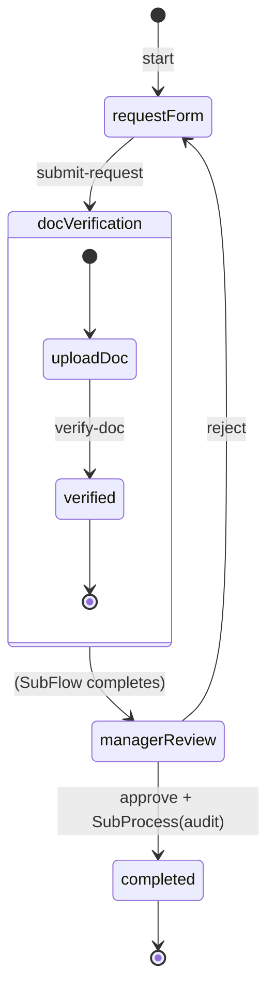

# Tutorial: SubFlow and SubProcess

In this guide you will extend the **simple-approval** workflow from the [First Workflow Tutorial](./tutorial) to learn two core orchestration patterns:

- **SubFlow** — Blocks the parent workflow, merges the result back (document verification)
- **SubProcess** — Fire-and-forget, runs independently (audit logging)

:::tip[Prerequisites]

- You should have completed the [Tutorial: First Workflow](./tutorial) and published the `simple-approval` workflow.
- The runtime should be running (`http://localhost:4201`).

:::

## Scenario

After the request form is submitted, document verification is now required before the manager review. Additionally, when approval is granted, an audit record is created in the background:



---

## 1. SubFlow: Document Verification

A SubFlow is a **dependent** child workflow that runs within a parent workflow state. When it completes, its result is merged into the parent instance.

### 1.1 SubFlow Workflow Definition

Create a new workflow in the Workflows folder. This workflow is defined as a SubFlow with `type: "S"`.

#### `doc-verification.json`

> **Schema:** `workflow-definition.schema.json`

```json
{
  "key": "doc-verification",
  "flow": "sys-flows",
  "flowVersion": "1.0.0",
  "domain": "demo",
  "version": "1.0.0",
  "tags": ["demo", "verification", "subflow"],
  "attributes": {
    "type": "S",
    "labels": [
      { "label": "Document Verification", "language": "en-US" },
      { "label": "Doküman Doğrulama", "language": "tr-TR" }
    ],
    "startTransition": {
      "key": "start",
      "target": "upload-doc",
      "triggerType": 0,
      "versionStrategy": "Minor",
      "labels": [
        { "label": "Start", "language": "en-US" },
        { "label": "Başlat", "language": "tr-TR" }
      ]
    },
    "states": [
      {
        "key": "upload-doc",
        "stateType": 1,
        "versionStrategy": "Minor",
        "labels": [
          { "label": "Upload Document", "language": "en-US" },
          { "label": "Doküman Yükle", "language": "tr-TR" }
        ],
        "transitions": [
          {
            "key": "verify-doc",
            "target": "verified",
            "triggerType": 0,
            "versionStrategy": "Minor",
            "labels": [
              { "label": "Verify Document", "language": "en-US" },
              { "label": "Dokümanı Doğrula", "language": "tr-TR" }
            ]
          }
        ]
      },
      {
        "key": "verified",
        "stateType": 3,
        "versionStrategy": "Minor",
        "labels": [
          { "label": "Verified", "language": "en-US" },
          { "label": "Doğrulandı", "language": "tr-TR" }
        ]
      }
    ]
  }
}
```

:::info
SubFlow workflows are defined with `type: "S"`. They have their own states, transitions, and lifecycle, but operate in integration with the parent workflow.
:::

### 1.2 Adding a SubFlow State to the Parent Workflow

In `simple-approval.json`, change the `submit-request` transition target to `doc-verification-state` and define this state with `stateType: 4` (SubFlow):

```json
{
  "key": "doc-verification-state",
  "stateType": 4,
  "versionStrategy": "Minor",
  "labels": [
    { "label": "Document Verification", "language": "en-US" },
    { "label": "Doküman Doğrulama", "language": "tr-TR" }
  ],
  "subFlow": {
    "type": "S",
    "process": {
      "key": "doc-verification",
      "domain": "demo",
      "version": "1.0.0",
      "flow": "sys-flows"
    },
    "mapping": {
      "type": "L",
      "location": "./src/DocVerificationMapping.csx",
      "code": "",
      "encoding": "NAT"
    }
  },
  "transitions": [
    {
      "key": "to-manager-review",
      "target": "manager-review",
      "triggerType": 1,
      "triggerKind": 10,
      "versionStrategy": "Minor",
      "labels": [
        { "label": "To Manager Review", "language": "en-US" },
        { "label": "Yönetici İncelemesine", "language": "tr-TR" }
      ]
    }
  ]
}
```

When the SubFlow state completes, the `triggerKind: 10` (default auto) transition fires automatically and the flow moves to `manager-review`.

### 1.3 Mapping: ISubFlowMapping

The SubFlow mapping contains two methods: `InputHandler` prepares data when the SubFlow starts, and `OutputHandler` merges the result back into the parent.

#### `DocVerificationMapping.csx`

```csharp
using System.Threading.Tasks;
using BBT.Workflow.Scripting;

public class DocVerificationMapping : ISubFlowMapping
{
    public async Task<ScriptResponse> InputHandler(ScriptContext context)
    {
        var response = new ScriptResponse();

        response.Data.requestTitle = context.Instance.Data.title;
        response.Data.requestPriority = context.Instance.Data.priority;

        return await Task.FromResult(response);
    }

    public async Task<ScriptResponse> OutputHandler(ScriptContext context)
    {
        var response = new ScriptResponse();

        response.Data.docVerified = true;
        response.Data.verifiedAt = context.Instance.Data.verifiedAt;

        return await Task.FromResult(response);
    }
}
```

`InputHandler` passes data from parent to SubFlow; `OutputHandler` merges the SubFlow result into the parent instance.

### 1.4 Updated Flow

Update the `submit-request` transition `target` in `simple-approval.json`:

```json
{
  "key": "submit-request",
  "target": "doc-verification-state",
  "triggerType": 0,
  "versionStrategy": "Minor",
  "labels": [
    { "label": "Submit Request", "language": "en-US" },
    { "label": "Talep Gönder", "language": "tr-TR" }
  ],
  "schema": {
    "key": "request-schema",
    "domain": "demo",
    "flow": "sys-schemas",
    "version": "1.0.0"
  }
}
```

---

## 2. SubProcess: Audit Logging

A SubProcess is a **fire-and-forget** child workflow that runs independently from the parent. It does not return results to the parent.

### 2.1 SubProcess Workflow Definition

#### `audit-log.json`

> **Schema:** `workflow-definition.schema.json`

```json
{
  "key": "audit-log",
  "flow": "sys-flows",
  "flowVersion": "1.0.0",
  "domain": "demo",
  "version": "1.0.0",
  "tags": ["demo", "audit", "subprocess"],
  "attributes": {
    "type": "P",
    "labels": [
      { "label": "Audit Log", "language": "en-US" },
      { "label": "Audit Kaydı", "language": "tr-TR" }
    ],
    "startTransition": {
      "key": "start",
      "target": "log-entry",
      "triggerType": 0,
      "versionStrategy": "Minor",
      "labels": [
        { "label": "Start", "language": "en-US" },
        { "label": "Başlat", "language": "tr-TR" }
      ]
    },
    "states": [
      {
        "key": "log-entry",
        "stateType": 1,
        "versionStrategy": "Minor",
        "labels": [
          { "label": "Log Entry", "language": "en-US" },
          { "label": "Kayıt Girişi", "language": "tr-TR" }
        ],
        "transitions": [
          {
            "key": "complete-log",
            "target": "logged",
            "triggerType": 1,
            "triggerKind": 10,
            "versionStrategy": "Minor",
            "labels": [
              { "label": "Complete Log", "language": "en-US" },
              { "label": "Kaydı Tamamla", "language": "tr-TR" }
            ]
          }
        ]
      },
      {
        "key": "logged",
        "stateType": 3,
        "versionStrategy": "Minor",
        "labels": [
          { "label": "Logged", "language": "en-US" },
          { "label": "Kaydedildi", "language": "tr-TR" }
        ]
      }
    ]
  }
}
```

### 2.2 SubProcessTask Definition

Create a SubProcessTask (type `14`) in the Tasks folder. This task will be triggered on the `approve` transition.

#### `start-audit-log.json`

> **Schema:** `task-definition.schema.json`

```json
{
  "key": "start-audit-log",
  "version": "1.0.0",
  "domain": "demo",
  "flow": "sys-tasks",
  "flowVersion": "1.0.0",
  "tags": ["demo", "audit", "subprocess"],
  "attributes": {
    "type": "14",
    "config": {
      "domain": "demo",
      "flow": "audit-log",
      "version": "1.0.0",
      "sync": false
    }
  }
}
```

:::warning
`sync: false` ensures the subprocess runs independently without blocking the parent. This is the core behavior of SubProcess.
:::

### 2.3 Adding SubProcessTask to the Parent Workflow

Add the SubProcessTask to the `approve` transition's `onExecutionTasks` array in `simple-approval.json`:

```json
{
  "key": "approve",
  "target": "completed",
  "triggerType": 0,
  "versionStrategy": "Minor",
  "labels": [
    { "label": "Approve", "language": "en-US" },
    { "label": "Onayla", "language": "tr-TR" }
  ],
  "schema": {
    "key": "approval-schema",
    "domain": "demo",
    "flow": "sys-schemas",
    "version": "1.0.0"
  },
  "onExecutionTasks": [
    {
      "order": 1,
      "task": {
        "key": "send-notification",
        "domain": "demo",
        "flow": "sys-tasks",
        "version": "1.0.0"
      }
    },
    {
      "order": 2,
      "task": {
        "key": "start-audit-log",
        "domain": "demo",
        "flow": "sys-tasks",
        "version": "1.0.0"
      }
    }
  ]
}
```

### 2.4 Mapping: ISubProcessMapping

The SubProcess mapping only contains `InputHandler` — no result is returned to the parent.

#### `AuditLogMapping.csx`

```csharp
using System.Threading.Tasks;
using BBT.Workflow.Scripting;

public class AuditLogMapping : ISubProcessMapping
{
    public async Task<ScriptResponse> InputHandler(ScriptContext context)
    {
        var response = new ScriptResponse();

        response.Data.action = "approved";
        response.Data.requestTitle = context.Instance.Data.title;
        response.Data.approvedBy = context.Headers["x-user-id"];
        response.Data.timestamp = System.DateTime.UtcNow.ToString("o");

        return await Task.FromResult(response);
    }
}
```

---

## 3. SubFlow vs SubProcess

| | SubFlow (`S`) | SubProcess (`P`) |
|---|---|---|
| **Synchronization** | Result is merged into the parent | Fire-and-forget |
| **Blocks parent?** | Yes, until completion | No |
| **Mapping interface** | `ISubFlowMapping` (InputHandler + OutputHandler) | `ISubProcessMapping` (InputHandler only) |
| **Triggering** | `stateType: 4` SubFlow state | `SubProcessTask` (type `14`) or `stateType: 4` with `type: "P"` |
| **Typical use** | Validation, calculation, approval sub-flows | Audit, notifications, background jobs |

---

## 4. Publish and Test

### 4.1 Publish

Deploy all new components:

```bash
wf update --all
```

### 4.2 Testing with Quick Runner

1. In Quick Runner, click **+ New Run** to start a new instance.
2. Trigger the `submit-request` transition (enter title, priority).
3. The instance moves to `doc-verification-state` — the SubFlow starts automatically.
4. In the SubFlow instance, trigger the `verify-doc` transition.
5. When the SubFlow completes, the parent automatically moves to `manager-review`.
6. Trigger `approve` — the `audit-log` SubProcess starts in the background.
7. Check the **History** tab for SubFlow and SubProcess transitions.

### 4.3 Testing with HTTP

**Start instance and submit request:**

```bash
curl -X POST http://localhost:4201/api/v1/demo/workflows/simple-approval/instances/start \
  -H "Content-Type: application/json" \
  -d '{ "key": "subflow-test-001", "tags": ["tutorial"], "attributes": {} }'
```

```bash
curl -X PATCH http://localhost:4201/api/v1/demo/workflows/simple-approval/instances/{instanceId}/transitions/submit-request \
  -H "Content-Type: application/json" \
  -d '{
    "attributes": {
      "title": "New Equipment Request",
      "description": "Document verification required",
      "priority": "high"
    }
  }'
```

**Querying the SubFlow instance:**

When the instance is queried, SubFlow correlation information appears in the `activeCorrelations` field:

```bash
curl http://localhost:4201/api/v1/demo/workflows/simple-approval/instances/{instanceId}
```

**Completing the SubFlow (verification):**

The SubFlow instance is advanced through its own workflow:

```bash
curl -X PATCH http://localhost:4201/api/v1/demo/workflows/doc-verification/instances/{subFlowInstanceId}/transitions/verify-doc \
  -H "Content-Type: application/json" \
  -d '{ "attributes": {} }'
```

When the SubFlow completes, the parent automatically transitions to `manager-review`.

---

## Next Steps

- **[Tutorial: Views and Extensions](./tutorial-views-extensions)** — Platform-specific view selection and extension usage.
- **[Workflow Components](/docs/components/workflow)** — State types and SubFlow details.
- **[Mapping Interfaces](/docs/components/interfaces)** — ISubFlowMapping and ISubProcessMapping reference.
- **[Trigger Tasks](/docs/components/tasks/trigger)** — SubProcessTask and other trigger task types.
