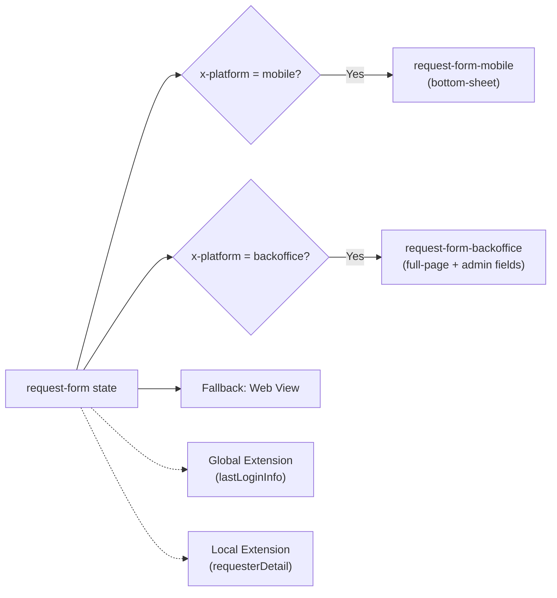

# Tutorial: Views and Extensions

In this guide you will extend the **simple-approval** workflow from the [First Workflow Tutorial](./tutorial) to learn two core concepts:

- **Rule-based view selection** — Showing different views for mobile, backoffice, and web within the same state
- **Global and Local Extensions** — Instance data enrichment scopes

:::tip[Prerequisites]

- You should have completed the [Tutorial: First Workflow](./tutorial) and published the `simple-approval` workflow.
- The runtime should be running (`http://localhost:4201`).

:::

## Scenario

In the approval request workflow, the `request-form` state will now show different screens based on the platform:

- **Mobile** users see a simplified `bottom-sheet` form
- **Backoffice** operators see a `full-page` screen with additional admin fields
- **Web** users see the default `full-page` form

Additionally, two extensions come into play: a **global** extension that runs across all workflows, and a **local** extension that only runs in the approval workflow.



---

## 1. Platform-Specific View Definitions

We will create three different views: mobile, backoffice, and web (default).

### 1.1 Mobile View

A simplified form for mobile users. Opens as a `bottom-sheet` panel with only required fields.

#### `request-form-mobile.json`

> **Schema:** `view-definition.schema.json`

```json
{
  "key": "request-form-mobile",
  "version": "1.0.0",
  "domain": "demo",
  "flow": "sys-views",
  "flowVersion": "1.0.0",
  "tags": ["demo", "approval", "mobile"],
  "attributes": {
    "type": 1,
    "display": "bottom-sheet",
    "content": {
      "type": "form",
      "title": {
        "en-US": "New Request",
        "tr-TR": "Yeni Talep"
      },
      "fields": [
        {
          "name": "title",
          "type": "text",
          "label": { "en-US": "Title", "tr-TR": "Başlık" },
          "required": true
        },
        {
          "name": "priority",
          "type": "select",
          "label": { "en-US": "Priority", "tr-TR": "Öncelik" },
          "required": true,
          "options": [
            { "value": "low", "label": { "en-US": "Low", "tr-TR": "Düşük" } },
            { "value": "medium", "label": { "en-US": "Medium", "tr-TR": "Orta" } },
            { "value": "high", "label": { "en-US": "High", "tr-TR": "Yüksek" } }
          ]
        }
      ]
    },
    "labels": [
      { "label": "Request Form (Mobile)", "language": "en-US" },
      { "label": "Talep Formu (Mobil)", "language": "tr-TR" }
    ]
  }
}
```

### 1.2 Backoffice View

A `full-page` screen for backoffice operators with additional admin fields (`assignee`, `internalNote`).

#### `request-form-backoffice.json`

> **Schema:** `view-definition.schema.json`

```json
{
  "key": "request-form-backoffice",
  "version": "1.0.0",
  "domain": "demo",
  "flow": "sys-views",
  "flowVersion": "1.0.0",
  "tags": ["demo", "approval", "backoffice"],
  "attributes": {
    "type": 1,
    "display": "full-page",
    "content": {
      "type": "form",
      "title": {
        "en-US": "New Approval Request (Backoffice)",
        "tr-TR": "Yeni Onay Talebi (Backoffice)"
      },
      "description": {
        "en-US": "Create a request on behalf of the customer.",
        "tr-TR": "Müşteri adına talep oluşturun."
      },
      "fields": [
        {
          "name": "title",
          "type": "text",
          "label": { "en-US": "Title", "tr-TR": "Başlık" },
          "required": true
        },
        {
          "name": "description",
          "type": "textarea",
          "label": { "en-US": "Description", "tr-TR": "Açıklama" },
          "required": false
        },
        {
          "name": "priority",
          "type": "select",
          "label": { "en-US": "Priority", "tr-TR": "Öncelik" },
          "required": true,
          "options": [
            { "value": "low", "label": { "en-US": "Low", "tr-TR": "Düşük" } },
            { "value": "medium", "label": { "en-US": "Medium", "tr-TR": "Orta" } },
            { "value": "high", "label": { "en-US": "High", "tr-TR": "Yüksek" } }
          ]
        },
        {
          "name": "assignee",
          "type": "text",
          "label": { "en-US": "Assign To", "tr-TR": "Atanan Kişi" },
          "required": false
        },
        {
          "name": "internalNote",
          "type": "textarea",
          "label": { "en-US": "Internal Note", "tr-TR": "İç Not" },
          "required": false
        }
      ]
    },
    "labels": [
      { "label": "Request Form (Backoffice)", "language": "en-US" },
      { "label": "Talep Formu (Backoffice)", "language": "tr-TR" }
    ]
  }
}
```

### 1.3 Web View (Default)

The standard form for web users. The `request-form-view.json` from the first tutorial already serves this role — you can continue using it as-is.

---

## 2. Rule-Based View Selection

Once the views are defined, add a `views` array to the workflow state for rule-based selection. Each entry's `rule` is an `IConditionMapping` C# script; the **first matching rule wins**, and an entry without a rule serves as the fallback.

### 2.1 Adding a `views` Array to the State

Update the `request-form` state in `simple-approval.json`. Use a `views` array instead of a single `view`:

```json
{
  "key": "request-form",
  "stateType": 1,
  "versionStrategy": "Minor",
  "labels": [
    { "label": "Request Form", "language": "en-US" },
    { "label": "Talep Formu", "language": "tr-TR" }
  ],
  "views": [
    {
      "rule": {
        "location": "inline",
        "code": "using System.Threading.Tasks;\nusing BBT.Workflow.Scripting;\npublic class MobileRule : IConditionMapping\n{\n    public async Task<bool> Handler(ScriptContext context)\n    {\n        return context.Headers?[\"x-platform\"] == \"mobile\";\n    }\n}",
        "encoding": "NAT"
      },
      "view": {
        "key": "request-form-mobile",
        "domain": "demo",
        "flow": "sys-views",
        "version": "1.0.0"
      },
      "loadData": false
    },
    {
      "rule": {
        "location": "inline",
        "code": "using System.Threading.Tasks;\nusing BBT.Workflow.Scripting;\npublic class BackofficeRule : IConditionMapping\n{\n    public async Task<bool> Handler(ScriptContext context)\n    {\n        return context.Headers?[\"x-platform\"] == \"backoffice\";\n    }\n}",
        "encoding": "NAT"
      },
      "view": {
        "key": "request-form-backoffice",
        "domain": "demo",
        "flow": "sys-views",
        "version": "1.0.0"
      },
      "loadData": false
    },
    {
      "view": {
        "key": "request-form-view",
        "domain": "demo",
        "flow": "sys-views",
        "version": "1.0.0"
      },
      "loadData": false
    }
  ],
  "transitions": [
    {
      "key": "submit-request",
      "target": "manager-review",
      "triggerType": 0,
      "versionStrategy": "Minor",
      "labels": [
        { "label": "Submit Request", "language": "en-US" },
        { "label": "Talep Gönder", "language": "tr-TR" }
      ],
      "schema": {
        "key": "request-schema",
        "domain": "demo",
        "flow": "sys-schemas",
        "version": "1.0.0"
      }
    }
  ]
}
```

### 2.2 Evaluation Order

1. If the `x-platform: mobile` header is present → `request-form-mobile` (bottom-sheet)
2. If the `x-platform: backoffice` header is present → `request-form-backoffice` (full-page + extra fields)
3. If no rule matches → `request-form-view` (default web form)

:::tip
Always place the default (fallback) view at the **end** of the array. An entry without a rule is used when no rules match.
:::

---

## 3. Transition View Example

The same `views` array format can also be used on transitions. For example, to show a `bottom-sheet` confirmation on mobile and a `popup` modal on desktop for the `approve` transition:

```json
{
  "key": "approve",
  "target": "completed",
  "triggerType": 0,
  "versionStrategy": "Minor",
  "labels": [
    { "label": "Approve", "language": "en-US" },
    { "label": "Onayla", "language": "tr-TR" }
  ],
  "views": [
    {
      "rule": {
        "location": "inline",
        "code": "using System.Threading.Tasks;\nusing BBT.Workflow.Scripting;\npublic class MobileConfirmRule : IConditionMapping\n{\n    public async Task<bool> Handler(ScriptContext context)\n    {\n        return context.Headers?[\"x-platform\"] == \"mobile\";\n    }\n}",
        "encoding": "NAT"
      },
      "view": {
        "key": "approve-confirm-mobile",
        "domain": "demo",
        "flow": "sys-views",
        "version": "1.0.0"
      },
      "loadData": true
    },
    {
      "view": {
        "key": "approve-confirm-desktop",
        "domain": "demo",
        "flow": "sys-views",
        "version": "1.0.0"
      },
      "loadData": true
    }
  ]
}
```

---

## 4. Global Extension: Last Login Info

A **Global** extension (`attributes.type: 1`) runs automatically across **all** workflows in the domain. There is no need to register it in any workflow definition.

### 4.1 Extension Definition

Create in the Extensions folder:

#### `extension-last-login.json`

> **Schema:** `extension-definition.schema.json`

```json
{
  "key": "extension-last-login",
  "version": "1.0.0",
  "domain": "demo",
  "flow": "sys-extensions",
  "flowVersion": "1.0.0",
  "tags": ["demo", "global", "login"],
  "attributes": {
    "type": 1,
    "scope": 3,
    "task": {
      "order": 1,
      "task": {
        "key": "send-notification",
        "domain": "demo",
        "flow": "sys-tasks",
        "version": "1.0.0"
      },
      "mapping": {
        "type": "L",
        "location": "./src/LastLoginMapping.csx",
        "code": "",
        "encoding": "NAT"
      }
    },
    "labels": [
      { "label": "Last Login Info", "language": "en-US" },
      { "label": "Son Giriş Bilgisi", "language": "tr-TR" }
    ]
  }
}
```

| Field | Value | Meaning |
|-------|-------|---------|
| `type` | `1` (Global) | Runs on all workflows |
| `scope` | `3` (Everywhere) | Runs on all get endpoints |

### 4.2 Behavior

Since `type: 1` (Global), this extension runs automatically on all instance queries in the domain without being registered in any workflow:

```bash
curl http://localhost:4201/api/v1/demo/workflows/simple-approval/instances/{instanceId}
```

It appears under `extensions` in the response:

```json
{
  "id": "...",
  "metadata": { "currentState": "manager-review", "status": "Active" },
  "attributes": { "title": "New Laptop Request", "priority": "high" },
  "extensions": {
    "extensionLastLogin": {
      "lastLoginAt": "2026-05-11T14:30:00Z",
      "lastLoginIp": "192.168.1.100",
      "device": "Chrome / macOS"
    }
  }
}
```

---

## 5. Local Extension: Requester Detail

A **Local** extension (`attributes.type: 3`, DefinedFlows) only runs in the **workflows where it is registered**. It must be added to both the workflow's `attributes.extensions` array and the relevant state's `view.extensions` field.

### 5.1 Extension Definition

#### `extension-requester-detail.json`

> **Schema:** `extension-definition.schema.json`

```json
{
  "key": "extension-requester-detail",
  "version": "1.0.0",
  "domain": "demo",
  "flow": "sys-extensions",
  "flowVersion": "1.0.0",
  "tags": ["demo", "approval", "requester"],
  "attributes": {
    "type": 3,
    "scope": 1,
    "task": {
      "order": 1,
      "task": {
        "key": "send-notification",
        "domain": "demo",
        "flow": "sys-tasks",
        "version": "1.0.0"
      },
      "mapping": {
        "type": "L",
        "location": "./src/RequesterDetailMapping.csx",
        "code": "",
        "encoding": "NAT"
      }
    },
    "labels": [
      { "label": "Requester Detail", "language": "en-US" },
      { "label": "Talep Sahibi Detayı", "language": "tr-TR" }
    ]
  }
}
```

| Field | Value | Meaning |
|-------|-------|---------|
| `type` | `3` (DefinedFlows) | Only runs in registered workflows |
| `scope` | `1` (GetInstance) | Only runs on single instance queries |

### 5.2 Workflow Registration

Add to two places in `simple-approval.json`:

**1. Workflow `attributes.extensions` array:**

```json
{
  "attributes": {
    "extensions": [
      {
        "key": "extension-requester-detail",
        "domain": "demo",
        "flow": "sys-extensions",
        "version": "1.0.0"
      }
    ]
  }
}
```

**2. Relevant state's `view.extensions` field:**

```json
{
  "key": "manager-review",
  "stateType": 2,
  "view": {
    "view": {
      "key": "manager-review-view",
      "domain": "demo",
      "flow": "sys-views",
      "version": "1.0.0"
    },
    "loadData": true,
    "extensions": ["extension-requester-detail"]
  }
}
```

### 5.3 Behavior

The local extension only runs in the workflow where it is registered and when the specified state's view is queried:

```bash
curl "http://localhost:4201/api/v1/demo/workflows/simple-approval/instances/{instanceId}?extensions=extension-requester-detail"
```

Response:

```json
{
  "id": "...",
  "metadata": { "currentState": "manager-review", "status": "Active" },
  "attributes": { "title": "New Laptop Request", "priority": "high" },
  "extensions": {
    "extensionLastLogin": {
      "lastLoginAt": "2026-05-11T14:30:00Z",
      "lastLoginIp": "192.168.1.100",
      "device": "Chrome / macOS"
    },
    "extensionRequesterDetail": {
      "name": "Ahmet Yılmaz",
      "department": "Engineering",
      "email": "ahmet@example.com",
      "employeeId": "EMP-1234"
    }
  }
}
```

`extensionLastLogin` appears automatically because it is global, while `extensionRequesterDetail` appears because of the local registration and request.

---

## 6. Global vs Local Extension Comparison

| | Global Extension | Local Extension |
|---|---|---|
| **`attributes.type`** | `1` (Global) or `2` (GlobalAndRequested) | `3` (DefinedFlows) or `4` (DefinedFlowAndRequested) |
| **Workflow registration** | Not required | Must be added to `attributes.extensions` |
| **State/View registration** | Not required | Must be added to `view.extensions` |
| **Scope** | All workflows in the domain | Only registered workflows |
| **Typical use** | User info, session data, platform metadata | Workflow-specific enrichment (customer detail, credit history) |

:::info
The `type: 2` (GlobalAndRequested) and `type: 4` (DefinedFlowAndRequested) variants allow the extension to run both automatically and when requested via the `?extensions=` parameter.
:::

---

## 7. Publish and Test

### 7.1 Publish

```bash
wf update --all
```

### 7.2 Platform-Based View Test

**Mobile view:**

```bash
curl http://localhost:4201/api/v1/demo/workflows/simple-approval/instances/{instanceId}/functions/view \
  -H "x-platform: mobile"
```

The response returns `display: "bottom-sheet"` with simplified form fields.

**Backoffice view:**

```bash
curl http://localhost:4201/api/v1/demo/workflows/simple-approval/instances/{instanceId}/functions/view \
  -H "x-platform: backoffice"
```

The response returns `display: "full-page"` with additional `assignee` and `internalNote` fields.

**Web view (default):**

```bash
curl http://localhost:4201/api/v1/demo/workflows/simple-approval/instances/{instanceId}/functions/view
```

When no header is sent, the fallback view is returned.

### 7.3 Extension Test

**Global extension is included automatically:**

```bash
curl http://localhost:4201/api/v1/demo/workflows/simple-approval/instances/{instanceId}
```

**Local extension is included on request:**

```bash
curl "http://localhost:4201/api/v1/demo/workflows/simple-approval/instances/{instanceId}?extensions=extension-requester-detail"
```

---

## Next Steps

- **[View Selection](/docs/how-to/view-selection)** — Detailed reference for rule-based view selection.
- **[View Component](/docs/components/view)** — Display types and platform override mechanism.
- **[Extension Component](/docs/components/extension)** — Type and scope enums, mapping details.
- **[Built-in Functions](/docs/components/functions/built-in)** — View function and extension integration.
