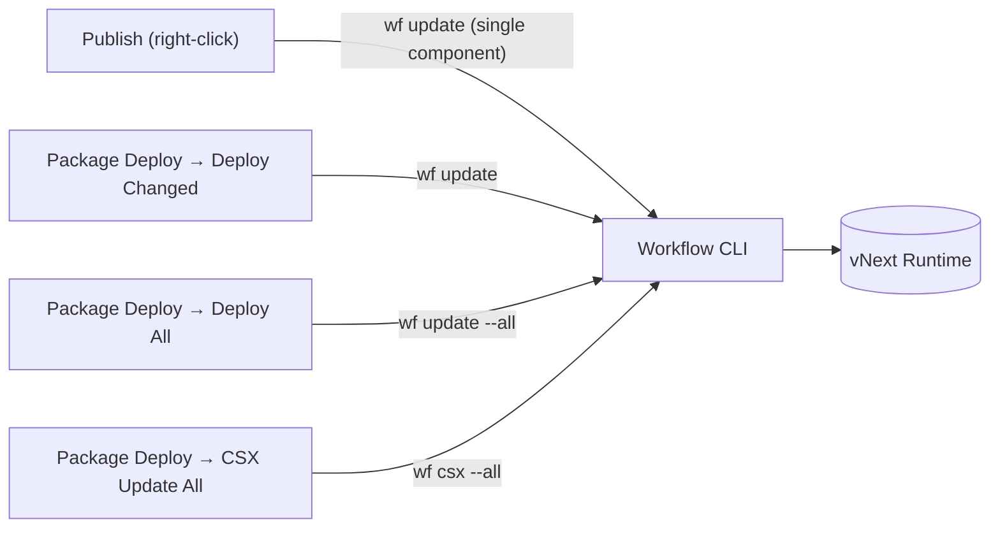

# Forge Usage Guide

This guide covers day-to-day use of the **vNext Forge** VS Code extension: the Forge Tools panels, Explorer context menus, the visual designer for each component type, and how publishing relates to the [Workflow CLI](/docs/tools/workflow-cli).

For installation and creating your first project, see the [Development Environment Setup (Forge)](/docs/getting-started/forge-setup) guide.

## Forge Tools Panels

Clicking the **vNext Forge Tools** icon in the Activity Bar reveals five panels (when no project is open, only Settings and Create Project are visible):

### Settings

Manages workspace and global Forge settings. Use the pencil icon on each setting row (**Change Setting**) to modify a value. Panel title actions:

| Action | Description |
|--------|-------------|
| **Share Config With Workspace** | Writes your personal settings into the workspace config so the whole team works with the same settings |
| **Export Forge Tools Config** | Exports settings to a file |
| **Import Forge Tools Config** | Imports a previously exported config |

### Project

Contains build and validation actions for the active domain project:

| Action | Description |
|--------|-------------|
| **Validate Project** | `npm run validate` — validates all components against their schemas |
| **Build Runtime** | Produces the runtime package (deployable output) |
| **Build Reference** | Produces the reference package (consumed by other domains) |
| **Generate Documents** | Generates documentation from the components |

### Environments

The panel where local and remote environments are added, started, and stopped. The full walkthrough is in the [Development Environment Setup](/docs/getting-started/forge-setup#5-add-an-environment) guide. In short:

- **Local (Docker)** — Forge installs and manages `vnext-runtime`: Start/Stop/Restart, Health Check, Logs, Reveal Ports, Update Runtime, Register with Workflow CLI, Reset Components.
- **Remote / existing** — connects to a running runtime via its base URL.
- **Infrastructure** row — manages the shared infrastructure (PostgreSQL, Redis, Vault, Dapr): Start/Stop/Restart Infrastructure, Show Infrastructure Logs/Status, Stop All Domains, Stop All Domains and Infrastructure.

### Package Deploy

Deploys component changes in the domain to the active environment. This panel is the visual counterpart of the Workflow CLI commands — each action maps to a `wf` command:

| Action | CLI equivalent | Description |
|--------|----------------|-------------|
| **Deploy All** | `wf update --all` | Deploys all components |
| **Deploy Changed** | `wf update` | Deploys only changed components |
| **CSX Update All** | `wf csx --all` | Updates all `.csx` mappings |

### Quick Run

A tool for testing workflows against the active environment in real time: starting new instances, triggering transitions, instance details (View, Data, History, Correlations), global headers, and filtering.

There is also a **Function Quick Run** for functions — right-click a JSON file under `Functions/` and choose **Open Function Quick Run**.

:::tip[Detailed guide]
See the **[Flow Quick Runner](./quick-runner)** page for the annotated main screen, starting instances, firing transitions, State View rendering, the Data/History/Correlations/Raw tabs, and the Function Quick Runner.
:::

## Explorer Context Menus

Forge adds actions to the Explorer right-click menu based on the file/folder type.

### On component folders (right-click → Create)

Each component folder shows the **Create** action for its own type:

| Folder | Menu action |
|--------|-------------|
| `Workflows/` | **Forge: Workflow Create** |
| `Tasks/` | **Forge: Task Create** |
| `Schemas/` | **Forge: Schema Create** |
| `Views/` | **Forge: View Create** |
| `Functions/` | **Forge: Function Create** |
| `Extensions/` | **Forge: Extension Create** |
| `Mappings/` | **Forge: Mapping Create** |

### On component JSON files

When you right-click a component `.json` file:

| Action | Description |
|--------|-------------|
| **Forge: Open with vNext Forge** | Opens the file in the visual designer |
| **Forge: Open with Text Editor** | Opens it as raw JSON |
| **Open Quick Run** | (Workflows) Opens the workflow in Quick Run |
| **Open Function Quick Run** | (Functions) Opens the function in the test panel |
| **Publish** | Deploys the component to the active environment (see below) |

### On `.csx` files

Right-click a `.csx` mapping file → **Sync Current CSX to JSON**: writes the script content into the linked component JSON's `code` field (Base64). From the Command Palette you can toggle **Enable/Disable CSX → JSON Auto-Sync**; **Sync All CSX Files to JSON** synchronizes everything in one go.

## Component Designers

Forge ships a dedicated visual editor for each component type. Two ways to open the designer: double-click the file (Forge is the default editor) or right-click → **Forge: Open with vNext Forge**.

### Workflow Designer

A state-machine-based visual canvas: adding/editing states, transition connections, auto-layout, search, and the property sidebar (General, Tasks, Transitions, Error Boundary).

### Schema Designer

Designs JSON Schemas visually: adding fields, type/validation rules, localization (`x-labels`), role-based access (`x-roles`), and query metadata.

The field tree with nested objects, type badges, and **Add nested** for sub-fields:

### View Designer

Edits view components: renderer selection (pseudo-ui recommended), the view tree, and schema bindings. See the [View Concept](/docs/how-to/view-consept) docs for the Pseudo-UI vocabulary.

Below the metadata a three-panel layout opens: the **Outline/Components** tree on the left, the live **Canvas** preview in the middle, and **View Settings** on the right (Data Schema binding, Lookups, UI State, `$schema`):

### Task Editor

Form-based editing of the task type (HTTP, Script, Dapr, Notification, …) and its type-specific config fields; manages mapping bindings.

Below the metadata, the task type is picked as a card and the type-specific **Configuration** section follows — e.g. Method, URL, Body, Content-Type, Headers, Timeout, Validate SSL, and Accepted Status Codes for an HTTP task:

### Function Editor

Manages the function scope (Domain/Flow/Instance), task composition, and `IMapping`/`IOutputHandler` script bindings.

The **Task Execution** section holds the Single Task / Multiple Tasks choice, the Raw response switch, the bound task with its `.csx` mapping preview (including Helpers & Assemblies), and the optional **Cache** configuration:

### Extension Editor

Edits the extension type × scope matrix and target workflow bindings.

Below the scope cards (Global, Defined Flows, Everywhere…) sits the **Task** section that runs when the extension is invoked — with the bound script-task and its `.csx` source preview:

### Mapping (CSX) Editor

A C# script editor: syntax highlighting, IntelliSense, Snippet Quick Bar, and the C# API Reference panel. When the `encoding` field is set to `REF`, a [sys-mappings component](/docs/components/mapping-component) reference is used instead of embedded code, selected via a pickup dialog.

Below the mapping metadata are the helper class name (**NAME**, referenced via `scripts.helpers`) and a preview of the `.csx` source:

## Publish and the CLI Relationship

Every deploy action in Forge runs the **Workflow CLI** (`wf`) behind the scenes — Forge is a visual shell over the CLI:

Practical consequences:

1. **The CLI must be installed** — if it isn't, Forge detects that and offers to install it ([details](/docs/getting-started/forge-setup#4-workflow-cli-installation)).
2. **The domain must be registered with the CLI** — the **Register with Workflow CLI** action on the local environment does this. Without the registration, publishing fails; Forge shows a warning on the environment row.
3. **Error messages come from the CLI** — for fixes to errors seen during publish, consult the [`vnext-workflow-cli`](https://github.com/burgan-tech/vnext-workflow-cli) documentation (DB connection, credentials, Docker requirements, etc.).

:::tip[Suggested publish flow]
When working on a single component, right-click → **Publish** is the fastest path. If several components changed, use **Package Deploy → Deploy Changed**; reserve **Deploy All** for seeding an environment from scratch.
:::

## Related Pages

- [vNext Forge Studio](/docs/tools/forge-studio) — overview and installation
- [Development Environment Setup (Forge)](/docs/getting-started/forge-setup) — the initial setup flow
- [Workflow CLI](/docs/tools/workflow-cli) — `wf` command reference
- [AI-Assisted Development](/docs/tools/ai-assisted-development) — the vNext AI Toolkit
