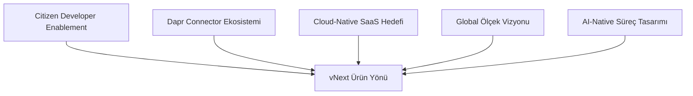
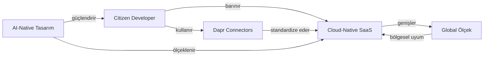

# Ürün Yönü ve Sınırlar

Bu sayfa, vNext'in **ürün yönünü** ve **sınırlarını** netleştirir: hangi yönlere yatırım yapılır, hangi sorumluluklar ürün dışında bırakılır?

## Ürün Yönünün Beş Ekseni

## 1. Citizen Developer Enablement

**Hedef:** Teknik olmayan veya az kod yazan ekiplerin de süreç uygulamaları geliştirebilmesini sağlamak.

**Bunu mümkün kılan yatırımlar:**

- Tanım odaklı (config-driven) workflow modeli — kodlama yerine deklaratif tanım
- Hazır task tipleri (HTTP, Condition, Timer, Notification, Script, SubFlow, DaprPubSub, DaprService)
- Şablon kütüphanesi (planlı) — yaygın senaryolar için referans
- Visual workflow designer (roadmap'te) — sürükle-bırak tasarım
- Self-service domain portal (roadmap'te) — alan oluşturma ve yönetim arayüzü
- Doğrulama ve hata mesajları — analist seviyesinde okunabilir

**Sınır:** Citizen developer yaklaşımı, profesyonel geliştirici rolünü ortadan kaldırmaz. Karmaşık iş mantığı, özel scripting ve performans-kritik bileşenler hâlâ uygulama geliştiricilerinin sorumluluğundadır.

## 2. Dapr Connector Ekosistemi

**Hedef:** Dapr üzerinden hazır entegrasyon bileşenlerinden faydalanmak ve sağlayıcı bağımsızlığı sağlamak.

**vNext, Dapr building block'larını birinci sınıf olarak kullanır:**

| Building Block | vNext'te Kullanımı |
|----------------|-------------------|
| **Service Invocation** | İç ve dış REST servislerine standart çağrı (DaprService task) |
| **Pub/Sub** | Olay tabanlı entegrasyon — Kafka, RabbitMQ, Redis, Azure Service Bus (DaprPubSub task) |
| **Bindings** | Input/output bağlayıcılar — SMTP, S3, SFTP, Kafka, vb. |
| **State Management** | Durum bilgisinin sağlayıcı bağımsız saklanması |
| **Secrets** | Credential'ların merkezi yönetimi (Vault, Kubernetes secrets, vb.) |

**Avantajlar:**

- **Vendor lock-in yok** — sağlayıcı değişikliği tanım değişikliği gerektirir, kod değil
- **Açık standartlar** — CloudEvents formatı, gRPC/HTTP arayüzleri
- **Topluluk ekosistemi** — Dapr'ın aktif geliştirilen connector kütüphanesinden yararlanma
- **Operasyonel olgunluk** — production-ready, geniş gözlemlenebilirlik desteği

**Sınır:** vNext tüm Dapr connector'larını paketle birlikte sunmaz; her kurumun ihtiyaç duyduğu sağlayıcılar (broker, secret store, vb.) altyapı seviyesinde kurulur ve yapılandırılır.

## 3. Cloud-Native SaaS Hedefi

**Hedef:** Ürünü çok kiracılı (multi-tenant), yüksek erişilebilir ve operasyonel olarak ölçeklenebilir bir SaaS platforma dönüştürmek.

**Mevcut destekler:**

- Multi-schema mimarisi — tek instance üzerinde çoklu tenant
- Domain bazında izolasyon — runtime + database + messaging
- Konteynerleştirilmiş deployment (Docker, Kubernetes uyumlu)
- Stateless API host'ları — yatay ölçeklenmeye doğal uyum
- Asenkron worker'lar (Inbox/Outbox) — yük altında dayanıklılık
- Health endpoint'ler ve metric standardı

**Planlanan:**

- **Self-service onboarding** — yeni tenant oluşturma akışı
- **Operasyonel guardrail'ler** — tenant bazlı kota, rate limit, izolasyon kontrolleri
- **Kullanım bazlı ölçek (usage-based scaling)** — gerçek talebe göre otomatik kaynak ayarlama
- **Subscription & billing** entegrasyonları

**Sınır:** Cloud-native SaaS olgunlaşması bir süreçtir; mevcut kurumlar on-prem veya hybrid kurulumlarda da çalıştırabilir, ancak ürün yönü SaaS modelini önceliklendirir.

## 4. Global Ölçek Vizyonu

**Hedef:** Farklı coğrafyalarda çalışabilecek, regülasyon ve performans ihtiyaçlarına uyarlanabilir bir yapı.

**Bu yön kapsamında değerlendirilenler:**

- **Bölgesel dağıtım** — birden fazla coğrafi bölgede aktif kurulumlar
- **Veri yerelliği (data residency)** — KVKK, GDPR, sektörel regülasyonlara uyum
- **Multi-cloud desteği** — AWS, Azure, GCP arasında taşınabilirlik
- **Bölgesel performans** — düşük gecikmeli erişim için CDN/edge stratejileri
- **Lokalizasyon** — dil, takvim, para birimi farklılıkları
- **Disaster recovery** — bölgeler arası yedeklilik ve failover

**Sınır:** Global ölçek vizyonu uzun vadelidir (roadmap'te "Later"). İlk fazda Türkiye/bölgesel bankacılık odağı korunur, küresel açılım faz faz hayata geçirilir.

## 5. AI-Native Süreç Tasarımı (Tek Kod Base, N Flow)

**Hedef:** AI çağında doğru cevap "herkes daha hızlı kod yazsın" değil; **"herkes kod yazmasın — AI ile flow çizsin"** olduğundan, vNext'i bu paradigmanın platformu hâline getirmek.

### Temel Tez

- **Bireysel AI üretkenliği**, kurum çapında N codebase'i N kat artıran bir yönetim yüküne dönüşür
- **Kurumsal AI üretkenliği**, sadece **tek kod base + AI destekli flow tasarımı** modelinde anlamlıdır
- **vNext runtime'ı kurumun tek kod base'i olur**; iş mantığı flow tanımlarında yaşar; AI flow tasarımına eşlik eder

### Yatırım Yapılan Alanlar

| Alan | Açıklama | Faz |
|------|----------|-----|
| **AI-Assisted Flow Design** | Doğal dil → workflow tanımı üretimi | Next / Later |
| **Flow Önerisi** | Mevcut süreç metni → akış taslağı | Next |
| **Akış Doğrulama / İnceleme** | AI ile risk, breaking change, paralel adım analizi | Next |
| **Doğal Dil Sorgulama** | "Şu an onayda kaç başvuru var?" → instance query | Later |
| **Process Mining** | Mevcut süreç loglarından otomatik flow çıkarımı | Later |
| **AI Copilot Entegrasyonu** | IDE / Designer içinde AI eşlik | Next / Later |

### Tek Kod Base'in Operasyonel Karşılığı

| Konu | vNext'in Yaklaşımı |
|------|--------------------|
| **Çalıştırma** | Tüm uygulamalar **aynı Orchestration + Execution API**'lerini kullanır |
| **Güncelleme** | Runtime güncellenir, yüzlerce uygulama otomatik faydalanır |
| **Güvenlik yaması** | Tek noktada, ekosistem geneline |
| **Gözlemlenebilirlik** | Standart OpenTelemetry, persistent metrics tüm uygulamalarda aynı |
| **Audit & Uyumluluk** | Tüm uygulamalar aynı audit trail standardını paylaşır |
| **Domain izolasyonu** | Tek kod base, **çoklu domain runtime** ile birleşir; uygulamalar veri ve yetki olarak izole kalır |

### Sınırlar

- vNext, kod yazma ihtiyacını **sıfırlamayı vaat etmez**: özel hesaplama (script task), karmaşık entegrasyon adaptörü, performans-kritik bileşen hâlâ uygulama geliştiricilerinin sorumluluğundadır
- **AI'nın ürettiği flow doğrulanmadan production'a çıkmaz**: insan-onaylı süreç (review, test, audit) zorunludur
- **AI-Native özellikler aşamalı gelir** — bugün şablon kütüphanesi ve doğrulama araçlarıyla başlar, AI copilot ve doğal dil tasarımıyla genişler
- vNext, **AI modeli sağlayıcısı değildir** — model entegrasyonu pluggable yapılandırılır (OpenAI, Anthropic, Azure OpenAI, açık modeller, kurum-içi modeller)

## Ürünün Açık Sınırları (Out of Scope)

Aşağıdaki sorumluluklar ürünün dışındadır ve **domain ekipleriyle birlikte yürütülür**:

| Konu | vNext'in Yaklaşımı |
|------|--------------------|
| **Kurumsal iş uygulaması geliştirme** | Ürün bir süreç orkestrasyon platformudur; kurumlara özel uçtan uca uygulama geliştirme sorumluluğu domain ekiplerinde kalır |
| **Özel UI / Frontend** | View tanımları platform tarafında, kurumsal frontend uygulamaları (mobil/web) ayrıdır |
| **Hesap muhasebesi, core banking** | Core sistem entegre edilir, içselleştirilmez |
| **CRM, ERP, ürün katalog** | Dış sistem olarak entegre edilir |
| **AI/ML model eğitimi** | Modeller dışarıda eğitilir, vNext tahmin servislerini çağırır; AI sağlayıcısı pluggable'dır |
| **Endüstri-özel iş mantığı** | Domain ekipleri kendi kurallarını tanımlar; platform genel motor sunar |
| **Custom connector geliştirme** | Dapr ekosistemindeki connector'lar kullanılır; özel ihtiyaçlar HTTP task ile karşılanır |

## Bu Yönlerin Birbiriyle İlişkisi

- **AI-Native tasarım**, citizen developer'a flow çizmede eşlik eder
- **Citizen developer**, hızlı süreç inşası için **Dapr connector**'larını kullanır
- **SaaS** modeli, citizen developer'ların self-service çalışmasını ve AI yeteneklerinin tüm tenant'lara ulaşmasını mümkün kılar
- **Global ölçek**, SaaS işletim modelini uluslararası seviyeye taşır

## İlgili Sayfalar

- [Ürün Vizyonu](../overview/) — Konumlandırma ve hedef pazar
- [Roadmap](../roadmap/) — Bu yönlerin zaman çizelgesi
- [Feature Catalog](../features/) — Mevcut yetenekler
- [Manifesto](/business/manifesto/) — Bu yönlerin felsefi temeli
