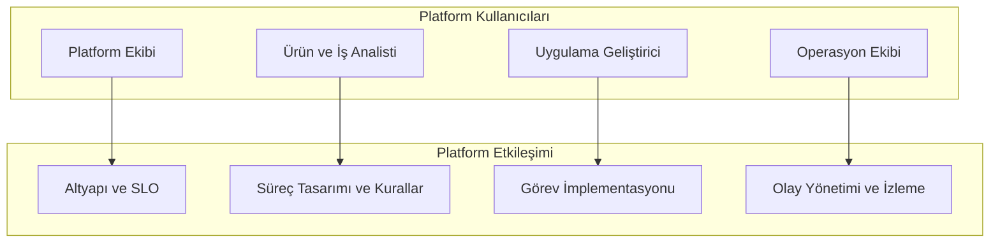
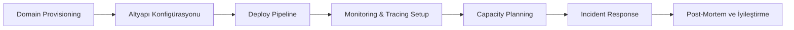
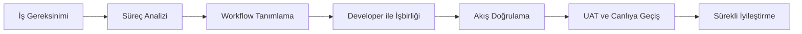
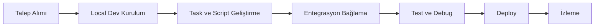
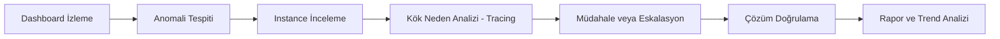

# Hedef Kullanıcılar (Persona)

Bu sayfa, vNext platformunun **dört ana kullanıcı grubunu** (persona) ve her birinin platform ile etkileşim yolculuğunu tanımlar.

## Persona Haritası

## 1. Platform Ekibi

**Kim:** Altyapı, güvenlik, gözlemlenebilirlik ve SLO takibinden sorumlu DevOps / SRE / Platform Engineering ekibi.

| | |
|---|---|
| **Hedefi** | Platformun güvenilir, performanslı, güvenli ve gözlemlenebilir çalışmasını sağlamak |
| **Günlük işi** | Domain provisioning, altyapı yönetimi, monitoring, capacity planning, secret yönetimi |
| **Acı noktası** | Çoklu domain yönetimi, hata izolasyonu, kaynak optimizasyonu, multi-tenant guardrails |
| **Başarı metriği** | Uptime, deployment başarı oranı, SLO uyum oranı, MTTR |

**Yolculuk:**

**Platform dokunma noktaları:**

- Architecture: [/architecture/intro](/architecture/intro)
- Local Dev: [/docs/intro](/docs/intro)
- Health endpoints: Orchestration `4201/health`, Execution `4202/health`
- OpenTelemetry, ClickHouse persistent metrics, Redis cache metrics

---

## 2. Ürün ve İş Analisti

**Kim:** İş süreçlerini analiz eden, kuralları tanımlayan ve süreç yaşam döngüsünü yöneten analist / ürün sahibi. **Citizen developer** rolünün birincil sahibi.

| | |
|---|---|
| **Hedefi** | İş kurallarını platform diline çevirmek, süreçleri optimize etmek, yaşam döngüsünü yönetmek |
| **Günlük işi** | Süreç analizi, workflow tanımlama, kural belirleme, sürüm yönetimi, iş birimi köprüsü |
| **Acı noktası** | Teknik dile çeviri, değişiklik etkisini öngörememe, kullanıcı geri bildirimini akışa yansıtma |
| **Başarı metriği** | Gereksinim → akış dönüşüm doğruluğu, time-to-workflow, iş birimi memnuniyeti |

**Yolculuk:**

**Platform dokunma noktaları:**

- [Business Capabilities](/business/capabilities/) — platform yetenekleri
- [Glossary](/business/glossary/) — terim eşleştirme
- [Industries](/business/industries/) — senaryo örnekleri
- [Manifesto](/business/manifesto/) — platform vizyonu
- [Value Proposition](/business/value/) — iş değeri

---

## 3. Uygulama Geliştirici

**Kim:** vNext üzerinde görev implementasyonu, entegrasyonlar ve test geliştiren yazılım mühendisi.

| | |
|---|---|
| **Hedefi** | İş biriminin talep ettiği görevleri ve entegrasyonları güvenli ve test edilmiş şekilde platforma taşımak |
| **Günlük işi** | Task konfigürasyonu, Roslyn script geliştirme, HTTP/Dapr entegrasyonları, schema tanımlama, test |
| **Acı noktası** | Karmaşık iş kurallarını anlamak, entegrasyon hatalarını debug etmek, performans tuning |
| **Başarı metriği** | Talep → canlı görev süresi, hata oranı, test coverage |

**Yolculuk:**

**Platform dokunma noktaları:**

- [Getting Started](/docs/intro) — ilk kurulum
- Task tipleri: HTTP, DaprService, DaprPubSub, Script, Timer, SubFlow, Notification
- Roslyn scripting modülü
- API host'ları: Orchestration API, Execution API

---

## 4. Operasyon Ekibi

**Kim:** Canlı ortamda çalışan süreçleri izleyen, olay yöneten ve sorun gideren operasyon ekibi.

| | |
|---|---|
| **Hedefi** | Süreçlerin sorunsuz çalışmasını sağlamak, olaylara hızlı müdahale, SLA uyumu |
| **Günlük işi** | Dashboard izleme, tıkanan instance'lara müdahale, eskalasyon, raporlama, audit incelemesi |
| **Acı noktası** | Sorunun kaynağını bulmak, SLA aşımlarını önlemek, çoklu domain arasında bağıntı kurmak |
| **Başarı metriği** | Ortalama çözüm süresi (MTTR), SLA uyum oranı, müdahale başarı oranı |

**Yolculuk:**

**Platform dokunma noktaları:**

- Instance filtering ve sorgulama
- OpenTelemetry distributed tracing
- Persistent metrics (ClickHouse)
- Audit trail ve event log incelemesi
- Inbox/Outbox worker durumu

---

## Persona × Yetenek Matrisi

| Yetenek | Platform Ekibi | Ürün/Analist | Uygulama Geliştirici | Operasyon |
|---------|:---:|:---:|:---:|:---:|
| Workflow Tanımlama | ○○○ | ●●● | ●●○ | ○○○ |
| Task Konfigürasyonu | ○○○ | ●●○ | ●●● | ○○○ |
| İş Kuralı Belirleme | ○○○ | ●●● | ●○○ | ○○○ |
| Instance İzleme | ●●○ | ●○○ | ●○○ | ●●● |
| Altyapı / SLO | ●●● | ○○○ | ○○○ | ●○○ |
| Domain Stratejisi | ●○○ | ●●● | ○○○ | ○○○ |
| Entegrasyon | ●●○ | ○○○ | ●●● | ●○○ |
| Raporlama | ●○○ | ●●○ | ○○○ | ●●● |
| Sürüm Yönetimi | ●●○ | ●●● | ●●○ | ●○○ |
| Olay Yönetimi | ●●○ | ○○○ | ●○○ | ●●● |

*●●● Birincil, ●●○ İkincil, ●○○ Zaman zaman, ○○○ Kullanmaz*

## İlgili Sayfalar

- [Ürün Vizyonu](../overview/) — Kim için, hangi pazara
- [Feature Catalog](../features/) — Hangi personalar hangi özellikleri kullanır
- [Ürün Yönü ve Sınırlar](../direction-scope/) — Citizen developer yönü
