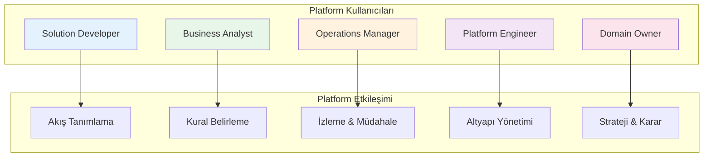
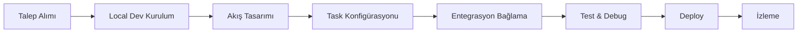
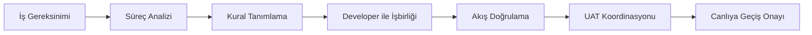
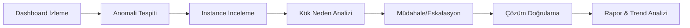
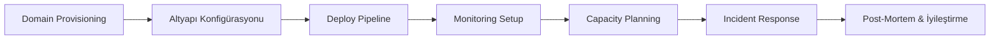
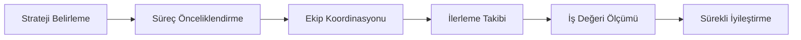

# Personas & Journeys

Bu sayfa, vNext platformunun farklı kullanıcı profillerini (persona) ve her birinin platform ile etkileşim yolculuğunu tanımlar.

## Persona Haritası

## Persona Detayları

### 1. Solution Developer

**Kim:** vNext üzerinde iş akışları geliştiren yazılım mühendisi.

| | |
|---|---|
| **Hedefi** | İş biriminin talep ettiği süreçleri hızlı ve güvenli şekilde platforma taşımak |
| **Günlük işi** | Workflow tanımlama, task konfigürasyonu, entegrasyon bağlama, test |
| **Acı noktası** | Karmaşık iş kurallarını anlamak, entegrasyon hatalarını debug etmek |
| **Başarı metriği** | Talep → canlı akış süresi, hata oranı |

**Yolculuk:**

**Platform dokunma noktaları:**
- [Getting Started](/docs/getting-started/) — ilk kurulum
- [Components](/docs/components/tasks/) — task tipleri ve konfigürasyonu
- [API Reference](/docs/api-reference/) — interface detayları
- [How-To](/docs/how-to/error-handling) — pratik rehberler

---

### 2. Business Analyst

**Kim:** İş süreçlerini analiz eden ve gereksinimleri tanımlayan analist.

| | |
|---|---|
| **Hedefi** | İş kurallarını platform diline çevirmek, süreçleri optimize etmek |
| **Günlük işi** | Süreç analizi, kural tanımlama, akış doğrulama, iş birimi ile köprü olmak |
| **Acı noktası** | Teknik dile çeviri, değişiklik etkisini öngörememe |
| **Başarı metriği** | Gereksinim → akış dönüşüm doğruluğu, iş birimi memnuniyeti |

**Yolculuk:**

**Platform dokunma noktaları:**
- [Business Capabilities](/business/capabilities/) — platform yetenekleri
- [Glossary](/business/glossary/) — terim eşleştirme
- [Concepts](/docs/concepts/user-integration) — kavramsal anlayış

---

### 3. Operations Manager

**Kim:** Canlı ortamda çalışan süreçleri izleyen ve müdahale eden operasyon yöneticisi.

| | |
|---|---|
| **Hedefi** | Süreçlerin sorunsuz çalıştığından emin olmak, sorunlara hızlı müdahale |
| **Günlük işi** | Dashboard izleme, tıkanan instance'ları çözme, eskalasyon, raporlama |
| **Acı noktası** | Sorunun kaynağını bulmak, SLA aşımlarını önlemek |
| **Başarı metriği** | Ortalama çözüm süresi (MTTR), SLA uyum oranı |

**Yolculuk:**

**Platform dokunma noktaları:**
- [Instance Filtering](/docs/how-to/instance-filtering) — durum bazlı sorgulama
- [Error Handling](/docs/how-to/error-handling) — hata yönetimi
- [Workflow](/docs/components/workflow) — workflow ve state anlayışı

---

### 4. Platform Engineer

**Kim:** vNext platform altyapısını kuran, yöneten ve ölçeklendiren DevOps/SRE mühendisi.

| | |
|---|---|
| **Hedefi** | Platformun güvenilir, performanslı ve güvenli çalışmasını sağlamak |
| **Günlük işi** | Domain provisioning, altyapı yönetimi, monitoring, capacity planning |
| **Acı noktası** | Çoklu domain yönetimi, hata izolasyonu, kaynak optimizasyonu |
| **Başarı metriği** | Uptime, deployment başarı oranı, kaynak kullanım verimliliği |

**Yolculuk:**

**Platform dokunma noktaları:**
- [Local Dev](/docs/getting-started/local-dev) — ortam kurulumu
- [Domain Topology](/architecture/domain-model/topology) — domain yönetimi

---

### 5. Domain Owner

**Kim:** Bir iş alanının stratejik yönetiminden sorumlu kişi (departman müdürü, ürün sahibi).

| | |
|---|---|
| **Hedefi** | Alanındaki iş süreçlerinin dijitalleşmesini ve sürekli iyileşmesini sağlamak |
| **Günlük işi** | Önceliklendirme, kaynak tahsisi, iş değeri takibi, stakeholder iletişimi |
| **Acı noktası** | BT bağımlılığı, görünürlük eksikliği, değişiklik hızı |
| **Başarı metriği** | Time-to-market, süreç verimliliği, müşteri memnuniyeti |

**Yolculuk:**

**Platform dokunma noktaları:**
- [Business Manifesto](/business/manifesto/) — platform vizyonu
- [Value Proposition](/business/value/) — iş değeri
- [Industries](/business/industries/) — senaryo örnekleri

---

## Persona × Yetenek Matrisi

| Yetenek | Solution Dev | Business Analyst | Ops Manager | Platform Eng | Domain Owner |
|---------|:---:|:---:|:---:|:---:|:---:|
| Workflow Tanımlama | ●●● | ●●○ | ○○○ | ○○○ | ○○○ |
| Task Konfigürasyonu | ●●● | ●○○ | ○○○ | ○○○ | ○○○ |
| İş Kuralı Belirleme | ●○○ | ●●● | ○○○ | ○○○ | ●●○ |
| Instance İzleme | ●○○ | ○○○ | ●●● | ●●○ | ●○○ |
| Altyapı Yönetimi | ○○○ | ○○○ | ○○○ | ●●● | ○○○ |
| Domain Stratejisi | ○○○ | ●○○ | ○○○ | ○○○ | ●●● |
| Entegrasyon | ●●● | ○○○ | ●○○ | ●●○ | ○○○ |
| Raporlama | ○○○ | ●●○ | ●●● | ●○○ | ●●● |

*●●● Birincil, ●●○ İkincil, ●○○ Zaman zaman, ○○○ Kullanmaz*
