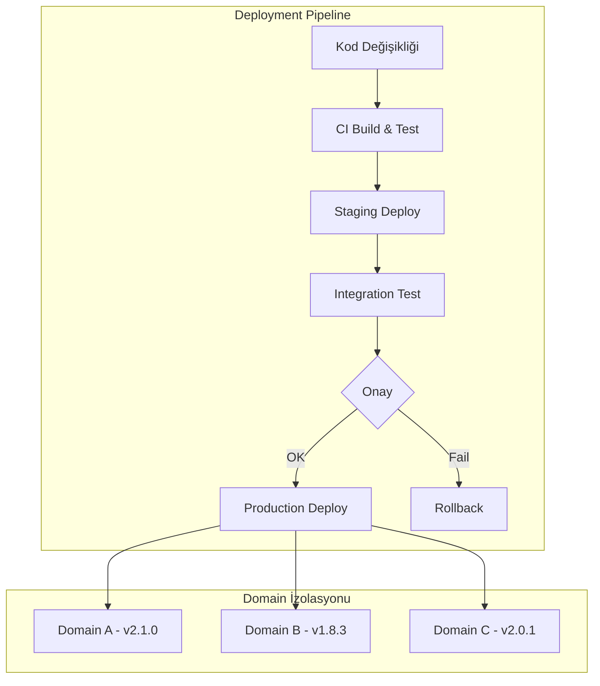
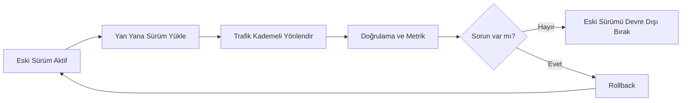

# Sürümleme ve Değişiklik Politikası

Bu sayfa, vNext platformunun **sürümleme**, **breaking changes**, **release notes** ve **migration** yaklaşımını açıklar. Hedef; değişimin **güvenle taşınması** ve kullanıcıların değişikliği **öngörebilmesidir**.

## Politika Özeti

- **Kırıcı değişiklikler `docs/breaking-changes/` altında resmi olarak duyurulur.**
- **Her release için release notes standardı zorunludur.**
- **Migration adımları mümkünse örnekle birlikte verilir.**
- **Eski ve yeni sürüm yan yana çalışır; geri dönüş daima mümkündür.**

## Versiyonlama Politikası

vNext platformu **Semantic Versioning (SemVer)** kullanır:

```
MAJOR.MINOR.PATCH
  │      │      │
  │      │      └── Bug fix, güvenlik yaması (geriye uyumlu)
  │      └────────── Yeni özellik (geriye uyumlu)
  └───────────────── Breaking change (geçiş rehberi ile)
```

### Platform vs Bileşen Versiyonlama

| Seviye | Versiyonlama | Örnek |
|--------|-------------|-------|
| **Platform** | Genel runtime sürümü | v0.0.43 |
| **Workflow** | Bileşen bazında bağımsız | MyFlow v2.1.0 |
| **Task** | Bileşen bazında bağımsız | KYCCheck v1.3.2 |
| **Schema** | Bileşen bazında bağımsız | CustomerSchema v1.0.0 |

Platform sürümü (v0.0.x) genel runtime değişikliklerini kapsar. İş akışı bileşenleri (workflow, task, schema, view, function, extension) kendi bağımsız SemVer döngülerine sahiptir.

## Release Kadansı

### Platform Runtime

| Tür | Sıklık | İçerik |
|-----|--------|--------|
| **Patch** | Haftalık (gerektiğinde) | Bug fix, güvenlik yaması |
| **Minor** | 2-4 haftada bir | Yeni özellik, iyileştirme |
| **Major** | Yılda 1-2 | Breaking change (migration rehberi ile) |

### İş Akışı Bileşenleri

Bileşenler **domain bazında bağımsız** deploy edilir:
- Domain ekibi kendi takviminde ilerler
- Platform runtime'ından bağımsızdır
- Hot-reload ile kesintisiz güncelleme

## Deployment Stratejisi

### Domain Bazında Bağımsız Deployment



Her domain bağımsız deploy edilir:
- Domain A güncellenirken Domain B ve C etkilenmez
- Sorun durumunda sadece ilgili domain rollback edilir
- Farklı domainler farklı sürümlerde olabilir

### Zero-Downtime Deployment

Platform, kesintisiz dağıtım için şu mekanizmaları kullanır:

1. **Hot Reload (Init Service)**: Bileşenler çalışan sisteme yeniden yüklenir
2. **Side-by-Side Versions**: Eski ve yeni versiyon paralel çalışır
3. **Graceful Drain**: Mevcut instance'lar eski versiyonla tamamlanır
4. **Health Checks**: Yeni versiyon sağlık kontrolünü geçmeden trafik almaz

## Release Lifecycle

### 1. Planlama

- Roadmap'teki özellikler sprint'lere ayrılır
- Her sprint sonunda demo ve geri bildirim
- Öncelik değişiklikleri PM tarafından yönetilir

### 2. Geliştirme

- Feature branch stratejisi
- PR bazlı code review
- Otomatik CI/CD pipeline

### 3. Test

- Unit test (bileşen seviyesi)
- Integration test (domain seviyesi)
- UAT (iş birimi doğrulaması)
- Performance test (yük altında davranış)

### 4. Release

- Staging ortamında son doğrulama
- Release notes hazırlanır ([Blog](/blog) sayfasında yayınlanır)
- Production deploy — domain bazında kademeli

### 5. Post-Release

- Monitoring ve alerting aktif izleme
- Hotfix hazırlığı (gerektiğinde)
- Retrospektif ve iyileştirme

## Backward Compatibility Politikası

### Garanti Edilen

- **Minor/Patch** güncellemeleri geriye uyumludur
- Mevcut API contract'ları korunur
- Mevcut akışlar değişiklik gerekmeden çalışmaya devam eder

### Breaking Change Yönetimi

Major versiyon güncellemelerinde:

1. **Deprecation Notice**: En az 1 minor önceden uyarı
2. **Migration Guide**: Adım adım geçiş rehberi
3. **Transition Period**: Eski ve yeni API paralel çalışır (minimum 2 minor süre)
4. **Support**: Geçiş sürecinde aktif destek

## Release Notes Standardı

Her release için **standart bir release notes formatı** kullanılır. Bu standart, kullanıcıların değişiklikleri **hızlı tarayıp etkisini anlamasına** olanak tanır.

### Zorunlu Alanlar

| Alan | İçerik |
|------|--------|
| **Sürüm** | vX.Y.Z |
| **Tarih** | YYYY-MM-DD |
| **Kategori** | Feature / Fix / Breaking / Performance / Security |
| **Özet** | 1-2 cümle değişiklik açıklaması |
| **Detay** | Teknik detay ve kullanım bilgisi |
| **Etkilenen Bileşen** | Workflow / Task / Schema / Function / Platform |
| **Migration** | (Sadece breaking change'lerde) adım adım geçiş rehberi |
| **Önerilen Aksiyon** | Hemen / Bir sonraki release ile / İsteğe bağlı |

### Örnek Yapı

```markdown
## v1.4.0 — 2026-05-08

### Highlights
- Visual Workflow Designer beta yayınlandı
- DaprPubSub task'a CloudEvents headers desteği eklendi

### Features
- [Designer] Sürükle-bırak workflow tasarımı
- [DaprPubSub] CloudEvents v1.0 headers parametreleri
- [Metrics] Persistent metric retention süresi yapılandırılabilir

### Fixes
- [Timer] Cron ifadelerinde DST kayması düzeltildi
- [Audit] Transition metadata'sı tüm task tiplerinde tutarlı

### Breaking Changes
- Yok

### Migration
- Yok (geriye uyumlu)

### Önerilen Aksiyon
- Visual Designer beta'sını staging ortamında deneyin
```

Tüm geçmiş release notes'lar [Blog / Release Notes](/blog) bölümünde kronolojik sırayla yer alır.

## Breaking Changes Disiplini

Kırıcı değişiklikler vNext'te **istisnai** ve **kontrollü** süreçlerdir. Disiplin şu unsurları içerir:

### 1. Erken Uyarı (Deprecation Notice)

- Kırıcı değişiklik en az **1 minor önceden** duyurulur
- Etkilenen kullanıcılara doğrudan bilgilendirme yapılır
- Eski API/davranış `@deprecated` olarak işaretlenir

### 2. Resmi Duyuru

Her kırıcı değişiklik için **özel bir doküman sayfası** açılır:

- Lokasyon: `docs/breaking-changes/<change-name>.md`
- Dil: Türkçe + İngilizce (zorunlu)
- İçerik: Neden değişti, ne değişti, nasıl geçilir

**Örnek mevcut breaking changes:**

- Function–Workflow Validation — `I` veya `F` scope'lu fonksiyonların workflow `functions` dizisinde tanımlı olması zorunluluğu
- Instance Filter Single String — `filter` artık dizi değil, tek string

### 3. Migration Rehberi

Her kırıcı değişiklik için **adım adım örnekli** rehber:

| Adım | İçerik |
|------|--------|
| **Etki Tespiti** | "Sizi etkiler mi? Kontrol komutu / örnek" |
| **Önce/Sonra Örneği** | Tanım veya kod karşılaştırması |
| **Geçiş Adımları** | Sıralı, çalıştırılabilir aksiyonlar |
| **Doğrulama** | "Doğru migrate ettim mi?" kontrolü |
| **Geri Dönüş** | Sorun çıkarsa rollback yolu |

### 4. Geçiş Süresi

- Eski ve yeni davranış **minimum 2 minor süre** paralel çalışır
- Eski davranış kaldırılmadan önce final uyarı yayımlanır
- Major sınırı, kaldırma için doğal sınırdır

### 5. Aktif Destek

- Geçiş sürecinde sorularınız için kanal: GitHub Issues
- Migration sorununda hızlı yanıt taahhüdü
- Toplu migration için profesyonel destek seçeneği

## Migration Pratiği

Migration adımları platformun **karakteristiğine uygun** şekilde tasarlanır:



**Önerilen pratikler:**

- **Staging önce, production sonra** — değişikliği staging'de en az 1 hafta çalıştırın
- **Pilot tenant / domain** — bir domain'de pilot çalıştırın
- **Metrik karşılaştırması** — eski ve yeni davranışın metriklerini yan yana izleyin
- **Geri dönüş planı** — her migration'ın rollback adımı hazır olsun
- **Audit doğrulaması** — migration sonrası audit log'larda anomali olmadığını teyit edin

## Ortam Matrisi

| Ortam | Amaç | Deploy Sıklığı | Erişim |
|-------|-------|----------------|--------|
| **Local Dev** | Geliştirme ve debug | Anlık | Developer |
| **CI** | Otomatik test | Her PR | Otomatik |
| **Staging** | Integration test ve UAT | Günlük | Ekip |
| **Production** | Canlı kullanım | Haftalık / talep bazlı | Tüm kullanıcılar |

## İlgili Sayfalar

- [Roadmap](../roadmap/) — Faz bazlı planlama
- [Feature Catalog](../features/) — Mevcut özellikler ve durumları
- [Ürün Yönü ve Sınırlar](../direction-scope/) — Stratejik yön
- [İş Riskleri ve Azaltım](/business/risks/) — Değişiklik etkisi yönetimi
- [Release Notes (Blog)](/blog) — Geçmiş sürümler
