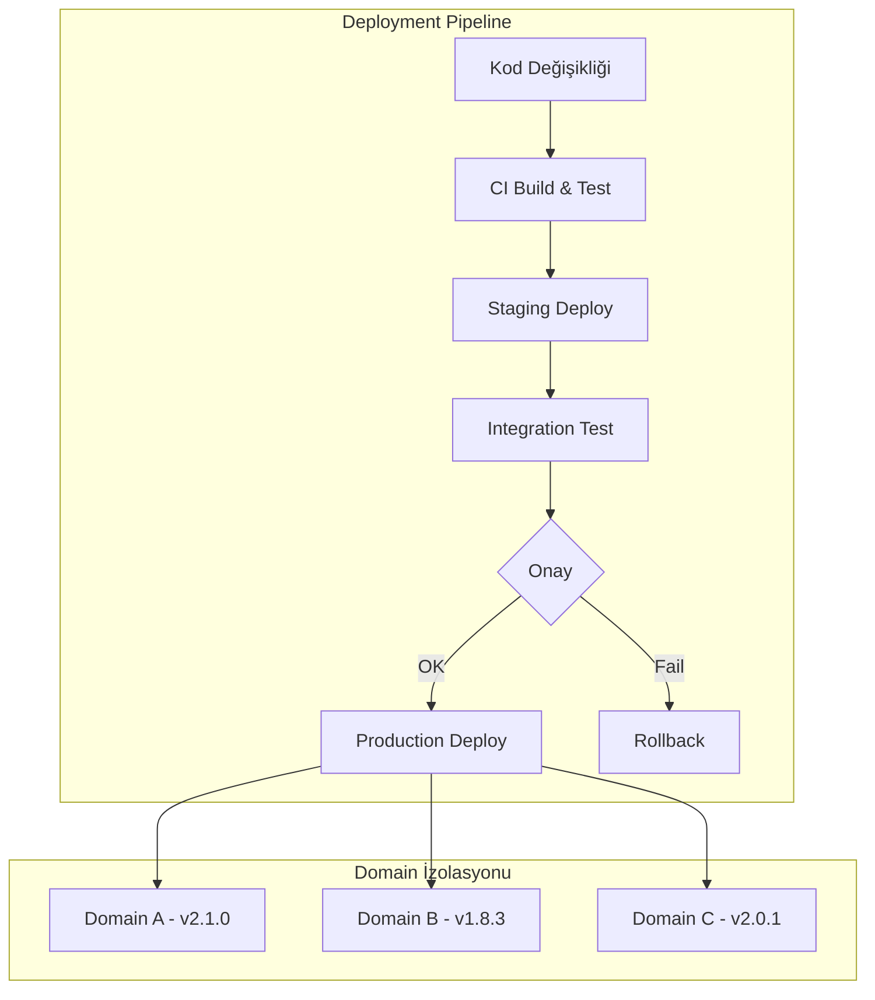

# Release Strategy

Bu sayfa, vNext platformunun sürüm yönetimi politikasını, dağıtım kadansını ve versiyonlama yaklaşımını açıklar.

## Versiyonlama Politikası

vNext platformu **Semantic Versioning (SemVer)** kullanır:

```
MAJOR.MINOR.PATCH
  │      │      │
  │      │      └── Bug fix, güvenlik yaması (geriye uyumlu)
  │      └────────── Yeni özellik (geriye uyumlu)
  └───────────────── Breaking change (geçiş rehberi ile)
```

### Platform vs Bileşen Versiyonlama

| Seviye | Versiyonlama | Örnek |
|--------|-------------|-------|
| **Platform** | Genel runtime sürümü | v0.0.43 |
| **Workflow** | Bileşen bazında bağımsız | MyFlow v2.1.0 |
| **Task** | Bileşen bazında bağımsız | KYCCheck v1.3.2 |
| **Schema** | Bileşen bazında bağımsız | CustomerSchema v1.0.0 |

Platform sürümü (v0.0.x) genel runtime değişikliklerini kapsar. İş akışı bileşenleri (workflow, task, schema, view, function, extension) kendi bağımsız SemVer döngülerine sahiptir.

## Release Kadansı

### Platform Runtime

| Tür | Sıklık | İçerik |
|-----|--------|--------|
| **Patch** | Haftalık (gerektiğinde) | Bug fix, güvenlik yaması |
| **Minor** | 2-4 haftada bir | Yeni özellik, iyileştirme |
| **Major** | Yılda 1-2 | Breaking change (migration rehberi ile) |

### İş Akışı Bileşenleri

Bileşenler **domain bazında bağımsız** deploy edilir:
- Domain ekibi kendi takviminde ilerler
- Platform runtime'ından bağımsızdır
- Hot-reload ile kesintisiz güncelleme

## Deployment Stratejisi

### Domain Bazında Bağımsız Deployment



Her domain bağımsız deploy edilir:
- Domain A güncellenirken Domain B ve C etkilenmez
- Sorun durumunda sadece ilgili domain rollback edilir
- Farklı domainler farklı sürümlerde olabilir

### Zero-Downtime Deployment

Platform, kesintisiz dağıtım için şu mekanizmaları kullanır:

1. **Hot Reload (Init Service)**: Bileşenler çalışan sisteme yeniden yüklenir
2. **Side-by-Side Versions**: Eski ve yeni versiyon paralel çalışır
3. **Graceful Drain**: Mevcut instance'lar eski versiyonla tamamlanır
4. **Health Checks**: Yeni versiyon sağlık kontrolünü geçmeden trafik almaz

## Release Lifecycle

### 1. Planlama

- Roadmap'teki özellikler sprint'lere ayrılır
- Her sprint sonunda demo ve geri bildirim
- Öncelik değişiklikleri PM tarafından yönetilir

### 2. Geliştirme

- Feature branch stratejisi
- PR bazlı code review
- Otomatik CI/CD pipeline

### 3. Test

- Unit test (bileşen seviyesi)
- Integration test (domain seviyesi)
- UAT (iş birimi doğrulaması)
- Performance test (yük altında davranış)

### 4. Release

- Staging ortamında son doğrulama
- Release notes hazırlanır ([Blog](/blog) sayfasında yayınlanır)
- Production deploy — domain bazında kademeli

### 5. Post-Release

- Monitoring ve alerting aktif izleme
- Hotfix hazırlığı (gerektiğinde)
- Retrospektif ve iyileştirme

## Backward Compatibility Politikası

### Garanti Edilen

- **Minor/Patch** güncellemeleri geriye uyumludur
- Mevcut API contract'ları korunur
- Mevcut akışlar değişiklik gerekmeden çalışmaya devam eder

### Breaking Change Yönetimi

Major versiyon güncellemelerinde:

1. **Deprecation Notice**: En az 1 minor önceden uyarı
2. **Migration Guide**: Adım adım geçiş rehberi
3. **Transition Period**: Eski ve yeni API paralel çalışır (minimum 2 minor süre)
4. **Support**: Geçiş sürecinde aktif destek

## Release Notes Formatı

Her release için standart format:

| Alan | İçerik |
|------|--------|
| **Sürüm** | vX.Y.Z |
| **Tarih** | YYYY-MM-DD |
| **Kategori** | Feature / Fix / Breaking / Performance |
| **Özet** | 1-2 cümle değişiklik açıklaması |
| **Detay** | Teknik detay ve kullanım bilgisi |
| **Migration** | (Sadece breaking change'lerde) geçiş adımları |

Tüm geçmiş release notes'lar [Blog](/blog) bölümünde kronolojik sırayla yer almaktadır.

## Ortam Matrisi

| Ortam | Amaç | Deploy Sıklığı | Erişim |
|-------|-------|----------------|--------|
| **Local Dev** | Geliştirme ve debug | Anlık | Developer |
| **CI** | Otomatik test | Her PR | Otomatik |
| **Staging** | Integration test ve UAT | Günlük | Ekip |
| **Production** | Canlı kullanım | Haftalık/talep bazlı | Tüm kullanıcılar |
