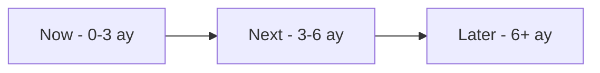

# Product Roadmap

Bu sayfa, vNext platformunun **kısa, orta ve uzun vadeli** yol haritasını **Now / Next / Later** formatında sunar. Tarihler tahmini önceliklendirmedir; ürün ekibi her çeyrekte tarih ve sahip bilgisiyle revize edebilir.

> **Not:** Bu roadmap statik bir taahhüt değil, dinamik bir önceliklendirme aracıdır. Müşteri geri bildirimleri, pazar koşulları ve teknik bağımlılıklar önceliği değiştirebilir.

## Roadmap Özeti



| Faz | Tema | Birincil Kullanıcı |
|-----|------|--------------------|
| **Now (0-3 ay)** | Olgunlaşma, standardizasyon, AI temelleri | Mevcut kullanıcılar, platform ekibi |
| **Next (3-6 ay)** | Geliştirici deneyimi, SaaS olgunluğu, AI flow copilot beta | Geliştirici, citizen developer, SaaS müşterisi |
| **Later (6+ ay)** | Global ölçek, ekosistem, AI-native olgunlaşma | Çoklu coğrafya, kurumsal governance |

---

## Now (0-3 ay) — Olgunlaşma

**Hedef:** Mevcut platformun **kullanım kalitesini** ve **operasyonel olgunluğunu** artırmak.

### Dokümantasyon Bilgi Mimarisi

- Business / Product / Technical / Architecture dört temel bölümün netleştirilmesi
- Sayfa hiyerarşisi ve navigasyon iyileştirmeleri
- Türkçe / İngilizce çift dil desteğinin tamamlanması

### Operasyonel Metriklerin Standardizasyonu

- SLO tanımları ve takip mekanizması
- Hata oranı ve gecikme metriklerinin standart raporu
- ClickHouse persistent metrics dashboard'ları
- Health endpoint genişletmeleri

### Citizen Developer Odaklı İlk Kullanım Kılavuzları

- "İlk akışınızı 30 dakikada yayınlayın" kılavuzu
- Yaygın senaryolar için adım-adım örnekler
- Hata mesajları ve doğrulama iyileştirmeleri
- Glossary ve referans kütüphanesi tamamlama

| Çalışma | Beklenen Çıktı | Durum |
|---------|----------------|-------|
| Documentation Platform | Birleşik docs sitesi (Docusaurus) | 🔄 Devam ediyor |
| SLO Metrik Standardı | Operasyonel KPI seti | 📋 Planlı |
| Citizen Developer Kılavuzu | Onboarding paketi | 📋 Planlı |
| Advanced Monitoring | Real-time instance izleme paneli | 🔄 Beta |
| Improved Error Handling | Detaylı hata mesajları ve recovery | 🔄 Beta |
| AI Kullanım Kılavuzu | "AI ile flow tasarımı" yaklaşım rehberi | 📋 Planlı |
| Tek Kod Base Vakası | Mevcut kurumsal codebase çoğalmasının vNext ile konsolidasyon örnekleri | 📋 Planlı |

---

## Next (3-6 ay) — Geliştirici Deneyimi ve SaaS Olgunluğu

**Hedef:** Geliştirici ve citizen developer deneyimini iyileştirmek; multi-tenant SaaS işletim için olgunlaşma.

### Dapr Entegrasyon Kataloglarının Genişletilmesi

- Yaygın connector senaryoları için örnek paketler
- Dapr building block referans projeleri
- Sağlayıcı bazlı (Kafka, RabbitMQ, Azure SB, Redis) yapılandırma rehberleri

### Geliştirici Deneyimi İyileştirmeleri

- Hızlı başlangıç paketleri (örnek proje şablonları)
- CLI araçları ve local dev iyileştirmeleri
- Workflow doğrulama araçları (lint, dry-run, simülasyon)
- Visual Workflow Designer (low-code tasarım arayüzü)

### AI-Assisted Flow Design (İlk Aşama)

vNext'in **AI-Native** ürün yönünün ilk somut adımları:

- **Doğal dil → flow taslağı** — kullanıcı süreci doğal dilde anlatır, AI başlangıç akışı önerir
- **Akış doğrulama copilot** — mevcut flow'da eksik adım, risk veya breaking change tespiti
- **Şablondan flow üretimi** — yaygın senaryolar (onboarding, kredi, raporlama) için AI ile özelleştirme
- **Pluggable AI sağlayıcı** — OpenAI, Anthropic, Azure OpenAI, açık modeller, kurum-içi modeller
- **İnsan-onaylı pipeline** — AI üretimi her zaman review + test + audit'ten geçer

> AI burada kodu yazan değil, **flow'u çizen** ve süreç sahibine eşlik eden bir partnerdir. Kod yazımı vNext runtime'ında sabitlenir; uygulama çeşitliliği **tanım çeşitliliği** ile elde edilir.

### SaaS için Tenant İzolasyonu ve Operasyonel Guardrail

- Tenant bazlı kota ve rate limit
- Self-service onboarding ilk versiyonu
- Multi-schema yönetim arayüzü
- Tenant bazlı audit ve raporlama

| Çalışma | Beklenen Çıktı | Hedef Faz |
|---------|----------------|-----------|
| Visual Workflow Designer | Sürükle-bırak ile akış tasarımı | Beta |
| Template Library | Sektörel hazır şablonlar | GA |
| CLI Geliştirme Araçları | Local dev / debug iyileştirmeleri | GA |
| Tenant Guardrails | Kota, rate limit, izolasyon kontrolleri | GA |
| Connector Pack | Dapr entegrasyon örnek paketleri | GA |
| **AI Flow Copilot (Beta)** | Doğal dil → flow taslağı; akış doğrulama önerileri | Beta |
| **AI Provider Plugin Modeli** | Çoklu AI sağlayıcı entegrasyonu | Beta |

---

## Later (6+ ay) — Global Ölçek ve Ekosistem

**Hedef:** Global ölçek için bölgesel dağıtım, cloud-native SaaS işletim modelinin tamamlanması ve kurumsal governance otomasyonu.

### Global Ölçek

- Bölgesel dağıtım ve veri yerelliği yaklaşımı
- KVKK, GDPR ve sektörel regülasyonlara uyum
- Multi-cloud desteği (AWS, Azure, GCP)
- Bölgeler arası disaster recovery

### Cloud-Native SaaS İşletim Modelinin Tamamlanması

- Self-service onboarding'in tam olgunlaşması
- Kullanım bazlı ölçek (usage-based scaling)
- Subscription & billing entegrasyonları
- Tenant migration ve archive araçları

### Kurumsal Governance Otomasyonları

- Policy-as-Code mekanizmaları
- Otomatik audit ve uyumluluk raporları
- Tenant ve domain lifecycle otomasyonu

### AI-Native Olgunlaşma (İleri Aşama)

Next fazında temelleri atılan AI yetenekleri, Later'da kurumsal olgunluğa ulaşır:

- **Process Mining** — mevcut süreç loglarından otomatik flow çıkarımı
- **Doğal Dil Sorgulama** — "Şu an onayda kaç başvuru var?" → instance query
- **AI-Driven Optimization** — performans verilerinden otomatik akış optimizasyonu önerileri
- **Compliance AI Assistant** — düzenleyici değişikliklerin etkilediği akışların otomatik tespiti
- **Multi-Modal Tasarım** — diyagram, doğal dil, sesli komut ile flow inşası
- **Kurumsal AI Knowledge Base** — flow geçmişinden öğrenen, kurum-özel öneriler üreten AI

### Marketplace

- 3. parti bileşen ve connector mağazası
- Açık şablon paylaşımı
- Doğrulanmış entegrasyon partner'ları

| Çalışma | Beklenen Etki |
|---------|---------------|
| Multi-Cloud Support | AWS, Azure, GCP arasında taşınabilirlik |
| Self-Service Tenant | Tam self-service SaaS onboarding |
| AI-Driven Optimization | Otomatik akış optimizasyonu önerileri |
| Process Mining | Mevcut iş akışlarının otomatik tespiti |
| Compliance AI Assistant | Düzenleyici değişiklik etki analizi |
| Marketplace | Açık ekosistem |
| Policy-as-Code | Kurumsal yönetişim otomasyonu |

---

## Tamamlananlar (Özet)

vNext platformunun temel çekirdeği aşağıdaki fazlarla **tamamlandı**:

### Faz 1 — Foundation (2025 Q1-Q3)

Workflow Engine, State Management, Basic Tasks (HTTP/Condition/Script), Single Domain, REST API.

### Faz 2 — Multi-Domain & Integration (2025 Q2-Q4)

Multi-Domain runtime, per-domain database, Dapr Integration (service invocation + state store), PubSub Events, Timer & Notification Tasks.

### Faz 3 — Enterprise Features (2025 Q4 — 2026 Q2)

Semantic Versioning, ETag Concurrency, Vault Secrets, Audit Trail, Sub-Flow/Sub-Process, Hot Reload (Init Service), Inbox/Outbox workers, OpenTelemetry.

> Detaylı özellik listesi için [Feature Catalog](../features/) sayfasına bakın.

## Geçmiş ve Gelecek (Görsel)

```mermaid
gantt
    title vNext Platform Roadmap
    dateFormat  YYYY-Q
    axisFormat  %Y-Q%q

    section Tamamlanan
    Foundation            :done, 2025-Q1, 2025-Q3
    Multi-Domain          :done, 2025-Q2, 2025-Q4
    Task Ecosystem        :done, 2025-Q3, 2026-Q1
    Event-Driven          :done, 2025-Q4, 2026-Q1
    Versioning System     :done, 2026-Q1, 2026-Q2

    section Now
    Docs and Observability :active, 2026-Q2, 2026-Q3
    Citizen Dev Onboarding :active, 2026-Q2, 2026-Q3

    section Next
    Visual Designer       :2026-Q3, 2026-Q4
    Template Library      :2026-Q3, 2027-Q1
    SaaS Guardrails       :2026-Q4, 2027-Q1
    AI Flow Copilot Beta  :2026-Q4, 2027-Q1

    section Later
    Multi-Cloud           :2027-Q1, 2027-Q3
    AI-Driven Optimization :2027-Q1, 2027-Q3
    Process Mining        :2027-Q2, 2027-Q4
    Marketplace           :2027-Q2, 2027-Q4
```

## Roadmap İlkeleri

1. **Customer-driven** — her faz müşteri geri bildirimi ile şekillenir
2. **Incremental delivery** — küçük, sık ve değerli release'ler
3. **Backward compatible** — mevcut kullanıcılar etkilenmez
4. **Production-first** — her özellik production-ready olarak çıkar
5. **Measurable** — her özelliğin başarı metriği tanımlıdır

## Feedback & Öneriler

Roadmap hakkında geri bildirim ve önerileriniz için:

- GitHub Issues üzerinden feature request açabilirsiniz: [github.com/burgan-tech/vnext/issues](https://github.com/burgan-tech/vnext/issues)
- Product ekibine doğrudan ulaşabilirsiniz

:::note
Bu roadmap tahmini bir planlama aracıdır. Tarihler ve öncelikler müşteri geri bildirimleri, pazar koşulları ve teknik bağımlılıklara göre değişebilir. **Ürün ekibi her çeyrekte tarih ve sahip bilgisiyle bu roadmap'i revize edebilir.**
:::

## İlgili Sayfalar

- [Ürün Vizyonu](../overview/) — Konumlandırma ve hedef pazar
- [Feature Catalog](../features/) — Mevcut özellik detayı
- [Ürün Yönü ve Sınırlar](../direction-scope/) — Stratejik yön ve sınırlar
- [Release Strategy](../release-strategy/) — Sürüm politikası
